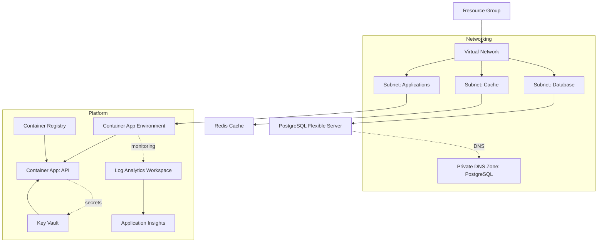

# Terraform Infrastructure

<cite>
**Referenced Files in This Document**
- [main.tf](file://infrastructure/terraform/main.tf)
- [providers.tf](file://infrastructure/terraform/providers.tf)
- [backend.tf](file://infrastructure/terraform/backend.tf)
- [variables.tf](file://infrastructure/terraform/variables.tf)
- [outputs.tf](file://infrastructure/terraform/outputs.tf)
- [modules/networking/main.tf](file://infrastructure/terraform/modules/networking/main.tf)
- [modules/networking/outputs.tf](file://infrastructure/terraform/modules/networking/outputs.tf)
- [modules/database/main.tf](file://infrastructure/terraform/modules/database/main.tf)
- [modules/database/outputs.tf](file://infrastructure/terraform/modules/database/outputs.tf)
- [modules/cache/main.tf](file://infrastructure/terraform/modules/cache/main.tf)
- [modules/cache/outputs.tf](file://infrastructure/terraform/modules/cache/outputs.tf)
- [modules/container-apps/main.tf](file://infrastructure/terraform/modules/container-apps/main.tf)
- [modules/container-apps/outputs.tf](file://infrastructure/terraform/modules/container-apps/outputs.tf)
- [modules/keyvault/main.tf](file://infrastructure/terraform/modules/keyvault/main.tf)
- [modules/keyvault/outputs.tf](file://infrastructure/terraform/modules/keyvault/outputs.tf)
- [modules/monitoring/main.tf](file://infrastructure/terraform/modules/monitoring/main.tf)
- [modules/monitoring/outputs.tf](file://infrastructure/terraform/modules/monitoring/outputs.tf)
- [modules/registry/main.tf](file://infrastructure/terraform/modules/registry/main.tf)
- [modules/registry/outputs.tf](file://infrastructure/terraform/modules/registry/outputs.tf)
</cite>

## Table of Contents
1. [Introduction](#introduction)
2. [Project Structure](#project-structure)
3. [Core Components](#core-components)
4. [Architecture Overview](#architecture-overview)
5. [Detailed Component Analysis](#detailed-component-analysis)
6. [Dependency Analysis](#dependency-analysis)
7. [Performance Considerations](#performance-considerations)
8. [Security and Compliance](#security-and-compliance)
9. [Monitoring and Alerting](#monitoring-and-alerting)
10. [Deployment and State Management](#deployment-and-state-management)
11. [Infrastructure Modification Workflows](#infrastructure-modification-workflows)
12. [Troubleshooting Guide](#troubleshooting-guide)
13. [Conclusion](#conclusion)

## Introduction
This document explains the Terraform infrastructure as code for the Quiz-to-build system. It covers the main orchestration file, provider configuration, remote state options, variable definitions, and module composition. The system provisions Azure resources for Container Apps, PostgreSQL, Redis, Key Vault, networking, and monitoring. It also documents environment-specific configurations, resource tagging, cost optimization techniques, and operational workflows for deployment, state management, and modifications.

## Project Structure
The Terraform implementation is organized around a single orchestration file that composes multiple modules. Each module encapsulates a domain area (networking, database, cache, container apps, registry, keyvault, monitoring) and exposes outputs consumed by other modules and the top-level configuration.

**Diagram sources**
- [main.tf](file://infrastructure/terraform/main.tf#L1-L151)
- [modules/networking/main.tf](file://infrastructure/terraform/modules/networking/main.tf#L1-L111)
- [modules/database/main.tf](file://infrastructure/terraform/modules/database/main.tf#L1-L62)
- [modules/cache/main.tf](file://infrastructure/terraform/modules/cache/main.tf#L1-L21)
- [modules/container-apps/main.tf](file://infrastructure/terraform/modules/container-apps/main.tf#L1-L192)
- [modules/registry/main.tf](file://infrastructure/terraform/modules/registry/main.tf#L1-L12)
- [modules/keyvault/main.tf](file://infrastructure/terraform/modules/keyvault/main.tf#L1-L88)
- [modules/monitoring/main.tf](file://infrastructure/terraform/modules/monitoring/main.tf#L1-L22)

**Section sources**
- [main.tf](file://infrastructure/terraform/main.tf#L1-L151)
- [providers.tf](file://infrastructure/terraform/providers.tf#L1-L29)
- [variables.tf](file://infrastructure/terraform/variables.tf#L1-L129)
- [outputs.tf](file://infrastructure/terraform/outputs.tf#L1-L116)

## Core Components
- Provider configuration pins the AzureRM provider version and enables safe deletion and soft-delete recovery behaviors for Key Vault and Resource Groups.
- Root orchestration defines a resource group, applies common tags, and composes modules for networking, monitoring, registry, database, cache, and container apps.
- Modules expose outputs that feed into downstream modules and the root outputs for developer consumption.

Key capabilities:
- Centralized tag management via locals and module passthrough.
- Explicit dependency ordering to ensure prerequisites are provisioned first.
- Secret management via Key Vault with distinct secrets for database URL, Redis password, and JWT secrets.
- Observability via Log Analytics and Application Insights.

**Section sources**
- [providers.tf](file://infrastructure/terraform/providers.tf#L1-L29)
- [main.tf](file://infrastructure/terraform/main.tf#L4-L18)
- [outputs.tf](file://infrastructure/terraform/outputs.tf#L1-L116)

## Architecture Overview
The system provisions a private network with dedicated subnets for applications, databases, and caches. Container Apps are deployed into a dedicated subnet with a managed environment. Database and cache resources are placed in private subnets with private DNS integration. Secrets are stored in Key Vault and injected into Container Apps as environment variables. Monitoring integrates with Log Analytics and Application Insights.

**Diagram sources**
- [main.tf](file://infrastructure/terraform/main.tf#L13-L150)
- [modules/networking/main.tf](file://infrastructure/terraform/modules/networking/main.tf#L3-L110)
- [modules/database/main.tf](file://infrastructure/terraform/modules/database/main.tf#L9-L61)
- [modules/cache/main.tf](file://infrastructure/terraform/modules/cache/main.tf#L3-L20)
- [modules/container-apps/main.tf](file://infrastructure/terraform/modules/container-apps/main.tf#L4-L191)
- [modules/registry/main.tf](file://infrastructure/terraform/modules/registry/main.tf#L3-L11)
- [modules/keyvault/main.tf](file://infrastructure/terraform/modules/keyvault/main.tf#L5-L87)
- [modules/monitoring/main.tf](file://infrastructure/terraform/modules/monitoring/main.tf#L3-L21)

## Detailed Component Analysis

### Networking Module
Responsibilities:
- Creates a virtual network with address spaces and subnets for applications, databases, and caches.
- Delegates the application subnet to Container Apps and the database subnet to PostgreSQL.
- Applies a Network Security Group to the application subnet allowing HTTP/HTTPS ingress.
- Provisions a private DNS zone for PostgreSQL and links it to the virtual network.

Operational notes:
- Subnet delegations ensure platform-managed services can operate within the network boundaries.
- Private DNS enables internal resolution of PostgreSQL FQDNs.

Outputs:
- Virtual network identifiers and names.
- Subnet IDs for application, database, and cache.
- Private DNS zone identifier and name for PostgreSQL.

**Section sources**
- [modules/networking/main.tf](file://infrastructure/terraform/modules/networking/main.tf#L3-L110)
- [modules/networking/outputs.tf](file://infrastructure/terraform/modules/networking/outputs.tf#L1-L35)

### Database Module (PostgreSQL Flexible Server)
Responsibilities:
- Generates a random administrator password for the PostgreSQL server.
- Creates a flexible server in the database subnet with private DNS integration.
- Defines a target application database and sets server configurations for timezone and connection logging.
- Tags resources and ignores specific attributes during lifecycle changes.

Outputs:
- Server identifiers and FQDN.
- Database name and administrator credentials.
- Connection string suitable for client applications.

**Section sources**
- [modules/database/main.tf](file://infrastructure/terraform/modules/database/main.tf#L3-L61)
- [modules/database/outputs.tf](file://infrastructure/terraform/modules/database/outputs.tf#L1-L37)

### Cache Module (Azure Cache for Redis)
Responsibilities:
- Creates a Redis cache with TLS enforcement and minimum TLS version set.
- Configures eviction policy and reserved memory deltas.
- Tags resources.

Outputs:
- Redis identifiers, hostnames, ports, and primary access keys.
- Primary connection string.

**Section sources**
- [modules/cache/main.tf](file://infrastructure/terraform/modules/cache/main.tf#L3-L20)
- [modules/cache/outputs.tf](file://infrastructure/terraform/modules/cache/outputs.tf#L1-L36)

### Container Apps Module
Responsibilities:
- Creates a Container App Environment bound to the application subnet and Log Analytics workspace.
- Deploys a single-revision Container App with system-assigned managed identity.
- Configures CPU/memory, replica counts, and ingress exposure.
- Injects environment variables for runtime configuration and probes for health checks.
- Pulls images from the configured Container Registry using admin credentials.
- Stores secrets for registry password, database URL, Redis password, and JWT secrets.

Outputs:
- Environment and app identifiers and names.
- Public API URL and FQDN.
- Managed identity principal ID and latest revision name.

**Section sources**
- [modules/container-apps/main.tf](file://infrastructure/terraform/modules/container-apps/main.tf#L4-L191)
- [modules/container-apps/outputs.tf](file://infrastructure/terraform/modules/container-apps/outputs.tf#L1-L39)

### Container Registry Module
Responsibilities:
- Creates an Azure Container Registry with admin credentials enabled for development.
- Tags resources.

Outputs:
- Registry identifiers, names, and login server.
- Admin username and password.

**Section sources**
- [modules/registry/main.tf](file://infrastructure/terraform/modules/registry/main.tf#L3-L11)
- [modules/registry/outputs.tf](file://infrastructure/terraform/modules/registry/outputs.tf#L1-L26)

### Key Vault Module
Responsibilities:
- Creates a Key Vault with soft delete retention and standard SKU.
- Grants permissions to the current deployment identity for full secret and key lifecycle operations.
- Optionally grants read-only secret permissions to the Container App managed identity.
- Stores secrets for database URL, Redis password, and generated JWT secrets.

Outputs:
- Key Vault identifiers, names, and URI.
- Secret identifiers and generated secret values.

**Section sources**
- [modules/keyvault/main.tf](file://infrastructure/terraform/modules/keyvault/main.tf#L5-L87)
- [modules/keyvault/outputs.tf](file://infrastructure/terraform/modules/keyvault/outputs.tf#L1-L41)

### Monitoring Module
Responsibilities:
- Creates a Log Analytics workspace and Application Insights resource.
- Links Application Insights to the workspace.
- Tags resources.

Outputs:
- Workspace and Application Insights identifiers and names.
- Instrumentation key and connection string.

**Section sources**
- [modules/monitoring/main.tf](file://infrastructure/terraform/modules/monitoring/main.tf#L3-L21)
- [modules/monitoring/outputs.tf](file://infrastructure/terraform/modules/monitoring/outputs.tf#L1-L37)

## Dependency Analysis
The orchestration enforces explicit dependencies among modules to ensure prerequisites are created before dependent resources. The dependency graph is layered: networking first, followed by monitoring and registry, then database and cache, and finally container apps depending on all upstream modules.

**Diagram sources**
- [main.tf](file://infrastructure/terraform/main.tf#L20-L150)

**Section sources**
- [main.tf](file://infrastructure/terraform/main.tf#L74-L103)
- [main.tf](file://infrastructure/terraform/main.tf#L142-L149)

## Performance Considerations
- Container sizing: CPU and memory allocations are configurable per environment. Adjust container_cpu, container_memory, container_min_replicas, and container_max_replicas to balance responsiveness and cost.
- Database and cache SKUs: PostgreSQL and Redis SKUs are configurable. Select appropriate tiers for workload profiles and scale out as needed.
- Replication and availability: PostgreSQL high availability is disabled in development; enable for production environments requiring HA.
- Network efficiency: Subnet delegation reduces overhead and improves integration with managed services.

[No sources needed since this section provides general guidance]

## Security and Compliance
- Secrets management: All secrets are stored in Key Vault and injected into Container Apps as environment variables. The deployment identity has broad permissions; restrict to least privilege in production.
- TLS enforcement: Redis requires TLS 1.2 or higher. Ensure clients connect over SSL/TLS.
- Identity and access: Container Apps use system-assigned managed identity. Grant only read access to secrets for the managed identity.
- Resource tagging: Common tags propagate to all resources for governance and cost allocation.
- Key Vault soft-delete: Enabled to protect against accidental deletion; purge protection is disabled by default.

**Section sources**
- [modules/keyvault/main.tf](file://infrastructure/terraform/modules/keyvault/main.tf#L18-L44)
- [modules/cache/main.tf](file://infrastructure/terraform/modules/cache/main.tf#L10-L11)
- [main.tf](file://infrastructure/terraform/main.tf#L6-L10)

## Monitoring and Alerting
- Application telemetry: Application Insights is provisioned and linked to the Log Analytics workspace. Connection strings are passed to the Container App for instrumentation.
- Logs and metrics: Log Analytics collects container logs and platform metrics.
- Health probes: Liveness, readiness, and startup probes are configured in the Container App to improve reliability and observability.

**Section sources**
- [modules/monitoring/main.tf](file://infrastructure/terraform/modules/monitoring/main.tf#L3-L21)
- [modules/container-apps/main.tf](file://infrastructure/terraform/modules/container-apps/main.tf#L106-L138)

## Deployment and State Management
Initial setup:
- Initialize Terraform with configured providers.
- For local state, run terraform init and terraform apply.
- After creating an Azure Storage Account for remote state, uncomment the backend configuration and reinitialize with state migration.

Environment-specific configuration:
- Use tfvars files to override project_name, environment, location, and SKU variables for dev/staging/prod.

Developer connectivity:
- The root outputs include connection_info with API URL, health endpoint, Swagger docs, and ACR repository path for local development.

**Section sources**
- [backend.tf](file://infrastructure/terraform/backend.tf#L1-L16)
- [outputs.tf](file://infrastructure/terraform/outputs.tf#L107-L115)

## Infrastructure Modification Workflows
- Variable-driven changes: Modify variables in variables.tf or supply overrides via tfvars to adjust resource sizes, SKUs, and names.
- Tagging updates: Change tags in variables.tf to reflect new governance policies; tags propagate automatically.
- Module-level changes: Update module main.tf files to add new resources or change configurations; ensure outputs remain compatible.
- State safety: Use terraform plan to preview changes; avoid destructive operations on sensitive resources like Key Vault and databases without explicit intent.

[No sources needed since this section provides general guidance]

## Troubleshooting Guide
Common issues and resolutions:
- State initialization errors: Ensure backend configuration is correct and storage account exists before migrating state.
- Network connectivity failures: Verify subnet delegations and private DNS zone links; confirm that the database subnet is delegated to PostgreSQL.
- Secret injection failures: Confirm Key Vault access policies grant read access to the Container App managed identity and that secret names match environment variable references.
- Container app startup failures: Review liveness/readiness probe paths and ensure the API exposes health endpoints.

**Section sources**
- [backend.tf](file://infrastructure/terraform/backend.tf#L1-L16)
- [modules/networking/main.tf](file://infrastructure/terraform/modules/networking/main.tf#L19-L46)
- [modules/keyvault/main.tf](file://infrastructure/terraform/modules/keyvault/main.tf#L33-L44)
- [modules/container-apps/main.tf](file://infrastructure/terraform/modules/container-apps/main.tf#L106-L138)

## Conclusion
The Terraform implementation provides a modular, environment-aware infrastructure for the Quiz-to-build system on Azure. It emphasizes secure secret management, observability, and network isolation while enabling scalable resource sizing. By leveraging modules and centralized variables, teams can efficiently manage infrastructure across environments and maintain strong governance through tagging and access controls.