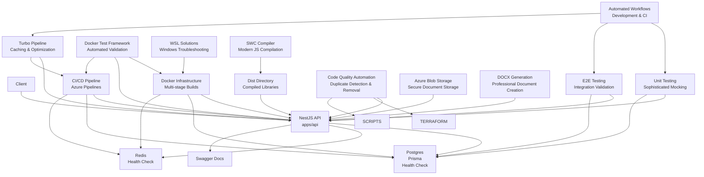
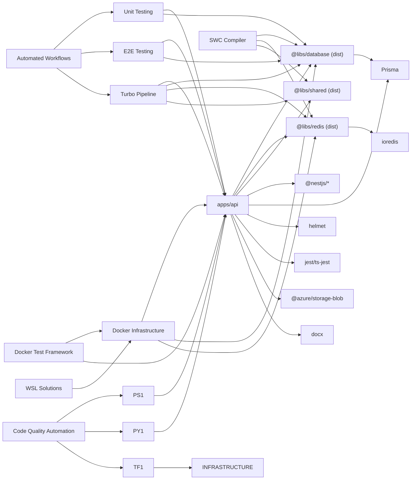

# Development Guidelines

<cite>
**Referenced Files in This Document**
- [.eslintrc.js](file://.eslintrc.js)
- [.prettierrc](file://.prettierrc)
- [.swcrc](file://.swcrc)
- [package.json](file://package.json)
- [turbo.json](file://turbo.json)
- [docker-compose.yml](file://docker-compose.yml)
- [docker-test.js](file://docker-test.js)
- [docker/api/Dockerfile](file://docker/api/Dockerfile)
- [docker/postgres/init.sql](file://docker/postgres/init.sql)
- [scripts/docker-wsl.ps1](file://scripts/docker-wsl.ps1)
- [scripts/fix-duplicate-code.ps1](file://scripts/fix-duplicate-code.ps1)
- [scripts/fix-all-duplicates.py](file://scripts/fix-all-duplicates.py)
- [scripts/fix-all-trailing-imports.ps1](file://scripts/fix-all-trailing-imports.ps1)
- [scripts/fix-duplicates-v2.py](file://scripts/fix-duplicates-v2.py)
- [scripts/fix-half-duplicates.py](file://scripts/fix-half-duplicates.py)
- [scripts/fix-late-imports.py](file://scripts/fix-late-imports.py)
- [scripts/fix-duplicates.py](file://scripts/fix-duplicates.py)
- [infrastructure/terraform/fix-duplicates.ps1](file://infrastructure/terraform/fix-duplicates.ps1)
- [azure-pipelines.yml](file://azure-pipelines.yml)
- [.gitignore](file://.gitignore)
- [apps/api/nest-cli.json](file://apps/api/nest-cli.json)
- [apps/api/tsconfig.json](file://apps/api/tsconfig.json)
- [apps/api/tsconfig.build.json](file://apps/api/tsconfig.build.json)
- [apps/api/src/app.module.ts](file://apps/api/src/app.module.ts)
- [apps/api/src/main.ts](file://apps/api/src/main.ts)
- [apps/api/test/jest-e2e.json](file://apps/api/test/jest-e2e.json)
- [apps/api/src/modules/users/users.service.spec.ts](file://apps/api/src/modules/users/users.service.spec.ts)
- [apps/api/src/modules/users/users.service.ts](file://apps/api/src/modules/users/users.service.ts)
- [apps/api/src/modules/users/users.controller.ts](file://apps/api/src/modules/users/users.controller.ts)
- [apps/api/src/modules/users/users.module.ts](file://apps/api/src/modules/users/users.module.ts)
- [apps/api/src/modules/document-generator/services/storage.service.ts](file://apps/api/src/modules/document-generator/services/storage.service.ts)
- [apps/api/src/modules/document-generator/services/document-builder.service.ts](file://apps/api/src/modules/document-generator/services/document-builder.service.ts)
- [libs/database/package.json](file://libs/database/package.json)
- [libs/redis/package.json](file://libs/redis/package.json)
- [libs/shared/package.json](file://libs/shared/package.json)
- [libs/database/src/prisma.service.ts](file://libs/database/src/prisma.service.ts)
- [libs/redis/src/redis.service.ts](file://libs/redis/src/redis.service.ts)
- [libs/shared/src/dto/response.dto.ts](file://libs/shared/src/dto/response.dto.ts)
- [prisma/schema.prisma](file://prisma/schema.prisma)
- [docs/cto/12-engineering-handbook.md](file://docs/cto/12-engineering-handbook.md)
</cite>

## Update Summary
**Changes Made**
- Added comprehensive documentation for the new PowerShell script `scripts/fix-all-trailing-imports.ps1` for automated trailing import duplicate removal
- Enhanced existing documentation for Python duplicate removal scripts with detailed algorithm explanations
- Updated code quality automation section to include the new PowerShell script alongside existing Python utilities
- Documented new Azure storage blob and docx dependencies that enhance code quality automation capabilities
- Added comprehensive documentation for Azure Blob Storage integration and DOCX document generation features
- Updated troubleshooting section to include the new PowerShell script in the code quality automation workflow

## Table of Contents
1. [Introduction](#introduction)
2. [Project Structure](#project-structure)
3. [Core Components](#core-components)
4. [Architecture Overview](#architecture-overview)
5. [Detailed Component Analysis](#detailed-component-analysis)
6. [Dependency Analysis](#dependency-analysis)
7. [Performance Considerations](#performance-considerations)
8. [Docker Testing Framework](#docker-testing-framework)
9. [Testing Strategy and Automated Workflows](#testing-strategy-and-automated-workflows)
10. [Code Quality Automation Scripts](#code-quality-automation-scripts)
11. [Troubleshooting Guide](#troubleshooting-guide)
12. [Conclusion](#conclusion)
13. [Appendices](#appendices)

## Introduction
This document provides comprehensive development guidelines for contributing to the Quiz-to-build project. It covers code style standards with ESLint and Prettier, TypeScript formatting rules, and NestJS-specific conventions. It also explains the testing strategy using Jest, the Git workflow, monorepo structure, adding new applications or libraries, clean code practices, error handling, logging, documentation, code review processes, quality gates, continuous integration requirements, and templates/best practices for working with Prisma, NestJS modules, and shared libraries.

**Updated** Enhanced with comprehensive Docker testing framework, sophisticated unit testing patterns for UsersService, automated testing workflows, SWC-based build system documentation reflecting modern compilation practices, and comprehensive code quality automation scripts for maintaining code cleanliness and consistency across the entire codebase. Now includes Azure Blob Storage integration and DOCX document generation capabilities.

## Project Structure
The project follows a monorepo layout with Turbo pipeline orchestration and comprehensive Docker infrastructure, now featuring SWC-based compilation and automated code quality tools:
- apps/api: The NestJS backend application with SWC compilation and Azure Blob Storage integration
- libs/database, libs/redis, libs/shared: Shared libraries built with SWC and consumed via dist directories
- prisma: Database schema and seed configuration
- docker: Local development containers with multi-stage Docker builds
- docker-test.js: Automated testing framework for Docker environments
- scripts/docker-wsl.ps1: PowerShell script for WSL-based Docker Desktop solutions
- scripts/: Comprehensive automation scripts for code quality improvement including new PowerShell utilities
- infrastructure/terraform: Infrastructure-as-Code for deployment with duplicate content fixer
- docs: Business and technical documentation
- Root tooling: ESLint, Prettier, Turbo, Husky, and CI pipeline with SWC integration

```mermaid
graph TB
subgraph "Apps"
API["apps/api"]
DOCGEN["Document Generator Module"]
ENDTOEND["E2E Testing"]
UNIT["Unit Testing"]
INTEGRATION["Integration Testing"]
AUTOMATED["Automated Workflows"]
CODEQUALITY["Code Quality Automation"]
ENDTOEND --> API
UNIT --> API
INTEGRATION --> API
AUTOMATED --> API
CODEQUALITY --> API
ENDTOEND --> DOCGEN
UNIT --> DOCGEN
INTEGRATION --> DOCGEN
AUTOMATED --> DOCGEN
CODEQUALITY --> DOCGEN
ENDTOEND --> API
UNIT --> API
INTEGRATION --> API
AUTOMATED --> API
CODEQUALITY --> API
```

**Diagram sources**
- [apps/api/src/app.module.ts](file://apps/api/src/app.module.ts#L1-L67)
- [apps/api/tsconfig.json](file://apps/api/tsconfig.json#L7-L14)
- [package.json](file://package.json#L6-L9)
- [.eslintrc.js](file://.eslintrc.js#L1-L96)
- [.prettierrc](file://.prettierrc#L1-L11)
- [turbo.json](file://turbo.json#L1-L46)
- [docker-compose.yml](file://docker-compose.yml#L1-L79)
- [docker-test.js](file://docker-test.js#L1-L494)
- [docker/api/Dockerfile](file://docker/api/Dockerfile#L1-L77)
- [docker/postgres/init.sql](file://docker/postgres/init.sql#L1-L21)
- [scripts/docker-wsl.ps1](file://scripts/docker-wsl.ps1#L1-L43)
- [scripts/fix-duplicate-code.ps1](file://scripts/fix-duplicate-code.ps1#L1-L101)
- [scripts/fix-all-duplicates.py](file://scripts/fix-all-duplicates.py#L1-L77)
- [scripts/fix-all-trailing-imports.ps1](file://scripts/fix-all-trailing-imports.ps1#L1-L35)
- [scripts/fix-half-duplicates.py](file://scripts/fix-half-duplicates.py#L1-L76)
- [scripts/fix-duplicates-v2.py](file://scripts/fix-duplicates-v2.py#L1-L90)
- [scripts/fix-late-imports.py](file://scripts/fix-late-imports.py#L1-L87)
- [infrastructure/terraform/fix-duplicates.ps1](file://infrastructure/terraform/fix-duplicates.ps1#L1-L39)
- [prisma/schema.prisma](file://prisma/schema.prisma#L1-L447)
- [libs/database/package.json](file://libs/database/package.json#L9)
- [libs/redis/package.json](file://libs/redis/package.json#L9)
- [libs/shared/package.json](file://libs/shared/package.json#L9)

**Section sources**
- [package.json](file://package.json#L6-L9)
- [apps/api/src/app.module.ts](file://apps/api/src/app.module.ts#L1-L67)
- [apps/api/tsconfig.json](file://apps/api/tsconfig.json#L7-L14)

## Core Components
- Code Style and Formatting
  - ESLint configured with TypeScript and Prettier integration, including strict rules for promises, unused variables, and naming conventions.
  - Prettier settings enforce consistent formatting across TS/JS/JSON/Markdown.
- SWC-Based Build System
  - Modern JavaScript compiler replacing traditional TypeScript compilation for improved performance.
  - SWC configuration supports TypeScript syntax, decorators, dynamic imports, and metadata generation.
  - Libraries built with SWC produce dist directories with compiled JavaScript and TypeScript definitions.
- Testing
  - Jest-based unit and e2e tests with ts-jest transform and moduleNameMapper for library aliases.
  - E2E configuration maps @libs/* to library source paths.
  - Comprehensive unit testing with sophisticated mocking patterns for complex business logic.
  - Advanced testing strategies including service-level testing with Prisma integration.
- Monorepo Tooling
  - Turbo pipeline orchestrates build, test, lint, and dev tasks across apps and libs with intelligent caching.
  - Husky and lint-staged auto-format and lint staged changes.
  - Enhanced dependency management with workspace-aware package scripts.
- NestJS Application
  - Central AppModule imports shared modules and global middleware/pipes/interceptors/filters.
  - main.ts sets up security, CORS, global prefix with health endpoint exclusion, Swagger docs (non-production), and graceful shutdown hooks.
- Shared Libraries
  - database: Prisma client wrapper with lifecycle logging and test helpers, built with SWC to dist directory.
  - redis: Redis client wrapper with connection lifecycle and convenience methods, built with SWC to dist directory.
  - shared: DTOs for standardized API responses, built with SWC to dist directory.
- Prisma
  - Strongly typed schema with enums, relations, indexes, and mapped table names.
- Docker Infrastructure
  - Multi-stage Docker builds with development and production targets using SWC-compiled distributions.
  - Health checks for automatic service recovery.
  - Network isolation with custom subnet configuration.
  - Automated testing framework for environment validation.
- **Code Quality Automation**
  - PowerShell scripts for detecting and removing duplicate code blocks in TypeScript files.
  - Python scripts for comprehensive duplicate removal, trailing duplicate imports, half-file duplicates, and late imports.
  - Terraform-specific duplicate content fixer for Infrastructure-as-Code consistency.
  - Automated cleanup of orphaned imports and duplicate content across the entire codebase.
- **Azure Blob Storage Integration**
  - Secure document storage with SAS token generation for controlled access.
  - Container-based organization with date-based folder structure.
  - Support for upload, download, and deletion operations with proper error handling.
  - Development fallback using Azure Storage Emulator for local testing.
- **DOCX Document Generation**
  - Comprehensive document building using docx library for professional document creation.
  - Support for multiple document types (CTO, CFO, BA) with specialized content structures.
  - Advanced formatting including headers, footers, tables, and styled content.
  - Template-based generation with dynamic content insertion.

**Updated** Enhanced with comprehensive code quality automation scripts including new PowerShell utilities, Azure Blob Storage integration, DOCX document generation capabilities, dist directory consumption patterns, selective global prefix configuration, and comprehensive Docker infrastructure.

**Section sources**
- [.eslintrc.js](file://.eslintrc.js#L1-L96)
- [.prettierrc](file://.prettierrc#L1-L11)
- [.swcrc](file://.swcrc#L1-L22)
- [apps/api/test/jest-e2e.json](file://apps/api/test/jest-e2e.json#L1-L15)
- [turbo.json](file://turbo.json#L1-L46)
- [package.json](file://package.json#L35-L59)
- [apps/api/src/app.module.ts](file://apps/api/src/app.module.ts#L1-L67)
- [apps/api/src/main.ts](file://apps/api/src/main.ts#L30-L33)
- [libs/database/package.json](file://libs/database/package.json#L6-L9)
- [libs/redis/package.json](file://libs/redis/package.json#L6-L9)
- [libs/shared/package.json](file://libs/shared/package.json#L6-L9)
- [prisma/schema.prisma](file://prisma/schema.prisma#L1-L447)
- [docker/api/Dockerfile](file://docker/api/Dockerfile#L1-L77)
- [docker-compose.yml](file://docker-compose.yml#L1-L79)
- [docker-test.js](file://docker-test.js#L1-L494)
- [scripts/fix-duplicate-code.ps1](file://scripts/fix-duplicate-code.ps1#L1-L101)
- [scripts/fix-all-duplicates.py](file://scripts/fix-all-duplicates.py#L1-L77)
- [scripts/fix-all-trailing-imports.ps1](file://scripts/fix-all-trailing-imports.ps1#L1-L35)
- [scripts/fix-half-duplicates.py](file://scripts/fix-half-duplicates.py#L1-L76)
- [scripts/fix-duplicates-v2.py](file://scripts/fix-duplicates-v2.py#L1-L90)
- [scripts/fix-late-imports.py](file://scripts/fix-late-imports.py#L1-L87)
- [infrastructure/terraform/fix-duplicates.ps1](file://infrastructure/terraform/fix-duplicates.ps1#L1-L39)
- [apps/api/src/modules/document-generator/services/storage.service.ts](file://apps/api/src/modules/document-generator/services/storage.service.ts#L1-L159)
- [apps/api/src/modules/document-generator/services/document-builder.service.ts](file://apps/api/src/modules/document-generator/services/document-builder.service.ts#L1-L481)

## Architecture Overview
High-level runtime architecture with comprehensive Docker infrastructure, SWC-based compilation, automated testing, and code quality automation:
- NestJS API application bootstrapped with global pipes, filters, interceptors, and Swagger.
- Uses shared libraries built with SWC and consumed via dist directories for optimal performance.
- Docker Compose runs Postgres and Redis locally with health checks and custom network configuration.
- Multi-stage Docker builds with development and production targets using SWC-compiled distributions.
- Automated testing framework validates Docker environment, application structure, and cloud infrastructure.
- CI/CD pipeline builds, tests, secures, provisions infrastructure, and deploys to Azure Container Apps with Turbo caching optimization.
- WSL-based solutions for Docker Desktop troubleshooting on Windows.
- Sophisticated unit testing framework with comprehensive coverage for business logic validation.
- **Code Quality Automation**: Automated scripts detect and fix duplicate code blocks, orphaned imports, half-file duplicates, and duplicate content across the entire codebase.
- **Azure Blob Storage**: Secure document storage with SAS token generation for controlled access and download URLs.
- **DOCX Generation**: Professional document creation with advanced formatting and template-based content generation.



**Diagram sources**
- [apps/api/src/main.ts](file://apps/api/src/main.ts#L11-L86)
- [apps/api/src/app.module.ts](file://apps/api/src/app.module.ts#L16-L64)
- [docker-compose.yml](file://docker-compose.yml#L15-L38)
- [docker/api/Dockerfile](file://docker/api/Dockerfile#L46-L47)
- [azure-pipelines.yml](file://azure-pipelines.yml#L40-L391)
- [turbo.json](file://turbo.json#L1-L46)
- [docker-test.js](file://docker-test.js#L124-L304)
- [scripts/docker-wsl.ps1](file://scripts/docker-wsl.ps1#L1-L43)
- [libs/database/package.json](file://libs/database/package.json#L9)
- [libs/redis/package.json](file://libs/redis/package.json#L9)
- [libs/shared/package.json](file://libs/shared/package.json#L9)
- [scripts/fix-duplicate-code.ps1](file://scripts/fix-duplicate-code.ps1#L1-L101)
- [scripts/fix-all-duplicates.py](file://scripts/fix-all-duplicates.py#L1-L77)
- [scripts/fix-all-trailing-imports.ps1](file://scripts/fix-all-trailing-imports.ps1#L1-L35)
- [scripts/fix-half-duplicates.py](file://scripts/fix-half-duplicates.py#L1-L76)
- [scripts/fix-duplicates-v2.py](file://scripts/fix-duplicates-v2.py#L1-L90)
- [scripts/fix-late-imports.py](file://scripts/fix-late-imports.py#L1-L87)
- [infrastructure/terraform/fix-duplicates.ps1](file://infrastructure/terraform/fix-duplicates.ps1#L1-L39)
- [apps/api/src/modules/document-generator/services/storage.service.ts](file://apps/api/src/modules/document-generator/services/storage.service.ts#L1-L159)
- [apps/api/src/modules/document-generator/services/document-builder.service.ts](file://apps/api/src/modules/document-generator/services/document-builder.service.ts#L1-L481)

## Detailed Component Analysis

### Code Style and Formatting (ESLint + Prettier)
- Parser and TypeScript integration with project-specific tsconfig.
- Extends recommended TypeScript and Prettier configs; Jest environment enabled.
- Strict rules:
  - Promises: floating, misused, await-thenable, require-await.
  - Variables: no any, unused vars with underscore allowance.
  - General: console warnings, debugger errors, duplicate imports, unused expressions, prefer-const, eqeqeq, curly braces.
  - Naming conventions: PascalCase for interfaces/classes/types/enums; UPPER_CASE for enums; camelCase for variables/functions/methods; leading underscore allowed for parameters.
- Overrides for spec/e2e files disable certain strictness rules to support testing patterns.

Best practices:
- Run formatting and lint fixes via npm scripts.
- Use lint-staged to automatically fix staged files before committing.

**Section sources**
- [.eslintrc.js](file://.eslintrc.js#L1-L96)
- [.prettierrc](file://.prettierrc#L1-L11)
- [package.json](file://package.json#L22-L28)

### SWC-Based Build System

#### Modern JavaScript Compilation
The project now uses SWC (Speedy Web Compiler) as the primary compilation system, replacing traditional TypeScript compilation for improved performance:

**SWC Configuration**
- ES2022 target with TypeScript syntax support
- Decorator support with legacy decorator compatibility
- dynamic import support for modular loading
- metadata generation for reflection capabilities
- CommonJS module output for Node.js compatibility
- Source maps enabled for debugging
- Loose mode for better performance

**Build Process**
- Libraries compile TypeScript to JavaScript using SWC with .swcrc configuration
- Dist directories contain compiled JavaScript and TypeScript definition files
- Main entry points point to dist/index.js for optimal performance
- Type definitions exported via dist/index.d.ts for TypeScript consumers

**Benefits**
- Significantly faster compilation times compared to tsc
- Better tree-shaking and optimization
- Reduced bundle sizes through modern JavaScript features
- Improved developer experience with faster feedback loops

**Section sources**
- [.swcrc](file://.swcrc#L1-L22)
- [libs/database/package.json](file://libs/database/package.json#L9)
- [libs/redis/package.json](file://libs/redis/package.json#L9)
- [libs/shared/package.json](file://libs/shared/package.json#L9)

### Testing Strategy and Automated Workflows

#### Comprehensive Unit Testing Framework
The project implements a sophisticated unit testing strategy with extensive coverage for business logic validation:

**UsersService Testing Excellence (247 Lines)**
- **Sophisticated Mocking Patterns**: Comprehensive mocking of PrismaService with realistic user data structures
- **Business Logic Validation**: Extensive test coverage for user profile management, permissions, and statistics calculation
- **Error Handling**: Thorough testing of NotFoundException and ForbiddenException scenarios
- **Complex Data Structures**: Testing of nested user profiles, preferences, and organization relationships
- **Pagination and Filtering**: Complete coverage for paginated user listings with role filtering

**Advanced Testing Patterns Demonstrated:**
- **Mock Service Architecture**: Realistic PrismaService mocks with method stubbing
- **Permission Validation**: Testing of role-based access control (CLIENT, ADMIN, SUPER_ADMIN)
- **Data Transformation**: Testing of complex data mapping from Prisma entities to UserProfile interfaces
- **Async Operations**: Comprehensive testing of Promise-based operations with proper error handling
- **Edge Cases**: Testing of null organizations, missing preferences, and incomplete user profiles

**Testing Categories:**
1. **Service-Level Testing**: Direct testing of UsersService methods without HTTP layer
2. **Mock Integration Testing**: Testing with mocked PrismaService for database operations
3. **Business Logic Validation**: Testing of complex business rules and data transformations
4. **Error Condition Testing**: Comprehensive testing of error scenarios and exception handling

**Current Testing Standards:**
- **Descriptive Test Names**: Following AAA (Arrange-Act-Assert) pattern with clear expectations
- **Comprehensive Coverage**: Testing both success scenarios and error conditions
- **Realistic Mock Data**: Mirroring production data structures and relationships
- **Business Logic Independence**: Validating business rules without external dependencies
- **Edge Case Handling**: Testing boundary conditions and unexpected inputs

**Recommended Testing Patterns:**
- Place unit tests alongside source files (.spec.ts) with comprehensive coverage
- Use realistic mock data structures that mirror production data
- Test both success scenarios and error conditions
- Validate data transformation between layers
- Test business logic independently from external dependencies
- Follow established patterns from the UsersService test suite

**Section sources**
- [apps/api/src/modules/users/users.service.spec.ts](file://apps/api/src/modules/users/users.service.spec.ts#L1-L247)
- [apps/api/src/modules/users/users.service.ts](file://apps/api/src/modules/users/users.service.ts#L1-L200)
- [apps/api/test/jest-e2e.json](file://apps/api/test/jest-e2e.json#L1-L15)
- [turbo.json](file://turbo.json#L23-L37)
- [package.json](file://package.json#L16-L19)
- [docs/cto/12-engineering-handbook.md](file://docs/cto/12-engineering-handbook.md#L983-L1092)

### Git Workflow
- Branching:
  - Develop and main are included in CI triggers.
  - Keep feature branches short-lived and focused.
- Commit messages:
  - Use imperative style; keep subject under 50 chars; reference issue numbers when applicable.
- Pull requests:
  - Open against develop or main depending on release strategy.
  - Ensure CI passes, reviews approved, and conflicts resolved before merging.

Note: The repository does not define explicit branch naming or commit message conventions in the checked files. Adopt team-specific standards aligned with semantic versioning and conventional commits if desired.

**Section sources**
- [azure-pipelines.yml](file://azure-pipelines.yml#L4-L18)
- [.gitignore](file://.gitignore#L1-L50)

### Monorepo Structure and Adding New Apps/Libs
- Workspaces include apps/* and libs/*.
- Turbo pipeline defines task dependencies and outputs per package with intelligent caching.
- NestJS tsconfig maps @libs/* to library source roots.
- Enhanced dependency management with workspace-aware package scripts.
- Add a new app:
  - Create apps/myapp with Nest CLI and Nest factory.
  - Configure nest-cli.json and tsconfig.json with proper paths.
  - Add to Turbo pipeline if needed.
- Add a new lib:
  - Create libs/mylib with src/index.ts exports.
  - Export public APIs from index.ts.
  - Reference via @libs/mylib alias in consuming apps.
  - Build with SWC to produce dist directory with compiled output.

**Updated** Enhanced with SWC-based build system integration for library compilation and dist directory consumption patterns.

**Section sources**
- [package.json](file://package.json#L6-L9)
- [turbo.json](file://turbo.json#L1-L46)
- [apps/api/nest-cli.json](file://apps/api/nest-cli.json#L1-L11)
- [apps/api/tsconfig.json](file://apps/api/tsconfig.json#L7-L14)

### Clean Code Practices
- Error handling:
  - Global HttpExceptionFilter applied in main.ts.
  - Prefer throwing domain/service exceptions and mapping them centrally.
- Logging:
  - Use Nest Logger in bootstrap and library services.
  - Database and Redis clients log lifecycle events and errors.
- Documentation:
  - Swagger enabled in non-production environments.
  - Shared DTOs provide structured response schemas.

**Section sources**
- [apps/api/src/main.ts](file://apps/api/src/main.ts#L45-L49)
- [apps/api/src/main.ts](file://apps/api/src/main.ts#L51-L78)
- [libs/database/src/prisma.service.ts](file://libs/database/src/prisma.service.ts#L6-L39)
- [libs/redis/src/redis.service.ts](file://libs/redis/src/redis.service.ts#L6-L34)
- [libs/shared/src/dto/response.dto.ts](file://libs/shared/src/dto/response.dto.ts#L17-L40)

### Prisma Integration
- Strongly typed models with enums, relations, indexes, and mapped table names.
- PrismaService extends PrismaClient with lifecycle hooks and slow query logging in development.
- Test-only cleanup utilities for truncating tables and flushing Redis.

Guidelines:
- Define schema changes in prisma/schema.prisma.
- Use prisma migrate commands for dev/prod migrations.
- Seed data via prisma db seed.

**Section sources**
- [prisma/schema.prisma](file://prisma/schema.prisma#L1-L447)
- [libs/database/src/prisma.service.ts](file://libs/database/src/prisma.service.ts#L1-L62)
- [package.json](file://package.json#L24-L28)

### NestJS Modules and Interceptors/Filters
- AppModule aggregates feature modules and shared modules (database, redis).
- Global interceptors (logging, transform) and filter (HTTP exceptions) applied in main.ts.
- ValidationPipe configured globally with whitelisting and implicit conversion.
- Selective global prefix configuration excludes health endpoints for container probes.

Recommendations:
- Keep modules cohesive and import only necessary shared modules.
- Centralize cross-cutting concerns in interceptors/filters/guards.
- Use health endpoint exclusion pattern for container health checks.

**Section sources**
- [apps/api/src/app.module.ts](file://apps/api/src/app.module.ts#L1-L67)
- [apps/api/src/main.ts](file://apps/api/src/main.ts#L30-L33)
- [apps/api/src/main.ts](file://apps/api/src/main.ts#L36-L49)

### Azure Blob Storage Integration

#### Secure Document Storage
The project includes comprehensive Azure Blob Storage integration for secure document management:

**Core Features:**
- **Connection Management**: Configurable connection string with fallback to Azure Storage Emulator for development
- **Container Organization**: Date-based folder structure (category/date/filename) for organized document storage
- **SAS Token Generation**: Secure access tokens with configurable expiration times
- **Content Type Management**: Proper MIME type handling for DOCX documents
- **Error Handling**: Graceful degradation with development fallbacks

**Storage Operations:**
- **Upload**: Buffer-based upload with container creation and date-based path organization
- **Download**: Secure URL generation with SAS tokens for controlled access
- **Delete**: Document removal with proper cleanup and logging
- **Configuration Check**: Validation of storage setup and credential availability

**Implementation Details:**
- Connection string parsing for account name and key extraction
- BlobServiceClient instantiation with proper authentication
- ContainerClient management for document organization
- SharedKeyCredential for SAS token generation
- Date-based path construction for document categorization

**Section sources**
- [apps/api/src/modules/document-generator/services/storage.service.ts](file://apps/api/src/modules/document-generator/services/storage.service.ts#L1-L159)

### DOCX Document Generation

#### Professional Document Creation
The project implements comprehensive DOCX document generation using the docx library:

**Core Features:**
- **Template-Based Generation**: Structured document creation with specialized content sections
- **Multiple Document Types**: Support for CTO, CFO, and BA document categories with tailored content
- **Advanced Formatting**: Headers, footers, tables, styled paragraphs, and page numbering
- **Dynamic Content**: Template-driven content insertion with proper data transformation
- **Professional Styling**: Consistent typography, spacing, and layout standards

**Document Types:**
- **CTO Documents**: Technology Roadmap, Architecture Overview, Infrastructure, Security sections
- **CFO Documents**: Business Plan, Company Description, Market Analysis, Financial Projections
- **BA Documents**: Business Requirements, Functional Requirements, User Stories, Process Flows

**Generation Process:**
- **Content Processing**: Template data transformation and section building
- **Document Assembly**: Section composition with proper hierarchy and styling
- **Formatting Application**: Advanced styling including fonts, sizes, and alignments
- **Buffer Generation**: Binary buffer creation for storage and download

**Section sources**
- [apps/api/src/modules/document-generator/services/document-builder.service.ts](file://apps/api/src/modules/document-generator/services/document-builder.service.ts#L1-L481)

### Continuous Integration and Quality Gates
- CI stages:
  - Build and Test: lint, type check, unit tests with coverage, build app with SWC, Docker image build with Turbo caching.
  - Security: npm audit and Trivy filesystem scan.
  - Infrastructure: Terraform init/plan; manual approval required before apply.
  - Deploy: load image, push to ACR, update Container Apps, run Prisma migrations.
  - Verify: health and readiness checks.
- Quality gates:
  - Lint and type checks must pass.
  - Unit test coverage published.
  - Security scans optional but encouraged.
  - Manual approval for infrastructure changes.
- Enhanced with Turbo pipeline optimization for faster builds and better caching.

**Updated** Enhanced with SWC-based build system integration for optimized CI/CD performance.

**Section sources**
- [azure-pipelines.yml](file://azure-pipelines.yml#L40-L391)
- [turbo.json](file://turbo.json#L1-L46)

### Turbo Pipeline Development Workflow
- Intelligent caching: Turbo caches build outputs and test results across packages.
- Task dependencies: Automatic dependency resolution ensures correct build order.
- Workspace awareness: Scripts are workspace-aware and optimize for monorepo structure.
- Development mode: Persistent tasks for faster local development iteration.
- Production optimization: Optimized caching for CI/C development environments.

Best practices:
- Use `npm run dev` for local development with Turbo's persistent caching.
- Leverage `npm run build` for optimized production builds with SWC compilation.
- Utilize `npm run test:cov` for coverage reporting with Turbo caching.
- Filter specific packages using `--filter` flag for targeted development.

**Section sources**
- [turbo.json](file://turbo.json#L1-L46)
- [package.json](file://package.json#L10-L33)

### Docker Infrastructure and Multi-Stage Builds
- Multi-stage Docker builds separate development and production environments using SWC-compiled distributions.
- Development stage uses npm run start:dev with hot reload capabilities.
- Production stage creates non-root user for security and includes health checks with global prefix configuration.
- Health checks automatically restart unhealthy containers.
- Custom network configuration with isolated subnet for development.
- Libraries copied with compiled dist directories for optimal performance.

Best practices:
- Use development target for local development with volume mounting.
- Use production target for container deployments with SWC-compiled distributions.
- Leverage health checks for automatic service recovery.
- Configure environment variables appropriately for different environments.

**Section sources**
- [docker/api/Dockerfile](file://docker/api/Dockerfile#L1-L77)
- [docker-compose.yml](file://docker-compose.yml#L40-L66)

## Dependency Analysis
- Internal dependencies:
  - apps/api depends on @libs/database, @libs/redis, @libs/shared (via dist directories).
  - Library tsconfig maps @libs/* aliases to source roots.
  - SWC compilation produces dist directories consumed by applications.
- External dependencies:
  - NestJS ecosystem (core, config, swagger, throttler), Prisma, Redis client, Helmet, Jest, Turbo, Husky, ESLint/Prettier, SWC.
  - Docker ecosystem (multi-stage builds, health checks, network configuration).
  - **Code Quality Tools**: PowerShell and Python automation scripts for code maintenance.
  - **Azure Storage**: @azure/storage-blob for secure document storage and management.
  - **DOCX Generation**: docx library for professional document creation and formatting.



**Diagram sources**
- [apps/api/src/app.module.ts](file://apps/api/src/app.module.ts#L1-L67)
- [apps/api/tsconfig.json](file://apps/api/tsconfig.json#L7-L14)
- [libs/database/src/prisma.service.ts](file://libs/database/src/prisma.service.ts#L1-L62)
- [libs/redis/src/redis.service.ts](file://libs/redis/src/redis.service.ts#L1-L96)
- [turbo.json](file://turbo.json#L1-L46)
- [docker/api/Dockerfile](file://docker/api/Dockerfile#L1-L77)
- [docker-test.js](file://docker-test.js#L1-L494)
- [scripts/docker-wsl.ps1](file://scripts/docker-wsl.ps1#L1-L43)
- [scripts/fix-duplicate-code.ps1](file://scripts/fix-duplicate-code.ps1#L1-L101)
- [scripts/fix-all-duplicates.py](file://scripts/fix-all-duplicates.py#L1-L77)
- [scripts/fix-all-trailing-imports.ps1](file://scripts/fix-all-trailing-imports.ps1#L1-L35)
- [scripts/fix-half-duplicates.py](file://scripts/fix-half-duplicates.py#L1-L76)
- [scripts/fix-duplicates-v2.py](file://scripts/fix-duplicates-v2.py#L1-L90)
- [scripts/fix-late-imports.py](file://scripts/fix-late-imports.py#L1-L87)
- [infrastructure/terraform/fix-duplicates.ps1](file://infrastructure/terraform/fix-duplicates.ps1#L1-L39)
- [libs/database/package.json](file://libs/database/package.json#L6)
- [libs/redis/package.json](file://libs/redis/package.json#L6)
- [libs/shared/package.json](file://libs/shared/package.json#L6)
- [apps/api/package.json](file://apps/api/package.json#L20-L41)

**Section sources**
- [apps/api/src/app.module.ts](file://apps/api/src/app.module.ts#L1-L67)
- [apps/api/tsconfig.json](file://apps/api/tsconfig.json#L7-L14)

## Performance Considerations
- Use Turbo caching and incremental builds to speed up local development and CI with SWC compilation.
- Enable lint-staged to catch issues early and reduce CI failures.
- Keep DTOs consistent to minimize serialization overhead.
- Monitor slow queries in development via Prisma query logs.
- Use Redis for caching hot data and offload database workloads.
- Leverage Turbo's intelligent caching for faster CI/CD pipelines.
- Optimize workspace configuration for better dependency resolution.
- Implement Docker health checks for automatic service recovery.
- Use multi-stage builds to optimize container sizes and startup times.
- Implement comprehensive unit testing to catch performance regressions early.
- **SWC Benefits**: Faster compilation times, better tree-shaking, reduced bundle sizes, improved developer experience.
- **Code Quality Automation Benefits**: Automated detection and removal of duplicate code improves maintainability and reduces technical debt across the entire codebase.
- **Azure Storage Benefits**: Secure document storage with efficient upload/download operations and automatic organization.
- **DOCX Generation Benefits**: Professional document creation with optimized memory usage and efficient buffer generation.

**Updated** Enhanced with SWC-based build system performance optimizations, dist directory consumption benefits, comprehensive testing framework for performance validation, code quality automation benefits for maintainability improvements, Azure Blob Storage performance benefits, and DOCX generation efficiency optimizations.

## Docker Testing Framework

### Automated Environment Validation
The project includes a comprehensive Docker testing framework that validates the entire development environment:

#### Test Categories
- **Local Docker Environment**: Validates Docker engine, Docker Compose, Docker Desktop status, and configuration
- **Quest Application**: Checks project structure, dependencies, environment configuration, and service connectivity
- **Azure Cloud Infrastructure**: Verifies Azure CLI, authentication, Terraform, and cloud resource availability

#### Key Features
- **Comprehensive Validation**: Tests Docker engine, Compose, network configuration, and service health
- **Application Structure Check**: Validates presence of critical source files and configuration
- **Service Connectivity**: Tests PostgreSQL and Redis connections when containers are running
- **Cloud Infrastructure**: Validates Azure CLI, authentication, and Terraform configuration
- **Color-coded Output**: Provides clear visual feedback with success, error, and warning indicators

#### Usage
```bash
# Run all tests
node docker-test.js

# Run specific test categories
node docker-test.js local
node docker-test.js quest
node docker-test.js cloud
```

#### Test Coverage Areas
- Docker Engine and Compose installation verification
- Docker Desktop status and configuration validation
- docker-compose.yml syntax and service configuration
- Dockerfile existence and build configuration
- Network configuration and subnet validation
- Running container status and health checks
- Project structure and required files validation
- Package.json Docker script configuration
- Environment file template presence
- Prisma schema validation
- API health endpoint accessibility
- Database and Redis service connectivity
- Azure CLI installation and authentication
- Terraform configuration validation
- Cloud resource availability and ACR status

**Section sources**
- [docker-test.js](file://docker-test.js#L1-L494)

### WSL-Based Docker Desktop Solutions
Windows users experiencing Docker Desktop integration issues can use the WSL workaround script:

#### Problem Solved
- Docker Desktop named pipe communication issues on Windows
- Path conversion problems between Windows and WSL environments
- Docker command accessibility when Windows integration fails

#### Solution Features
- **PowerShell Functions**: Creates global docker and docker-compose functions
- **Path Conversion**: Automatically converts Windows paths to WSL-compatible paths
- **Command Routing**: Routes Docker commands through WSL Ubuntu instance
- **Connection Testing**: Validates Docker server connectivity through WSL
- **Usage Instructions**: Provides clear command examples for common operations

#### Implementation
```powershell
# Run the WSL workaround script
.\scripts\docker-wsl.ps1

# After running, use Docker commands normally
docker ps
docker-compose up -d
docker-compose down
```

#### Benefits
- Resolves Docker Desktop integration issues on Windows
- Maintains familiar Docker workflow without manual path conversions
- Provides transparent access to Docker services through WSL
- Enables seamless development on Windows machines

**Section sources**
- [scripts/docker-wsl.ps1](file://scripts/docker-wsl.ps1#L1-L43)

### Docker Infrastructure Enhancements
The Docker setup includes several enhancements for reliability and development experience:

#### Health Checks
- **PostgreSQL Health Check**: Automatic restart of unhealthy database containers
- **Redis Health Check**: Monitoring of Redis service availability
- **API Health Check**: Container health verification for the NestJS application with global prefix configuration

#### Network Configuration
- **Custom Subnet**: Isolated 172.28.0.0/16 network for development
- **Bridge Driver**: Standard Docker networking for service communication
- **Volume Mounting**: Persistent data storage for Postgres and Redis

#### Multi-Stage Builds
- **Development Target**: Hot reload with volume mounting for rapid iteration
- **Production Target**: Optimized container with non-root user for security and SWC-compiled distributions
- **Health Checks**: Built-in health monitoring for container lifecycle management

**Section sources**
- [docker-compose.yml](file://docker-compose.yml#L15-L38)
- [docker/api/Dockerfile](file://docker/api/Dockerfile#L46-L47)
- [docker/postgres/init.sql](file://docker/postgres/init.sql#L1-L21)

## Testing Strategy and Automated Workflows

### Comprehensive Unit Testing Framework

#### UsersService Testing Excellence (247 Lines)
The UsersService demonstrates sophisticated testing patterns with comprehensive coverage:

**Mock Architecture**
- Realistic PrismaService mocking with method stubbing
- Complex user data structures with nested profiles and preferences
- Organization relationships and statistics calculation
- Role-based access control testing

**Business Logic Validation**
- User profile retrieval with statistics aggregation
- Permission validation for profile updates
- Data transformation from Prisma entities to UserProfile interfaces
- Error handling for not found and forbidden scenarios

**Testing Categories**
1. **Service Method Testing**: Direct testing of findById, update, and findAll methods
2. **Mock Integration Testing**: Testing with mocked PrismaService for database operations
3. **Business Rule Testing**: Testing of complex business logic and data transformations
4. **Error Scenario Testing**: Comprehensive testing of exception handling

#### Advanced Testing Patterns

**Sophisticated Mocking Techniques**
- Mock PrismaService with realistic method signatures
- Stub findUnique, findMany, update, and count methods
- Mock nested Prisma operations for document counting
- Test complex query structures with includes and where clauses

**Business Logic Validation**
- Test user profile statistics calculation
- Validate permission enforcement for profile updates
- Test data transformation between layers
- Validate error conditions and exception handling

**Data Structure Testing**
- Test complex nested user profiles
- Validate preferences merging and updates
- Test organization relationship handling
- Validate statistics aggregation from multiple sources

#### Automated Testing Workflows

**Development Integration**
- Watch mode for rapid feedback during development
- Coverage reporting with configurable thresholds
- Integration with Turbo pipeline for optimized testing
- Support for both unit and integration testing

**CI/CD Integration**
- Automated testing in Azure Pipelines
- Quality gates with coverage thresholds
- Parallel test execution for faster feedback
- Comprehensive test reporting and artifact publishing

**Best Practices for Testing**
- Use realistic mock data that mirrors production structures
- Test both success scenarios and error conditions
- Validate data transformation between layers
- Test business logic independently from external dependencies
- Use descriptive test names that explain the scenario being tested
- Organize tests by feature area with clear describe blocks
- Use beforeEach for test setup and afterEach for cleanup
- Follow established patterns from the UsersService test suite

**Section sources**
- [apps/api/src/modules/users/users.service.spec.ts](file://apps/api/src/modules/users/users.service.spec.ts#L1-L247)
- [apps/api/src/modules/users/users.service.ts](file://apps/api/src/modules/users/users.service.ts#L1-L200)
- [apps/api/src/modules/users/users.controller.ts](file://apps/api/src/modules/users/users.controller.ts#L1-L78)
- [apps/api/src/modules/users/users.module.ts](file://apps/api/src/modules/users/users.module.ts#L1-L11)
- [docs/cto/12-engineering-handbook.md](file://docs/cto/12-engineering-handbook.md#L983-L1092)

### Troubleshooting Guide
- Local environment
  - Ensure Docker Compose services are healthy before starting the API.
  - Check database and Redis healthchecks in docker-compose.yml.
  - Verify Turbo cache integrity if experiencing build issues.
  - Use docker-test.js to validate the entire Docker environment.
  - Run unit tests with `npm run test` to validate service functionality.
  - Use `npm run test:watch` for rapid feedback during development.
- Prisma
  - If migrations fail, run dev/prod migration commands and seed as needed.
  - Use studio for schema inspection during development.
- CI/CD
  - Review lint/type/test failures in pipeline logs.
  - For Terraform apply, ensure manual approval was granted and plan artifacts are present.
  - Check Turbo cache status in CI logs for optimization issues.
  - Monitor test coverage thresholds in CI pipeline.
  - Verify SWC compilation succeeds in CI environment.
- NestJS
  - Verify global pipes/filters/interceptors are registered in main.ts.
  - Confirm Swagger is enabled only in non-production environments.
  - Check global prefix configuration excludes health endpoints.
- Turbo Pipeline
  - Clear Turbo cache if experiencing inconsistent build results: `npx turbo clean`.
  - Check task dependencies in turbo.json for build order issues.
  - Verify workspace configuration in package.json for proper package discovery.
- Docker Environment
  - Use `npm run docker:up` to start all services with health checks.
  - Use `npm run docker:down` to gracefully shut down services.
  - Use `npm run docker:logs` to monitor service logs in real-time.
  - Run `node docker-test.js` to validate Docker environment configuration.
  - Verify SWC-compiled dist directories are properly copied in Docker builds.
- Windows Docker Issues
  - If Docker Desktop integration fails, run `.\scripts\docker-wsl.ps1`.
  - The script creates PowerShell functions for Docker commands.
  - Automatically handles path conversion between Windows and WSL.
- Service Connectivity
  - Verify network configuration in docker-compose.yml.
  - Check service dependencies and health status.
  - Ensure environment variables match container names and ports.
  - Validate global prefix configuration for health endpoint accessibility.
- Testing Issues
  - Use `npm run test:debug` for debugging test failures.
  - Check Jest configuration in package.json for proper module mapping.
  - Verify test files are properly named with .spec.ts suffix.
  - Ensure mock data structures match expected interfaces.
  - Verify SWC compilation produces dist directories with proper exports.
  - Follow established patterns from the UsersService test suite.
- **Code Quality Automation Issues**
  - Use `.\scripts\fix-duplicate-code.ps1` to detect and remove duplicate code blocks.
  - Use `python scripts/fix-all-duplicates.py` to remove exact content duplication anywhere in files.
  - Use `python scripts/fix-half-duplicates.py` to remove files where first half equals second half.
  - Use `python scripts/fix-duplicates-v2.py` to remove trailing duplicate imports after class definitions.
  - Use `python scripts/fix-late-imports.py` to remove duplicate imports appearing after the main code body.
  - Use `.\scripts\fix-all-trailing-imports.ps1` to remove trailing imports from specific files.
  - Use `.\infrastructure\terraform\fix-duplicates.ps1` to fix Terraform duplicate content.
  - Run scripts with `-DryRun` parameter first to preview changes before applying.
  - Ensure Python and PowerShell dependencies are installed before running scripts.
- **Azure Blob Storage Issues**
  - Verify Azure Storage connection string is properly configured in environment variables.
  - Check container creation and document upload operations.
  - Validate SAS token generation and URL expiration settings.
  - Ensure proper MIME type handling for DOCX documents.
  - Test development fallback using Azure Storage Emulator.
- **DOCX Generation Issues**
  - Verify docx library is properly installed and imported.
  - Check document template data structure and content formatting.
  - Validate buffer generation and binary output creation.
  - Test document styling and advanced formatting features.
  - Ensure proper error handling for invalid template data.

**Updated** Enhanced with comprehensive Docker testing framework, sophisticated unit testing patterns for UsersService, automated testing workflows, SWC-based build system troubleshooting, selective global prefix configuration validation, comprehensive code quality automation troubleshooting including new PowerShell utilities, Azure Blob Storage troubleshooting, and DOCX generation troubleshooting.

**Section sources**
- [docker-compose.yml](file://docker-compose.yml#L17-L21)
- [docker-compose.yml](file://docker-compose.yml#L33-L37)
- [package.json](file://package.json#L30-L33)
- [azure-pipelines.yml](file://azure-pipelines.yml#L139-L259)
- [apps/api/src/main.ts](file://apps/api/src/main.ts#L51-L78)
- [turbo.json](file://turbo.json#L1-L46)
- [docker-test.js](file://docker-test.js#L124-L304)
- [scripts/docker-wsl.ps1](file://scripts/docker-wsl.ps1#L1-L43)
- [apps/api/src/modules/users/users.service.spec.ts](file://apps/api/src/modules/users/users.service.spec.ts#L1-L247)
- [scripts/fix-duplicate-code.ps1](file://scripts/fix-duplicate-code.ps1#L1-L101)
- [scripts/fix-all-duplicates.py](file://scripts/fix-all-duplicates.py#L1-L77)
- [scripts/fix-all-trailing-imports.ps1](file://scripts/fix-all-trailing-imports.ps1#L1-L35)
- [scripts/fix-half-duplicates.py](file://scripts/fix-half-duplicates.py#L1-L76)
- [scripts/fix-duplicates-v2.py](file://scripts/fix-duplicates-v2.py#L1-L90)
- [scripts/fix-late-imports.py](file://scripts/fix-late-imports.py#L1-L87)
- [infrastructure/terraform/fix-duplicates.ps1](file://infrastructure/terraform/fix-duplicates.ps1#L1-L39)
- [apps/api/src/modules/document-generator/services/storage.service.ts](file://apps/api/src/modules/document-generator/services/storage.service.ts#L1-L159)
- [apps/api/src/modules/document-generator/services/document-builder.service.ts](file://apps/api/src/modules/document-generator/services/document-builder.service.ts#L1-L481)

## Conclusion
These guidelines consolidate the project's tooling, architecture, and processes to ensure consistent, maintainable, and secure development. With the enhanced Turbo pipeline integration, comprehensive Docker infrastructure, automated testing framework, sophisticated unit testing patterns for UsersService, WSL-based troubleshooting solutions, SWC-based build system implementation, and comprehensive code quality automation scripts including new Python utilities and PowerShell scripts, developers now benefit from optimized monorepo workflows, intelligent caching, improved development experience, robust environment validation, comprehensive testing strategies, modern compilation practices, and automated code maintenance. The advanced testing framework demonstrates sophisticated mocking patterns and business logic validation that serve as templates for other services. The SWC-based build system provides significantly improved compilation performance and optimized distribution packages. The comprehensive code quality automation scripts ensure consistent code formatting, eliminate duplicate imports, handle half-file duplicates, and maintain clean, readable code across the entire codebase. The Azure Blob Storage integration provides secure document management with SAS token generation and container-based organization. The DOCX document generation capability enables professional document creation with advanced formatting and template-based content. Follow the style and testing standards, adhere to the Git workflow, leverage the monorepo structure with Turbo optimization, utilize the Docker testing framework for environment validation, employ WSL solutions for Windows Docker issues, implement comprehensive unit testing with sophisticated mocking patterns, use SWC-compiled libraries via dist directories, configure selective global prefix patterns for health endpoints, implement comprehensive code quality automation with the provided scripts including the new PowerShell utilities, integrate Azure Blob Storage for secure document management, utilize DOCX generation for professional document creation, and meet the CI quality gates to deliver reliable features.

**Updated** Enhanced with comprehensive Docker testing framework, sophisticated unit testing patterns for UsersService, automated testing workflows, SWC-based build system integration, selective global prefix configuration, improved development environment setup guidance for modern monorepo development practices, comprehensive code quality automation for maintaining code cleanliness and consistency including new Python duplicate removal utilities and PowerShell scripts, Azure Blob Storage integration for secure document management, and DOCX generation capabilities for professional document creation.

## Code Quality Automation Scripts

### Overview
The project includes a comprehensive suite of automation scripts designed to maintain code quality, eliminate duplication, and ensure consistent formatting across the entire codebase. These scripts address common code quality issues such as duplicate imports, orphaned imports, half-file duplicates, and exact content duplication blocks.

### PowerShell Scripts

#### fix-duplicate-code.ps1
A PowerShell script specifically designed to detect and remove duplicate code blocks in TypeScript files:

**Features:**
- Scans TypeScript files in the specified source directory (defaults to `apps/api/src`)
- Identifies duplicate import sections in files
- Supports dry-run mode for previewing changes
- Removes duplicate import blocks while preserving the first occurrence
- Handles various file types (.ts, excluding .spec.ts, .d.ts, .js, .map)

**Usage:**
```powershell
# Dry run to preview changes
.\scripts\fix-duplicate-code.ps1 -DryRun

# Apply fixes to files
.\scripts\fix-duplicate-code.ps1

# Specify custom source directory
.\scripts\fix-duplicate-code.ps1 -SourceDir "custom/path"
```

**Output:**
- Color-coded console output with success/error/warning indicators
- Summary statistics showing files scanned and fixed
- Detailed information about detected duplicate sections

#### fix-all-trailing-imports.ps1
**New PowerShell Script** - Removes trailing duplicate imports from specific files:

**Features:**
- Targets specific files in the codebase with trailing import issues
- Removes imports that appear after the main code body in designated files
- Supports dry-run mode for previewing changes
- Handles multiple file types with consistent import removal patterns
- Preserves functional code while eliminating orphaned imports

**Target Files:**
- apps/api/src/common/interceptors/logging.interceptor.ts
- apps/api/src/common/interceptors/transform.interceptor.ts
- apps/api/src/modules/questionnaire/questionnaire.controller.ts
- apps/api/src/modules/session/session.controller.ts
- apps/api/src/modules/session/session.service.ts
- apps/api/src/modules/standards/standards.controller.ts
- apps/api/src/modules/users/users.controller.ts

**Usage:**
```powershell
# Dry run to preview changes
.\scripts\fix-all-trailing-imports.ps1 -DryRun

# Apply fixes to target files
.\scripts\fix-all-trailing-imports.ps1
```

**Output:**
- Color-coded console output with success/error/warning indicators
- Summary statistics showing files processed and fixed
- Detailed information about detected trailing imports

### Python Scripts

#### fix-all-duplicates.py
**New Script** - A comprehensive duplicate remover that finds exact content duplication anywhere in files:

**Features:**
- Scans TypeScript files in `apps/api/src` and `libs` directories
- Identifies exact content duplication by checking content hashes
- Removes duplicate sections while preserving unique content
- Handles files of various lengths and content patterns
- Maintains proper file formatting and line endings

**Algorithm:**
1. Reads file content and splits into lines
2. Iterates through potential split points to find duplicate blocks
3. Compares hash values of first part with remaining content
4. If duplicate found, removes the duplicate portion
5. Cleans up trailing empty lines
6. Writes back the cleaned content

**Usage:**
```bash
# Run the comprehensive duplicate remover
python scripts/fix-all-duplicates.py
```

**Output:**
- Progress tracking with file-by-file processing
- Summary statistics showing files processed and lines removed
- Detailed feedback for each file processed

#### fix-half-duplicates.py
**New Script** - Removes files where first half equals second half (entire file duplicated):

**Features:**
- Scans TypeScript files in `apps/api/src` and `libs` directories
- Detects files where first half equals second half
- Handles slight misalignments with offset detection
- Keeps only the first half of duplicated files
- Preserves file structure and formatting

**Algorithm:**
1. Reads file content and counts total lines
2. Checks if file length is even and halves match exactly
3. If exact match not found, tries with 0-2 line offsets
4. Removes second half and keeps only the first half
5. Writes back the cleaned content

**Usage:**
```bash
# Run the half-file duplicate remover
python scripts/fix-half-duplicates.py
```

**Output:**
- Progress tracking with file-by-file processing
- Summary statistics showing files processed and lines removed
- Detailed feedback for each file processed

#### fix-duplicates-v2.py
**Enhanced Script** - Removes trailing duplicate imports after class definitions:

**Features:**
- Analyzes TypeScript files for orphaned imports after the last root-level closing brace
- Identifies imports that appear after the main code body
- Handles complex indentation and brace nesting
- Removes duplicate import sections while preserving functional code
- Maintains proper file formatting

**Algorithm:**
1. Finds the last root-level closing brace (`}`) in the file
2. Tracks brace nesting level to identify root-level braces
3. Checks if there are import statements after the last root brace
4. Removes everything after the last root brace if imports are found
5. Cleans up trailing empty lines

**Usage:**
```bash
# Run the trailing duplicate imports remover
python scripts/fix-duplicates-v2.py
```

**Output:**
- Progress tracking with file-by-file processing
- Summary statistics showing files processed and lines removed
- Detailed feedback for each file processed

#### fix-late-imports.py
**Enhanced Script** - Removes duplicate imports appearing after the main code body:

**Features:**
- Detects imports that appear after line 100 in files (suspicious placement)
- Identifies imports that appear after the main code body
- Handles last export class/interface closing brace detection
- Removes late imports while preserving early imports
- Maintains proper file formatting

**Algorithm:**
1. Finds the last export class/interface closing brace in the file
2. Searches for imports after the last closing brace (line 100+ threshold)
3. Removes suspicious import blocks while preserving early imports
4. Cleans up trailing empty lines

**Usage:**
```bash
# Run the late imports remover
python scripts/fix-late-imports.py
```

**Output:**
- Progress tracking with file-by-file processing
- Summary statistics showing files processed and lines removed
- Detailed feedback for each file processed

### Terraform Scripts

#### fix-duplicates.ps1 (Infrastructure)
A PowerShell script specifically for Terraform Infrastructure-as-Code:

**Features:**
- Processes all `.tf` files in the `infrastructure/terraform/modules` directory
- Detects exact duplicate content (entire file duplication)
- Identifies and reports merge conflict markers
- Removes duplicate halves of duplicated files

**Usage:**
```bash
# Run the Terraform duplicate fixer
.\infrastructure\terraform\fix-duplicates.ps1
```

**Algorithm:**
1. Splits file content in half and compares the halves
2. If identical, removes the second half
3. Reports files with merge conflict markers requiring manual resolution

### Integration with Development Workflow

#### Pre-commit Hook Integration
The automation scripts can be integrated into the development workflow:

**Recommended Usage Pattern:**
1. Run duplicate detection scripts before committing changes
2. Use dry-run mode to preview changes
3. Apply fixes for minor issues automatically
4. Manually review and approve major changes

**Automation Integration:**
```bash
# Run all quality scripts
.\scripts\fix-duplicate-code.ps1 -DryRun
.\scripts\fix-all-trailing-imports.ps1 -DryRun
python scripts/fix-all-duplicates.py
python scripts/fix-half-duplicates.py
python scripts/fix-duplicates-v2.py
python scripts/fix-late-imports.py
.\infrastructure\terraform\fix-duplicates.ps1
```

#### CI/CD Integration
The scripts can be integrated into the CI/CD pipeline:

**Pipeline Steps:**
1. Code Quality Check: Run duplicate detection scripts
2. Fail on Major Issues: Block merges with unresolved conflicts
3. Auto-Fix Minor Issues: Apply safe fixes automatically
4. Report Results: Publish quality metrics and findings

**Benefits:**
- Maintains codebase cleanliness automatically
- Prevents duplicate code from entering the repository
- Ensures consistent import organization
- Reduces technical debt accumulation
- Improves code readability and maintainability

**Section sources**
- [scripts/fix-duplicate-code.ps1](file://scripts/fix-duplicate-code.ps1#L1-L101)
- [scripts/fix-all-trailing-imports.ps1](file://scripts/fix-all-trailing-imports.ps1#L1-L35)
- [scripts/fix-all-duplicates.py](file://scripts/fix-all-duplicates.py#L1-L77)
- [scripts/fix-half-duplicates.py](file://scripts/fix-half-duplicates.py#L1-L76)
- [scripts/fix-duplicates-v2.py](file://scripts/fix-duplicates-v2.py#L1-L90)
- [scripts/fix-late-imports.py](file://scripts/fix-late-imports.py#L1-L87)
- [infrastructure/terraform/fix-duplicates.ps1](file://infrastructure/terraform/fix-duplicates.ps1#L1-L39)

## Appendices

### A. Code Style Templates
- ESLint configuration enforces TypeScript best practices and naming conventions.
- Prettier ensures consistent formatting across the monorepo.

**Section sources**
- [.eslintrc.js](file://.eslintrc.js#L21-L84)
- [.prettierrc](file://.prettierrc#L1-L11)

### B. Testing Templates
- Unit tests: place .spec.ts beside the source file with comprehensive coverage.
- E2E tests: place .e2e-spec.ts under apps/api/test with ts-jest transform and library aliases.
- UsersService testing patterns: use realistic mock data and test both success and error scenarios.
- Follow established patterns from the UsersService test suite for comprehensive coverage.

**Section sources**
- [apps/api/test/jest-e2e.json](file://apps/api/test/jest-e2e.json#L1-L15)
- [apps/api/src/modules/users/users.service.spec.ts](file://apps/api/src/modules/users/users.service.spec.ts#L1-L247)
- [docs/cto/12-engineering-handbook.md](file://docs/cto/12-engineering-handbook.md#L983-L1092)

### C. NestJS Module Template
- Import shared modules (database, redis) and feature modules.
- Register global pipes, filters, interceptors, and Swagger in main.ts.
- Configure selective global prefix with health endpoint exclusion.

**Section sources**
- [apps/api/src/app.module.ts](file://apps/api/src/app.module.ts#L16-L64)
- [apps/api/src/main.ts](file://apps/api/src/main.ts#L30-L78)

### D. Prisma Schema Template
- Define models, enums, relations, indexes, and mapped table names.
- Use Prisma CLI commands for migrations and seeding.

**Section sources**
- [prisma/schema.prisma](file://prisma/schema.prisma#L1-L447)
- [package.json](file://package.json#L24-L28)

### E. CI/CD Pipeline Overview
- Build, lint, type check, unit tests, Docker build with SWC, security scans, Terraform plan/apply, deploy, and verification with Turbo optimization.

**Updated** Enhanced with SWC-based build system integration for optimized CI/CD performance.

**Section sources**
- [azure-pipelines.yml](file://azure-pipelines.yml#L40-L391)
- [turbo.json](file://turbo.json#L1-L46)

### F. Turbo Pipeline Development Commands
- Development: `npm run dev` - starts all packages in watch mode with Turbo caching.
- Build: `npm run build` - builds all packages with dependency-aware ordering and SWC compilation.
- Test: `npm run test:cov` - runs tests with coverage and Turbo caching.
- Filtering: `npm run dev -- --filter=api` - targets specific package for development.
- Cleanup: `npx turbo clean` - clears Turbo cache for troubleshooting.

**Section sources**
- [turbo.json](file://turbo.json#L1-L46)
- [package.json](file://package.json#L10-L33)

### G. Docker Environment Management
- Start services: `npm run docker:up` - brings up all Docker containers with health checks.
- Stop services: `npm run docker:down` - gracefully shuts down all containers.
- Monitor logs: `npm run docker:logs` - streams container logs in real-time.
- Validate environment: `node docker-test.js` - comprehensive Docker environment validation.
- Windows troubleshooting: `.\scripts\docker-wsl.ps1` - WSL-based Docker Desktop solution.

**Section sources**
- [package.json](file://package.json#L30-L33)
- [docker-test.js](file://docker-test.js#L1-L494)
- [scripts/docker-wsl.ps1](file://scripts/docker-wsl.ps1#L1-L43)

### H. Docker Testing Framework Usage
- All tests: `node docker-test.js`
- Local environment: `node docker-test.js local`
- Application tests: `node docker-test.js quest`
- Cloud infrastructure: `node docker-test.js cloud`

The testing framework provides comprehensive validation of Docker environments, application structure, and cloud infrastructure with color-coded output and detailed failure reporting.

### I. Advanced Testing Patterns
- Use sophisticated mocking patterns with realistic data structures.
- Test both success scenarios and comprehensive error conditions.
- Validate business logic independently from external dependencies.
- Use descriptive test names and clear describe blocks.
- Implement proper test setup and teardown with beforeEach/afterEach.
- Test data transformation between layers and interfaces.
- Follow established patterns from the UsersService test suite.

**Section sources**
- [apps/api/src/modules/users/users.service.spec.ts](file://apps/api/src/modules/users/users.service.spec.ts#L1-L247)
- [docs/cto/12-engineering-handbook.md](file://docs/cto/12-engineering-handbook.md#L983-L1092)

### J. Automated Testing Workflows
- Development: `npm run test:watch` - rapid feedback during development.
- CI/CD: Automated testing with coverage thresholds and quality gates.
- Debugging: `npm run test:debug` - debug test failures with breakpoints.
- Coverage: `npm run test:cov` - comprehensive coverage reporting.

**Section sources**
- [apps/api/package.json](file://apps/api/package.json#L13-L17)
- [package.json](file://package.json#L16-L18)

### K. SWC Build System Configuration
- Modern JavaScript compilation replacing tsc for improved performance.
- TypeScript syntax support with decorators and dynamic imports.
- CommonJS output for Node.js compatibility.
- Source maps enabled for debugging.
- Dist directories produced for library consumption.

**Section sources**
- [.swcrc](file://.swcrc#L1-L22)
- [libs/database/package.json](file://libs/database/package.json#L9)
- [libs/redis/package.json](file://libs/redis/package.json#L9)
- [libs/shared/package.json](file://libs/shared/package.json#L9)

### L. Selective Global Prefix Configuration
- Global prefix excludes health endpoints for container probe compatibility.
- Health endpoints: health, health/live, health/ready
- Ensures container health checks can access health endpoints
- Maintains API prefix for all other routes

**Section sources**
- [apps/api/src/main.ts](file://apps/api/src/main.ts#L30-L33)
- [docker/api/Dockerfile](file://docker/api/Dockerfile#L66-L67)

### M. Code Quality Automation Scripts
- PowerShell scripts for detecting and removing duplicate code blocks in TypeScript files.
- Python scripts for comprehensive duplicate removal, trailing duplicate imports, half-file duplicates, and late imports.
- Terraform-specific duplicate content fixer for Infrastructure-as-Code consistency.
- PowerShell script for removing trailing imports from specific files.
- Integration with development workflow and CI/CD pipelines.
- Automated cleanup of orphaned imports and duplicate content across the codebase.

**Updated** Enhanced with comprehensive documentation for new Python duplicate removal utilities including fix-all-duplicates.py and fix-half-duplicates.py, and the new PowerShell script fix-all-trailing-imports.ps1.

**Section sources**
- [scripts/fix-duplicate-code.ps1](file://scripts/fix-duplicate-code.ps1#L1-L101)
- [scripts/fix-all-trailing-imports.ps1](file://scripts/fix-all-trailing-imports.ps1#L1-L35)
- [scripts/fix-all-duplicates.py](file://scripts/fix-all-duplicates.py#L1-L77)
- [scripts/fix-half-duplicates.py](file://scripts/fix-half-duplicates.py#L1-L76)
- [scripts/fix-duplicates-v2.py](file://scripts/fix-duplicates-v2.py#L1-L90)
- [scripts/fix-late-imports.py](file://scripts/fix-late-imports.py#L1-L87)
- [infrastructure/terraform/fix-duplicates.ps1](file://infrastructure/terraform/fix-duplicates.ps1#L1-L39)

### N. Advanced Testing Patterns
- Use sophisticated mocking patterns with realistic data structures.
- Test both success scenarios and comprehensive error conditions.
- Validate business logic independently from external dependencies.
- Use descriptive test names and clear describe blocks.
- Implement proper test setup and teardown with beforeEach/afterEach.
- Test data transformation between layers and interfaces.
- Follow established patterns from the UsersService test suite.

**Section sources**
- [apps/api/src/modules/users/users.service.spec.ts](file://apps/api/src/modules/users/users.service.spec.ts#L1-L247)
- [docs/cto/12-engineering-handbook.md](file://docs/cto/12-engineering-handbook.md#L983-L1092)

### O. Automated Testing Workflows
- Development: `npm run test:watch` - rapid feedback during development.
- CI/CD: Automated testing with coverage thresholds and quality gates.
- Debugging: `npm run test:debug` - debug test failures with breakpoints.
- Coverage: `npm run test:cov` - comprehensive coverage reporting.

**Section sources**
- [apps/api/package.json](file://apps/api/package.json#L13-L17)
- [package.json](file://package.json#L16-L18)

### P. SWC Build System Configuration
- Modern JavaScript compilation replacing tsc for improved performance.
- TypeScript syntax support with decorators and dynamic imports.
- CommonJS output for Node.js compatibility.
- Source maps enabled for debugging.
- Dist directories produced for library consumption.

**Section sources**
- [.swcrc](file://.swcrc#L1-L22)
- [libs/database/package.json](file://libs/database/package.json#L9)
- [libs/redis/package.json](file://libs/redis/package.json#L9)
- [libs/shared/package.json](file://libs/shared/package.json#L9)

### Q. Selective Global Prefix Configuration
- Global prefix excludes health endpoints for container probe compatibility.
- Health endpoints: health, health/live, health/ready
- Ensures container health checks can access health endpoints
- Maintains API prefix for all other routes

**Section sources**
- [apps/api/src/main.ts](file://apps/api/src/main.ts#L30-L33)
- [docker/api/Dockerfile](file://docker/api/Dockerfile#L66-L67)

### R. New PowerShell Script: fix-all-trailing-imports.ps1

#### Purpose and Scope
**New PowerShell Script** - Removes trailing duplicate imports from specific files in the codebase:

**Target Files:**
- Logging interceptor service
- Transform interceptor service
- Questionnaire controller
- Session controller
- Session service
- Standards controller
- Users controller

**Problem Addressed:**
- Trailing imports that appear after the main code body in specific files
- Orphaned imports that don't contribute to functionality
- Inconsistent import organization in key application components

**Algorithm Details:**
1. Defines a predefined list of target files to process
2. Validates file existence before processing
3. Uses regex pattern matching to identify trailing imports after closing braces
4. Removes imports that appear after the main code body while preserving functional imports
5. Supports dry-run mode for previewing changes before applying

**Usage Patterns:**
- Dry-run mode for change preview: `.\scripts\fix-all-trailing-imports.ps1 -DryRun`
- Apply fixes immediately: `.\scripts\fix-all-trailing-imports.ps1`
- Integrates seamlessly with existing code quality automation workflow

**Benefits:**
- Addresses specific import organization issues in key application components
- Provides targeted cleanup for files with known trailing import problems
- Maintains backward compatibility with existing functionality
- Reduces code complexity by eliminating unnecessary imports

**Section sources**
- [scripts/fix-all-trailing-imports.ps1](file://scripts/fix-all-trailing-imports.ps1#L1-L35)

### S. Azure Blob Storage and DOCX Dependencies

#### Azure Storage Blob Integration
**New Dependencies** - Enhanced document storage capabilities:

**Dependencies:**
- `@azure/storage-blob`: ^12.17.0 - Official Azure Blob Storage SDK
- Enables secure document storage, upload, download, and management operations

**Capabilities:**
- Secure SAS token generation for controlled document access
- Container-based organization with date-based folder structure
- MIME type handling for DOCX document content
- Development fallback using Azure Storage Emulator
- Error handling and logging for storage operations

**Implementation:**
- Connection string parsing for account credentials
- BlobServiceClient instantiation with proper authentication
- ContainerClient management for document organization
- SharedKeyCredential for SAS token generation
- Date-based path construction for document categorization

#### DOCX Document Generation
**New Dependencies** - Professional document creation capabilities:

**Dependencies:**
- `docx`: ^8.5.0 - Comprehensive DOCX document generation library

**Capabilities:**
- Professional document creation with advanced formatting
- Multiple document types (CTO, CFO, BA) with specialized content
- Headers, footers, tables, styled paragraphs, and page numbering
- Template-based content insertion with proper data transformation
- Buffer generation for storage and download operations

**Implementation:**
- Template-based document building with specialized content sections
- Advanced styling including fonts, sizes, and alignments
- Content processing and section composition
- Buffer creation for efficient storage and transmission

**Section sources**
- [apps/api/package.json](file://apps/api/package.json#L20-L41)
- [apps/api/src/modules/document-generator/services/storage.service.ts](file://apps/api/src/modules/document-generator/services/storage.service.ts#L1-L159)
- [apps/api/src/modules/document-generator/services/document-builder.service.ts](file://apps/api/src/modules/document-generator/services/document-builder.service.ts#L1-L481)