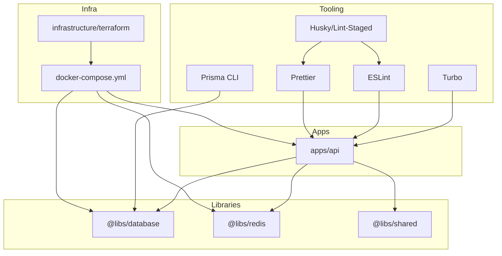
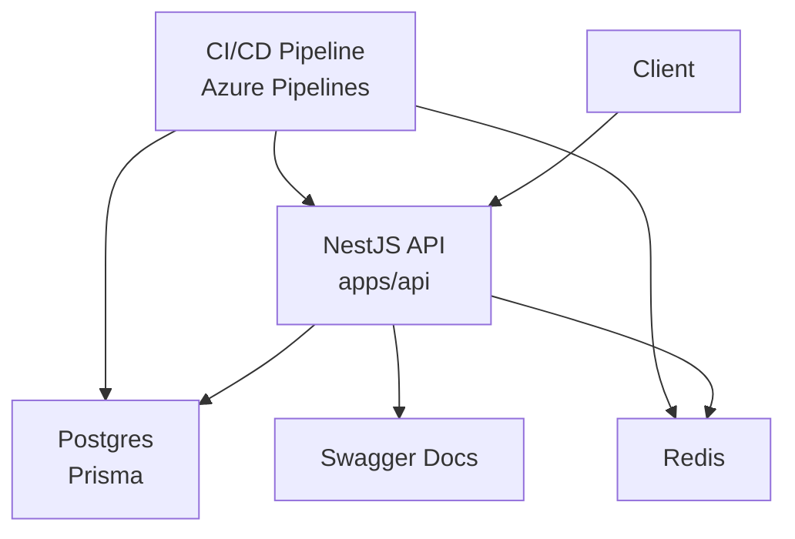
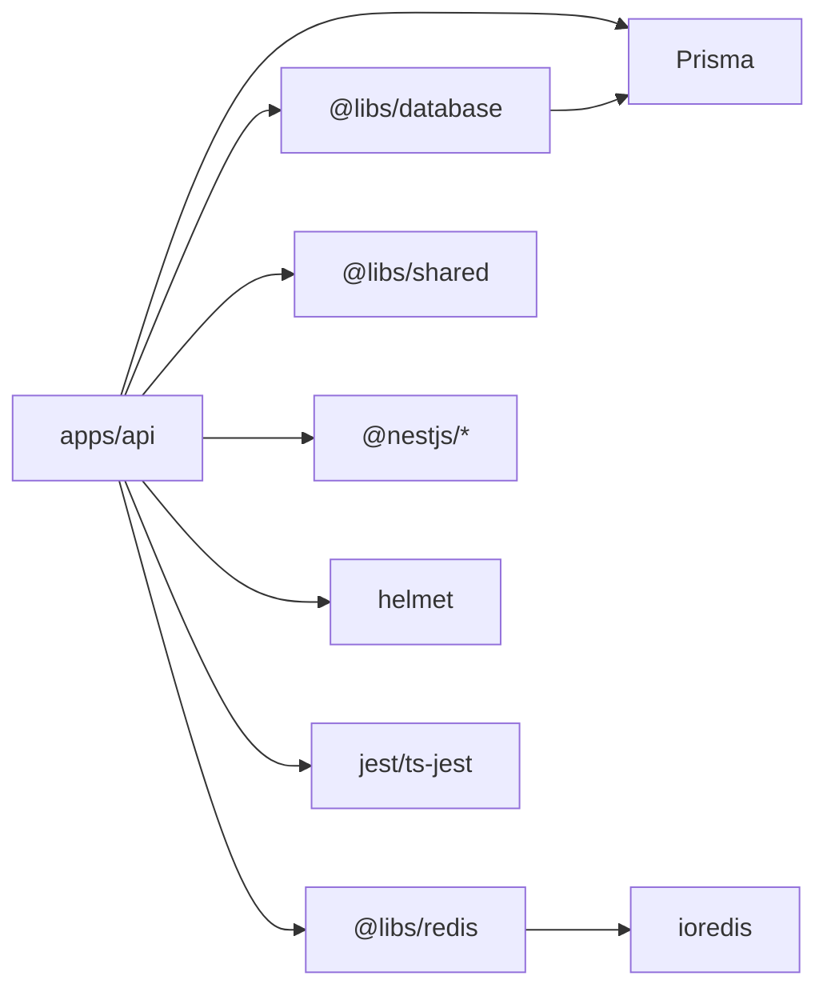

# Development Guidelines

<cite>
**Referenced Files in This Document**
- [.eslintrc.js](file://.eslintrc.js)
- [.prettierrc](file://.prettierrc)
- [package.json](file://package.json)
- [turbo.json](file://turbo.json)
- [docker-compose.yml](file://docker-compose.yml)
- [azure-pipelines.yml](file://azure-pipelines.yml)
- [.gitignore](file://.gitignore)
- [apps/api/nest-cli.json](file://apps/api/nest-cli.json)
- [apps/api/tsconfig.json](file://apps/api/tsconfig.json)
- [apps/api/src/app.module.ts](file://apps/api/src/app.module.ts)
- [apps/api/src/main.ts](file://apps/api/src/main.ts)
- [apps/api/test/jest-e2e.json](file://apps/api/test/jest-e2e.json)
- [libs/database/src/prisma.service.ts](file://libs/database/src/prisma.service.ts)
- [libs/redis/src/redis.service.ts](file://libs/redis/src/redis.service.ts)
- [libs/shared/src/dto/response.dto.ts](file://libs/shared/src/dto/response.dto.ts)
- [prisma/schema.prisma](file://prisma/schema.prisma)
</cite>

## Table of Contents
1. [Introduction](#introduction)
2. [Project Structure](#project-structure)
3. [Core Components](#core-components)
4. [Architecture Overview](#architecture-overview)
5. [Detailed Component Analysis](#detailed-component-analysis)
6. [Dependency Analysis](#dependency-analysis)
7. [Performance Considerations](#performance-considerations)
8. [Troubleshooting Guide](#troubleshooting-guide)
9. [Conclusion](#conclusion)
10. [Appendices](#appendices)

## Introduction
This document provides comprehensive development guidelines for contributing to the Quiz-to-build project. It covers code style standards with ESLint and Prettier, TypeScript formatting rules, and NestJS-specific conventions. It also explains the testing strategy using Jest, the Git workflow, monorepo structure, adding new applications or libraries, clean code practices, error handling, logging, documentation, code review processes, quality gates, continuous integration requirements, and templates/best practices for working with Prisma, NestJS modules, and shared libraries.

## Project Structure
The project follows a monorepo layout with:
- apps/api: The NestJS backend application
- libs/database, libs/redis, libs/shared: Shared libraries consumed by apps
- prisma: Database schema and seed configuration
- docker: Local development containers
- infrastructure/terraform: Infrastructure-as-Code for deployment
- docs: Business and technical documentation
- Root tooling: ESLint, Prettier, Turbo, Husky, and CI pipeline

**Diagram sources**
- [apps/api/src/app.module.ts](file://apps/api/src/app.module.ts#L1-L67)
- [apps/api/tsconfig.json](file://apps/api/tsconfig.json#L7-L14)
- [package.json](file://package.json#L10-L33)
- [.eslintrc.js](file://.eslintrc.js#L1-L96)
- [.prettierrc](file://.prettierrc#L1-L11)
- [turbo.json](file://turbo.json#L1-L46)
- [docker-compose.yml](file://docker-compose.yml#L1-L77)
- [prisma/schema.prisma](file://prisma/schema.prisma#L1-L447)

**Section sources**
- [package.json](file://package.json#L6-L9)
- [apps/api/src/app.module.ts](file://apps/api/src/app.module.ts#L1-L67)
- [apps/api/tsconfig.json](file://apps/api/tsconfig.json#L7-L14)

## Core Components
- Code Style and Formatting
  - ESLint configured with TypeScript and Prettier integration, including strict rules for promises, unused variables, and naming conventions.
  - Prettier settings enforce consistent formatting across TS/JS/JSON/Markdown.
- Testing
  - Jest-based unit and e2e tests with ts-jest transform and moduleNameMapper for library aliases.
  - E2E configuration maps @libs/* to library source paths.
- Monorepo Tooling
  - Turbo pipeline orchestrates build, test, lint, and dev tasks across apps and libs.
  - Husky and lint-staged auto-format and lint staged changes.
- NestJS Application
  - Central AppModule imports shared modules and global middleware/pipes/interceptors/filters.
  - main.ts sets up security, CORS, global prefix, Swagger docs (non-production), and graceful shutdown hooks.
- Shared Libraries
  - database: Prisma client wrapper with lifecycle logging and test helpers.
  - redis: Redis client wrapper with connection lifecycle and convenience methods.
  - shared: DTOs for standardized API responses.
- Prisma
  - Strongly typed schema with enums, relations, indexes, and mapped table names.

**Section sources**
- [.eslintrc.js](file://.eslintrc.js#L1-L96)
- [.prettierrc](file://.prettierrc#L1-L11)
- [apps/api/test/jest-e2e.json](file://apps/api/test/jest-e2e.json#L1-L15)
- [turbo.json](file://turbo.json#L1-L46)
- [package.json](file://package.json#L35-L59)
- [apps/api/src/app.module.ts](file://apps/api/src/app.module.ts#L1-L67)
- [apps/api/src/main.ts](file://apps/api/src/main.ts#L1-L93)
- [libs/database/src/prisma.service.ts](file://libs/database/src/prisma.service.ts#L1-L62)
- [libs/redis/src/redis.service.ts](file://libs/redis/src/redis.service.ts#L1-L96)
- [libs/shared/src/dto/response.dto.ts](file://libs/shared/src/dto/response.dto.ts#L1-L61)
- [prisma/schema.prisma](file://prisma/schema.prisma#L1-L447)

## Architecture Overview
High-level runtime architecture:
- NestJS API application bootstrapped with global pipes, filters, interceptors, and Swagger.
- Uses shared libraries for database (Prisma) and cache (Redis).
- Docker Compose runs Postgres and Redis locally; API depends on them.
- CI/CD pipeline builds, tests, secures, provisions infrastructure, and deploys to Azure Container Apps.

**Diagram sources**
- [apps/api/src/main.ts](file://apps/api/src/main.ts#L11-L86)
- [apps/api/src/app.module.ts](file://apps/api/src/app.module.ts#L16-L64)
- [docker-compose.yml](file://docker-compose.yml#L4-L68)
- [azure-pipelines.yml](file://azure-pipelines.yml#L40-L391)

## Detailed Component Analysis

### Code Style and Formatting (ESLint + Prettier)
- Parser and TypeScript integration with project-specific tsconfig.
- Extends recommended TypeScript and Prettier configs; Jest environment enabled.
- Strict rules:
  - Promises: floating, misused, await-thenable, require-await.
  - Variables: no any, unused vars with underscore allowance.
  - General: console warnings, debugger errors, duplicate imports, unused expressions, prefer-const, eqeqeq, curly braces.
  - Naming conventions: PascalCase for interfaces/classes/types/enums; UPPER_CASE for enums; camelCase for variables/functions/methods; leading underscore allowed for parameters.
- Overrides for spec/e2e files disable certain strictness rules to support testing patterns.

Best practices:
- Run formatting and lint fixes via npm scripts.
- Use lint-staged to automatically fix staged files before committing.

**Section sources**
- [.eslintrc.js](file://.eslintrc.js#L1-L96)
- [.prettierrc](file://.prettierrc#L1-L11)
- [package.json](file://package.json#L22-L28)

### Testing Strategy (Jest)
- Unit tests: run via turbo pipeline; coverage published.
- E2E tests: ts-jest transform, test regex targeting e2e-spec.ts, and moduleNameMapper for @libs/* aliases.
- Test scripts: test, test:watch, test:cov, test:e2e.

Recommended patterns:
- Place unit tests alongside source files (.spec.ts).
- Place e2e tests under apps/api/test with .e2e-spec.ts suffix.
- Use shared DTOs from @libs/shared for consistent response shapes.

**Section sources**
- [apps/api/test/jest-e2e.json](file://apps/api/test/jest-e2e.json#L1-L15)
- [turbo.json](file://turbo.json#L23-L37)
- [package.json](file://package.json#L16-L19)

### Git Workflow
- Branching:
  - Develop and main are included in CI triggers.
  - Keep feature branches short-lived and focused.
- Commit messages:
  - Use imperative style; keep subject under 50 chars; reference issue numbers when applicable.
- Pull requests:
  - Open against develop or main depending on release strategy.
  - Ensure CI passes, reviews approved, and conflicts resolved before merging.

Note: The repository does not define explicit branch naming or commit message conventions in the checked files. Adopt team-specific standards aligned with semantic versioning and conventional commits if desired.

**Section sources**
- [azure-pipelines.yml](file://azure-pipelines.yml#L4-L18)
- [.gitignore](file://.gitignore#L1-L50)

### Monorepo Structure and Adding New Apps/Libs
- Workspaces include apps/* and libs/*.
- Turbo pipeline defines task dependencies and outputs per package.
- NestJS tsconfig maps @libs/* to library source roots.
- Add a new app:
  - Create apps/myapp with Nest CLI and Nest factory.
  - Configure nest-cli.json and tsconfig.json with proper paths.
  - Add to Turbo pipeline if needed.
- Add a new lib:
  - Create libs/mylib with src/index.ts exports.
  - Export public APIs from index.ts.
  - Reference via @libs/mylib alias in consuming apps.

**Section sources**
- [package.json](file://package.json#L6-L9)
- [turbo.json](file://turbo.json#L1-L46)
- [apps/api/nest-cli.json](file://apps/api/nest-cli.json#L1-L11)
- [apps/api/tsconfig.json](file://apps/api/tsconfig.json#L7-L14)

### Clean Code Practices
- Error handling:
  - Global HttpExceptionFilter applied in main.ts.
  - Prefer throwing domain/service exceptions and mapping them centrally.
- Logging:
  - Use Nest Logger in bootstrap and library services.
  - Database and Redis clients log lifecycle events and errors.
- Documentation:
  - Swagger enabled in non-production environments.
  - Shared DTOs provide structured response schemas.

**Section sources**
- [apps/api/src/main.ts](file://apps/api/src/main.ts#L45-L49)
- [apps/api/src/main.ts](file://apps/api/src/main.ts#L51-L78)
- [libs/database/src/prisma.service.ts](file://libs/database/src/prisma.service.ts#L6-L39)
- [libs/redis/src/redis.service.ts](file://libs/redis/src/redis.service.ts#L6-L34)
- [libs/shared/src/dto/response.dto.ts](file://libs/shared/src/dto/response.dto.ts#L17-L40)

### Prisma Integration
- Strongly typed models with enums, relations, indexes, and mapped table names.
- PrismaService extends PrismaClient with lifecycle hooks and slow query logging in development.
- Test-only cleanup utilities for truncating tables and flushing Redis.

Guidelines:
- Define schema changes in prisma/schema.prisma.
- Use prisma migrate commands for dev/prod migrations.
- Seed data via prisma db seed.

**Section sources**
- [prisma/schema.prisma](file://prisma/schema.prisma#L1-L447)
- [libs/database/src/prisma.service.ts](file://libs/database/src/prisma.service.ts#L1-L62)
- [package.json](file://package.json#L24-L28)

### NestJS Modules and Interceptors/Filters
- AppModule aggregates feature modules and shared modules (database, redis).
- Global interceptors (logging, transform) and filter (HTTP exceptions) applied in main.ts.
- ValidationPipe configured globally with whitelisting and implicit conversion.

Recommendations:
- Keep modules cohesive and import only necessary shared modules.
- Centralize cross-cutting concerns in interceptors/filters/guards.

**Section sources**
- [apps/api/src/app.module.ts](file://apps/api/src/app.module.ts#L1-L67)
- [apps/api/src/main.ts](file://apps/api/src/main.ts#L33-L49)

### Continuous Integration and Quality Gates
- CI stages:
  - Build and Test: lint, type check, unit tests with coverage, build app, Docker image build.
  - Security: npm audit and Trivy filesystem scan.
  - Infrastructure: Terraform init/plan; manual approval required before apply.
  - Deploy: load image, push to ACR, update Container Apps, run Prisma migrations.
  - Verify: health and readiness checks.
- Quality gates:
  - Lint and type checks must pass.
  - Unit test coverage published.
  - Security scans optional but encouraged.
  - Manual approval for infrastructure changes.

**Section sources**
- [azure-pipelines.yml](file://azure-pipelines.yml#L40-L391)

## Dependency Analysis
- Internal dependencies:
  - apps/api depends on @libs/database, @libs/redis, @libs/shared.
  - Library tsconfig maps @libs/* aliases to source roots.
- External dependencies:
  - NestJS ecosystem (core, config, swagger, throttler), Prisma, Redis client, Helmet, Jest, Turbo, Husky, ESLint/Prettier.

**Diagram sources**
- [apps/api/src/app.module.ts](file://apps/api/src/app.module.ts#L5-L56)
- [apps/api/tsconfig.json](file://apps/api/tsconfig.json#L7-L14)
- [libs/database/src/prisma.service.ts](file://libs/database/src/prisma.service.ts#L1-L62)
- [libs/redis/src/redis.service.ts](file://libs/redis/src/redis.service.ts#L1-L96)

**Section sources**
- [apps/api/src/app.module.ts](file://apps/api/src/app.module.ts#L1-L67)
- [apps/api/tsconfig.json](file://apps/api/tsconfig.json#L7-L14)

## Performance Considerations
- Use Turbo caching and incremental builds to speed up local development and CI.
- Enable lint-staged to catch issues early and reduce CI failures.
- Keep DTOs consistent to minimize serialization overhead.
- Monitor slow queries in development via Prisma query logs.
- Use Redis for caching hot data and offload database workloads.

## Troubleshooting Guide
- Local environment
  - Ensure Docker Compose services are healthy before starting the API.
  - Check database and Redis healthchecks in docker-compose.yml.
- Prisma
  - If migrations fail, run dev/prod migration commands and seed as needed.
  - Use studio for schema inspection during development.
- CI/CD
  - Review lint/type/test failures in pipeline logs.
  - For Terraform apply, ensure manual approval was granted and plan artifacts are present.
- NestJS
  - Verify global pipes/filters/interceptors are registered in main.ts.
  - Confirm Swagger is enabled only in non-production environments.

**Section sources**
- [docker-compose.yml](file://docker-compose.yml#L17-L21)
- [docker-compose.yml](file://docker-compose.yml#L33-L37)
- [package.json](file://package.json#L24-L28)
- [azure-pipelines.yml](file://azure-pipelines.yml#L139-L259)
- [apps/api/src/main.ts](file://apps/api/src/main.ts#L51-L78)

## Conclusion
These guidelines consolidate the project’s tooling, architecture, and processes to ensure consistent, maintainable, and secure development. Follow the style and testing standards, adhere to the Git workflow, leverage the monorepo structure, and meet the CI quality gates to deliver reliable features.

## Appendices

### A. Code Style Templates
- ESLint configuration enforces TypeScript best practices and naming conventions.
- Prettier ensures consistent formatting across the monorepo.

**Section sources**
- [.eslintrc.js](file://.eslintrc.js#L21-L84)
- [.prettierrc](file://.prettierrc#L1-L11)

### B. Testing Templates
- Unit tests: place .spec.ts beside the source file.
- E2E tests: place .e2e-spec.ts under apps/api/test with ts-jest transform and library aliases.

**Section sources**
- [apps/api/test/jest-e2e.json](file://apps/api/test/jest-e2e.json#L1-L15)

### C. NestJS Module Template
- Import shared modules (database, redis) and feature modules.
- Register global pipes, filters, interceptors, and Swagger in main.ts.

**Section sources**
- [apps/api/src/app.module.ts](file://apps/api/src/app.module.ts#L16-L64)
- [apps/api/src/main.ts](file://apps/api/src/main.ts#L33-L78)

### D. Prisma Schema Template
- Define models, enums, relations, indexes, and mapped table names.
- Use Prisma CLI commands for migrations and seeding.

**Section sources**
- [prisma/schema.prisma](file://prisma/schema.prisma#L1-L447)
- [package.json](file://package.json#L24-L28)

### E. CI/CD Pipeline Overview
- Build, lint, type check, unit tests, Docker build, security scans, Terraform plan/apply, deploy, and verification.

**Section sources**
- [azure-pipelines.yml](file://azure-pipelines.yml#L40-L391)