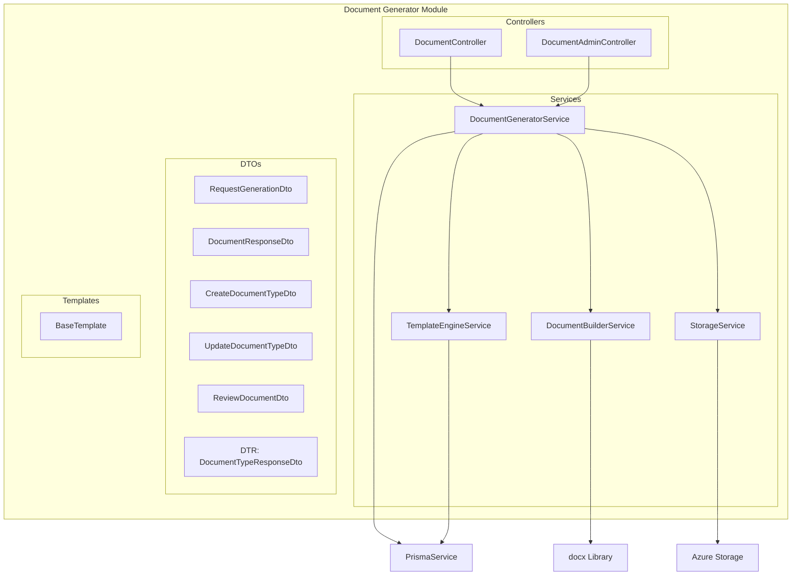
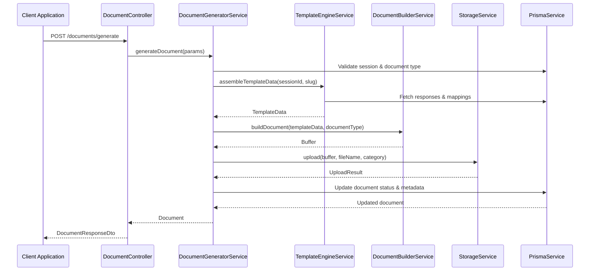
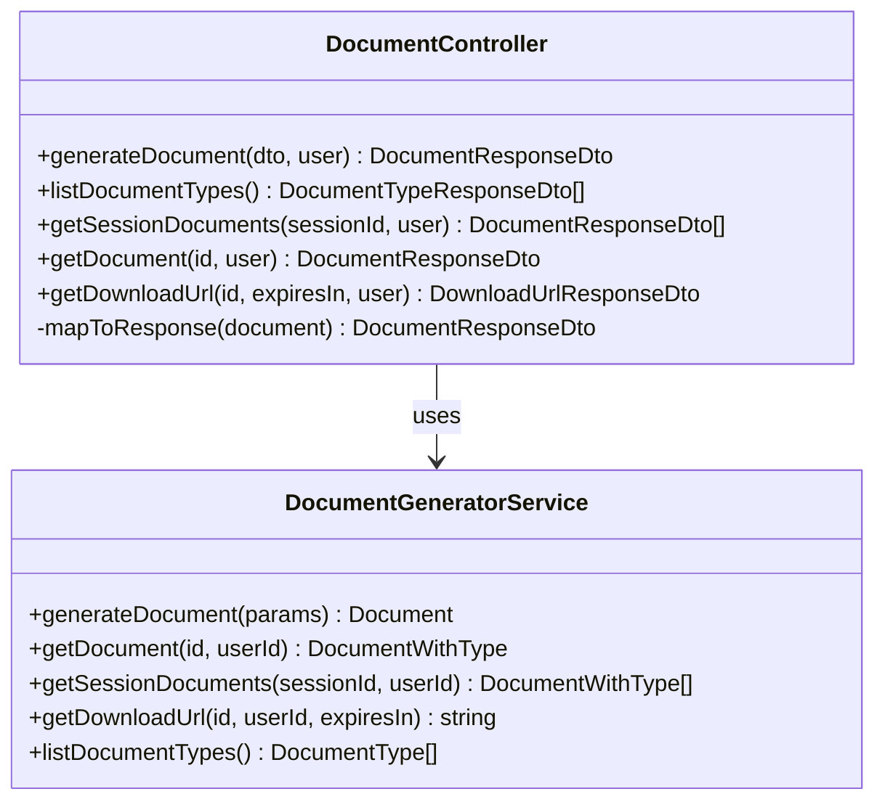
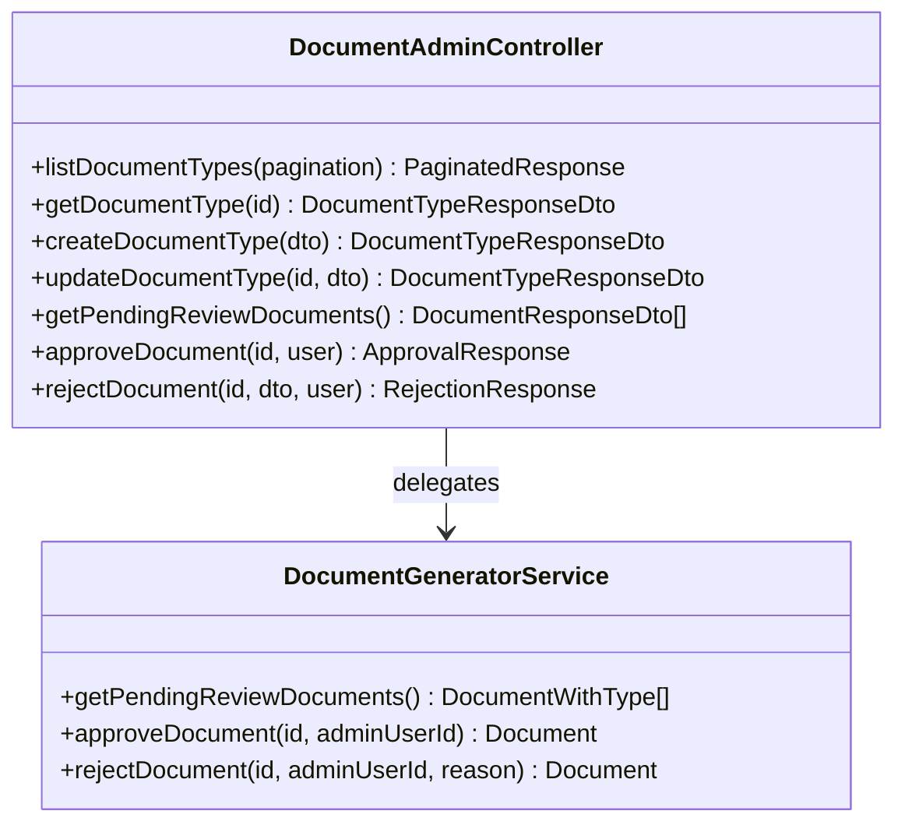
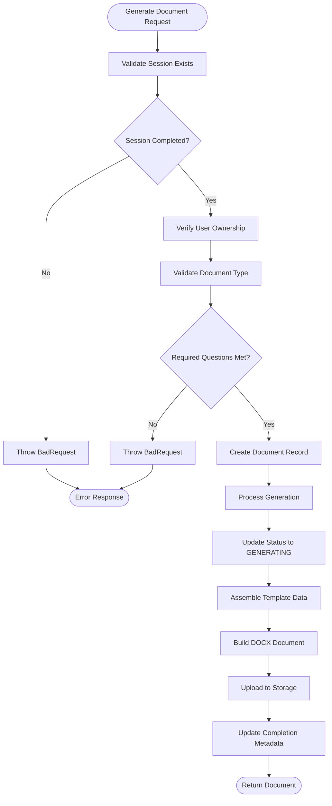
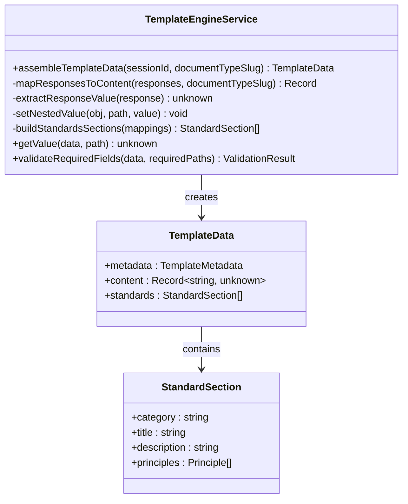
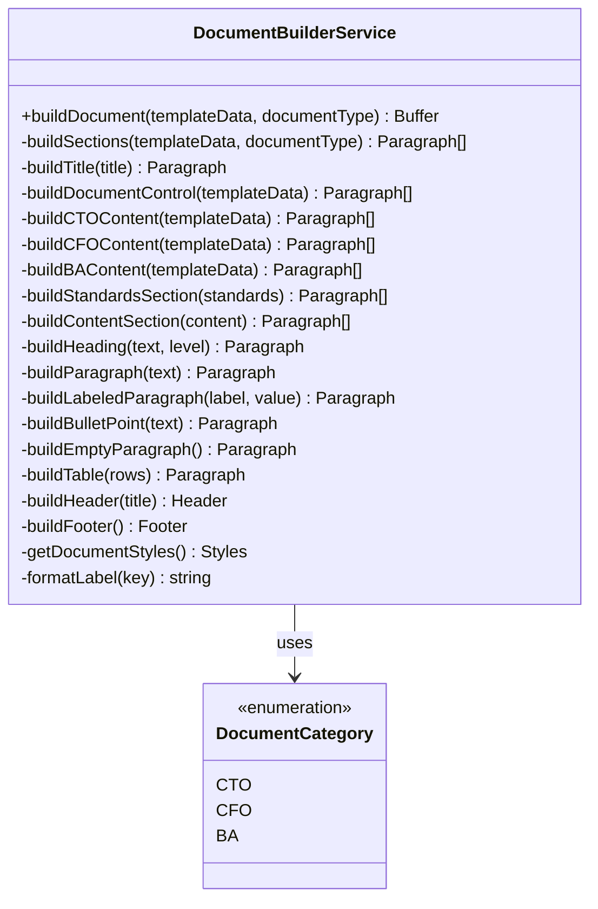
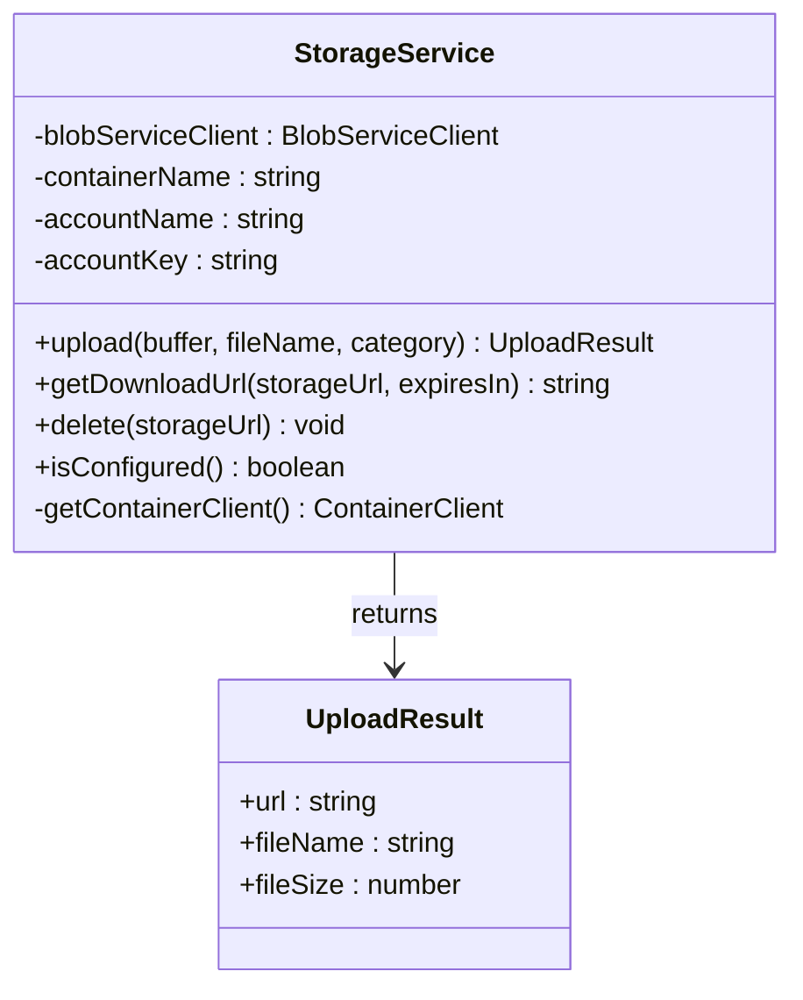

# Document Generator Controllers

<cite>
**Referenced Files in This Document**
- [document-admin.controller.ts](file://apps/api/src/modules/document-generator/controllers/document-admin.controller.ts)
- [document.controller.ts](file://apps/api/src/modules/document-generator/controllers/document.controller.ts)
- [document-generator.service.ts](file://apps/api/src/modules/document-generator/services/document-generator.service.ts)
- [document-builder.service.ts](file://apps/api/src/modules/document-generator/services/document-builder.service.ts)
- [template-engine.service.ts](file://apps/api/src/modules/document-generator/services/template-engine.service.ts)
- [storage.service.ts](file://apps/api/src/modules/document-generator/services/storage.service.ts)
- [document-generator.module.ts](file://apps/api/src/modules/document-generator/document-generator.module.ts)
- [request-generation.dto.ts](file://apps/api/src/modules/document-generator/dto/request-generation.dto.ts)
- [document-response.dto.ts](file://apps/api/src/modules/document-generator/dto/document-response.dto.ts)
- [create-document-type.dto.ts](file://apps/api/src/modules/document-generator/dto/create-document-type.dto.ts)
- [update-document-type.dto.ts](file://apps/api/src/modules/document-generator/dto/update-document-type.dto.ts)
- [review-document.dto.ts](file://apps/api/src/modules/document-generator/dto/review-document.dto.ts)
- [base.template.ts](file://apps/api/src/modules/document-generator/templates/base.template.ts)
</cite>

## Update Summary
**Changes Made**
- Enhanced type safety in controller methods with explicit DocumentTypeResponseDto casting
- Improved response handling through explicit type assertions for better compile-time type checking
- Added comprehensive type safety measures in document generation and administrative operations

## Table of Contents
1. [Introduction](#introduction)
2. [Project Structure](#project-structure)
3. [Core Components](#core-components)
4. [Architecture Overview](#architecture-overview)
5. [Detailed Component Analysis](#detailed-component-analysis)
6. [API Endpoints](#api-endpoints)
7. [Document Generation Workflow](#document-generation-workflow)
8. [Security and Access Control](#security-and-access-control)
9. [Storage and Templates](#storage-and-templates)
10. [Enhanced Type Safety Implementation](#enhanced-type-safety-implementation)
11. [Troubleshooting Guide](#troubleshooting-guide)
12. [Conclusion](#conclusion)

## Introduction

The Document Generator Controllers module is a comprehensive system within the Quiz-to-build application that enables automated document creation from questionnaire responses. This module provides both user-facing document generation capabilities and administrative document management functionality. It integrates with Azure Blob Storage for document storage, uses a sophisticated template engine for content assembly, and implements a multi-tiered document generation pipeline.

The system supports three primary document categories: Business Analysis (BA), Chief Financial Officer (CFO), and Chief Technology Officer (CTO) documents, each with specialized content structures and requirements. The controllers expose RESTful APIs for document generation requests, retrieval, and administrative oversight.

**Updated** Enhanced with improved type safety through explicit DocumentTypeResponseDto casting in controller methods for better compile-time type checking and runtime response validation.

## Project Structure

The Document Generator module follows a clean architecture pattern with clear separation of concerns:



**Diagram sources**
- [document-generator.module.ts](file://apps/api/src/modules/document-generator/document-generator.module.ts#L1-L23)
- [document.controller.ts](file://apps/api/src/modules/document-generator/controllers/document.controller.ts#L1-L163)
- [document-admin.controller.ts](file://apps/api/src/modules/document-generator/controllers/document-admin.controller.ts#L1-L230)

**Section sources**
- [document-generator.module.ts](file://apps/api/src/modules/document-generator/document-generator.module.ts#L1-L23)

## Core Components

The Document Generator module consists of several interconnected components that work together to provide comprehensive document generation capabilities:

### Controller Layer
- **DocumentController**: Handles user-facing document operations including generation requests, document retrieval, and download URL generation
- **DocumentAdminController**: Manages administrative document operations including document type management and document review workflows

### Service Layer
- **DocumentGeneratorService**: Orchestrates the complete document generation pipeline, coordinating between template engine, builder, and storage services
- **TemplateEngineService**: Assembles template data from questionnaire responses and applies document-specific mappings
- **DocumentBuilderService**: Constructs DOCX documents using the docx library with category-specific formatting
- **StorageService**: Manages document storage and retrieval using Azure Blob Storage with secure SAS token generation

### Data Transfer Objects (DTOs)
- Comprehensive validation and serialization for all API requests and responses
- Support for document type management and review workflows
- **Enhanced Type Safety**: Explicit DocumentTypeResponseDto casting ensures compile-time type checking and runtime response validation

**Section sources**
- [document.controller.ts](file://apps/api/src/modules/document-generator/controllers/document.controller.ts#L33-L36)
- [document-admin.controller.ts](file://apps/api/src/modules/document-generator/controllers/document-admin.controller.ts#L40-L43)
- [document-generator.service.ts](file://apps/api/src/modules/document-generator/services/document-generator.service.ts#L28-L37)

## Architecture Overview

The Document Generator follows a layered architecture pattern with clear separation between presentation, business logic, and data access layers:



**Diagram sources**
- [document.controller.ts](file://apps/api/src/modules/document-generator/controllers/document.controller.ts#L38-L54)
- [document-generator.service.ts](file://apps/api/src/modules/document-generator/services/document-generator.service.ts#L42-L139)
- [template-engine.service.ts](file://apps/api/src/modules/document-generator/services/template-engine.service.ts#L35-L99)

The architecture implements several key design patterns:

- **Service Layer Pattern**: Business logic encapsulated in dedicated services
- **Repository Pattern**: Data access through PrismaService
- **Strategy Pattern**: Category-specific document building strategies
- **Template Method Pattern**: Consistent document generation workflow

## Detailed Component Analysis

### DocumentController Analysis

The DocumentController provides the primary interface for end-users to interact with the document generation system:



**Diagram sources**
- [document.controller.ts](file://apps/api/src/modules/document-generator/controllers/document.controller.ts#L33-L162)
- [document-generator.service.ts](file://apps/api/src/modules/document-generator/services/document-generator.service.ts#L28-L37)

**Section sources**
- [document.controller.ts](file://apps/api/src/modules/document-generator/controllers/document.controller.ts#L33-L162)

### DocumentAdminController Analysis

The DocumentAdminController handles administrative document management operations:



**Diagram sources**
- [document-admin.controller.ts](file://apps/api/src/modules/document-generator/controllers/document-admin.controller.ts#L39-L229)
- [document-generator.service.ts](file://apps/api/src/modules/document-generator/services/document-generator.service.ts#L284-L358)

**Section sources**
- [document-admin.controller.ts](file://apps/api/src/modules/document-generator/controllers/document-admin.controller.ts#L39-L229)

### DocumentGeneratorService Analysis

The DocumentGeneratorService orchestrates the entire document generation pipeline:



**Diagram sources**
- [document-generator.service.ts](file://apps/api/src/modules/document-generator/services/document-generator.service.ts#L42-L194)

**Section sources**
- [document-generator.service.ts](file://apps/api/src/modules/document-generator/services/document-generator.service.ts#L28-L359)

### TemplateEngineService Analysis

The TemplateEngineService handles the complex task of transforming questionnaire responses into structured document content:



**Diagram sources**
- [template-engine.service.ts](file://apps/api/src/modules/document-generator/services/template-engine.service.ts#L27-L289)

**Section sources**
- [template-engine.service.ts](file://apps/api/src/modules/document-generator/services/template-engine.service.ts#L27-L289)

### DocumentBuilderService Analysis

The DocumentBuilderService constructs the final DOCX documents using the docx library:



**Diagram sources**
- [document-builder.service.ts](file://apps/api/src/modules/document-generator/services/document-builder.service.ts#L28-L486)

**Section sources**
- [document-builder.service.ts](file://apps/api/src/modules/document-generator/services/document-builder.service.ts#L28-L486)

### StorageService Analysis

The StorageService manages document storage and retrieval using Azure Blob Storage:



**Diagram sources**
- [storage.service.ts](file://apps/api/src/modules/document-generator/services/storage.service.ts#L18-L159)

**Section sources**
- [storage.service.ts](file://apps/api/src/modules/document-generator/services/storage.service.ts#L18-L159)

## API Endpoints

The Document Generator exposes a comprehensive set of RESTful endpoints organized into logical groups:

### User Document Operations

| Endpoint | Method | Description | Authentication |
|----------|--------|-------------|----------------|
| `/documents/generate` | POST | Request document generation for a session | JWT Required |
| `/documents/types` | GET | List available document types | JWT Required |
| `/documents/session/:sessionId` | GET | List all documents for a session | JWT Required |
| `/documents/:id` | GET | Get document details | JWT Required |
| `/documents/:id/download` | GET | Get secure download URL | JWT Required |

### Administrative Document Operations

| Endpoint | Method | Description | Authentication | Roles |
|----------|--------|-------------|----------------|-------|
| `/admin/document-types` | GET | List all document types | JWT + Roles | ADMIN, SUPER_ADMIN |
| `/admin/document-types/:id` | GET | Get document type details | JWT + Roles | ADMIN, SUPER_ADMIN |
| `/admin/document-types` | POST | Create document type | JWT + Roles | ADMIN, SUPER_ADMIN |
| `/admin/document-types/:id` | PATCH | Update document type | JWT + Roles | ADMIN, SUPER_ADMIN |
| `/admin/documents/pending-review` | GET | List documents pending review | JWT + Roles | ADMIN, SUPER_ADMIN |
| `/admin/documents/:id/approve` | PATCH | Approve a document | JWT + Roles | ADMIN, SUPER_ADMIN |
| `/admin/documents/:id/reject` | PATCH | Reject a document | JWT + Roles | ADMIN, SUPER_ADMIN |

**Section sources**
- [document.controller.ts](file://apps/api/src/modules/document-generator/controllers/document.controller.ts#L38-L113)
- [document-admin.controller.ts](file://apps/api/src/modules/document-generator/controllers/document-admin.controller.ts#L49-L228)

## Document Generation Workflow

The document generation process follows a sophisticated multi-stage workflow:

### Stage 1: Validation and Preparation
1. **Session Validation**: Verify session exists and is completed
2. **User Authorization**: Confirm user ownership of the session
3. **Document Type Validation**: Ensure document type exists and is active
4. **Requirement Checking**: Validate completion of required questions

### Stage 2: Template Assembly
1. **Response Collection**: Gather all valid responses for the session
2. **Content Mapping**: Apply document-specific mappings to organize data
3. **Standard Integration**: Include relevant engineering standards for CTO documents
4. **Template Data Creation**: Structure data for document building

### Stage 3: Document Construction
1. **Category-Specific Building**: Apply appropriate content structure based on document category
2. **Content Rendering**: Convert structured data to formatted paragraphs and sections
3. **Style Application**: Apply consistent formatting and typography
4. **Section Organization**: Arrange content according to document specifications

### Stage 4: Storage and Metadata
1. **File Upload**: Store document in Azure Blob Storage with categorized folder structure
2. **Metadata Recording**: Update document records with storage URLs and file sizes
3. **Status Update**: Mark document as generated and ready for download
4. **Access Token Generation**: Create secure download URLs with expiration

**Section sources**
- [document-generator.service.ts](file://apps/api/src/modules/document-generator/services/document-generator.service.ts#L42-L194)
- [template-engine.service.ts](file://apps/api/src/modules/document-generator/services/template-engine.service.ts#L35-L99)
- [document-builder.service.ts](file://apps/api/src/modules/document-generator/services/document-builder.service.ts#L35-L108)

## Security and Access Control

The Document Generator implements multiple layers of security and access control:

### Authentication
- **JWT Authentication**: All endpoints require valid JSON Web Tokens
- **Role-Based Access Control**: Administrative operations restricted to ADMIN and SUPER_ADMIN roles
- **Session Ownership Verification**: Users can only access their own documents

### Authorization Patterns
- **Document Access Control**: Documents are accessible only to their creators or administrators
- **Administrative Privileges**: Admin users can approve or reject documents pending review
- **Rate Limiting**: Built-in protection against abuse through request validation

### Data Protection
- **Secure Storage**: Azure Blob Storage with HTTPS encryption
- **Temporary URLs**: Secure Access Signature (SAS) tokens with configurable expiration
- **Audit Trail**: Complete document lifecycle tracking with timestamps

**Section sources**
- [document.controller.ts](file://apps/api/src/modules/document-generator/controllers/document.controller.ts#L31-L32)
- [document-admin.controller.ts](file://apps/api/src/modules/document-generator/controllers/document-admin.controller.ts#L37-L38)
- [storage.service.ts](file://apps/api/src/modules/document-generator/services/storage.service.ts#L100-L136)

## Storage and Templates

### Storage Architecture
The system uses Azure Blob Storage with a hierarchical organization:

```
documents/
├── cto/
│   ├── 2024-01-15/
│   │   ├── business-plan-123e4567-e89b-12d3-a456-426614174000.docx
│   │   └── architecture-review-789f0123-a45b...docx
├── cfo/
│   └── 2024-01-15/
│       └── business-plan-456c7890-d12e...
└── ba/
    └── 2024-01-15/
        └── requirements-doc-321g6549-h78f...
```

### Template System
The template engine supports dynamic content assembly:

- **Category-Specific Templates**: Different content structures for CTO, CFO, and BA documents
- **Dynamic Content Mapping**: Flexible mapping from questionnaire responses to document sections
- **Standard Integration**: Automatic inclusion of relevant engineering standards for technical documents
- **Placeholder Management**: Intelligent handling of missing or incomplete data

**Section sources**
- [storage.service.ts](file://apps/api/src/modules/document-generator/services/storage.service.ts#L75-L95)
- [base.template.ts](file://apps/api/src/modules/document-generator/templates/base.template.ts#L59-L95)

## Enhanced Type Safety Implementation

**Updated** The Document Generator module now implements comprehensive type safety measures to ensure robust response handling and compile-time type checking.

### Explicit DocumentTypeResponseDto Casting

The controllers now employ explicit type casting to ensure type safety across all response operations:

#### Controller-Level Type Safety
- **DocumentController**: Uses explicit casting for document type responses in list operations
- **DocumentAdminController**: Implements comprehensive type casting for all document type management operations
- **Response Mapping**: Ensures consistent type conversion in custom response mappers

#### Implementation Details
```typescript
// Example of explicit casting in controller methods
async listDocumentTypes(): Promise<DocumentTypeResponseDto[]> {
  return this.documentGeneratorService.listDocumentTypes() 
    as unknown as Promise<DocumentTypeResponseDto[]>;
}

// Category-specific type casting for enum validation
category: document.documentType.category as DocumentTypeResponseDto['category']
```

#### Benefits of Enhanced Type Safety
- **Compile-Time Validation**: TypeScript catches type mismatches during development
- **Runtime Type Assurance**: Explicit casting ensures consistent response structures
- **Enum Type Protection**: Prevents invalid category values in document type responses
- **Better IntelliSense**: Improved development experience with accurate type information

### Type Safety in Response Mapping

The internal response mapping functions now include comprehensive type casting:

```typescript
private mapToResponse(document: {
  // ... properties
  documentType?: {
    // ... properties
    category: string;
  };
}): DocumentResponseDto {
  return {
    // ... mapped properties
    documentType: document.documentType
      ? {
          // ... mapped document type properties
          category: document.documentType.category 
            as DocumentTypeResponseDto['category'],
        }
      : undefined,
  };
}
```

### Administrative Type Safety

The administrative controller implements robust type safety for document type operations:

- **Document Type Creation**: Explicit casting ensures proper validation of new document types
- **Document Type Updates**: Type-safe updates prevent invalid property modifications
- **Document Review Responses**: Structured responses with proper type casting for approval/rejection workflows

**Section sources**
- [document.controller.ts](file://apps/api/src/modules/document-generator/controllers/document.controller.ts#L59-L61)
- [document.controller.ts](file://apps/api/src/modules/document-generator/controllers/document.controller.ts#L154-L156)
- [document-admin.controller.ts](file://apps/api/src/modules/document-generator/controllers/document-admin.controller.ts#L95-L96)
- [document-admin.controller.ts](file://apps/api/src/modules/document-generator/controllers/document-admin.controller.ts#L117-L118)
- [document-admin.controller.ts](file://apps/api/src/modules/document-generator/controllers/document-admin.controller.ts#L142-L143)

## Troubleshooting Guide

### Common Issues and Solutions

#### Document Generation Failures
**Symptoms**: Generation requests return 400 errors with validation messages
**Causes**: 
- Session not completed before generation
- Missing required questions for the document type
- User lacks permission to access the session
- Document type is inactive

**Solutions**:
1. Verify session status is COMPLETED before requesting generation
2. Check that all required questions are answered for the target document type
3. Confirm user ownership of the session
4. Ensure the document type is marked as active

#### Storage Configuration Issues
**Symptoms**: Upload operations fail or return generic errors
**Causes**:
- Missing Azure Storage connection string
- Invalid storage account credentials
- Network connectivity issues

**Solutions**:
1. Verify `AZURE_STORAGE_CONNECTION_STRING` environment variable is set
2. Check storage account name and key configuration
3. Test network connectivity to Azure endpoints

#### Download URL Generation Problems
**Symptoms**: Download requests return 400 errors or expired URLs
**Causes**:
- Document not in GENERATED or APPROVED status
- Missing storage URL in document record
- Expiration time configuration issues

**Solutions**:
1. Verify document status is either GENERATED or APPROVED
2. Check that storage URL exists in the document record
3. Validate expiration time parameter (default 60 minutes)

#### Administrative Operation Failures
**Symptoms**: Admin operations return 400 errors for document review
**Causes**:
- Document not in PENDING_REVIEW status
- Incorrect role-based access
- Invalid document ID format

**Solutions**:
1. Verify document status is PENDING_REVIEW before approval/rejection
2. Confirm user has ADMIN or SUPER_ADMIN role
3. Validate UUID format for document IDs

#### Type Safety Issues
**Symptoms**: Compilation errors or runtime type mismatches in controller responses
**Causes**:
- Missing explicit type casting in controller methods
- Inconsistent type handling across different response scenarios
- Enum type validation failures

**Solutions**:
1. Ensure all controller methods use explicit DocumentTypeResponseDto casting
2. Verify response mapping functions include proper type casting
3. Check that enum values are properly validated during type conversion

**Section sources**
- [document-generator.service.ts](file://apps/api/src/modules/document-generator/services/document-generator.service.ts#L54-L132)
- [storage.service.ts](file://apps/api/src/modules/document-generator/services/storage.service.ts#L104-L136)
- [document.controller.ts](file://apps/api/src/modules/document-generator/controllers/document.controller.ts#L59-L61)
- [document.controller.ts](file://apps/api/src/modules/document-generator/controllers/document.controller.ts#L154-L156)

## Conclusion

The Document Generator Controllers module represents a sophisticated solution for automated document creation from questionnaire responses. The system demonstrates excellent architectural principles with clear separation of concerns, comprehensive validation, and robust error handling.

**Updated** The recent enhancements significantly improve the module's reliability and maintainability through comprehensive type safety implementations. The explicit DocumentTypeResponseDto casting in controller methods provides:

- **Enhanced Compile-Time Safety**: TypeScript catches type-related issues during development
- **Improved Runtime Reliability**: Explicit casting ensures consistent response structures
- **Better Development Experience**: Accurate IntelliSense and type validation throughout the codebase
- **Future-Proof Architecture**: Robust type safety foundation for future feature additions

Key strengths of the implementation include:

- **Modular Design**: Clean separation between controllers, services, and supporting components
- **Extensible Architecture**: Easy addition of new document types and categories
- **Robust Security**: Multi-layered authentication and authorization mechanisms
- **Scalable Storage**: Efficient Azure Blob Storage integration with proper organization
- **Comprehensive Error Handling**: Detailed error messages and appropriate HTTP status codes
- **Advanced Type Safety**: Explicit casting ensures type consistency across all controller operations

The module successfully addresses the core requirement of transforming structured questionnaire data into professional, formatted documents while maintaining data integrity and user privacy. The implementation provides a solid foundation for future enhancements and additional document types, with enhanced type safety serving as a cornerstone of the improved architecture.