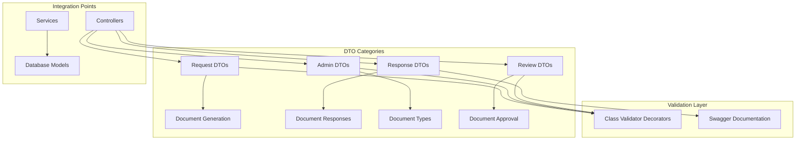
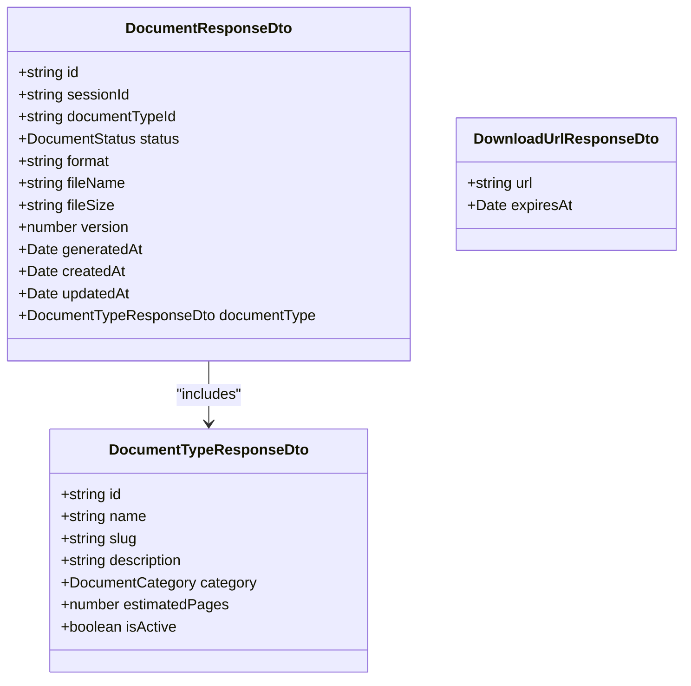
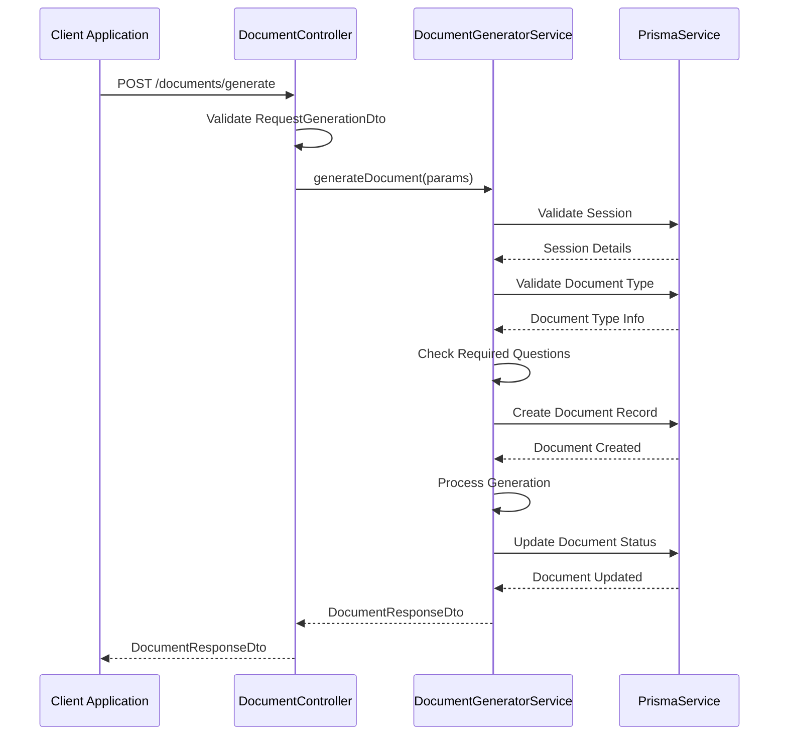
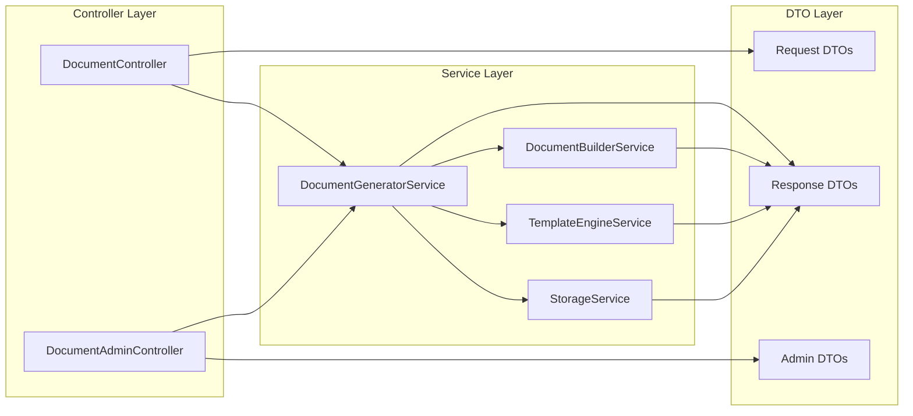

# Document Generator DTOs Documentation

<cite>
**Referenced Files in This Document**
- [index.ts](file://apps/api/src/modules/document-generator/dto/index.ts)
- [create-document-type.dto.ts](file://apps/api/src/modules/document-generator/dto/create-document-type.dto.ts)
- [document-response.dto.ts](file://apps/api/src/modules/document-generator/dto/document-response.dto.ts)
- [request-generation.dto.ts](file://apps/api/src/modules/document-generator/dto/request-generation.dto.ts)
- [review-document.dto.ts](file://apps/api/src/modules/document-generator/dto/review-document.dto.ts)
- [update-document-type.dto.ts](file://apps/api/src/modules/document-generator/dto/update-document-type.dto.ts)
- [document-generator.service.ts](file://apps/api/src/modules/document-generator/services/document-generator.service.ts)
- [document.controller.ts](file://apps/api/src/modules/document-generator/controllers/document.controller.ts)
- [document-admin.controller.ts](file://apps/api/src/modules/document-generator/controllers/document-admin.controller.ts)
- [document-generator.module.ts](file://apps/api/src/modules/document-generator/document-generator.module.ts)
- [pagination.dto.ts](file://libs/shared/src/dto/pagination.dto.ts)
- [response.dto.ts](file://libs/shared/src/dto/response.dto.ts)
</cite>

## Table of Contents
1. [Introduction](#introduction)
2. [DTO Architecture Overview](#dto-architecture-overview)
3. [Core DTO Definitions](#core-dto-definitions)
4. [Validation and Constraints](#validation-and-constraints)
5. [Response DTOs](#response-dtos)
6. [Request DTOs](#request-dtos)
7. [Admin DTOs](#admin-dtos)
8. [Integration Patterns](#integration-patterns)
9. [Usage Examples](#usage-examples)
10. [Best Practices](#best-practices)
11. [Troubleshooting Guide](#troubleshooting-guide)
12. [Conclusion](#conclusion)

## Introduction

The Document Generator DTOs represent a comprehensive set of data transfer objects that define the contract between the client applications and the Document Generator module. These DTOs serve as the foundation for document creation, generation, and management workflows within the Quiz-to-build platform.

The DTO system follows NestJS best practices by leveraging class-validator decorators for input validation and Swagger decorators for API documentation. Each DTO is carefully designed to ensure data integrity while maintaining flexibility for various document generation scenarios.

## DTO Architecture Overview

The Document Generator DTO architecture consists of several distinct categories, each serving specific purposes in the document lifecycle:



**Diagram sources**
- [document.controller.ts](file://apps/api/src/modules/document-generator/controllers/document.controller.ts#L22-L27)
- [document-admin.controller.ts](file://apps/api/src/modules/document-generator/controllers/document-admin.controller.ts#L27-L33)

**Section sources**
- [document-generator.module.ts](file://apps/api/src/modules/document-generator/document-generator.module.ts#L1-L23)

## Core DTO Definitions

### Document Type Management DTOs

The document type management DTOs handle the creation and updating of document templates and their associated metadata.

#### CreateDocumentTypeDto

The `CreateDocumentTypeDto` serves as the primary input model for creating new document types. It encapsulates all necessary information for defining document templates, including categorization, formatting requirements, and validation rules.

Key characteristics include:
- **Name Validation**: String validation with maximum length constraint
- **Slug Generation**: Unique identifier for document types
- **Category Association**: Enum-based categorization system
- **Template Path**: Optional template file specification
- **Required Questions**: Array of question IDs that must be answered
- **Output Formats**: Supported document formats (default: DOCX)
- **Page Estimation**: Estimated document length calculation
- **Activation Control**: Boolean flag for document availability

#### UpdateDocumentTypeDto

The `UpdateDocumentTypeDto` extends the creation DTO using NestJS's `PartialType` utility, enabling partial updates without requiring all fields to be specified.

**Section sources**
- [create-document-type.dto.ts](file://apps/api/src/modules/document-generator/dto/create-document-type.dto.ts#L14-L70)
- [update-document-type.dto.ts](file://apps/api/src/modules/document-generator/dto/update-document-type.dto.ts#L1-L5)

## Validation and Constraints

The DTO validation system employs a comprehensive decorator-based approach to ensure data integrity and type safety:

### Input Validation Decorators

```mermaid
flowchart TD
A[DTO Input] --> B[Class Validator]
B --> C{Field Validation}
C --> |String Fields| D[IsString + MaxLength]
C --> |UUID Fields| E[IsUUID]
C --> |Enum Fields| F[IsEnum]
C --> |Array Fields| G[IsArray + IsString(each)]
C --> |Integer Fields| H[IsInt + Min]
C --> |Boolean Fields| I[IsBoolean]
C --> |Optional Fields| J[IsOptional]
D --> K[Swagger Documentation]
E --> K
F --> K
G --> K
H --> K
I --> K
J --> K
```

**Diagram sources**
- [create-document-type.dto.ts](file://apps/api/src/modules/document-generator/dto/create-document-type.dto.ts#L1-L10)
- [request-generation.dto.ts](file://apps/api/src/modules/document-generator/dto/request-generation.dto.ts#L1-L2)

### Constraint Specifications

Each field type follows specific validation patterns:

- **String Fields**: Length-limited with optional presence
- **UUID Fields**: Strict UUID format validation
- **Enum Fields**: Type-safe enumeration validation
- **Array Fields**: Element-wise validation with type checking
- **Integer Fields**: Range validation with minimum constraints
- **Boolean Fields**: Type-safe boolean validation

**Section sources**
- [create-document-type.dto.ts](file://apps/api/src/modules/document-generator/dto/create-document-type.dto.ts#L1-L70)
- [request-generation.dto.ts](file://apps/api/src/modules/document-generator/dto/request-generation.dto.ts#L1-L28)

## Response DTOs

The response DTOs provide standardized output structures for API responses, ensuring consistent data presentation across all document-related operations.

### DocumentResponseDto

The `DocumentResponseDto` represents the complete document entity with comprehensive metadata:



**Diagram sources**
- [document-response.dto.ts](file://apps/api/src/modules/document-generator/dto/document-response.dto.ts#L27-L63)

### DocumentTypeResponseDto

The `DocumentTypeResponseDto` provides essential document type information for response contexts, excluding sensitive administrative details.

### DownloadUrlResponseDto

The `DownloadUrlResponseDto` encapsulates secure download URLs with expiration timing for document access control.

**Section sources**
- [document-response.dto.ts](file://apps/api/src/modules/document-generator/dto/document-response.dto.ts#L1-L77)

## Request DTOs

The request DTOs define the input contracts for document generation operations, ensuring proper validation and data flow.

### RequestGenerationDto

The `RequestGenerationDto` serves as the primary input for document generation requests:



**Diagram sources**
- [document.controller.ts](file://apps/api/src/modules/document-generator/controllers/document.controller.ts#L38-L54)
- [document-generator.service.ts](file://apps/api/src/modules/document-generator/services/document-generator.service.ts#L42-L139)

**Section sources**
- [request-generation.dto.ts](file://apps/api/src/modules/document-generator/dto/request-generation.dto.ts#L1-L28)

## Admin DTOs

The admin DTOs provide specialized input models for administrative document management operations.

### ReviewDocument DTOs

The review document DTOs support the document approval workflow with comprehensive validation:

#### RejectDocumentDto

The `RejectDocumentDto` validates rejection reasons with strict length constraints to ensure meaningful feedback.

#### ApproveDocumentDto

The `ApproveDocumentDto` provides optional approval notes with character limits for administrative documentation.

**Section sources**
- [review-document.dto.ts](file://apps/api/src/modules/document-generator/dto/review-document.dto.ts#L1-L24)

## Integration Patterns

The DTO system integrates seamlessly with the broader application architecture through several key patterns:

### Controller-Service Integration



**Diagram sources**
- [document.controller.ts](file://apps/api/src/modules/document-generator/controllers/document.controller.ts#L34-L36)
- [document-admin.controller.ts](file://apps/api/src/modules/document-generator/controllers/document-admin.controller.ts#L40-L43)

### Shared DTO Integration

The DTO system leverages shared DTOs for pagination and response standardization:

- **PaginationDto**: Standardized pagination with validation constraints
- **ApiResponseDto**: Consistent API response structure
- **ErrorResponseDto**: Standardized error response format

**Section sources**
- [pagination.dto.ts](file://libs/shared/src/dto/pagination.dto.ts#L1-L25)
- [response.dto.ts](file://libs/shared/src/dto/response.dto.ts#L1-L61)

## Usage Examples

### Creating a Document Type

```typescript
// Example payload for creating a document type
const createPayload = {
  name: "Business Plan",
  slug: "business-plan",
  category: "CFO",
  templatePath: "templates/cfo/business-plan.hbs",
  requiredQuestions: ["question-id-1", "question-id-2"],
  outputFormats: ["DOCX"],
  estimatedPages: 15,
  isActive: true
};
```

### Generating a Document

```typescript
// Example payload for document generation
const generatePayload = {
  sessionId: "123e4567-e89b-12d3-a456-426614174000",
  documentTypeId: "123e4567-e89b-12d3-a456-426614174000",
  format: "DOCX"
};
```

### Admin Document Review

```typescript
// Example payload for document rejection
const rejectPayload = {
  reason: "Document contains inaccurate financial projections"
};

// Example payload for document approval
const approvePayload = {
  notes: "Reviewed and approved"
};
```

## Best Practices

### Validation Strategy

The DTO validation strategy follows these principles:

1. **Progressive Validation**: Input validation occurs before business logic execution
2. **Type Safety**: Strong typing ensures compile-time error detection
3. **Constraint Specificity**: Field-specific validation constraints prevent invalid data
4. **Optional Field Handling**: Clear distinction between required and optional fields

### Error Handling

The DTO system integrates with the application's error handling framework:

- **Validation Errors**: Return structured validation error responses
- **Business Logic Errors**: Leverage service-layer exceptions
- **HTTP Status Codes**: Appropriate HTTP status codes for different error scenarios

### Performance Considerations

- **DTO Size**: Keep DTOs focused and avoid unnecessary field inclusion
- **Validation Overhead**: Use selective validation where appropriate
- **Memory Efficiency**: Consider large payload handling for document operations

## Troubleshooting Guide

### Common Validation Issues

**UUID Validation Failures**
- Ensure UUID format matches RFC 4122 standard
- Verify UUID strings are properly formatted without extra characters

**String Length Exceeds Limits**
- Check maximum length constraints for each string field
- Validate input against field-specific length limits

**Enum Value Validation**
- Ensure enum values match defined enumeration options
- Verify case sensitivity for enum values

### Integration Issues

**Controller-Service Communication**
- Verify DTO imports in controller files
- Check service method signatures match expected parameters
- Ensure proper error propagation from services to controllers

**Database Integration**
- Confirm DTO field mappings align with database schema
- Verify optional field handling for nullable database columns
- Check data type compatibility between DTOs and database models

**Section sources**
- [document.controller.ts](file://apps/api/src/modules/document-generator/controllers/document.controller.ts#L115-L161)
- [document-admin.controller.ts](file://apps/api/src/modules/document-generator/controllers/document-admin.controller.ts#L154-L178)

## Conclusion

The Document Generator DTOs provide a robust, validated, and well-documented foundation for document creation and management within the Quiz-to-build platform. The comprehensive validation system ensures data integrity, while the standardized response formats enable consistent API behavior across all document-related operations.

The modular architecture supports both user-facing document generation and administrative document management, with clear separation of concerns between request DTOs, response DTOs, and admin-specific DTOs. The integration with shared DTOs ensures consistency with the broader application architecture while maintaining the specialized requirements of the document generation workflow.

This DTO system establishes a solid foundation for future enhancements and extensions to the document generation capabilities, supporting scalability and maintainability as the platform evolves.