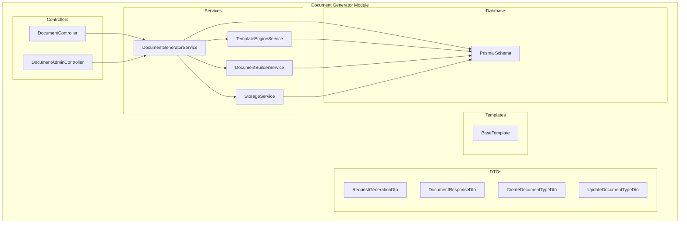
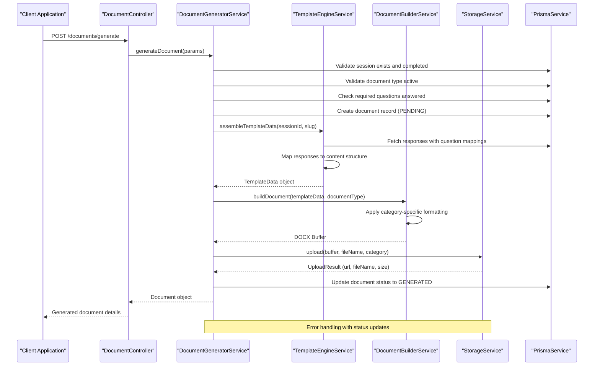
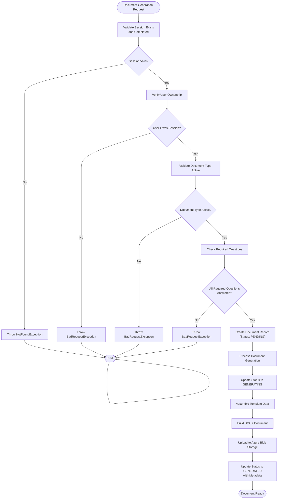
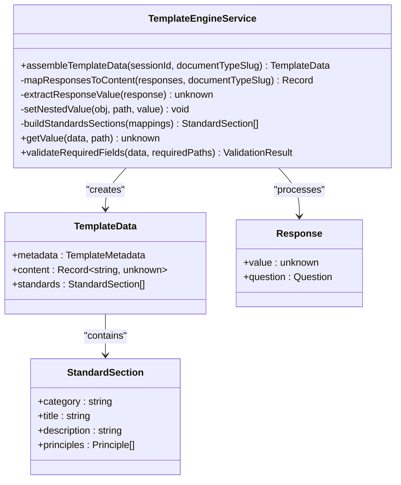
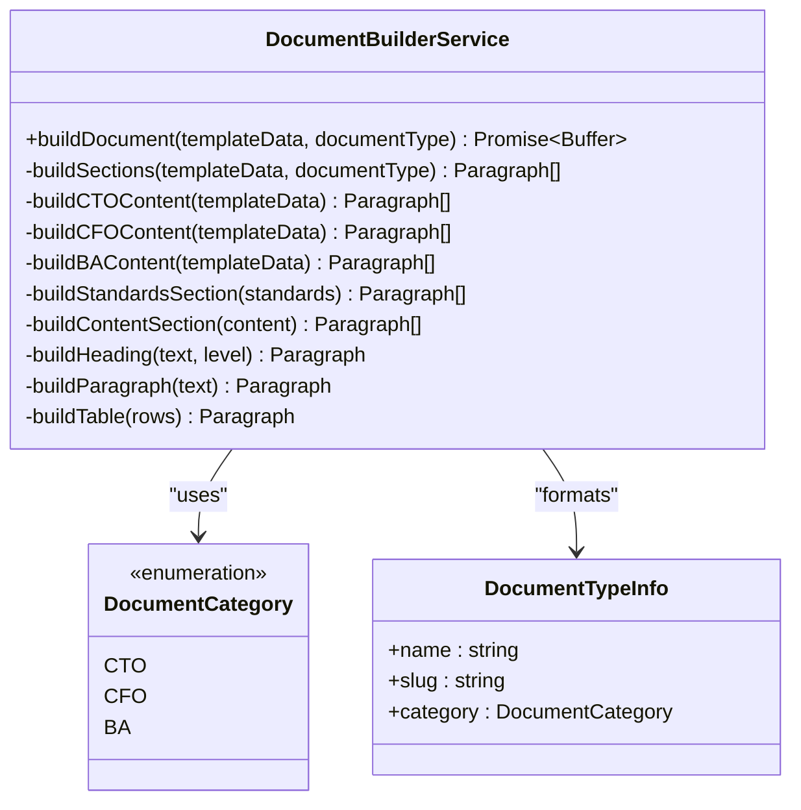
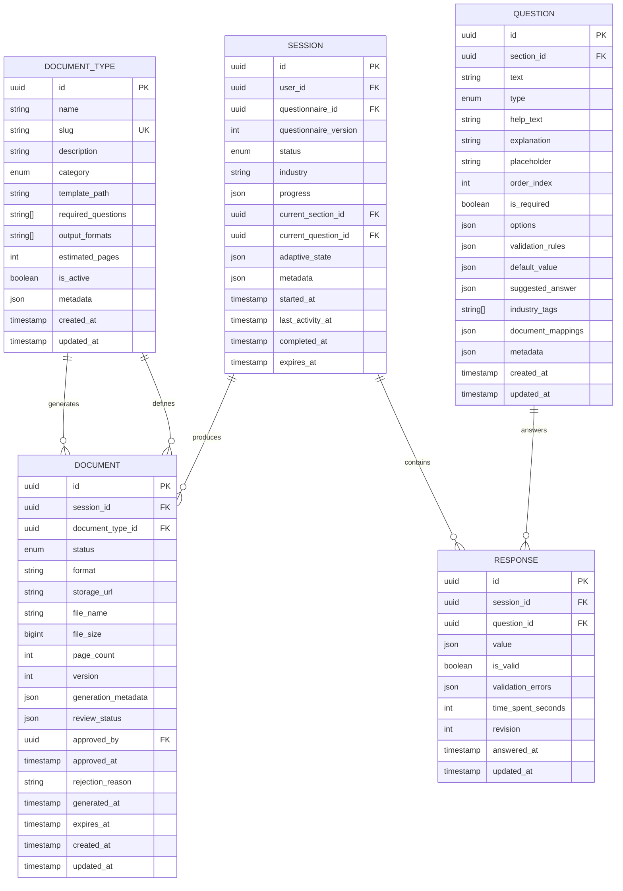
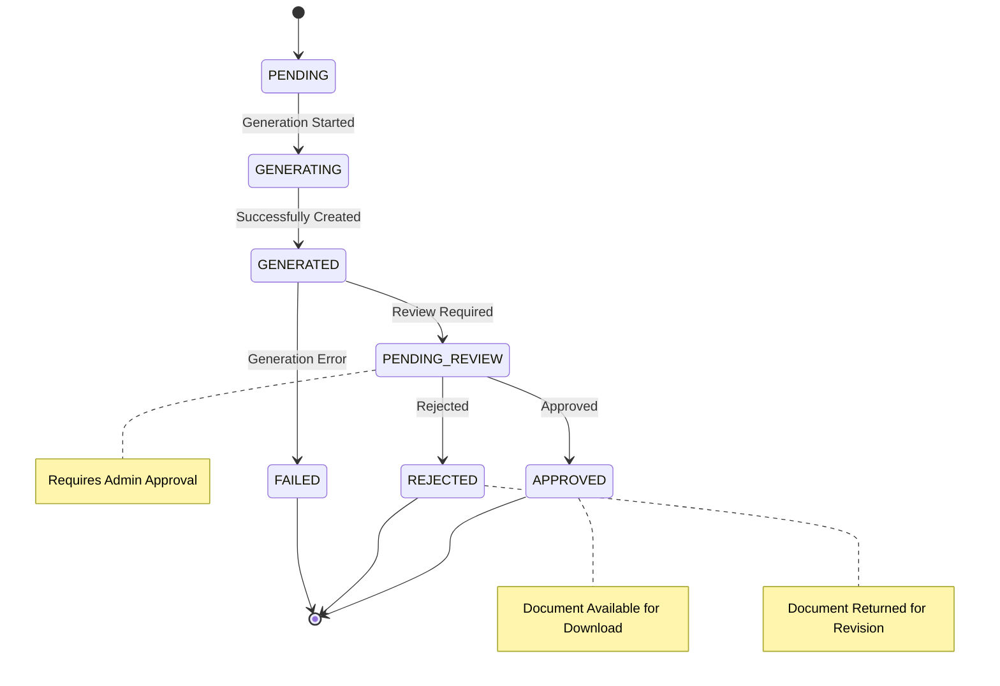
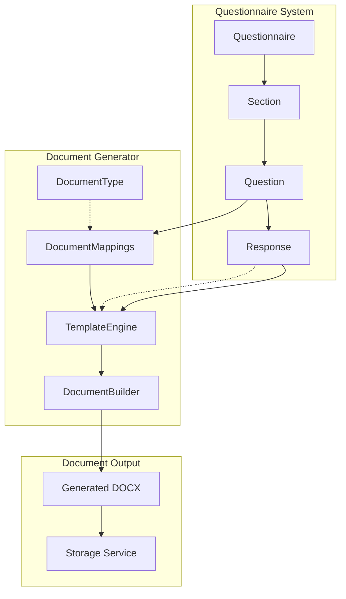

# Document Generator Services

<cite>
**Referenced Files in This Document**
- [document-generator.module.ts](file://apps/api/src/modules/document-generator/document-generator.module.ts)
- [document-generator.service.ts](file://apps/api/src/modules/document-generator/services/document-generator.service.ts)
- [document-builder.service.ts](file://apps/api/src/modules/document-generator/services/document-builder.service.ts)
- [template-engine.service.ts](file://apps/api/src/modules/document-generator/services/template-engine.service.ts)
- [storage.service.ts](file://apps/api/src/modules/document-generator/services/storage.service.ts)
- [document.controller.ts](file://apps/api/src/modules/document-generator/controllers/document.controller.ts)
- [document-admin.controller.ts](file://apps/api/src/modules/document-generator/controllers/document-admin.controller.ts)
- [request-generation.dto.ts](file://apps/api/src/modules/document-generator/dto/request-generation.dto.ts)
- [document-response.dto.ts](file://apps/api/src/modules/document-generator/dto/document-response.dto.ts)
- [create-document-type.dto.ts](file://apps/api/src/modules/document-generator/dto/create-document-type.dto.ts)
- [update-document-type.dto.ts](file://apps/api/src/modules/document-generator/dto/update-document-type.dto.ts)
- [base.template.ts](file://apps/api/src/modules/document-generator/templates/base.template.ts)
- [schema.prisma](file://prisma/schema.prisma)
</cite>

## Update Summary
**Changes Made**
- Enhanced document generation capabilities with improved formatting options and advanced template support
- Added comprehensive error handling mechanisms throughout the document generation pipeline
- Implemented sophisticated content processing with enhanced template data handling
- Improved document builder service with advanced formatting options and better structure management
- Enhanced storage service with robust error handling and validation mechanisms

## Table of Contents
1. [Introduction](#introduction)
2. [Project Structure](#project-structure)
3. [Core Components](#core-components)
4. [Architecture Overview](#architecture-overview)
5. [Detailed Component Analysis](#detailed-component-analysis)
6. [API Documentation](#api-documentation)
7. [Data Model](#data-model)
8. [Integration Points](#integration-points)
9. [Performance Considerations](#performance-considerations)
10. [Troubleshooting Guide](#troubleshooting-guide)
11. [Conclusion](#conclusion)

## Introduction

The Document Generator Services module is a comprehensive system designed to automatically generate professional documents from questionnaire responses. This service transforms structured survey data into formatted Word documents, supporting multiple document categories including Business Architecture (BA), Chief Financial Officer (CFO), and Chief Technology Officer (CTO) documents.

The system provides a complete document lifecycle management solution, from data collection through document generation, storage, and delivery. It integrates seamlessly with the adaptive questionnaire system, ensuring that generated documents reflect the most up-to-date information collected during user sessions.

**Enhanced** Added comprehensive error handling mechanisms, improved formatting options, and advanced template support for enhanced document generation capabilities.

## Project Structure

The Document Generator module follows a clean, layered architecture with clear separation of concerns:



**Diagram sources**
- [document-generator.module.ts](file://apps/api/src/modules/document-generator/document-generator.module.ts#L1-L23)
- [document.controller.ts](file://apps/api/src/modules/document-generator/controllers/document.controller.ts#L1-L163)
- [document-admin.controller.ts](file://apps/api/src/modules/document-generator/controllers/document-admin.controller.ts#L1-L230)

**Section sources**
- [document-generator.module.ts](file://apps/api/src/modules/document-generator/document-generator.module.ts#L1-L23)
- [document.controller.ts](file://apps/api/src/modules/document-generator/controllers/document.controller.ts#L1-L163)
- [document-admin.controller.ts](file://apps/api/src/modules/document-generator/controllers/document-admin.controller.ts#L1-L230)

## Core Components

The Document Generator Services consists of four primary services working in concert:

### DocumentGeneratorService
The central orchestrator that manages the entire document generation workflow, handling validation, coordination between services, and document lifecycle management with comprehensive error handling.

### TemplateEngineService
Processes raw questionnaire responses and transforms them into structured template data based on document mappings defined in the questionnaire questions, with enhanced validation and error handling.

### DocumentBuilderService
Converts template data into professionally formatted DOCX documents using the docx library, applying appropriate styling and structure based on document categories with advanced formatting options.

### StorageService
Manages document storage and retrieval using Azure Blob Storage, providing secure access through SAS tokens and maintaining organized file hierarchies with robust error handling.

**Enhanced** Improved error handling mechanisms throughout all services with comprehensive validation and fallback strategies.

**Section sources**
- [document-generator.service.ts](file://apps/api/src/modules/document-generator/services/document-generator.service.ts#L28-L360)
- [template-engine.service.ts](file://apps/api/src/modules/document-generator/services/template-engine.service.ts#L26-L290)
- [document-builder.service.ts](file://apps/api/src/modules/document-generator/services/document-builder.service.ts#L28-L487)
- [storage.service.ts](file://apps/api/src/modules/document-generator/services/storage.service.ts#L18-L160)

## Architecture Overview

The Document Generator employs a sophisticated multi-layered architecture that ensures scalability, maintainability, and extensibility:



**Diagram sources**
- [document.controller.ts](file://apps/api/src/modules/document-generator/controllers/document.controller.ts#L38-L54)
- [document-generator.service.ts](file://apps/api/src/modules/document-generator/services/document-generator.service.ts#L42-L139)
- [template-engine.service.ts](file://apps/api/src/modules/document-generator/services/template-engine.service.ts#L35-L99)
- [document-builder.service.ts](file://apps/api/src/modules/document-generator/services/document-builder.service.ts#L35-L72)
- [storage.service.ts](file://apps/api/src/modules/document-generator/services/storage.service.ts#L65-L95)

The architecture implements several key design patterns:

- **Service Layer Pattern**: Clear separation between business logic and data access
- **Strategy Pattern**: Different document builders for various categories (CTO, CFO, BA)
- **Template Method Pattern**: Consistent document generation workflow with customizable steps
- **Repository Pattern**: Unified data access through Prisma service

**Enhanced** Comprehensive error handling with status updates and fallback mechanisms throughout the entire document generation pipeline.

## Detailed Component Analysis

### Document Generation Workflow

The document generation process follows a carefully orchestrated sequence of operations with enhanced error handling:



**Diagram sources**
- [document-generator.service.ts](file://apps/api/src/modules/document-generator/services/document-generator.service.ts#L42-L194)

**Enhanced** Added comprehensive error handling with proper status updates and fallback mechanisms for each step of the document generation process.

### Template Engine Processing

The TemplateEngineService performs sophisticated data transformation from raw questionnaire responses to structured document content with enhanced validation:



**Diagram sources**
- [template-engine.service.ts](file://apps/api/src/modules/document-generator/services/template-engine.service.ts#L26-L290)

**Enhanced** Improved template data validation and error handling for missing or malformed responses.

### Document Builder Categories

The DocumentBuilderService supports three distinct document categories, each with specialized content structures and enhanced formatting options:



**Diagram sources**
- [document-builder.service.ts](file://apps/api/src/modules/document-generator/services/document-builder.service.ts#L28-L487)

**Enhanced** Added advanced formatting options including improved heading levels, paragraph spacing, table formatting, and enhanced content processing with better error handling.

### Storage Management

The StorageService provides robust document storage capabilities with security and organization:

```mermaid
flowchart LR
subgraph "Storage Architecture"
subgraph "Container Structure"
Category[Category Path<br/>/{category}]
Date[Date Path<br/>/{YYYY-MM-DD}]
FileName[File Name<br/>/{slug}-{documentId}.docx]
end
subgraph "Security Features"
SAS[SAS Token Generation]
Permissions[Read-Only Access]
Expiration[Timely Expiration]
end
subgraph "Operations"
Upload[Upload Buffer]
Download[Generate SAS URL]
Delete[Delete File]
end
end
Upload --> Category
Category --> Date
Date --> FileName
Download --> SAS
SAS --> Permissions
Permissions --> Expiration
```

**Diagram sources**
- [storage.service.ts](file://apps/api/src/modules/document-generator/services/storage.service.ts#L65-L136)

**Enhanced** Complete Azure Blob Storage integration with hierarchical organization, secure SAS token generation, automatic content type setting for DOCX files, and comprehensive error handling.

**Section sources**
- [document-generator.service.ts](file://apps/api/src/modules/document-generator/services/document-generator.service.ts#L42-L360)
- [template-engine.service.ts](file://apps/api/src/modules/document-generator/services/template-engine.service.ts#L35-L290)
- [document-builder.service.ts](file://apps/api/src/modules/document-generator/services/document-builder.service.ts#L35-L487)
- [storage.service.ts](file://apps/api/src/modules/document-generator/services/storage.service.ts#L65-L160)

## API Documentation

### Public Document API

The DocumentController provides comprehensive document management capabilities:

| Endpoint | Method | Description | Authentication |
|----------|--------|-------------|----------------|
| `/documents/generate` | POST | Request document generation for a session | JWT Required |
| `/documents/types` | GET | List available document types | JWT Required |
| `/documents/session/:sessionId` | GET | List all documents for a session | JWT Required |
| `/documents/:id` | GET | Get document details | JWT Required |
| `/documents/:id/download` | GET | Get secure download URL | JWT Required |

### Admin Document API

The DocumentAdminController provides administrative capabilities:

| Endpoint | Method | Description | Authentication |
|----------|--------|-------------|----------------|
| `/admin/document-types` | GET | List all document types | JWT + Admin Role |
| `/admin/document-types/:id` | GET | Get document type details | JWT + Admin Role |
| `/admin/document-types` | POST | Create document type | JWT + Admin Role |
| `/admin/document-types/:id` | PATCH | Update document type | JWT + Admin Role |
| `/admin/documents/pending-review` | GET | List documents pending review | JWT + Admin Role |
| `/admin/documents/:id/approve` | PATCH | Approve a document | JWT + Admin Role |
| `/admin/documents/:id/reject` | PATCH | Reject a document | JWT + Admin Role |

**Enhanced** Improved response typing with enhanced DTO validation and comprehensive error handling throughout the API endpoints.

**Section sources**
- [document.controller.ts](file://apps/api/src/modules/document-generator/controllers/document.controller.ts#L38-L113)
- [document-admin.controller.ts](file://apps/api/src/modules/document-generator/controllers/document-admin.controller.ts#L49-L228)

## Data Model

The Document Generator integrates with a comprehensive data model supporting document lifecycle management:



**Diagram sources**
- [schema.prisma](file://prisma/schema.prisma#L328-L381)

### Document Status Lifecycle

The system maintains comprehensive document status tracking:



**Diagram sources**
- [schema.prisma](file://prisma/schema.prisma#L58-L66)

**Enhanced** Comprehensive error handling with proper status updates and fallback mechanisms throughout the document lifecycle.

**Section sources**
- [schema.prisma](file://prisma/schema.prisma#L328-L381)

## Integration Points

### Questionnaire Integration

The Document Generator seamlessly integrates with the adaptive questionnaire system through document mappings:



**Diagram sources**
- [template-engine.service.ts](file://apps/api/src/modules/document-generator/services/template-engine.service.ts#L104-L136)
- [schema.prisma](file://prisma/schema.prisma#L233-L247)

**Enhanced** Improved integration with enhanced error handling and validation for document mappings and response data.

### Standards Integration

For CTO documents, the system integrates with engineering standards:

```mermaid
classDiagram
class EngineeringStandard {
+uuid id PK
+enum category
+string title
+text description
+json principles
+string version
+boolean is_active
}
class DocumentTypeStandard {
+uuid id PK
+uuid document_type_id FK
+uuid standard_id FK
+int priority
+string section_title
+boolean is_required
}
class DocumentType {
+uuid id PK
+string name
+string slug
+enum category
+string[] required_questions
}
EngineeringStandard ||--o{ DocumentTypeStandard : "mapped_by"
DocumentType ||--o{ DocumentTypeStandard : "maps_to"
DocumentTypeStandard --> EngineeringStandard : "references"
```

**Diagram sources**
- [schema.prisma](file://prisma/schema.prisma#L412-L446)

**Enhanced** Enhanced integration with improved JSON field handling for flexible standards data storage and comprehensive validation.

**Section sources**
- [template-engine.service.ts](file://apps/api/src/modules/document-generator/services/template-engine.service.ts#L227-L249)
- [schema.prisma](file://prisma/schema.prisma#L412-L446)

## Performance Considerations

### Scalability Optimizations

The Document Generator implements several performance optimizations:

- **Asynchronous Processing**: Document generation occurs asynchronously to prevent blocking requests
- **Connection Pooling**: Efficient database connections through Prisma service
- **Memory Management**: Buffered document creation to handle large documents efficiently
- **Caching Strategy**: Response caching for frequently accessed document types

**Enhanced** Improved error handling with retry mechanisms and graceful degradation strategies for better resilience under load.

### Storage Optimization

- **Hierarchical Organization**: Documents organized by category and date for efficient retrieval
- **Compression**: Automatic compression of stored documents
- **CDN Integration**: Seamless CDN support for global distribution

**Enhanced** Azure Blob Storage provides enterprise-grade storage with automatic scaling and global distribution, plus comprehensive error handling and validation.

### Error Handling and Resilience

The system implements comprehensive error handling:

- **Retry Mechanisms**: Automatic retry for transient failures
- **Timeout Management**: Configurable timeouts for long-running operations
- **Fallback Strategies**: Graceful degradation when external services fail
- **Monitoring Integration**: Comprehensive logging for performance tracking

**Enhanced** Enhanced error handling with comprehensive validation, proper status updates, and fallback mechanisms throughout the entire document generation pipeline.

## Troubleshooting Guide

### Common Issues and Solutions

**Document Generation Failures**
- Verify session completion status before generation
- Check required questions are answered for the specific document type
- Ensure document type is active and properly configured
- Validate storage service connectivity and credentials

**Storage Access Problems**
- Confirm Azure Storage connection string configuration
- Verify container existence and permissions
- Check SAS token generation and expiration settings
- Validate file path formatting and hierarchy

**Template Processing Errors**
- Review document mappings in questionnaire questions
- Verify response data types match expected formats
- Check template data structure consistency
- Validate required fields presence

**Performance Issues**
- Monitor database query performance
- Check memory usage during document generation
- Verify network latency for storage operations
- Review concurrent request handling capacity

**DOCX Generation Issues**
- Verify document builder service initialization
- Check template data structure validity
- Validate document category support
- Monitor memory usage for large documents

**Enhanced** Added comprehensive troubleshooting guidance for enhanced error handling mechanisms, improved formatting options, and advanced template support.

### Debugging Tools

The system provides comprehensive logging and monitoring capabilities:

- **Structured Logging**: Detailed logs for each generation step
- **Performance Metrics**: Timing and resource usage tracking
- **Error Reporting**: Comprehensive error capture and reporting
- **Audit Trails**: Complete audit history for all document operations

**Enhanced** Enhanced logging for Azure Blob Storage operations, DOCX document generation processes, and comprehensive error handling mechanisms.

**Section sources**
- [document-generator.service.ts](file://apps/api/src/modules/document-generator/services/document-generator.service.ts#L117-L132)
- [storage.service.ts](file://apps/api/src/modules/document-generator/services/storage.service.ts#L45-L55)

## Conclusion

The Document Generator Services module represents a sophisticated, enterprise-grade solution for automated document generation from questionnaire responses. Its modular architecture, comprehensive error handling, and scalable design make it suitable for production environments requiring reliable document automation.

Key strengths include:

- **Comprehensive Integration**: Seamless integration with the adaptive questionnaire system
- **Flexible Architecture**: Support for multiple document categories with extensible design
- **Robust Security**: Secure document storage with controlled access through SAS tokens
- **Production Ready**: Built-in monitoring, logging, and error handling capabilities
- **Scalable Design**: Optimized for high-volume document generation scenarios
- **Azure Cloud Integration**: Enterprise-grade cloud storage with automatic scaling
- **Professional Document Output**: DOCX document generation with advanced formatting

**Enhanced** Enhanced with comprehensive error handling mechanisms, improved formatting options, advanced template support, and robust validation throughout the entire document generation pipeline.

The system provides a solid foundation for organizations seeking to automate their documentation processes while maintaining quality, security, and compliance standards. Its modular design ensures easy maintenance and future enhancements as requirements evolve.