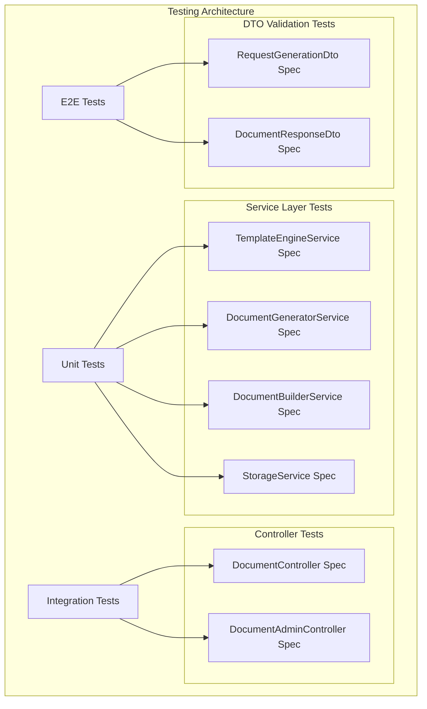
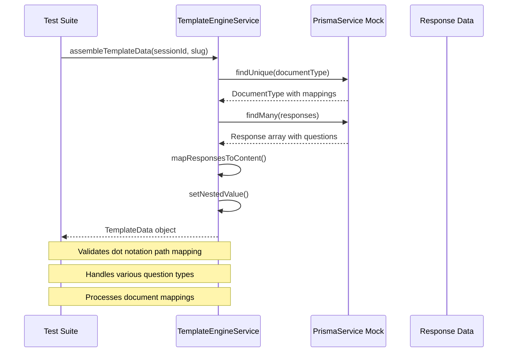
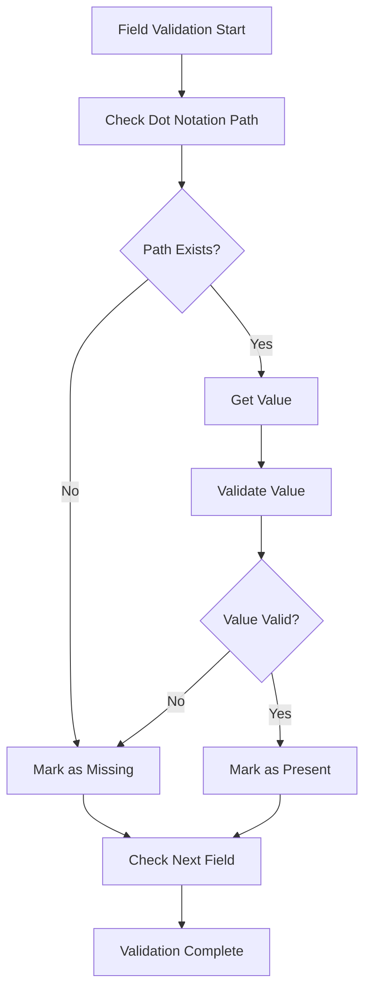
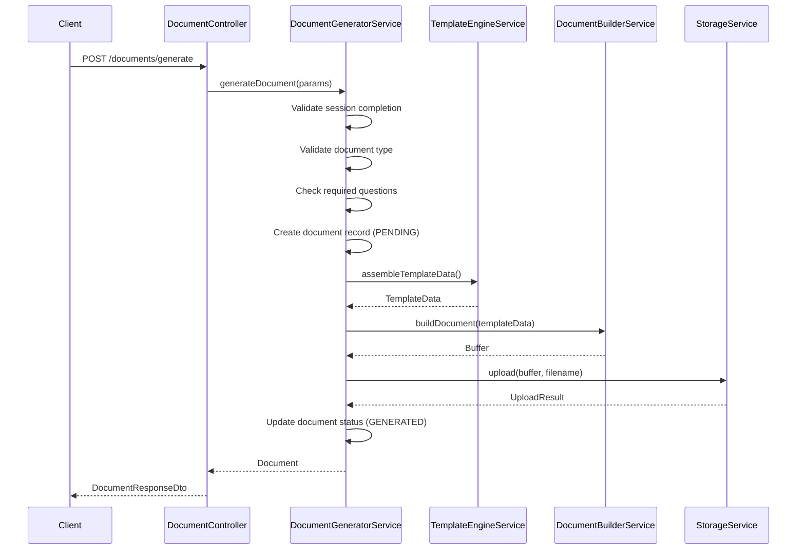
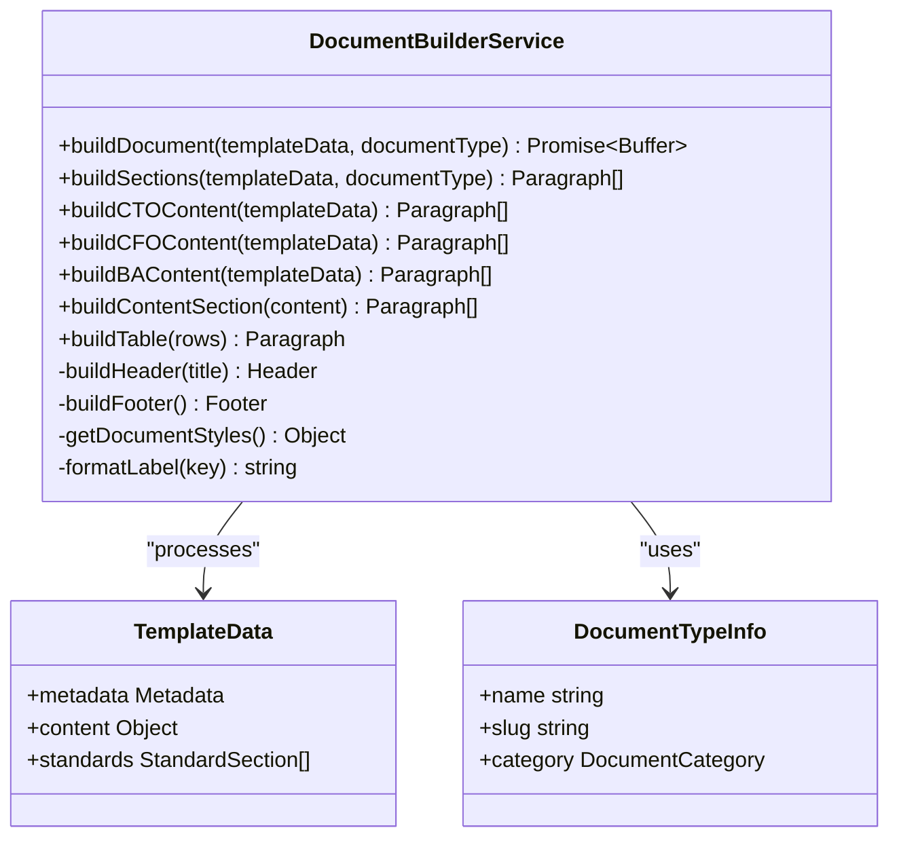
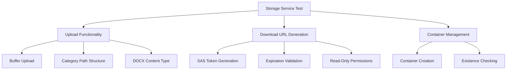
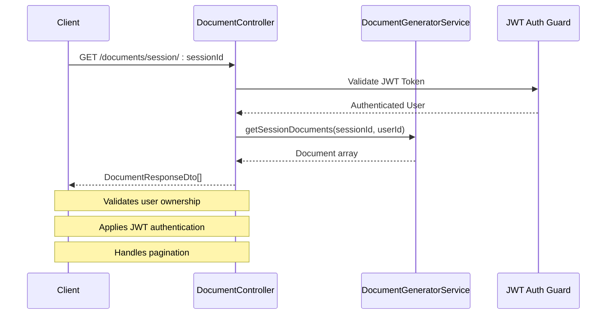
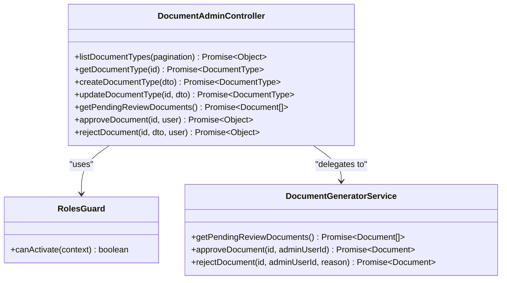
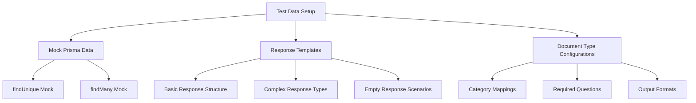
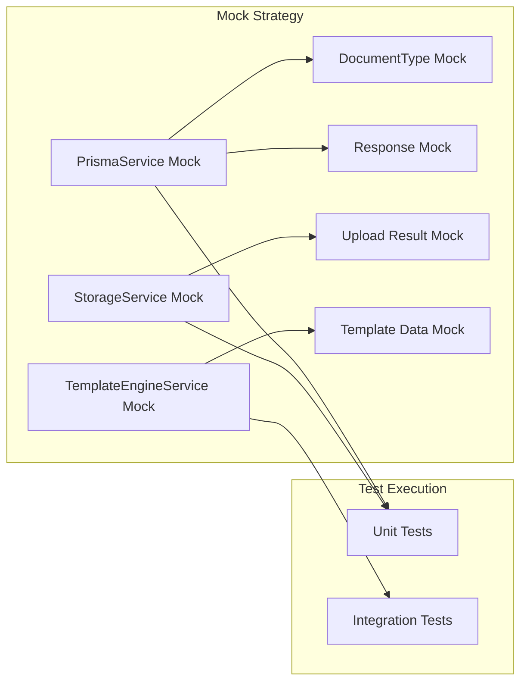

# Document Generator Testing

<cite>
**Referenced Files in This Document**
- [template-engine.service.spec.ts](file://apps/api/src/modules/document-generator/tests/template-engine.service.spec.ts)
- [template-engine.service.ts](file://apps/api/src/modules/document-generator/services/template-engine.service.ts)
- [document-generator.service.ts](file://apps/api/src/modules/document-generator/services/document-generator.service.ts)
- [document-builder.service.ts](file://apps/api/src/modules/document-generator/services/document-builder.service.ts)
- [storage.service.ts](file://apps/api/src/modules/document-generator/services/storage.service.ts)
- [document-generator.module.ts](file://apps/api/src/modules/document-generator/document-generator.module.ts)
- [document.controller.ts](file://apps/api/src/modules/document-generator/controllers/document.controller.ts)
- [document-admin.controller.ts](file://apps/api/src/modules/document-generator/controllers/document-admin.controller.ts)
- [request-generation.dto.ts](file://apps/api/src/modules/document-generator/dto/request-generation.dto.ts)
- [document-response.dto.ts](file://apps/api/src/modules/document-generator/dto/document-response.dto.ts)
- [jest-e2e.json](file://apps/api/test/jest-e2e.json)
- [package.json](file://apps/api/package.json)
</cite>

## Table of Contents
1. [Introduction](#introduction)
2. [Testing Architecture Overview](#testing-architecture-overview)
3. [Core Testing Components](#core-testing-components)
4. [Template Engine Testing](#template-engine-testing)
5. [Document Generation Testing](#document-generation-testing)
6. [Service Layer Testing](#service-layer-testing)
7. [Controller Testing](#controller-testing)
8. [Integration Testing Strategy](#integration-testing-strategy)
9. [Testing Best Practices](#testing-best-practices)
10. [Troubleshooting Guide](#troubleshooting-guide)
11. [Conclusion](#conclusion)

## Introduction

The Document Generator Testing documentation provides comprehensive coverage of the testing framework for the document generation system within the Adaptive Questionnaire System. This system generates professional documents from questionnaire responses, supporting multiple document categories (CTO, CFO, BA) with automated content assembly and DOCX formatting capabilities.

The testing strategy encompasses unit tests for individual services, integration tests for service interactions, and controller tests for API endpoint validation. The system utilizes NestJS testing modules with Jest for comprehensive test coverage.

## Testing Architecture Overview

The document generator testing follows a layered architecture pattern with distinct testing components for each layer of the application:



**Diagram sources**
- [template-engine.service.spec.ts](file://apps/api/src/modules/document-generator/tests/template-engine.service.spec.ts#L1-L243)
- [document-generator.service.ts](file://apps/api/src/modules/document-generator/services/document-generator.service.ts#L1-L360)
- [document.controller.ts](file://apps/api/src/modules/document-generator/controllers/document.controller.ts#L1-L163)

## Core Testing Components

### Test Environment Configuration

The testing environment is configured through multiple configuration files that define test runners, coverage thresholds, and module mappings:

```mermaid
flowchart TD
TestConfig[Test Configuration] --> JestConfig[Jest Configuration]
TestConfig --> CoverageConfig[Coverage Thresholds]
TestConfig --> ModuleMapping[Module Path Mapping]
JestConfig --> TestRunner[Jest Test Runner]
JestConfig --> Transform[TypeScript Transformation]
JestConfig --> TestRegex[Spec File Pattern]
CoverageConfig --> Branches[80% Branches]
CoverageConfig --> Functions[80% Functions]
CoverageConfig --> Lines[80% Lines]
CoverageConfig --> Statements[80% Statements]
ModuleMapping --> DatabaseLib[@libs/database]
ModuleMapping --> RedisLib[@libs/redis]
ModuleMapping --> SharedLib[@libs/shared]
```

**Diagram sources**
- [package.json](file://apps/api/package.json#L62-L85)
- [jest-e2e.json](file://apps/api/test/jest-e2e.json#L1-L15)

**Section sources**
- [package.json](file://apps/api/package.json#L1-L87)
- [jest-e2e.json](file://apps/api/test/jest-e2e.json#L1-L15)

### Testing Dependencies

The project leverages a comprehensive set of testing dependencies including:

- **Jest**: Primary test runner and assertion library
- **NestJS Testing**: Framework-specific testing utilities
- **Supertest**: HTTP assertion library for API testing
- **TypeScript Jest**: TypeScript transformation support
- **Class Validator**: DTO validation testing

**Section sources**
- [package.json](file://apps/api/package.json#L41-L61)

## Template Engine Testing

### Template Data Assembly Testing

The TemplateEngineService undergoes extensive testing for template data assembly from questionnaire responses:



**Diagram sources**
- [template-engine.service.spec.ts](file://apps/api/src/modules/document-generator/tests/template-engine.service.spec.ts#L101-L155)
- [template-engine.service.ts](file://apps/api/src/modules/document-generator/services/template-engine.service.ts#L35-L99)

### Response Value Extraction Testing

The template engine tests cover extraction of values from different question types:

| Question Type | Expected Behavior | Test Coverage |
|---------------|-------------------|---------------|
| TEXT/TEXTAREA | Returns text value or empty string | Value extraction validation |
| NUMBER | Returns numeric value or zero | Numeric type handling |
| SINGLE_CHOICE | Returns selected option label | Option lookup validation |
| MULTIPLE_CHOICE | Returns array of selected labels | Array processing |
| DATE | Returns date value or null | Date type handling |
| FILE_UPLOAD | Returns file URL or null | File handling |

**Section sources**
- [template-engine.service.spec.ts](file://apps/api/src/modules/document-generator/tests/template-engine.service.spec.ts#L157-L193)
- [template-engine.service.ts](file://apps/api/src/modules/document-generator/services/template-engine.service.ts#L141-L200)

### Required Field Validation Testing

The template engine includes comprehensive validation for required fields:



**Diagram sources**
- [template-engine.service.spec.ts](file://apps/api/src/modules/document-generator/tests/template-engine.service.spec.ts#L195-L241)
- [template-engine.service.ts](file://apps/api/src/modules/document-generator/services/template-engine.service.ts#L271-L288)

**Section sources**
- [template-engine.service.spec.ts](file://apps/api/src/modules/document-generator/tests/template-engine.service.spec.ts#L195-L241)
- [template-engine.service.ts](file://apps/api/src/modules/document-generator/services/template-engine.service.ts#L254-L288)

## Document Generation Testing

### Document Generation Workflow Testing

The DocumentGeneratorService tests validate the complete document generation workflow:



**Diagram sources**
- [document-generator.service.ts](file://apps/api/src/modules/document-generator/services/document-generator.service.ts#L42-L139)
- [document.controller.ts](file://apps/api/src/modules/document-generator/controllers/document.controller.ts#L38-L54)

### Document Status Management Testing

The testing framework validates document status transitions and access controls:

| Status Transition | Valid? | Validation Point |
|-------------------|--------|------------------|
| PENDING → GENERATING | Yes | Process initiation |
| GENERATING → GENERATED | Yes | Successful completion |
| GENERATING → FAILED | Yes | Error handling |
| PENDING → APPROVED | No | Admin-only transition |
| Generated → Approved | Yes | Admin approval |

**Section sources**
- [document-generator.service.ts](file://apps/api/src/modules/document-generator/services/document-generator.service.ts#L144-L194)

## Service Layer Testing

### Document Builder Service Testing

The DocumentBuilderService handles DOCX document creation with category-specific content assembly:



**Diagram sources**
- [document-builder.service.ts](file://apps/api/src/modules/document-generator/services/document-builder.service.ts#L28-L487)

### Storage Service Testing

The StorageService tests focus on Azure Blob Storage integration and secure URL generation:



**Diagram sources**
- [storage.service.ts](file://apps/api/src/modules/document-generator/services/storage.service.ts#L65-L136)

**Section sources**
- [document-builder.service.ts](file://apps/api/src/modules/document-generator/services/document-builder.service.ts#L1-L487)
- [storage.service.ts](file://apps/api/src/modules/document-generator/services/storage.service.ts#L1-L160)

## Controller Testing

### Document Controller Testing

The DocumentController tests validate API endpoint functionality and security:



**Diagram sources**
- [document.controller.ts](file://apps/api/src/modules/document-generator/controllers/document.controller.ts#L63-L77)
- [document.controller.ts](file://apps/api/src/modules/document-generator/controllers/document.controller.ts#L91-L113)

### Admin Controller Testing

The DocumentAdminController tests cover administrative document management:



**Diagram sources**
- [document-admin.controller.ts](file://apps/api/src/modules/document-generator/controllers/document-admin.controller.ts#L39-L230)

**Section sources**
- [document.controller.ts](file://apps/api/src/modules/document-generator/controllers/document.controller.ts#L1-L163)
- [document-admin.controller.ts](file://apps/api/src/modules/document-generator/controllers/document-admin.controller.ts#L1-L230)

## Integration Testing Strategy

### Test Data Management

The testing strategy employs comprehensive test data management:



**Diagram sources**
- [template-engine.service.spec.ts](file://apps/api/src/modules/document-generator/tests/template-engine.service.spec.ts#L11-L74)

### Error Handling Testing

The integration tests validate comprehensive error handling scenarios:

| Error Scenario | Expected Behavior | Test Coverage |
|----------------|-------------------|---------------|
| Invalid Session ID | NotFoundException | Session validation |
| Incomplete Session | BadRequestException | Status validation |
| Invalid Document Type | NotFoundException | Type validation |
| Missing Required Questions | BadRequestException | Requirement validation |
| Unauthorized Access | BadRequestException | Access control |
| Storage Failure | Failed Document Status | Error recovery |

**Section sources**
- [document-generator.service.ts](file://apps/api/src/modules/document-generator/services/document-generator.service.ts#L54-L103)

## Testing Best Practices

### Mock Strategy Implementation

The testing framework employs strategic mocking for external dependencies:



**Diagram sources**
- [template-engine.service.spec.ts](file://apps/api/src/modules/document-generator/tests/template-engine.service.spec.ts#L76-L95)

### Test Organization Principles

The testing organization follows these principles:

1. **Separation of Concerns**: Each service has dedicated test files
2. **Mock Isolation**: External dependencies are isolated through mocks
3. **Comprehensive Coverage**: All major code paths are tested
4. **Error Scenario Testing**: Edge cases and error conditions are validated
5. **DTO Validation**: Input validation is tested through DTO specifications

**Section sources**
- [template-engine.service.spec.ts](file://apps/api/src/modules/document-generator/tests/template-engine.service.spec.ts#L1-L243)

## Troubleshooting Guide

### Common Testing Issues

| Issue | Symptoms | Solution |
|-------|----------|----------|
| Test Timeout | Tests hang or timeout | Check async operations and promises |
| Mock Not Working | Real dependencies called | Verify mock setup in beforeEach |
| Coverage Low | Coverage below threshold | Add tests for uncovered branches |
| Type Errors | TypeScript compilation errors | Fix type definitions in test files |
| Environment Variables | Storage failures | Configure test environment variables |

### Debugging Strategies

1. **Enable Verbose Logging**: Use Jest verbose mode for detailed output
2. **Isolate Failing Tests**: Run individual tests to identify specific issues
3. **Check Mock Implementations**: Verify mock functions return expected values
4. **Validate DTO Structures**: Ensure test data matches DTO requirements
5. **Review Error Messages**: Analyze test failure messages for specific causes

**Section sources**
- [package.json](file://apps/api/package.json#L13-L17)

## Conclusion

The Document Generator Testing framework provides comprehensive coverage for the document generation system, ensuring reliability and maintainability. The testing strategy effectively validates:

- **Unit Testing**: Individual service functionality with comprehensive mock strategies
- **Integration Testing**: Service interactions and workflow validation
- **Controller Testing**: API endpoint functionality and security enforcement
- **Error Handling**: Robust error management and recovery mechanisms
- **Coverage**: Meeting established coverage thresholds across all components

The modular testing architecture supports future enhancements while maintaining high code quality standards. The comprehensive test suite ensures that document generation functionality remains reliable as the system evolves.