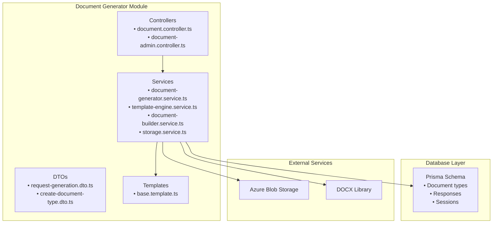
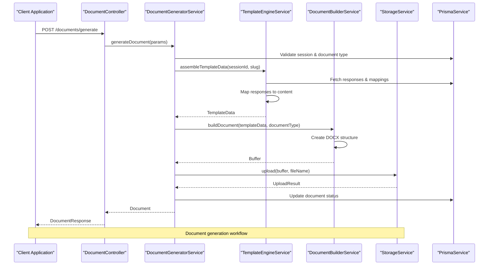
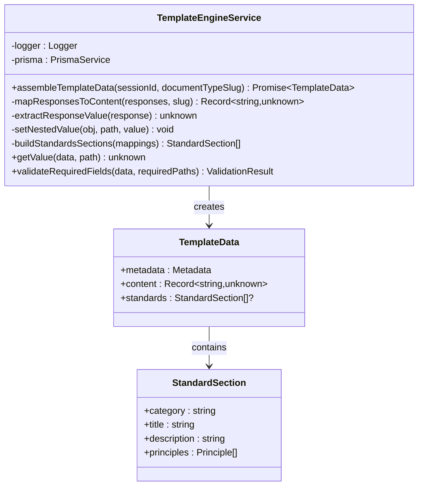
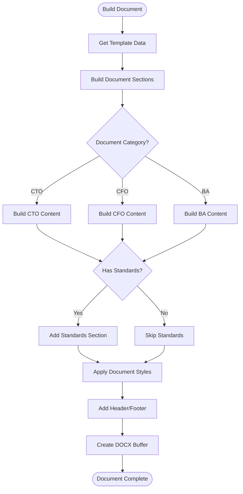
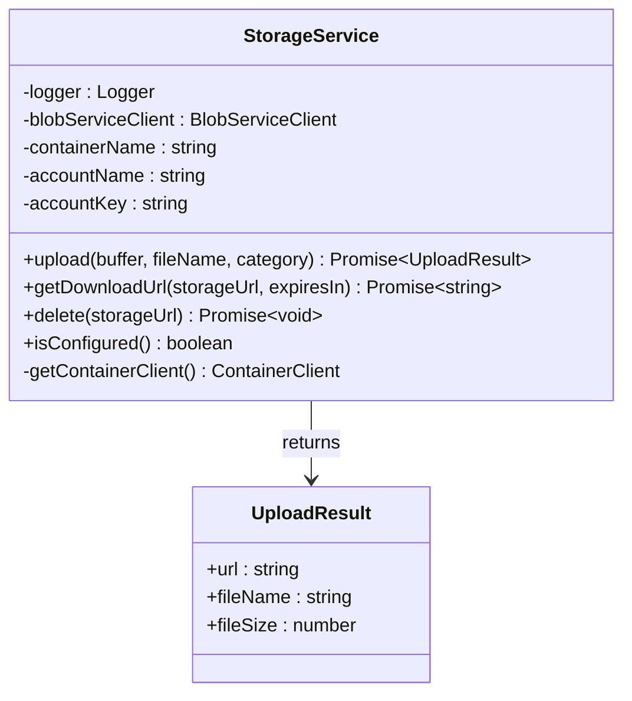
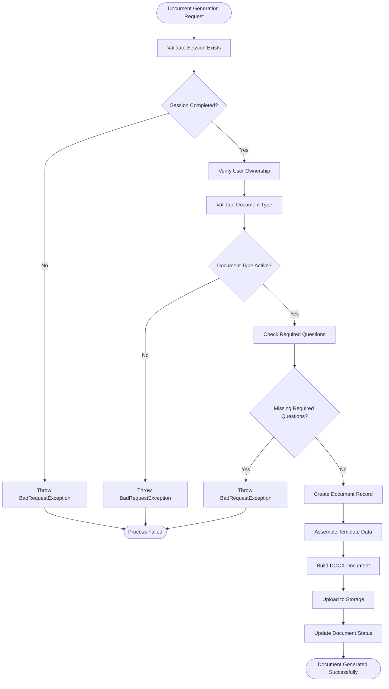
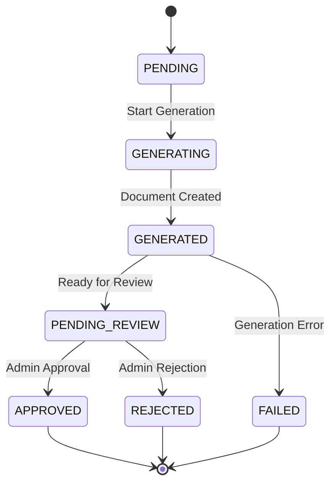

# Document Templates

<cite>
**Referenced Files in This Document**
- [document-generator.module.ts](file://apps/api/src/modules/document-generator/document-generator.module.ts)
- [base.template.ts](file://apps/api/src/modules/document-generator/templates/base.template.ts)
- [template-engine.service.ts](file://apps/api/src/modules/document-generator/services/template-engine.service.ts)
- [document-generator.service.ts](file://apps/api/src/modules/document-generator/services/document-generator.service.ts)
- [document-builder.service.ts](file://apps/api/src/modules/document-generator/services/document-builder.service.ts)
- [storage.service.ts](file://apps/api/src/modules/document-generator/services/storage.service.ts)
- [document.controller.ts](file://apps/api/src/modules/document-generator/controllers/document.controller.ts)
- [document-admin.controller.ts](file://apps/api/src/modules/document-generator/controllers/document-admin.controller.ts)
- [request-generation.dto.ts](file://apps/api/src/modules/document-generator/dto/request-generation.dto.ts)
- [create-document-type.dto.ts](file://apps/api/src/modules/document-generator/dto/create-document-type.dto.ts)
- [schema.prisma](file://prisma/schema.prisma)
- [standards.service.ts](file://apps/api/src/modules/standards/standards.service.ts)
- [standard.types.ts](file://apps/api/src/modules/standards/types/standard.types.ts)
</cite>

## Table of Contents
1. [Introduction](#introduction)
2. [Project Structure](#project-structure)
3. [Core Components](#core-components)
4. [Architecture Overview](#architecture-overview)
5. [Detailed Component Analysis](#detailed-component-analysis)
6. [Template System](#template-system)
7. [Document Generation Workflow](#document-generation-workflow)
8. [Admin Management](#admin-management)
9. [Storage and Security](#storage-and-security)
10. [Performance Considerations](#performance-considerations)
11. [Troubleshooting Guide](#troubleshooting-guide)
12. [Conclusion](#conclusion)

## Introduction

The Document Templates system is a comprehensive document generation framework built with NestJS that transforms questionnaire responses into professional Word documents. This system supports multiple document categories (CTO, CFO, BA) with standardized templates, automated content assembly, and secure document storage.

The system integrates seamlessly with the adaptive questionnaire system, allowing users to generate structured documents from their completed survey responses. It provides both user-facing document generation capabilities and administrative tools for managing document types and review workflows.

## Project Structure

The document generation module follows a clean architecture pattern with clear separation of concerns:



**Diagram sources**
- [document-generator.module.ts](file://apps/api/src/modules/document-generator/document-generator.module.ts#L1-L23)
- [document.controller.ts](file://apps/api/src/modules/document-generator/controllers/document.controller.ts#L1-L163)
- [document-admin.controller.ts](file://apps/api/src/modules/document-generator/controllers/document-admin.controller.ts#L1-L230)

**Section sources**
- [document-generator.module.ts](file://apps/api/src/modules/document-generator/document-generator.module.ts#L1-L23)
- [document.controller.ts](file://apps/api/src/modules/document-generator/controllers/document.controller.ts#L1-L163)
- [document-admin.controller.ts](file://apps/api/src/modules/document-generator/controllers/document-admin.controller.ts#L1-L230)

## Core Components

The Document Templates system consists of several interconnected components that work together to generate professional documents:

### Document Generator Service
The central orchestrator that manages the entire document generation lifecycle, from validation to final storage.

### Template Engine Service
Responsible for assembling template data from questionnaire responses and mapping them to document structure.

### Document Builder Service
Handles the actual DOCX document creation using the docx library, applying styles and formatting.

### Storage Service
Manages document storage and retrieval using Azure Blob Storage with secure SAS tokens.

### Controllers
Provide REST API endpoints for both user and administrative document operations.

**Section sources**
- [document-generator.service.ts](file://apps/api/src/modules/document-generator/services/document-generator.service.ts#L28-L360)
- [template-engine.service.ts](file://apps/api/src/modules/document-generator/services/template-engine.service.ts#L26-L290)
- [document-builder.service.ts](file://apps/api/src/modules/document-generator/services/document-builder.service.ts#L28-L487)
- [storage.service.ts](file://apps/api/src/modules/document-generator/services/storage.service.ts#L18-L160)

## Architecture Overview

The document generation system follows a layered architecture with clear separation between presentation, business logic, and data access layers:



**Diagram sources**
- [document.controller.ts](file://apps/api/src/modules/document-generator/controllers/document.controller.ts#L38-L54)
- [document-generator.service.ts](file://apps/api/src/modules/document-generator/services/document-generator.service.ts#L42-L139)
- [template-engine.service.ts](file://apps/api/src/modules/document-generator/services/template-engine.service.ts#L35-L99)
- [document-builder.service.ts](file://apps/api/src/modules/document-generator/services/document-builder.service.ts#L35-L72)
- [storage.service.ts](file://apps/api/src/modules/document-generator/services/storage.service.ts#L65-L95)

## Detailed Component Analysis

### Template Engine Service

The Template Engine Service is responsible for transforming raw questionnaire responses into structured template data:



**Diagram sources**
- [template-engine.service.ts](file://apps/api/src/modules/document-generator/services/template-engine.service.ts#L26-L290)
- [base.template.ts](file://apps/api/src/modules/document-generator/templates/base.template.ts#L5-L106)

The service handles different question types and maps them to appropriate content structures. It supports complex nested content through dot notation paths and includes validation for required fields.

**Section sources**
- [template-engine.service.ts](file://apps/api/src/modules/document-generator/services/template-engine.service.ts#L26-L290)
- [base.template.ts](file://apps/api/src/modules/document-generator/templates/base.template.ts#L1-L106)

### Document Builder Service

The Document Builder Service constructs professional DOCX documents using the docx library:



**Diagram sources**
- [document-builder.service.ts](file://apps/api/src/modules/document-generator/services/document-builder.service.ts#L35-L108)
- [base.template.ts](file://apps/api/src/modules/document-generator/templates/base.template.ts#L5-L48)

The service applies consistent styling, manages section ordering, and handles different content types including text, lists, and tables.

**Section sources**
- [document-builder.service.ts](file://apps/api/src/modules/document-generator/services/document-builder.service.ts#L28-L487)
- [base.template.ts](file://apps/api/src/modules/document-generator/templates/base.template.ts#L1-L106)

### Storage Service

The Storage Service manages document lifecycle with secure access controls:



**Diagram sources**
- [storage.service.ts](file://apps/api/src/modules/document-generator/services/storage.service.ts#L18-L160)

The service implements Azure Blob Storage integration with SAS token generation for secure document access and automatic categorization by document type.

**Section sources**
- [storage.service.ts](file://apps/api/src/modules/document-generator/services/storage.service.ts#L18-L160)

## Template System

The template system provides a flexible foundation for document generation with predefined styles and section structures:

### Base Styles and Configuration

The system defines comprehensive styling guidelines that ensure consistent document appearance:

| Style Category | Properties | Values |
|---|---|---|
| Document | Font family | Calibri |
| Document | Base font size | 24 (12pt) |
| Document | Line spacing | 276 (1.15) |
| Titles | Font size | 48 (24pt) |
| Titles | Bold | true |
| Headings | H1 | 32 (16pt, bold, spacing) |
| Headings | H2 | 28 (14pt, bold, spacing) |
| Headings | H3 | 24 (12pt, bold, spacing) |
| Paragraphs | Spacing | 120 after |
| Tables | Header background | E0E0E0 |
| Tables | Border color | 000000 |
| Tables | Border size | 1 |

### Section Order Management

Different document categories follow specific section ordering:

**CTO Documents:**
1. Document Control
2. Executive Summary
3. Technical Overview
4. Architecture
5. Infrastructure
6. Security
7. Engineering Standards
8. Appendices

**CFO Documents:**
1. Document Control
2. Executive Summary
3. Company Description
4. Market Analysis
5. Products/Services
6. Marketing Strategy
7. Operations Plan
8. Management Team
9. Financial Projections
10. Risk Management
11. Appendices

**BA Documents:**
1. Document Control
2. Introduction
3. Business Requirements
4. Functional Requirements
5. Non-Functional Requirements
6. User Stories
7. Process Flows
8. Data Requirements
9. Acceptance Criteria
10. Appendices

### Placeholder System

The system includes intelligent placeholder handling for missing data:

| Placeholder Type | Default Value | Purpose |
|---|---|---|
| Text | "[Not provided]" | Empty text responses |
| Number | 0 | Empty numeric responses |
| Date | "TBD" | Unspecified dates |
| List | [] | Empty choice selections |

**Section sources**
- [base.template.ts](file://apps/api/src/modules/document-generator/templates/base.template.ts#L1-L106)

## Document Generation Workflow

The document generation process follows a structured workflow with comprehensive validation and error handling:



**Diagram sources**
- [document-generator.service.ts](file://apps/api/src/modules/document-generator/services/document-generator.service.ts#L42-L139)

The workflow ensures data integrity, proper validation, and maintains detailed audit trails for all document generation activities.

**Section sources**
- [document-generator.service.ts](file://apps/api/src/modules/document-generator/services/document-generator.service.ts#L28-L360)

## Admin Management

Administrative capabilities provide comprehensive control over document types and review workflows:

### Document Type Management

Administrators can manage document types through dedicated endpoints:

| Endpoint | Method | Description |
|---|---|---|
| `/admin/document-types` | GET | List all document types with pagination |
| `/admin/document-types/:id` | GET | Get document type details |
| `/admin/document-types` | POST | Create new document type |
| `/admin/document-types/:id` | PATCH | Update existing document type |

### Review Workflow

The system implements a three-stage review process:

1. **PENDING_REVIEW**: Initial document generation completion
2. **APPROVED**: Administrative approval for publication
3. **REJECTED**: Rejection with reason documentation



**Diagram sources**
- [document-generator.service.ts](file://apps/api/src/modules/document-generator/services/document-generator.service.ts#L284-L358)

**Section sources**
- [document-admin.controller.ts](file://apps/api/src/modules/document-generator/controllers/document-admin.controller.ts#L1-L230)
- [document-generator.service.ts](file://apps/api/src/modules/document-generator/services/document-generator.service.ts#L282-L358)

## Storage and Security

The storage system implements enterprise-grade security and reliability:

### Azure Blob Storage Integration

The system uses Azure Blob Storage for scalable document storage with the following features:

- **Automatic categorization**: Documents organized by category/date structure
- **Secure access**: SAS token generation for temporary access
- **Content type management**: Proper MIME type handling for DOCX files
- **Container management**: Automatic container creation and maintenance

### Security Features

| Security Aspect | Implementation | Purpose |
|---|---|---|
| Access Control | JWT authentication | User identity verification |
| Role-based Access | ADMIN/SUPER_ADMIN roles | Administrative privileges |
| Session Validation | Session ownership check | Prevent unauthorized access |
| Download Security | SAS token generation | Controlled document access |
| Data Validation | DTO validation | Input sanitization |

### Storage Structure

Documents are stored in a hierarchical structure:
```
{category}/{date}/{filename}.docx
```

Example: `cto/2024-01-15/business-plan-123e4567-e89b-12d3-a456-426614174000.docx`

**Section sources**
- [storage.service.ts](file://apps/api/src/modules/document-generator/services/storage.service.ts#L18-L160)
- [document.controller.ts](file://apps/api/src/modules/document-generator/controllers/document.controller.ts#L91-L113)

## Performance Considerations

The document generation system is designed for optimal performance and scalability:

### Caching Strategies

- **Template data caching**: Frequently accessed document types cached in memory
- **Response aggregation**: Batch processing of questionnaire responses
- **Storage optimization**: Efficient blob storage organization

### Scalability Features

- **Asynchronous processing**: Background document generation support
- **Database optimization**: Indexed queries for fast response retrieval
- **Memory management**: Efficient buffer handling for large documents

### Monitoring and Logging

The system implements comprehensive logging for:
- Document generation metrics
- Storage operation tracking
- Error reporting and debugging
- Performance monitoring

## Troubleshooting Guide

Common issues and their solutions:

### Document Generation Failures

**Issue**: Session not completed
**Solution**: Ensure questionnaire is fully completed before generation

**Issue**: Missing required questions
**Solution**: Complete all questions marked as required for the document type

**Issue**: Document type not available
**Solution**: Verify the document type is active in the system

### Storage Issues

**Issue**: Download URL generation fails
**Solution**: Check Azure Storage configuration and credentials

**Issue**: Document not found
**Solution**: Verify document ID and user ownership

### Template Issues

**Issue**: Incorrect content mapping
**Solution**: Check question-to-template mappings in the database

**Issue**: Formatting problems
**Solution**: Review base template styles and section configurations

**Section sources**
- [document-generator.service.ts](file://apps/api/src/modules/document-generator/services/document-generator.service.ts#L54-L132)
- [storage.service.ts](file://apps/api/src/modules/document-generator/services/storage.service.ts#L46-L55)

## Conclusion

The Document Templates system provides a robust, scalable solution for automated document generation from questionnaire responses. Its modular architecture, comprehensive validation, and enterprise-grade security make it suitable for production environments requiring professional document output.

Key strengths include:
- Flexible template system supporting multiple document categories
- Comprehensive validation and error handling
- Secure document storage with controlled access
- Administrative tools for document type management
- Professional styling and formatting
- Scalable architecture for high-volume document generation

The system successfully bridges the gap between questionnaire data collection and professional document delivery, enabling organizations to streamline their documentation processes while maintaining quality and security standards.