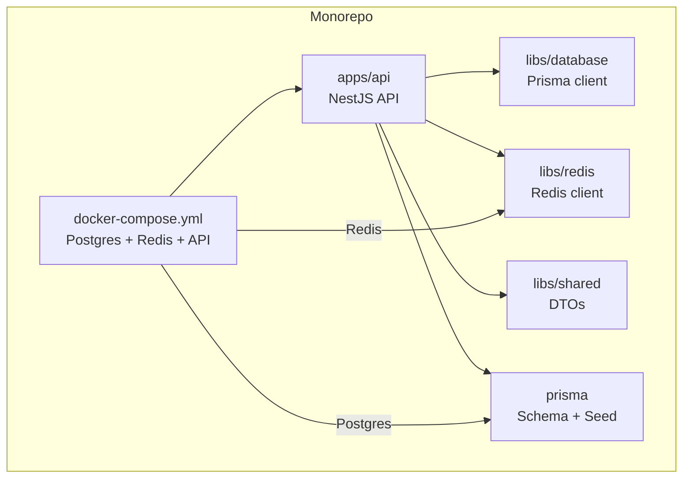
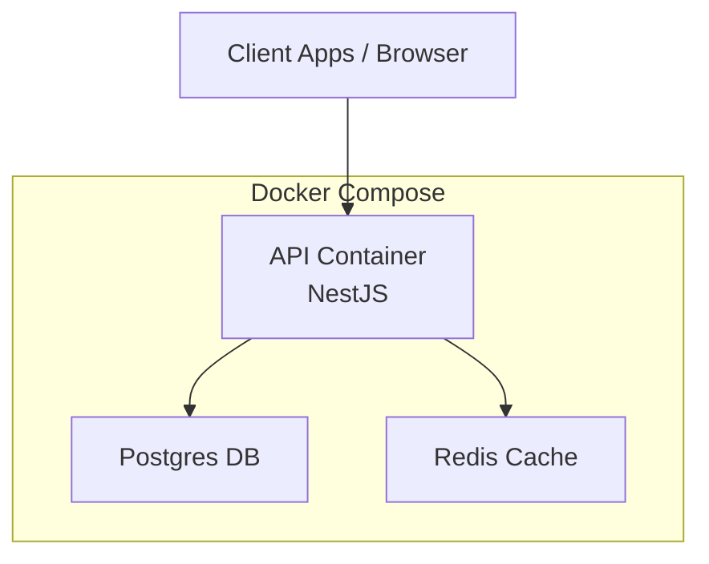
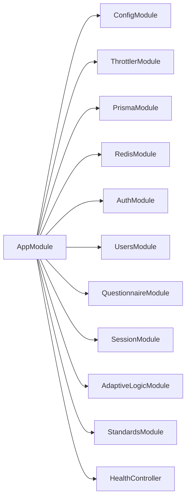

# Getting Started

<cite>
**Referenced Files in This Document**
- [package.json](file://package.json)
- [turbo.json](file://turbo.json)
- [docker-compose.yml](file://docker-compose.yml)
- [.env.example](file://.env.example)
- [Dockerfile (api)](file://docker/api/Dockerfile)
- [apps/api/src/main.ts](file://apps/api/src/main.ts)
- [apps/api/src/app.module.ts](file://apps/api/src/app.module.ts)
- [apps/api/src/config/configuration.ts](file://apps/api/src/config/configuration.ts)
- [apps/api/src/modules/auth/auth.controller.ts](file://apps/api/src/modules/auth/auth.controller.ts)
- [apps/api/src/modules/questionnaire/questionnaire.controller.ts](file://apps/api/src/modules/questionnaire/questionnaire.controller.ts)
- [apps/api/src/modules/session/session.controller.ts](file://apps/api/src/modules/session/session.controller.ts)
- [prisma/schema.prisma](file://prisma/schema.prisma)
- [libs/database/src/prisma.service.ts](file://libs/database/src/prisma.service.ts)
- [libs/redis/src/redis.service.ts](file://libs/redis/src/redis.service.ts)
</cite>

## Table of Contents
1. [Introduction](#introduction)
2. [Project Structure](#project-structure)
3. [Core Components](#core-components)
4. [Architecture Overview](#architecture-overview)
5. [Detailed Component Analysis](#detailed-component-analysis)
6. [Dependency Analysis](#dependency-analysis)
7. [Performance Considerations](#performance-considerations)
8. [Troubleshooting Guide](#troubleshooting-guide)
9. [Conclusion](#conclusion)
10. [Appendices](#appendices)

## Introduction
This guide helps you set up and run the Quiz-to-build project locally. It covers prerequisites, environment configuration, database initialization, dependency installation, monorepo navigation, and how to start the development server. You will also learn how to access API endpoints, run tests, and troubleshoot common issues. Practical examples show how to create a questionnaire, start a session, and authenticate users.

## Project Structure
The project is a monorepo organized with workspaces for applications and libraries:
- apps/api: NestJS-based backend API
- libs/database, libs/redis, libs/shared: Shared libraries for database, caching, and DTOs
- prisma: Database schema and seed configuration
- docker and docker-compose.yml: Local database and cache containers
- Root scripts and Turbo pipeline orchestrate builds, dev, test, and Docker commands

**Diagram sources**
- [apps/api/src/app.module.ts](file://apps/api/src/app.module.ts#L1-L67)
- [prisma/schema.prisma](file://prisma/schema.prisma#L1-L447)
- [docker-compose.yml](file://docker-compose.yml#L1-L77)

**Section sources**
- [package.json](file://package.json#L6-L9)
- [turbo.json](file://turbo.json#L1-L46)

## Core Components
- API server: Bootstrapped via NestJS, configured with global pipes, filters, interceptors, CORS, and Swagger documentation in non-production environments.
- Configuration: Centralized via a configuration loader that reads environment variables.
- Database: Prisma client connects to PostgreSQL using DATABASE_URL.
- Cache: Redis client configured via environment variables.
- Modules: Auth, Users, Questionnaire, Session, Adaptive Logic, Standards, and Health controller.

Key runtime behaviors:
- Global prefix and CORS are applied at startup.
- Swagger is enabled in non-production environments.
- Health checks are exposed by the HealthController.

**Section sources**
- [apps/api/src/main.ts](file://apps/api/src/main.ts#L11-L86)
- [apps/api/src/app.module.ts](file://apps/api/src/app.module.ts#L16-L66)
- [apps/api/src/config/configuration.ts](file://apps/api/src/config/configuration.ts#L1-L49)

## Architecture Overview
The API depends on a PostgreSQL database and a Redis cache. Docker Compose provisions both services and the API container. Environment variables define connectivity and secrets.

**Diagram sources**
- [docker-compose.yml](file://docker-compose.yml#L1-L77)
- [apps/api/src/main.ts](file://apps/api/src/main.ts#L11-L86)

## Detailed Component Analysis

### Environment Variables and Configuration
- Required variables include application settings, database URL, Redis host/port/password, JWT secrets, rate limits, logging, and CORS origin.
- The configuration loader reads environment variables and exposes them to the application.

Recommended steps:
- Copy the example environment file to a local environment file and adjust values for your environment.
- Ensure DATABASE_URL points to your local Postgres or Docker Postgres.
- Set JWT secrets to strong random values in non-development environments.

**Section sources**
- [.env.example](file://.env.example#L1-L33)
- [apps/api/src/config/configuration.ts](file://apps/api/src/config/configuration.ts#L1-L49)

### Database Initialization with Prisma
- The schema defines core entities: organizations, users, questionnaires, sections, questions, sessions, responses, documents, audit logs, and engineering standards.
- Initialize the database using Prisma migrations and seed data.

Typical workflow:
- Run migration to create/update tables.
- Seed initial data if needed.
- Verify connectivity via Prisma Studio or the API health endpoint.

**Section sources**
- [prisma/schema.prisma](file://prisma/schema.prisma#L1-L447)
- [package.json](file://package.json#L24-L29)

### Running Services Locally

#### Option A: Docker Compose (recommended for local)
- Starts Postgres, Redis, and the API container.
- Exposes ports 3000 (API), 5432 (Postgres), 6379 (Redis).
- Uses environment variables defined in docker-compose.yml.

Commands:
- Bring up services: docker compose up -d
- View logs: docker compose logs -f
- Tear down: docker compose down

Notes:
- The API container runs in development mode by default.
- The API waits for Postgres and Redis to be healthy before starting.

**Section sources**
- [docker-compose.yml](file://docker-compose.yml#L1-L77)
- [docker/api/Dockerfile](file://docker/api/Dockerfile#L53-L72)

#### Option B: Native local setup
- Install dependencies at the monorepo root.
- Configure environment variables.
- Start Postgres and Redis manually or via Docker Compose.
- Run the API in development mode.

Prerequisites:
- Node.js v20+ and npm v10+ (enforced by engines).
- Docker (optional but recommended for Postgres/Redis).
- Basic understanding of PostgreSQL and Redis.

**Section sources**
- [package.json](file://package.json#L60-L63)
- [package.json](file://package.json#L10-L33)

### Starting the Development Server
- From the monorepo root, use the dev script to start the API in watch mode.
- Alternatively, use the dedicated API script for NestJS dev mode.

Expected behavior:
- The server starts on the configured port with a global prefix.
- Swagger UI is available at /docs in non-production environments.

**Section sources**
- [package.json](file://package.json#L10-L12)
- [apps/api/src/main.ts](file://apps/api/src/main.ts#L11-L86)

### Accessing API Endpoints
- Base URL: http://localhost:3000/api/v1 (prefix configurable via environment).
- Authentication endpoints: POST /api/v1/auth/register, POST /api/v1/auth/login, POST /api/v1/auth/refresh, POST /api/v1/auth/logout, GET /api/v1/auth/me.
- Questionnaire endpoints: GET /api/v1/questionnaires, GET /api/v1/questionnaires/{id}.
- Session endpoints: POST /api/v1/sessions, GET /api/v1/sessions, GET /api/v1/sessions/{id}, GET /api/v1/sessions/{id}/continue, GET /api/v1/sessions/{id}/questions/next, POST /api/v1/sessions/{id}/responses, PUT /api/v1/sessions/{id}/responses/{questionId}, POST /api/v1/sessions/{id}/complete.

Swagger:
- Available at /docs in non-production environments.

**Section sources**
- [apps/api/src/main.ts](file://apps/api/src/main.ts#L30-L78)
- [apps/api/src/modules/auth/auth.controller.ts](file://apps/api/src/modules/auth/auth.controller.ts#L22-L74)
- [apps/api/src/modules/questionnaire/questionnaire.controller.ts](file://apps/api/src/modules/questionnaire/questionnaire.controller.ts#L18-L56)
- [apps/api/src/modules/session/session.controller.ts](file://apps/api/src/modules/session/session.controller.ts#L29-L153)

### Running Tests
- Unit and integration tests: npm run test
- Watch mode: npm run test:watch
- Coverage: npm run test:cov
- End-to-end tests: npm run test:e2e

Jest configuration in the API package includes module name mapping for shared libraries.

**Section sources**
- [apps/api/package.json](file://apps/api/package.json#L13-L17)
- [apps/api/package.json](file://apps/api/package.json#L62-L85)

### Quick Start Examples

#### Create a questionnaire
- Use the questionnaire endpoints to list and retrieve questionnaires.
- Example request paths:
  - List: GET /api/v1/questionnaires
  - Retrieve by ID: GET /api/v1/questionnaires/{id}

**Section sources**
- [apps/api/src/modules/questionnaire/questionnaire.controller.ts](file://apps/api/src/modules/questionnaire/questionnaire.controller.ts#L25-L54)

#### Start a session
- Authenticate first, then create a session.
- Example request paths:
  - Create session: POST /api/v1/sessions
  - List sessions: GET /api/v1/sessions
  - Get session details: GET /api/v1/sessions/{id}

**Section sources**
- [apps/api/src/modules/session/session.controller.ts](file://apps/api/src/modules/session/session.controller.ts#L36-L79)

#### Authenticate users
- Register a new user: POST /api/v1/auth/register
- Login: POST /api/v1/auth/login
- Refresh token: POST /api/v1/auth/refresh
- Logout: POST /api/v1/auth/logout
- Get profile: GET /api/v1/auth/me

Use the returned JWT token in the Authorization header for protected endpoints.

**Section sources**
- [apps/api/src/modules/auth/auth.controller.ts](file://apps/api/src/modules/auth/auth.controller.ts#L27-L72)

## Dependency Analysis
The API module composes feature modules and integrates shared libraries. The database and cache are provided by dedicated modules.

**Diagram sources**
- [apps/api/src/app.module.ts](file://apps/api/src/app.module.ts#L16-L66)

**Section sources**
- [apps/api/src/app.module.ts](file://apps/api/src/app.module.ts#L1-L67)

## Performance Considerations
- Use Docker Compose for consistent local environments and reduced setup overhead.
- Enable rate limiting via throttler configuration.
- Monitor slow database queries in development using Prisma logs.
- Keep JWT secrets strong and rotate them regularly outside development.

## Troubleshooting Guide
Common issues and resolutions:
- Port conflicts
  - Adjust PORT in environment variables or stop conflicting services.
- Database not reachable
  - Confirm DATABASE_URL matches your Postgres instance.
  - Ensure Prisma migrations are applied.
- Redis connectivity errors
  - Verify REDIS_HOST, REDIS_PORT, and optional REDIS_PASSWORD.
- CORS blocked requests
  - Set CORS_ORIGIN appropriately for your frontend origin.
- Swagger not visible
  - Ensure NODE_ENV is not set to production.
- Health checks failing
  - Confirm Postgres and Redis are healthy per docker-compose healthchecks.

Operational commands:
- docker compose logs -f
- docker compose ps
- npm run db:studio (Prisma Studio)
- npm run db:reset (reset migrations if needed)

**Section sources**
- [docker-compose.yml](file://docker-compose.yml#L17-L21)
- [docker-compose.yml](file://docker-compose.yml#L33-L37)
- [apps/api/src/main.ts](file://apps/api/src/main.ts#L52-L78)
- [libs/database/src/prisma.service.ts](file://libs/database/src/prisma.service.ts#L20-L34)
- [libs/redis/src/redis.service.ts](file://libs/redis/src/redis.service.ts#L21-L27)
- [package.json](file://package.json#L24-L29)

## Conclusion
You now have the essentials to set up Quiz-to-build locally, configure environment variables, initialize the database, and run the API with Docker or natively. Use the provided examples to authenticate, create questionnaires, and manage sessions. Refer to the troubleshooting section for common issues and keep environment variables secure for non-development usage.

## Appendices

### Environment Variables Reference
- Application: NODE_ENV, PORT, API_PREFIX
- Database: DATABASE_URL
- Redis: REDIS_HOST, REDIS_PORT, REDIS_PASSWORD
- JWT: JWT_SECRET, JWT_EXPIRES_IN, JWT_REFRESH_SECRET, JWT_REFRESH_EXPIRES_IN
- Security: BCRYPT_ROUNDS
- Rate limiting: THROTTLE_TTL, THROTTLE_LIMIT, THROTTLE_LOGIN_LIMIT
- Logging: LOG_LEVEL
- CORS: CORS_ORIGIN

**Section sources**
- [.env.example](file://.env.example#L1-L33)

### Database Schema Highlights
- Entities include organizations, users, questionnaires, sections, questions, visibility rules, sessions, responses, documents, audit logs, and engineering standards.
- UUID primary keys and JSON fields for flexible metadata.

**Section sources**
- [prisma/schema.prisma](file://prisma/schema.prisma#L82-L131)
- [prisma/schema.prisma](file://prisma/schema.prisma#L173-L195)
- [prisma/schema.prisma](file://prisma/schema.prisma#L270-L300)
- [prisma/schema.prisma](file://prisma/schema.prisma#L351-L381)
- [prisma/schema.prisma](file://prisma/schema.prisma#L412-L428)