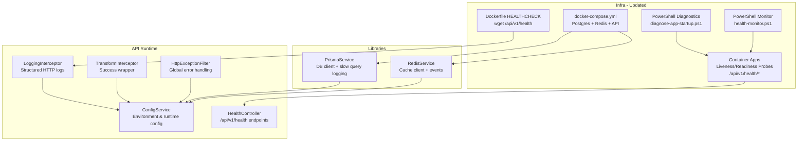
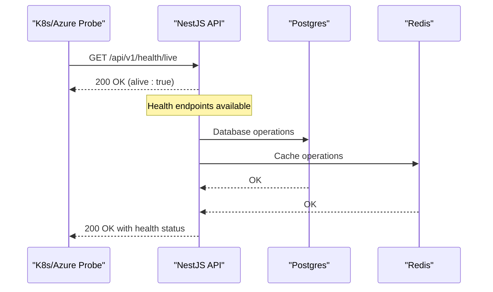
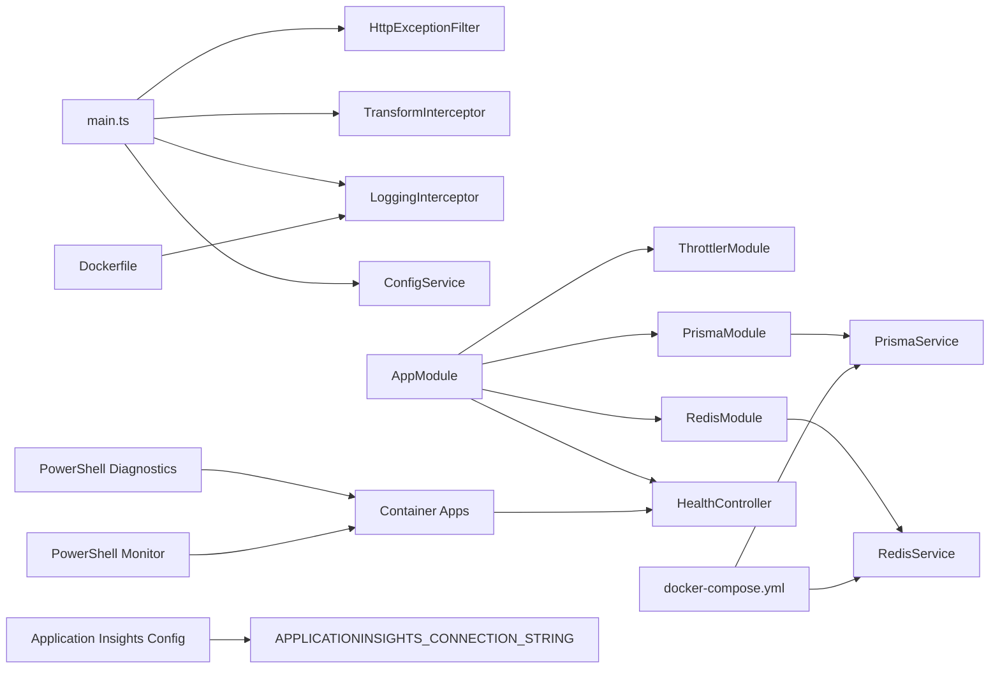

# Monitoring and Maintenance

<cite>
**Referenced Files in This Document**
- [apps/api/src/health.controller.ts](file://apps/api/src/health.controller.ts)
- [apps/api/src/health.controller.js](file://apps/api/src/health.controller.js)
- [apps/api/src/common/filters/http-exception.filter.ts](file://apps/api/src/common/filters/http-exception.filter.ts)
- [apps/api/src/common/interceptors/logging.interceptor.ts](file://apps/api/src/common/interceptors/logging.interceptor.ts)
- [apps/api/src/common/interceptors/transform.interceptor.ts](file://apps/api/src/common/interceptors/transform.interceptor.ts)
- [apps/api/src/config/configuration.ts](file://apps/api/src/config/configuration.ts)
- [apps/api/src/main.ts](file://apps/api/src/main.ts)
- [apps/api/src/app.module.ts](file://apps/api/src/app.module.ts)
- [libs/database/src/prisma.service.ts](file://libs/database/src/prisma.service.ts)
- [libs/redis/src/redis.service.ts](file://libs/redis/src/redis.service.ts)
- [docker/api/Dockerfile](file://docker/api/Dockerfile)
- [docker-compose.yml](file://docker-compose.yml)
- [infrastructure/terraform/modules/monitoring/main.tf](file://infrastructure/terraform/modules/monitoring/main.tf)
- [infrastructure/terraform/modules/monitoring/outputs.tf](file://infrastructure/terraform/modules/monitoring/outputs.tf)
- [infrastructure/terraform/modules/container-apps/main.tf](file://infrastructure/terraform/modules/container-apps/main.tf)
- [infrastructure/terraform/variables.tf](file://infrastructure/terraform/variables.tf)
- [infrastructure/terraform/main.tf](file://infrastructure/terraform/main.tf)
- [infrastructure/terraform/terraform.tfstate](file://infrastructure/terraform/terraform.tfstate)
- [scripts/cleanup.sh](file://scripts/cleanup.sh)
- [scripts/diagnose-app-startup.ps1](file://scripts/diagnose-app-startup.ps1)
- [scripts/health-monitor.ps1](file://scripts/health-monitor.ps1)
- [apps/api/package.json](file://apps/api/package.json)
- [package.json](file://package.json)
- [.env.example](file://.env.example)
- [.env.production.example](file://.env.production.example)
</cite>

## Update Summary
**Changes Made**
- Added comprehensive PowerShell diagnostic scripts for Azure Container Apps monitoring
- Introduced automated startup diagnostics with diagnose-app-startup.ps1
- Added continuous health monitoring with health-monitor.ps1 including alerting capabilities
- Enhanced Azure Container Apps monitoring with PowerShell-based automation
- Updated monitoring toolkit with automated troubleshooting and health checking

## Table of Contents
1. [Introduction](#introduction)
2. [Project Structure](#project-structure)
3. [Core Components](#core-components)
4. [Architecture Overview](#architecture-overview)
5. [Detailed Component Analysis](#detailed-component-analysis)
6. [Dependency Analysis](#dependency-analysis)
7. [Performance Considerations](#performance-considerations)
8. [Troubleshooting Guide](#troubleshooting-guide)
9. [Conclusion](#conclusion)
10. [Appendices](#appendices)

## Introduction
This document provides comprehensive monitoring and maintenance guidance for the Quiz-to-build system. It covers health check endpoints, logging configuration, error handling, performance monitoring, maintenance procedures, debugging and profiling, alerting strategies, and operational runbooks for capacity planning, scaling, and disaster recovery.

**Updated** The monitoring toolkit has been enhanced with comprehensive PowerShell diagnostic scripts for Azure Container Apps monitoring, providing automated startup diagnostics and continuous health monitoring capabilities.

## Project Structure
The system is a NestJS-based API application with modularized domain features and shared libraries for database and caching. Monitoring and maintenance capabilities are integrated via:
- **Health endpoints**: Available at /api/v1/health, /api/v1/health/ready, and /api/v1/health/live
- Structured logging via interceptors and Winston-compatible NestJS Logger
- Centralized error handling with global exception filter
- Database and Redis connectivity with diagnostic hooks
- Container health checks and orchestration with Docker and Docker Compose
- Infrastructure-as-code for monitoring resources in Azure with regional configurations
- **New** PowerShell diagnostic scripts for automated monitoring and troubleshooting

**Diagram sources**
- [apps/api/src/common/interceptors/logging.interceptor.ts](file://apps/api/src/common/interceptors/logging.interceptor.ts#L1-L62)
- [apps/api/src/common/interceptors/transform.interceptor.ts](file://apps/api/src/common/interceptors/transform.interceptor.ts#L1-L37)
- [apps/api/src/common/filters/http-exception.filter.ts](file://apps/api/src/common/filters/http-exception.filter.ts#L1-L102)
- [apps/api/src/config/configuration.ts](file://apps/api/src/config/configuration.ts#L1-L49)
- [apps/api/src/health.controller.ts](file://apps/api/src/health.controller.ts#L1-L42)
- [libs/database/src/prisma.service.ts](file://libs/database/src/prisma.service.ts#L1-L62)
- [libs/redis/src/redis.service.ts](file://libs/redis/src/redis.service.ts#L1-L96)
- [docker/api/Dockerfile](file://docker/api/Dockerfile#L65-L67)
- [docker-compose.yml](file://docker-compose.yml#L1-L77)
- [infrastructure/terraform/modules/container-apps/main.tf](file://infrastructure/terraform/modules/container-apps/main.tf#L107-L138)
- [scripts/diagnose-app-startup.ps1](file://scripts/diagnose-app-startup.ps1#L1-L164)
- [scripts/health-monitor.ps1](file://scripts/health-monitor.ps1#L1-L195)

**Section sources**
- [apps/api/src/common/interceptors/logging.interceptor.ts](file://apps/api/src/common/interceptors/logging.interceptor.ts#L1-L62)
- [apps/api/src/common/interceptors/transform.interceptor.ts](file://apps/api/src/common/interceptors/transform.interceptor.ts#L1-L37)
- [apps/api/src/common/filters/http-exception.filter.ts](file://apps/api/src/common/filters/http-exception.filter.ts#L1-L102)
- [apps/api/src/config/configuration.ts](file://apps/api/src/config/configuration.ts#L1-L49)
- [apps/api/src/app.module.ts](file://apps/api/src/app.module.ts#L1-L67)
- [apps/api/src/health.controller.ts](file://apps/api/src/health.controller.ts#L1-L42)
- [libs/database/src/prisma.service.ts](file://libs/database/src/prisma.service.ts#L1-L62)
- [libs/redis/src/redis.service.ts](file://libs/redis/src/redis.service.ts#L1-L96)
- [docker/api/Dockerfile](file://docker/api/Dockerfile#L1-L72)
- [docker-compose.yml](file://docker-compose.yml#L1-L77)
- [infrastructure/terraform/modules/monitoring/main.tf](file://infrastructure/terraform/modules/monitoring/main.tf#L1-L22)
- [infrastructure/terraform/modules/container-apps/main.tf](file://infrastructure/terraform/modules/container-apps/main.tf#L101-L104)
- [scripts/diagnose-app-startup.ps1](file://scripts/diagnose-app-startup.ps1#L1-L164)
- [scripts/health-monitor.ps1](file://scripts/health-monitor.ps1#L1-L195)

## Core Components
- **Health endpoints**: Available at /api/v1/health, /api/v1/health/ready, and /api/v1/health/live for comprehensive service monitoring.
- Logging interceptor: Emits structured JSON logs for requests and errors with timing and correlation ID.
- Transform interceptor: Wraps successful responses with a consistent success flag and metadata.
- Global exception filter: Normalizes error responses and logs unhandled exceptions.
- Configuration: Centralized environment-driven settings for logging, rate limiting, CORS, and database/Redis connections.
- Database and cache: Prisma client with slow query detection; Redis client with lifecycle hooks and commands.
- Container health checks: Docker HEALTHCHECK probes the API's health endpoints for comprehensive service verification.
- **Updated** Application Insights integration: Environment variable configuration for Azure Application Insights connection string.
- **New** PowerShell diagnostic toolkit: Automated monitoring and troubleshooting scripts for Azure Container Apps.

**Section sources**
- [apps/api/src/common/interceptors/logging.interceptor.ts](file://apps/api/src/common/interceptors/logging.interceptor.ts#L13-L61)
- [apps/api/src/common/interceptors/transform.interceptor.ts](file://apps/api/src/common/interceptors/transform.interceptor.ts#L19-L36)
- [apps/api/src/common/filters/http-exception.filter.ts](file://apps/api/src/common/filters/http-exception.filter.ts#L22-L82)
- [apps/api/src/config/configuration.ts](file://apps/api/src/config/configuration.ts#L1-L49)
- [apps/api/src/health.controller.ts](file://apps/api/src/health.controller.ts#L15-L41)
- [libs/database/src/prisma.service.ts](file://libs/database/src/prisma.service.ts#L5-L40)
- [libs/redis/src/redis.service.ts](file://libs/redis/src/redis.service.ts#L6-L34)
- [docker/api/Dockerfile](file://docker/api/Dockerfile#L65-L67)
- [infrastructure/terraform/modules/container-apps/main.tf](file://infrastructure/terraform/modules/container-apps/main.tf#L107-L138)
- [scripts/diagnose-app-startup.ps1](file://scripts/diagnose-app-startup.ps1#L1-L164)
- [scripts/health-monitor.ps1](file://scripts/health-monitor.ps1#L1-L195)

## Architecture Overview
The monitoring and maintenance architecture integrates runtime observability with infrastructure-level telemetry, now featuring regional Azure deployments, enhanced Application Insights configuration, and comprehensive PowerShell diagnostic automation. **Updated** The architecture includes automated monitoring solutions for Azure Container Apps with PowerShell scripts that provide startup diagnostics and continuous health monitoring.

**Diagram sources**
- [docker/api/Dockerfile](file://docker/api/Dockerfile#L65-L67)
- [docker-compose.yml](file://docker-compose.yml#L17-L21)
- [docker-compose.yml](file://docker-compose.yml#L33-L37)
- [apps/api/src/health.controller.ts](file://apps/api/src/health.controller.ts#L35-L41)

## Detailed Component Analysis

### Health Checks
**Updated** Health endpoints remain available and fully functional:

- **GET /api/v1/health**: Returns service status, timestamp, uptime, and environment information.
- **GET /api/v1/health/ready**: Indicates whether dependent services (Postgres, Redis) are reachable.
- **GET /api/v1/health/live**: Confirms process liveness and basic service availability.
- **Container health**: Docker HEALTHCHECK probes the health endpoints for comprehensive service verification.
- **Azure Container Apps**: Liveness, readiness, and startup probes configured to use health endpoints.

**New** PowerShell diagnostic automation:
- **diagnose-app-startup.ps1**: Comprehensive startup diagnostics for Azure Container Apps including status checks, log analysis, environment validation, and connectivity testing.
- **health-monitor.ps1**: Continuous health monitoring with real-time status tracking, alerting capabilities, and performance metrics.

Operational guidance:
- Use health endpoints for service verification and integration with container orchestration platforms.
- Deploy PowerShell scripts for automated monitoring and troubleshooting in Azure environments.
- Configure alerts based on health monitor results for proactive incident response.
- Utilize diagnostic scripts for rapid troubleshooting during deployment failures.

**Section sources**
- [apps/api/src/health.controller.ts](file://apps/api/src/health.controller.ts#L15-L41)
- [docker/api/Dockerfile](file://docker/api/Dockerfile#L65-L67)
- [infrastructure/terraform/modules/container-apps/main.tf](file://infrastructure/terraform/modules/container-apps/main.tf#L107-L138)
- [scripts/diagnose-app-startup.ps1](file://scripts/diagnose-app-startup.ps1#L1-L164)
- [scripts/health-monitor.ps1](file://scripts/health-monitor.ps1#L1-L195)

### PowerShell Diagnostic Scripts

#### Startup Diagnostics Script
**New** The diagnose-app-startup.ps1 script provides comprehensive startup troubleshooting:

- **Container App Status**: Checks provisioning state, running status, and latest revision
- **Revision Health**: Validates health state and active replica count
- **Container Logs**: Retrieves recent log entries with color-coded error/warning highlighting
- **Environment Variables**: Validates all environment variables have values or secret references
- **Database Connectivity**: Verifies PostgreSQL server state and connectivity
- **Redis Cache**: Checks Redis cache availability and configuration
- **Health Endpoint Testing**: Tests readiness endpoint for dependent service validation
- **Key Vault Secrets**: Verifies critical secrets existence in Azure Key Vault

#### Health Monitoring Script
**New** The health-monitor.ps1 script provides continuous monitoring capabilities:

- **Real-time Monitoring**: Configurable interval-based health checking with customizable duration
- **Alerting System**: Webhook-based alerting for critical failures with severity levels
- **Performance Metrics**: Tracks response times, success rates, and consecutive failure counts
- **Status Tracking**: Color-coded console output with detailed monitoring statistics
- **Uptime Calculation**: Tracks total monitoring duration and system availability
- **Consecutive Failure Detection**: Automatic alerts after 3 consecutive failed checks

**Section sources**
- [scripts/diagnose-app-startup.ps1](file://scripts/diagnose-app-startup.ps1#L1-L164)
- [scripts/health-monitor.ps1](file://scripts/health-monitor.ps1#L1-L195)

### Logging and Structured Logs
- Interceptor emits structured JSON logs for HTTP traffic:
  - Fields include method, URL, status code, duration, IP, user agent, and request ID.
  - Logs are emitted for both success and error paths.
- Log level is configured via environment variable and loaded by ConfigService.
- Winston is not explicitly imported; NestJS Logger is used and supports structured logging patterns.

Best practices:
- Correlate logs using the x-request-id header.
- Tune LOG_LEVEL per environment (e.g., info in production).
- Forward logs to centralized systems (e.g., Azure Log Analytics/App Insights).

**Section sources**
- [apps/api/src/common/interceptors/logging.interceptor.ts](file://apps/api/src/common/interceptors/logging.interceptor.ts#L13-L61)
- [apps/api/src/config/configuration.ts](file://apps/api/src/config/configuration.ts#L44-L48)
- [apps/api/src/main.ts](file://apps/api/src/main.ts#L48-L49)

### Error Handling and Global Filters
- Global exception filter:
  - Converts exceptions to normalized error responses with code, message, optional details, request ID, and timestamp.
  - Logs HTTP requests/responses and stack traces for unhandled errors.
  - Derives error codes from HTTP status codes with a predefined mapping.
- Uncaught errors are logged with severity and stack traces for debugging.

Recommendations:
- Propagate x-request-id from upstream to correlate end-to-end.
- Add contextual metadata to structured logs for auditability.

**Section sources**
- [apps/api/src/common/filters/http-exception.filter.ts](file://apps/api/src/common/filters/http-exception.filter.ts#L22-L82)

### Response Transformation
- TransformInterceptor wraps successful responses with:
  - success: true
  - data: original payload
  - meta: timestamp and optional request ID

Benefits:
- Consistent client-side handling.
- Built-in correlation via request ID.

**Section sources**
- [apps/api/src/common/interceptors/transform.interceptor.ts](file://apps/api/src/common/interceptors/transform.interceptor.ts#L19-L36)

### Database Monitoring and Slow Query Detection
- PrismaService:
  - Connects to Postgres and logs info/warn/error events to stdout.
  - In development, listens for query events and warns on slow queries (>100ms).
  - Provides a test-only cleanup utility for truncating tables.

Operational tips:
- Monitor Prisma logs in production for warnings and errors.
- Use slow query logs to identify performance bottlenecks.
- Avoid using cleanup utilities outside test environments.

**Section sources**
- [libs/database/src/prisma.service.ts](file://libs/database/src/prisma.service.ts#L5-L40)

### Redis Monitoring and Lifecycle Hooks
- RedisService:
  - Establishes connection with retry strategy.
  - Emits connect and error events for diagnostics.
  - Provides CRUD and hash helpers plus test-only flushdb.

Guidance:
- Monitor Redis logs for connection errors.
- Use keyspace notifications and metrics from the platform for capacity planning.

**Section sources**
- [libs/redis/src/redis.service.ts](file://libs/redis/src/redis.service.ts#L6-L34)

### Container Health and Orchestration
- **Updated** Dockerfile HEALTHCHECK now probes the health endpoints every 30s with a 10s timeout.
- docker-compose orchestrates Postgres and Redis healthchecks and exposes ports for local development.
- API depends on Postgres and Redis being healthy before starting.
- **Updated** Azure Container Apps configured with comprehensive health probes:
  - Liveness probe: /api/v1/health/live
  - Readiness probe: /api/v1/health/ready
  - Startup probe: /api/v1/health/live

Maintenance:
- Ensure health endpoints respond quickly and do not trigger rate limits.
- Verify container health checks pass in staging and production.
- Implement custom monitoring solutions using PowerShell scripts.

**Section sources**
- [docker/api/Dockerfile](file://docker/api/Dockerfile#L65-L67)
- [docker-compose.yml](file://docker-compose.yml#L62-L66)
- [infrastructure/terraform/modules/container-apps/main.tf](file://infrastructure/terraform/modules/container-apps/main.tf#L107-L138)

### Infrastructure Telemetry (Azure) - Updated
- Terraform module provisions:
  - Log Analytics workspace with 30-day retention
  - Application Insights for Node.js with regional endpoint support
  - Australia East region deployment for compliance and performance
- Container Apps integration passes Application Insights connection string as environment variable
- Regional endpoint configuration: `https://australiaeast-1.in.applicationinsights.azure.com/`
- Connection string includes instrumentation key and live diagnostics endpoint

Recommendations:
- Configure Application Insights connection string in production using regional endpoints.
- Set retention policies and alerts on the workspace.
- Monitor regional performance and compliance requirements.
- Implement custom health monitoring using Application Insights metrics.

**Section sources**
- [infrastructure/terraform/modules/monitoring/main.tf](file://infrastructure/terraform/modules/monitoring/main.tf#L1-L22)
- [infrastructure/terraform/modules/monitoring/outputs.tf](file://infrastructure/terraform/modules/monitoring/outputs.tf#L1-L37)
- [infrastructure/terraform/modules/container-apps/main.tf](file://infrastructure/terraform/modules/container-apps/main.tf#L101-L104)
- [infrastructure/terraform/variables.tf](file://infrastructure/terraform/variables.tf#L16-L16)
- [infrastructure/terraform/terraform.tfstate](file://infrastructure/terraform/terraform.tfstate#L373-L373)

## Dependency Analysis
Runtime and configuration dependencies relevant to monitoring and maintenance:

**Diagram sources**
- [apps/api/src/main.ts](file://apps/api/src/main.ts#L7-L49)
- [apps/api/src/app.module.ts](file://apps/api/src/app.module.ts#L3-L66)
- [apps/api/src/health.controller.ts](file://apps/api/src/health.controller.ts#L13-L13)
- [libs/database/src/prisma.service.ts](file://libs/database/src/prisma.service.ts#L1-L62)
- [libs/redis/src/redis.service.ts](file://libs/redis/src/redis.service.ts#L1-L96)
- [docker/api/Dockerfile](file://docker/api/Dockerfile#L65-L67)
- [docker-compose.yml](file://docker-compose.yml#L1-L77)
- [infrastructure/terraform/modules/container-apps/main.tf](file://infrastructure/terraform/modules/container-apps/main.tf#L107-L138)
- [scripts/diagnose-app-startup.ps1](file://scripts/diagnose-app-startup.ps1#L1-L164)
- [scripts/health-monitor.ps1](file://scripts/health-monitor.ps1#L1-L195)

**Section sources**
- [apps/api/src/main.ts](file://apps/api/src/main.ts#L7-L49)
- [apps/api/src/app.module.ts](file://apps/api/src/app.module.ts#L16-L66)
- [apps/api/src/health.controller.ts](file://apps/api/src/health.controller.ts#L13-L13)
- [libs/database/src/prisma.service.ts](file://libs/database/src/prisma.service.ts#L1-L62)
- [libs/redis/src/redis.service.ts](file://libs/redis/src/redis.service.ts#L1-L96)
- [docker/api/Dockerfile](file://docker/api/Dockerfile#L65-L67)
- [docker-compose.yml](file://docker-compose.yml#L1-L77)
- [infrastructure/terraform/modules/monitoring/main.tf](file://infrastructure/terraform/modules/monitoring/main.tf#L1-L22)
- [infrastructure/terraform/modules/container-apps/main.tf](file://infrastructure/terraform/modules/container-apps/main.tf#L101-L104)
- [scripts/diagnose-app-startup.ps1](file://scripts/diagnose-app-startup.ps1#L1-L164)
- [scripts/health-monitor.ps1](file://scripts/health-monitor.ps1#L1-L195)

## Performance Considerations
- Response time tracking:
  - LoggingInterceptor measures request duration and logs it with each request.
  - Use this to monitor latency trends and identify slow routes.
- Memory usage:
  - Enable Node.js heap snapshots and CPU profiling during performance testing.
  - Use platform-native metrics (e.g., Azure Container Instances/App Service) to track RSS and GC pauses.
- Database query performance:
  - Prisma slow query warnings in development help surface long-running queries.
  - In production, rely on database performance insights and Application Insights SQL dependencies.
- Caching:
  - Redis operations are logged; monitor hit rates and TTL usage to optimize cache strategy.
- **Updated** Application Insights performance monitoring:
  - Real-time dependency tracking and performance metrics
  - Regional endpoint optimization for Australia East deployment
  - Instrumentation key-based performance monitoring
  - Custom metrics for application-specific performance indicators
- **New** PowerShell monitoring performance:
  - Health monitor tracks response times and success rates
  - Automated alerting for performance degradation
  - Continuous monitoring with configurable intervals

## Troubleshooting Guide
Common scenarios and remedies:
- Service appears down:
  - Verify health endpoints respond successfully (GET /api/v1/health, /api/v1/health/ready, /api/v1/health/live).
  - Check Docker health status and container logs for startup errors.
  - Monitor Application Insights for application-level errors and performance issues.
  - **New** Use diagnose-app-startup.ps1 for automated startup diagnostics.
- Readiness failures:
  - Confirm Postgres and Redis are healthy and reachable.
  - Review Prisma and Redis logs for connection errors.
  - Check database connectivity and Redis availability.
  - **New** Use health-monitor.ps1 for continuous readiness monitoring.
- High latency:
  - Inspect structured logs for slow endpoints and durations.
  - Profile hotspots using CPU and heap profiling.
  - Analyze Application Insights dependency tracking for slow external calls.
  - **New** Monitor health endpoint response times with PowerShell scripts.
- Unhandled errors:
  - Check global error logs for stack traces and request IDs.
  - Reissue the failing request with x-request-id to locate correlated logs.
  - Monitor Application Insights for error trends and patterns.
- **Updated** Health endpoint issues:
  - Verify health endpoints are accessible and returning expected responses.
  - Check container health probes configuration in Azure Container Apps.
  - Review health controller implementation and routing.

**New** PowerShell troubleshooting:
- Use diagnose-app-startup.ps1 for automated startup failure diagnosis
- Leverage health-monitor.ps1 for continuous monitoring and alerting
- Configure webhook alerts for critical health issues
- Monitor response times and success rates automatically

Debugging and profiling:
- Use start:dev and start:debug scripts to attach a debugger.
- Capture Application Insights traces and dependency calls for end-to-end analysis.
- For database, review slow query logs and query plans.
- **Updated** Monitor Application Insights metrics for performance bottlenecks and custom health indicators.
- **New** Utilize PowerShell scripts for automated debugging and monitoring workflows.

Maintenance tasks:
- Log rotation:
  - Rely on platform log aggregation (e.g., Azure Log Analytics) and container log drivers.
- Database cleanup:
  - Use test-only utilities in library code for resetting test databases.
- System optimization:
  - Adjust rate limits, Redis TTLs, and Prisma query strategies based on observed metrics.
- **Updated** Monitoring maintenance:
  - Regularly verify Application Insights connection string validity
  - Monitor regional endpoint performance and availability
  - Update connection strings during environment migrations
  - Implement custom health monitoring solutions
- **New** PowerShell script maintenance:
  - Update resource group and container app names in scripts
  - Configure webhook URLs for alerting
  - Schedule automated monitoring with appropriate intervals
  - Validate Azure CLI access and permissions

**Section sources**
- [apps/api/src/common/filters/http-exception.filter.ts](file://apps/api/src/common/filters/http-exception.filter.ts#L56-L79)
- [apps/api/src/common/interceptors/logging.interceptor.ts](file://apps/api/src/common/interceptors/logging.interceptor.ts#L25-L59)
- [libs/database/src/prisma.service.ts](file://libs/database/src/prisma.service.ts#L25-L33)
- [apps/api/src/health.controller.ts](file://apps/api/src/health.controller.ts#L15-L41)
- [apps/api/package.json](file://apps/api/package.json#L6-L18)
- [infrastructure/terraform/modules/container-apps/main.tf](file://infrastructure/terraform/modules/container-apps/main.tf#L107-L138)
- [infrastructure/terraform/terraform.tfstate](file://infrastructure/terraform/terraform.tfstate#L373-L373)
- [scripts/diagnose-app-startup.ps1](file://scripts/diagnose-app-startup.ps1#L1-L164)
- [scripts/health-monitor.ps1](file://scripts/health-monitor.ps1#L1-L195)

## Conclusion
The Quiz-to-build system integrates health checks, structured logging, global error handling, and database/Redis observability. With the updated Application Insights and Log Analytics configuration, combined with container health checks, Azure monitoring resources, and comprehensive PowerShell diagnostic automation, it provides a robust foundation for operational reliability across regional deployments. **Updated** The addition of PowerShell diagnostic scripts significantly enhances the monitoring toolkit with automated startup diagnostics and continuous health monitoring capabilities for Azure Container Apps, providing proactive monitoring and troubleshooting solutions.

## Appendices

### Alerting Strategies and Incident Response
- Health probes:
  - Configure Kubernetes/Azure Container Health to alert on failed health endpoint requests.
  - Monitor Application Insights for application-level health metrics and error rates.
  - **New** Configure webhook alerts through health-monitor.ps1 for automated incident notification.
- Log-based alerts:
  - Create alerts on error rate spikes, high latency thresholds, and Redis/DB connection failures.
  - Set up alerts for missing health endpoints and degraded application performance.
- Application Insights:
  - Track dependency failures, slow SQL, and unhandled exceptions.
  - Monitor regional endpoint performance and availability.
  - Implement custom metrics for application-specific health indicators.
- **New** PowerShell-based alerting:
  - Configure webhook URLs for critical health failures
  - Set up automated alerting after consecutive failures
  - Monitor response times and success rates with custom thresholds
- Runbooks:
  - Define steps for restoring DB/Redis, rolling updates, and emergency rollbacks.
  - **Updated** Include procedures for implementing custom health monitoring solutions.
  - **New** Add PowerShell script deployment and configuration runbooks.

### Capacity Planning, Scaling, and Disaster Recovery
- Capacity planning:
  - Use latency, throughput, and error rate metrics to size containers and provision DB/Redis.
  - **Updated** Monitor Application Insights regional performance metrics and custom health indicators.
  - **New** Use health-monitor.ps1 data for capacity trend analysis and forecasting.
- Scaling:
  - Horizontal pod scaling based on CPU/memory and queue depth for async workloads.
  - Implement auto-scaling based on Application Insights metrics and custom health signals.
  - **New** Configure PowerShell monitoring for scaling decision triggers.
- Disaster recovery:
  - Back up Postgres and Redis regularly; test restore procedures.
  - Maintain immutable infrastructure with CI/CD pipelines and blue/green deployments.
  - **Updated** Include regional disaster recovery planning for Australia East deployment and custom monitoring solutions.
  - **New** Implement PowerShell script-based monitoring for DR scenarios.

### Maintenance Procedures Checklist
- Daily:
  - Review health probe results and error logs.
  - Monitor database and Redis metrics.
  - **Updated** Verify Application Insights connection string and regional endpoint accessibility.
  - Implement and monitor custom health monitoring solutions.
  - **New** Execute diagnose-app-startup.ps1 for routine health verification.
  - **New** Review health-monitor.ps1 alert history and performance metrics.
- Weekly:
  - Rotate secrets and refresh tokens.
  - Audit rate-limit configurations.
  - **Updated** Validate Application Insights instrumentation key and connection string.
  - Review custom health monitoring configurations.
  - **New** Update PowerShell script parameters and webhook configurations.
- Monthly:
  - Review pruning policies for logs and backups.
  - Validate disaster recovery procedures.
  - **Updated** Test regional endpoint failover and performance monitoring.
  - Evaluate and optimize custom health monitoring implementations.
  - **New** Review and update PowerShell script schedules and monitoring intervals.
  - **New** Audit webhook configurations and alert thresholds.

### PowerShell Script Usage Guide
**New** Comprehensive guide for using diagnostic and monitoring scripts:

#### diagnose-app-startup.ps1
- **Purpose**: Automated startup failure diagnosis for Azure Container Apps
- **Usage**: `.\diagnose-app-startup.ps1 -ResourceGroup "rg-questionnaire-dev" -ContainerAppName "ca-questionnaire-api-dev"`
- **Features**: Status checks, log analysis, environment validation, connectivity testing, health endpoint verification
- **Output**: Color-coded status reporting with actionable recommendations

#### health-monitor.ps1
- **Purpose**: Continuous health monitoring with alerting capabilities
- **Usage**: `.\health-monitor.ps1 -Interval 30 -Duration 60 -AlertWebhook "https://your-webhook.url"`
- **Features**: Real-time monitoring, performance metrics, alerting system, uptime tracking
- **Output**: Live console display with historical statistics and summary reports

**Section sources**
- [scripts/diagnose-app-startup.ps1](file://scripts/diagnose-app-startup.ps1#L1-L164)
- [scripts/health-monitor.ps1](file://scripts/health-monitor.ps1#L1-L195)