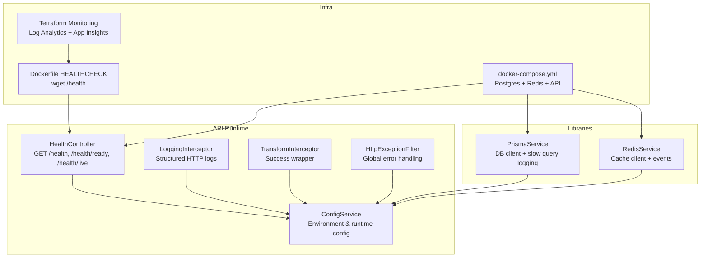
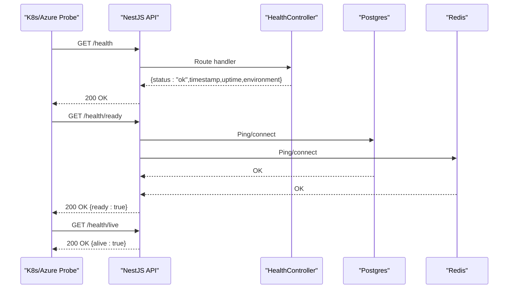
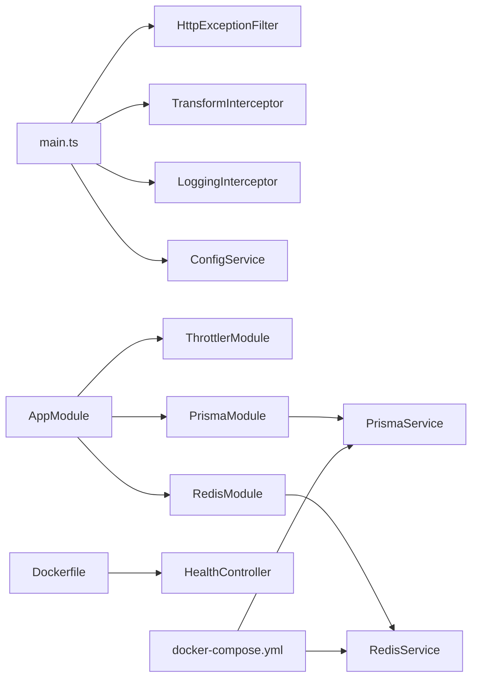

# Monitoring and Maintenance

<cite>
**Referenced Files in This Document**
- [apps/api/src/health.controller.ts](file://apps/api/src/health.controller.ts)
- [apps/api/src/common/filters/http-exception.filter.ts](file://apps/api/src/common/filters/http-exception.filter.ts)
- [apps/api/src/common/interceptors/logging.interceptor.ts](file://apps/api/src/common/interceptors/logging.interceptor.ts)
- [apps/api/src/common/interceptors/transform.interceptor.ts](file://apps/api/src/common/interceptors/transform.interceptor.ts)
- [apps/api/src/config/configuration.ts](file://apps/api/src/config/configuration.ts)
- [apps/api/src/main.ts](file://apps/api/src/main.ts)
- [apps/api/src/app.module.ts](file://apps/api/src/app.module.ts)
- [libs/database/src/prisma.service.ts](file://libs/database/src/prisma.service.ts)
- [libs/redis/src/redis.service.ts](file://libs/redis/src/redis.service.ts)
- [docker/api/Dockerfile](file://docker/api/Dockerfile)
- [docker-compose.yml](file://docker-compose.yml)
- [infrastructure/terraform/modules/monitoring/main.tf](file://infrastructure/terraform/modules/monitoring/main.tf)
- [scripts/cleanup.sh](file://scripts/cleanup.sh)
- [apps/api/package.json](file://apps/api/package.json)
- [package.json](file://package.json)
- [.env.example](file://.env.example)
- [.env.production.example](file://.env.production.example)
</cite>

## Table of Contents
1. [Introduction](#introduction)
2. [Project Structure](#project-structure)
3. [Core Components](#core-components)
4. [Architecture Overview](#architecture-overview)
5. [Detailed Component Analysis](#detailed-component-analysis)
6. [Dependency Analysis](#dependency-analysis)
7. [Performance Considerations](#performance-considerations)
8. [Troubleshooting Guide](#troubleshooting-guide)
9. [Conclusion](#conclusion)
10. [Appendices](#appendices)

## Introduction
This document provides comprehensive monitoring and maintenance guidance for the Quiz-to-build system. It covers health check endpoints, logging configuration, error handling, performance monitoring, maintenance procedures, debugging and profiling, alerting strategies, and operational runbooks for capacity planning, scaling, and disaster recovery.

## Project Structure
The system is a NestJS-based API application with modularized domain features and shared libraries for database and caching. Monitoring and maintenance capabilities are integrated via:
- Health endpoints for readiness and liveness
- Structured logging via interceptors and Winston-compatible NestJS Logger
- Centralized error handling with global exception filter
- Database and Redis connectivity with diagnostic hooks
- Container health checks and orchestration with Docker and Docker Compose
- Infrastructure-as-code for monitoring resources in Azure

**Diagram sources**
- [apps/api/src/health.controller.ts](file://apps/api/src/health.controller.ts#L1-L42)
- [apps/api/src/common/interceptors/logging.interceptor.ts](file://apps/api/src/common/interceptors/logging.interceptor.ts#L1-L62)
- [apps/api/src/common/interceptors/transform.interceptor.ts](file://apps/api/src/common/interceptors/transform.interceptor.ts#L1-L37)
- [apps/api/src/common/filters/http-exception.filter.ts](file://apps/api/src/common/filters/http-exception.filter.ts#L1-L102)
- [apps/api/src/config/configuration.ts](file://apps/api/src/config/configuration.ts#L1-L49)
- [libs/database/src/prisma.service.ts](file://libs/database/src/prisma.service.ts#L1-L62)
- [libs/redis/src/redis.service.ts](file://libs/redis/src/redis.service.ts#L1-L96)
- [docker/api/Dockerfile](file://docker/api/Dockerfile#L45-L48)
- [docker-compose.yml](file://docker-compose.yml#L1-L77)
- [infrastructure/terraform/modules/monitoring/main.tf](file://infrastructure/terraform/modules/monitoring/main.tf#L1-L22)

**Section sources**
- [apps/api/src/health.controller.ts](file://apps/api/src/health.controller.ts#L1-L42)
- [apps/api/src/common/interceptors/logging.interceptor.ts](file://apps/api/src/common/interceptors/logging.interceptor.ts#L1-L62)
- [apps/api/src/common/interceptors/transform.interceptor.ts](file://apps/api/src/common/interceptors/transform.interceptor.ts#L1-L37)
- [apps/api/src/common/filters/http-exception.filter.ts](file://apps/api/src/common/filters/http-exception.filter.ts#L1-L102)
- [apps/api/src/config/configuration.ts](file://apps/api/src/config/configuration.ts#L1-L49)
- [apps/api/src/app.module.ts](file://apps/api/src/app.module.ts#L1-L67)
- [libs/database/src/prisma.service.ts](file://libs/database/src/prisma.service.ts#L1-L62)
- [libs/redis/src/redis.service.ts](file://libs/redis/src/redis.service.ts#L1-L96)
- [docker/api/Dockerfile](file://docker/api/Dockerfile#L1-L72)
- [docker-compose.yml](file://docker-compose.yml#L1-L77)
- [infrastructure/terraform/modules/monitoring/main.tf](file://infrastructure/terraform/modules/monitoring/main.tf#L1-L22)

## Core Components
- Health endpoints: Provides status, timestamp, uptime, environment, readiness, and liveness indicators.
- Logging interceptor: Emits structured JSON logs for requests and errors with timing and correlation ID.
- Transform interceptor: Wraps successful responses with a consistent success flag and metadata.
- Global exception filter: Normalizes error responses and logs unhandled exceptions.
- Configuration: Centralized environment-driven settings for logging, rate limiting, CORS, and database/Redis connections.
- Database and cache: Prisma client with slow query detection; Redis client with lifecycle hooks and commands.
- Container health checks: Docker HEALTHCHECK probes the API’s health endpoint.

**Section sources**
- [apps/api/src/health.controller.ts](file://apps/api/src/health.controller.ts#L12-L41)
- [apps/api/src/common/interceptors/logging.interceptor.ts](file://apps/api/src/common/interceptors/logging.interceptor.ts#L13-L61)
- [apps/api/src/common/interceptors/transform.interceptor.ts](file://apps/api/src/common/interceptors/transform.interceptor.ts#L19-L36)
- [apps/api/src/common/filters/http-exception.filter.ts](file://apps/api/src/common/filters/http-exception.filter.ts#L22-L82)
- [apps/api/src/config/configuration.ts](file://apps/api/src/config/configuration.ts#L1-L49)
- [libs/database/src/prisma.service.ts](file://libs/database/src/prisma.service.ts#L5-L40)
- [libs/redis/src/redis.service.ts](file://libs/redis/src/redis.service.ts#L6-L34)
- [docker/api/Dockerfile](file://docker/api/Dockerfile#L45-L48)

## Architecture Overview
The monitoring and maintenance architecture integrates runtime observability with infrastructure-level telemetry.

**Diagram sources**
- [apps/api/src/health.controller.ts](file://apps/api/src/health.controller.ts#L16-L40)
- [docker/api/Dockerfile](file://docker/api/Dockerfile#L45-L48)
- [docker-compose.yml](file://docker-compose.yml#L17-L21)
- [docker-compose.yml](file://docker-compose.yml#L33-L37)

## Detailed Component Analysis

### Health Checks
- Endpoint definitions:
  - GET /health: Returns service status, timestamp, uptime, and environment.
  - GET /health/ready: Indicates whether dependent services are reachable.
  - GET /health/live: Confirms process liveness.
- Throttling: Health endpoints skip rate limits for reliable probing.
- Container health: Docker HEALTHCHECK pings /health.

Operational guidance:
- Use /health/live for container liveness.
- Use /health/ready for startup/readiness gates.
- Use /health for general service status.

**Section sources**
- [apps/api/src/health.controller.ts](file://apps/api/src/health.controller.ts#L16-L40)
- [docker/api/Dockerfile](file://docker/api/Dockerfile#L45-L48)
- [docker-compose.yml](file://docker-compose.yml#L17-L21)
- [docker-compose.yml](file://docker-compose.yml#L33-L37)

### Logging and Structured Logs
- Interceptor emits structured JSON logs for HTTP traffic:
  - Fields include method, URL, status code, duration, IP, user agent, and request ID.
  - Logs are emitted for both success and error paths.
- Log level is configured via environment variable and loaded by ConfigService.
- Winston is not explicitly imported; NestJS Logger is used and supports structured logging patterns.

Best practices:
- Correlate logs using the x-request-id header.
- Tune LOG_LEVEL per environment (e.g., info in production).
- Forward logs to centralized systems (e.g., Azure Log Analytics/App Insights).

**Section sources**
- [apps/api/src/common/interceptors/logging.interceptor.ts](file://apps/api/src/common/interceptors/logging.interceptor.ts#L13-L61)
- [apps/api/src/config/configuration.ts](file://apps/api/src/config/configuration.ts#L44-L48)
- [apps/api/src/main.ts](file://apps/api/src/main.ts#L48-L49)

### Error Handling and Global Filters
- Global exception filter:
  - Converts exceptions to normalized error responses with code, message, optional details, request ID, and timestamp.
  - Logs HTTP requests/responses and stack traces for unhandled errors.
  - Derives error codes from HTTP status codes with a predefined mapping.
- Uncaught errors are logged with severity and stack traces for debugging.

Recommendations:
- Propagate x-request-id from upstream to correlate end-to-end.
- Add contextual metadata to structured logs for auditability.

**Section sources**
- [apps/api/src/common/filters/http-exception.filter.ts](file://apps/api/src/common/filters/http-exception.filter.ts#L22-L82)

### Response Transformation
- TransformInterceptor wraps successful responses with:
  - success: true
  - data: original payload
  - meta: timestamp and optional request ID

Benefits:
- Consistent client-side handling.
- Built-in correlation via request ID.

**Section sources**
- [apps/api/src/common/interceptors/transform.interceptor.ts](file://apps/api/src/common/interceptors/transform.interceptor.ts#L19-L36)

### Database Monitoring and Slow Query Detection
- PrismaService:
  - Connects to Postgres and logs info/warn/error events to stdout.
  - In development, listens for query events and warns on slow queries (>100ms).
  - Provides a test-only cleanup utility for truncating tables.

Operational tips:
- Monitor Prisma logs in production for warnings and errors.
- Use slow query logs to identify performance bottlenecks.
- Avoid using cleanup utilities outside test environments.

**Section sources**
- [libs/database/src/prisma.service.ts](file://libs/database/src/prisma.service.ts#L5-L40)

### Redis Monitoring and Lifecycle Hooks
- RedisService:
  - Establishes connection with retry strategy.
  - Emits connect and error events for diagnostics.
  - Provides CRUD and hash helpers plus test-only flushdb.

Guidance:
- Monitor Redis logs for connection errors.
- Use keyspace notifications and metrics from the platform for capacity planning.

**Section sources**
- [libs/redis/src/redis.service.ts](file://libs/redis/src/redis.service.ts#L6-L34)

### Container Health and Orchestration
- Dockerfile HEALTHCHECK probes /health every 30s with a 10s timeout.
- docker-compose orchestrates Postgres and Redis healthchecks and exposes ports for local development.
- API depends on Postgres and Redis being healthy before starting.

Maintenance:
- Ensure the health endpoint remains fast and does not trigger rate limits.
- Verify Docker health checks pass in staging and production.

**Section sources**
- [docker/api/Dockerfile](file://docker/api/Dockerfile#L45-L48)
- [docker-compose.yml](file://docker-compose.yml#L62-L66)

### Infrastructure Telemetry (Azure)
- Terraform module provisions:
  - Log Analytics workspace
  - Application Insights for Node.js
- These resources enable centralized log collection and performance monitoring.

Recommendations:
- Configure Application Insights connection string in production.
- Set retention policies and alerts on the workspace.

**Section sources**
- [infrastructure/terraform/modules/monitoring/main.tf](file://infrastructure/terraform/modules/monitoring/main.tf#L1-L22)

## Dependency Analysis
Runtime and configuration dependencies relevant to monitoring and maintenance:

**Diagram sources**
- [apps/api/src/main.ts](file://apps/api/src/main.ts#L7-L49)
- [apps/api/src/app.module.ts](file://apps/api/src/app.module.ts#L3-L66)
- [libs/database/src/prisma.service.ts](file://libs/database/src/prisma.service.ts#L1-L62)
- [libs/redis/src/redis.service.ts](file://libs/redis/src/redis.service.ts#L1-L96)
- [docker/api/Dockerfile](file://docker/api/Dockerfile#L45-L48)
- [docker-compose.yml](file://docker-compose.yml#L1-L77)

**Section sources**
- [apps/api/src/main.ts](file://apps/api/src/main.ts#L7-L49)
- [apps/api/src/app.module.ts](file://apps/api/src/app.module.ts#L16-L66)
- [libs/database/src/prisma.service.ts](file://libs/database/src/prisma.service.ts#L1-L62)
- [libs/redis/src/redis.service.ts](file://libs/redis/src/redis.service.ts#L1-L96)
- [docker/api/Dockerfile](file://docker/api/Dockerfile#L45-L48)
- [docker-compose.yml](file://docker-compose.yml#L1-L77)

## Performance Considerations
- Response time tracking:
  - LoggingInterceptor measures request duration and logs it with each request.
  - Use this to monitor latency trends and identify slow routes.
- Memory usage:
  - Enable Node.js heap snapshots and CPU profiling during performance testing.
  - Use platform-native metrics (e.g., Azure Container Instances/App Service) to track RSS and GC pauses.
- Database query performance:
  - Prisma slow query warnings in development help surface long-running queries.
  - In production, rely on database performance insights and Application Insights SQL dependencies.
- Caching:
  - Redis operations are logged; monitor hit rates and TTL usage to optimize cache strategy.

[No sources needed since this section provides general guidance]

## Troubleshooting Guide
Common scenarios and remedies:
- Service appears down:
  - Verify /health/live responds quickly.
  - Check Docker health status and container logs.
- Readiness failures:
  - Confirm Postgres and Redis are healthy and reachable.
  - Review Prisma and Redis logs for connection errors.
- High latency:
  - Inspect structured logs for slow endpoints and durations.
  - Profile hotspots using CPU and heap profiling.
- Unhandled errors:
  - Check global error logs for stack traces and request IDs.
  - Reissue the failing request with x-request-id to locate correlated logs.

Debugging and profiling:
- Use start:dev and start:debug scripts to attach a debugger.
- Capture Application Insights traces and dependency calls for end-to-end analysis.
- For database, review slow query logs and query plans.

Maintenance tasks:
- Log rotation:
  - Rely on platform log aggregation (e.g., Azure Log Analytics) and container log drivers.
- Database cleanup:
  - Use test-only utilities in library code for resetting test databases.
- System optimization:
  - Adjust rate limits, Redis TTLs, and Prisma query strategies based on observed metrics.

**Section sources**
- [apps/api/src/common/filters/http-exception.filter.ts](file://apps/api/src/common/filters/http-exception.filter.ts#L56-L79)
- [apps/api/src/common/interceptors/logging.interceptor.ts](file://apps/api/src/common/interceptors/logging.interceptor.ts#L25-L59)
- [libs/database/src/prisma.service.ts](file://libs/database/src/prisma.service.ts#L25-L33)
- [apps/api/package.json](file://apps/api/package.json#L6-L18)

## Conclusion
The Quiz-to-build system integrates health checks, structured logging, global error handling, and database/Redis observability. Combined with container health checks and Azure monitoring resources, it provides a solid foundation for operational reliability. Apply the recommendations here to maintain availability, performance, and resilience across environments.

[No sources needed since this section summarizes without analyzing specific files]

## Appendices

### Alerting Strategies and Incident Response
- Health probes:
  - Configure Kubernetes/Azure Container Health to alert on failed /health/live or /health/ready.
- Log-based alerts:
  - Create alerts on error rate spikes, high latency thresholds, and Redis/DB connection failures.
- Application Insights:
  - Track dependency failures, slow SQL, and unhandled exceptions.
- Runbooks:
  - Define steps for restoring DB/Redis, rolling updates, and emergency rollbacks.

[No sources needed since this section provides general guidance]

### Capacity Planning, Scaling, and Disaster Recovery
- Capacity planning:
  - Use latency, throughput, and error rate metrics to size containers and provision DB/Redis.
- Scaling:
  - Horizontal pod scaling based on CPU/memory and queue depth for async workloads.
- Disaster recovery:
  - Back up Postgres and Redis regularly; test restore procedures.
  - Maintain immutable infrastructure with CI/CD pipelines and blue/green deployments.

[No sources needed since this section provides general guidance]

### Maintenance Procedures Checklist
- Daily:
  - Review health probe results and error logs.
  - Monitor database and Redis metrics.
- Weekly:
  - Rotate secrets and refresh tokens.
  - Audit rate-limit configurations.
- Monthly:
  - Review pruning policies for logs and backups.
  - Validate disaster recovery procedures.

[No sources needed since this section provides general guidance]