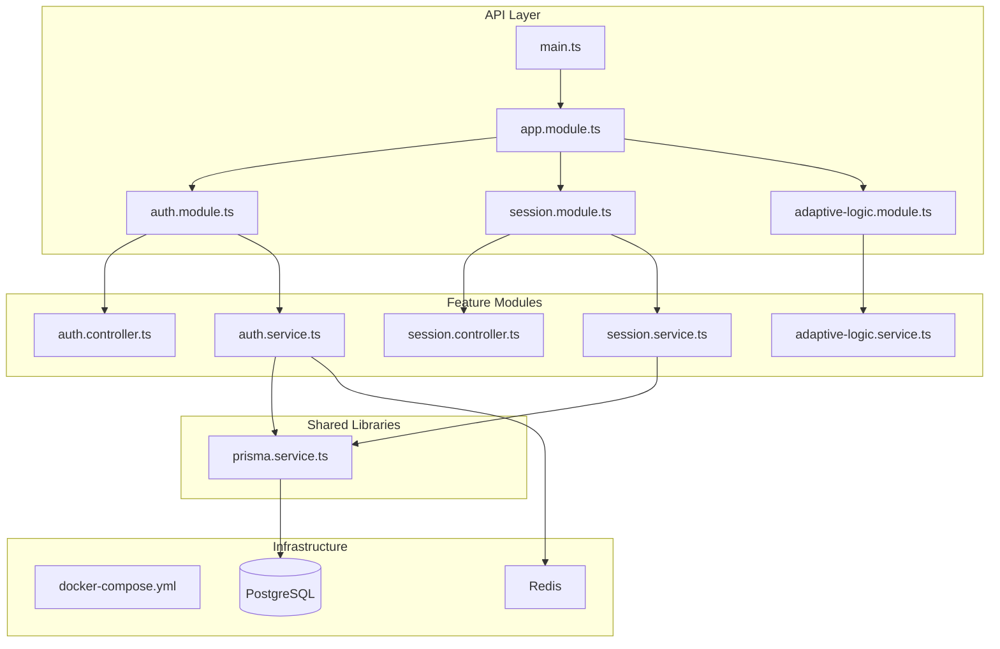
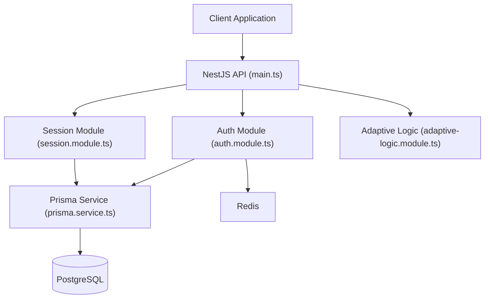
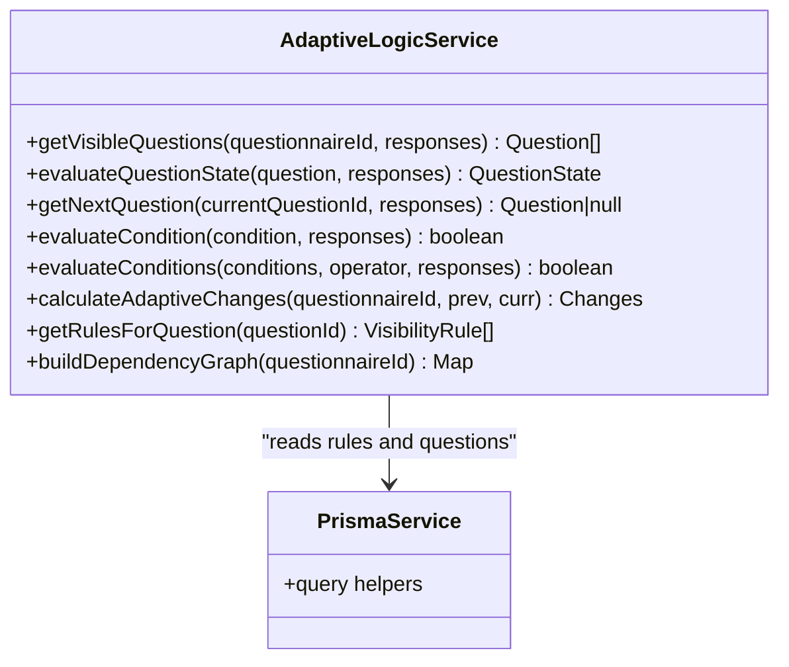
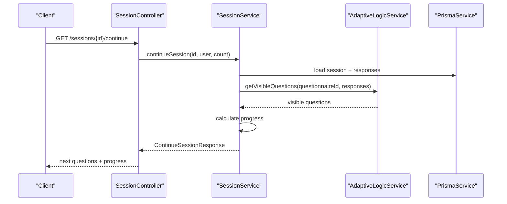
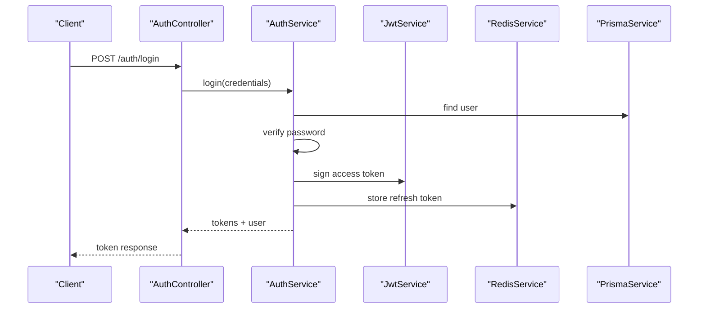
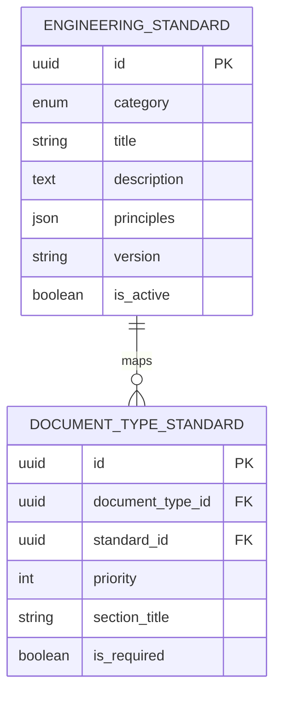
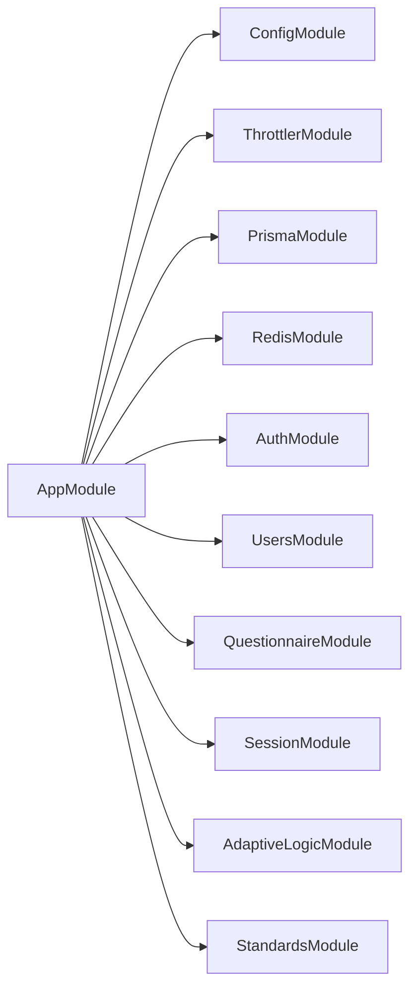

# Project Overview

<cite>
**Referenced Files in This Document**
- [main.ts](file://apps/api/src/main.ts)
- [app.module.ts](file://apps/api/src/app.module.ts)
- [package.json](file://package.json)
- [docker-compose.yml](file://docker-compose.yml)
- [schema.prisma](file://prisma/schema.prisma)
- [adaptive-logic.module.ts](file://apps/api/src/modules/adaptive-logic/adaptive-logic.module.ts)
- [adaptive-logic.service.ts](file://apps/api/src/modules/adaptive-logic/adaptive-logic.service.ts)
- [session.module.ts](file://apps/api/src/modules/session/session.module.ts)
- [session.service.ts](file://apps/api/src/modules/session/session.service.ts)
- [session.controller.ts](file://apps/api/src/modules/session/session.controller.ts)
- [auth.module.ts](file://apps/api/src/modules/auth/auth.module.ts)
- [auth.controller.ts](file://apps/api/src/modules/auth/auth.controller.ts)
- [auth.service.ts](file://apps/api/src/modules/auth/auth.service.ts)
- [prisma.service.ts](file://libs/database/src/prisma.service.ts)
</cite>

## Table of Contents
1. [Introduction](#introduction)
2. [Project Structure](#project-structure)
3. [Core Components](#core-components)
4. [Architecture Overview](#architecture-overview)
5. [Detailed Component Analysis](#detailed-component-analysis)
6. [Dependency Analysis](#dependency-analysis)
7. [Performance Considerations](#performance-considerations)
8. [Troubleshooting Guide](#troubleshooting-guide)
9. [Conclusion](#conclusion)

## Introduction
The Quiz-to-build project is an Adaptive Questionnaire System designed to deliver intelligent, dynamic assessment experiences. It enables personalized, branching questionnaires that adapt in real time based on user responses, ensuring assessments are efficient, relevant, and outcome-focused. Built with modern engineering standards, the system emphasizes scalability, maintainability, and robust security, while providing a seamless developer and end-user experience.

Key value drivers:
- Intelligent assessment delivery through adaptive logic
- Personalized user journeys with dynamic question flows
- Strong operational controls via session lifecycle management
- Enterprise-grade security with authentication, authorization, and auditability
- Cloud-ready infrastructure for scalable deployments

## Project Structure
The system follows a modular NestJS architecture with clear separation of concerns across features (authentication, questionnaires, sessions, adaptive logic, standards) and shared libraries (database and Redis). The API module orchestrates configuration, rate limiting, and feature modules, while Docker Compose provisions local PostgreSQL and Redis environments.

**Diagram sources**
- [main.ts](file://apps/api/src/main.ts#L11-L86)
- [app.module.ts](file://apps/api/src/app.module.ts#L16-L66)
- [auth.module.ts](file://apps/api/src/modules/auth/auth.module.ts#L11-L29)
- [session.module.ts](file://apps/api/src/modules/session/session.module.ts#L7-L16)
- [adaptive-logic.module.ts](file://apps/api/src/modules/adaptive-logic/adaptive-logic.module.ts#L6-L11)
- [auth.controller.ts](file://apps/api/src/modules/auth/auth.controller.ts#L22-L74)
- [session.controller.ts](file://apps/api/src/modules/session/session.controller.ts#L29-L153)
- [session.service.ts](file://apps/api/src/modules/session/session.service.ts#L87-L684)
- [auth.service.ts](file://apps/api/src/modules/auth/auth.service.ts#L34-L278)
- [adaptive-logic.service.ts](file://apps/api/src/modules/adaptive-logic/adaptive-logic.service.ts#L19-L307)
- [prisma.service.ts](file://libs/database/src/prisma.service.ts#L4-L61)
- [docker-compose.yml](file://docker-compose.yml#L3-L77)

**Section sources**
- [main.ts](file://apps/api/src/main.ts#L11-L86)
- [app.module.ts](file://apps/api/src/app.module.ts#L16-L66)
- [docker-compose.yml](file://docker-compose.yml#L3-L77)

## Core Components
- Adaptive Question Flow: Evaluates visibility and branching rules to present only relevant questions, dynamically adjusting as users respond.
- Session Management: Tracks user progress, maintains current position, enforces completion rules, and calculates time estimates.
- Authentication & Authorization: Implements secure login, refresh tokens, logout, and user validation with role-aware guards.
- Engineering Standards: Provides curated standards aligned with modern architecture, testing, security, and operational excellence.

**Section sources**
- [adaptive-logic.service.ts](file://apps/api/src/modules/adaptive-logic/adaptive-logic.service.ts#L28-L66)
- [session.service.ts](file://apps/api/src/modules/session/session.service.ts#L96-L136)
- [auth.service.ts](file://apps/api/src/modules/auth/auth.service.ts#L85-L126)
- [schema.prisma](file://prisma/schema.prisma#L68-L76)

## Architecture Overview
The system integrates NestJS with Prisma for data access and Redis for caching and token persistence. The API exposes Swagger documentation in development, applies global pipes and interceptors, and enforces rate limiting and security middleware.

**Diagram sources**
- [main.ts](file://apps/api/src/main.ts#L11-L86)
- [auth.module.ts](file://apps/api/src/modules/auth/auth.module.ts#L11-L29)
- [session.module.ts](file://apps/api/src/modules/session/session.module.ts#L7-L16)
- [adaptive-logic.module.ts](file://apps/api/src/modules/adaptive-logic/adaptive-logic.module.ts#L6-L11)
- [prisma.service.ts](file://libs/database/src/prisma.service.ts#L4-L61)
- [docker-compose.yml](file://docker-compose.yml#L4-L41)

**Section sources**
- [main.ts](file://apps/api/src/main.ts#L20-L78)
- [app.module.ts](file://apps/api/src/app.module.ts#L16-L66)

## Detailed Component Analysis

### Adaptive Question Flow
The adaptive engine evaluates visibility rules and branching conditions to compute which questions are shown and in what order. It supports requirement toggling, prioritized rule evaluation, and dependency graph construction for complex branching scenarios.

**Diagram sources**
- [adaptive-logic.service.ts](file://apps/api/src/modules/adaptive-logic/adaptive-logic.service.ts#L19-L307)
- [prisma.service.ts](file://libs/database/src/prisma.service.ts#L4-L61)

**Section sources**
- [adaptive-logic.service.ts](file://apps/api/src/modules/adaptive-logic/adaptive-logic.service.ts#L28-L195)

### Session Management
Session orchestration coordinates questionnaire progression, response submission, and completion checks. It integrates with adaptive logic to adjust visibility and branching, tracks progress, and ensures compliance with required questions.

**Diagram sources**
- [session.controller.ts](file://apps/api/src/modules/session/session.controller.ts#L81-L105)
- [session.service.ts](file://apps/api/src/modules/session/session.service.ts#L388-L546)
- [adaptive-logic.service.ts](file://apps/api/src/modules/adaptive-logic/adaptive-logic.service.ts#L31-L66)
- [prisma.service.ts](file://libs/database/src/prisma.service.ts#L4-L61)

**Section sources**
- [session.controller.ts](file://apps/api/src/modules/session/session.controller.ts#L81-L105)
- [session.service.ts](file://apps/api/src/modules/session/session.service.ts#L388-L546)

### Authentication & Authorization
Authentication handles registration, login, refresh, and logout with JWT access tokens and Redis-backed refresh tokens. Guards enforce access control and role-based permissions.

**Diagram sources**
- [auth.controller.ts](file://apps/api/src/modules/auth/auth.controller.ts#L35-L53)
- [auth.service.ts](file://apps/api/src/modules/auth/auth.service.ts#L85-L126)
- [auth.module.ts](file://apps/api/src/modules/auth/auth.module.ts#L11-L29)
- [prisma.service.ts](file://libs/database/src/prisma.service.ts#L4-L61)

**Section sources**
- [auth.controller.ts](file://apps/api/src/modules/auth/auth.controller.ts#L35-L53)
- [auth.service.ts](file://apps/api/src/modules/auth/auth.service.ts#L85-L126)

### Engineering Standards
Standards are modeled as categories and mapped to document types, enabling assessments to align with organizational or industry best practices. This supports governance and compliance workflows.

**Diagram sources**
- [schema.prisma](file://prisma/schema.prisma#L412-L446)

**Section sources**
- [schema.prisma](file://prisma/schema.prisma#L412-L446)

## Dependency Analysis
The API module aggregates configuration, rate limiting, database, cache, and feature modules. Feature modules depend on shared libraries and each other to implement cohesive workflows.

**Diagram sources**
- [app.module.ts](file://apps/api/src/app.module.ts#L16-L66)

**Section sources**
- [app.module.ts](file://apps/api/src/app.module.ts#L16-L66)

## Performance Considerations
- Database efficiency: Use Prisma’s query batching and indexing strategies; monitor slow queries in development.
- Caching: Leverage Redis for refresh tokens and session state to reduce database load.
- Adaptive evaluation: Keep rule sets concise and ordered by priority to minimize evaluation overhead.
- API throughput: Configure rate limits appropriately and avoid unnecessary DTO transformations.

[No sources needed since this section provides general guidance]

## Troubleshooting Guide
- Database connectivity: Confirm Prisma connects and logs slow queries in development mode.
- Redis availability: Ensure refresh tokens can be stored and retrieved during auth flows.
- Session ownership: Validate user ID matches session owner to prevent unauthorized access.
- Adaptive visibility: Verify visibility rules are active and properly ordered by priority.

**Section sources**
- [prisma.service.ts](file://libs/database/src/prisma.service.ts#L20-L40)
- [auth.service.ts](file://apps/api/src/modules/auth/auth.service.ts#L128-L164)
- [session.service.ts](file://apps/api/src/modules/session/session.service.ts#L548-L565)
- [adaptive-logic.service.ts](file://apps/api/src/modules/adaptive-logic/adaptive-logic.service.ts#L87-L153)

## Conclusion
Quiz-to-build delivers a robust, adaptive assessment platform that balances intelligent personalization with strong operational and security foundations. Its modular architecture, clear data models, and cloud-ready infrastructure support scalable deployment and continuous evolution. By combining adaptive logic, session orchestration, and enterprise-grade auth, the system empowers organizations to create meaningful, efficient, and compliant assessment experiences.