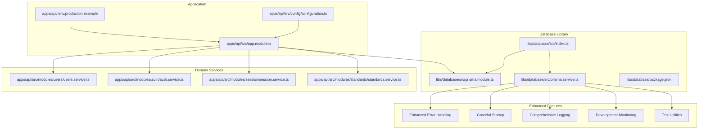
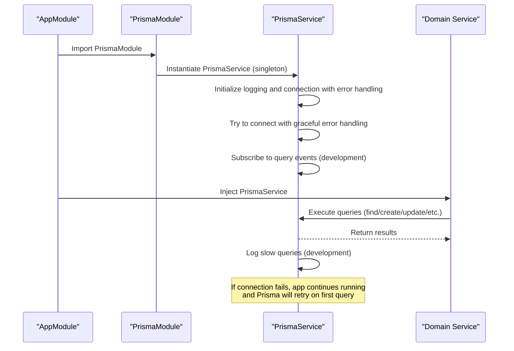
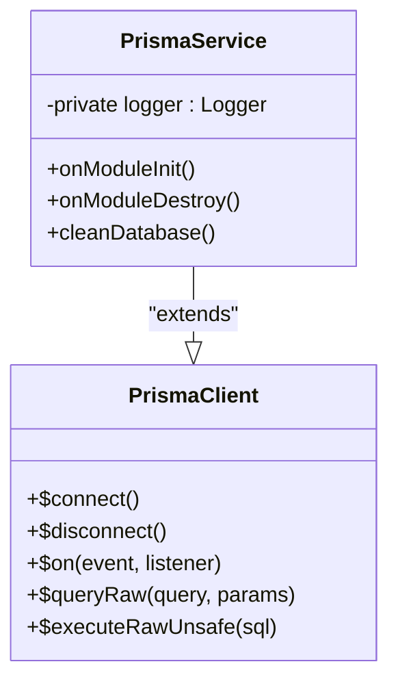
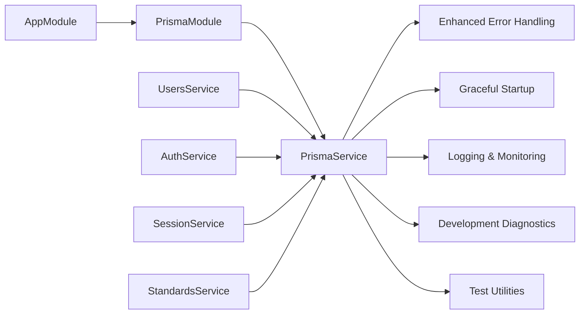
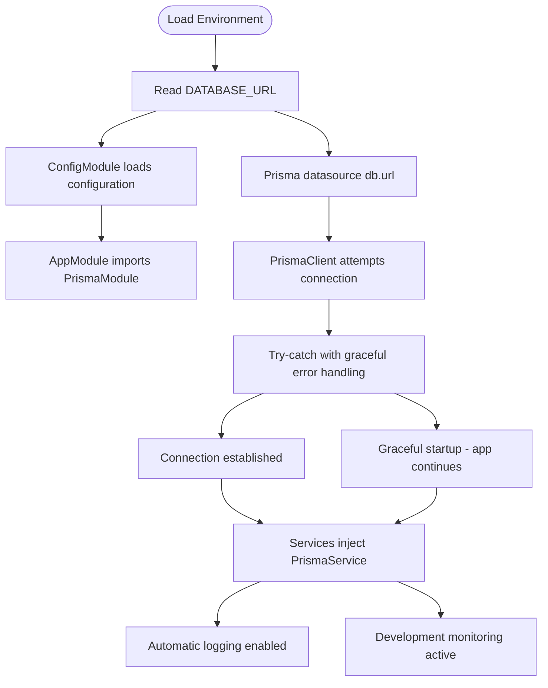
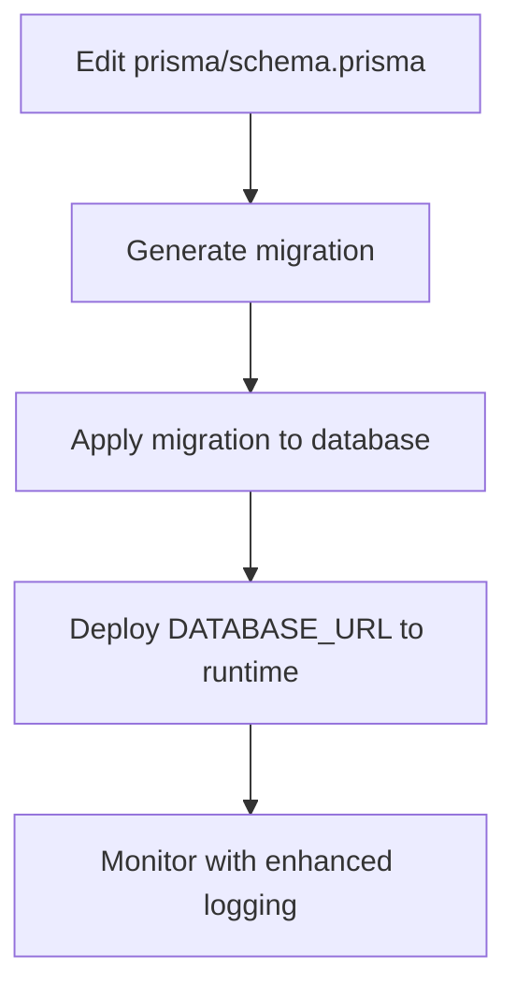
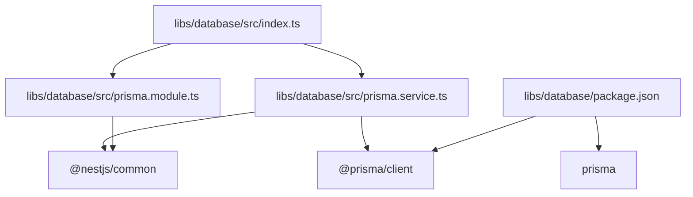

# Database Library

<cite>
**Referenced Files in This Document**
- [index.ts](file://libs/database/src/index.ts)
- [prisma.module.ts](file://libs/database/src/prisma.module.ts)
- [prisma.service.ts](file://libs/database/src/prisma.service.ts)
- [package.json](file://libs/database/package.json)
- [app.module.ts](file://apps/api/src/app.module.ts)
- [configuration.ts](file://apps/api/src/config/configuration.ts)
- [schema.prisma](file://prisma/schema.prisma)
- [seed.ts](file://prisma/seed.ts)
- [users.service.ts](file://apps/api/src/modules/users/users.service.ts)
- [auth.service.ts](file://apps/api/src/modules/auth/auth.service.ts)
- [session.service.ts](file://apps/api/src/modules/session/session.service.ts)
- [standards.service.ts](file://apps/api/src/modules/standards/standards.service.ts)
- [http-exception.filter.ts](file://apps/api/src/common/filters/http-exception.filter.ts)
- [.env.production.example](file://.env.production.example)
- [main.tf](file://infrastructure/terraform/modules/container-apps/main.tf)
- [variables.tf](file://infrastructure/terraform/modules/container-apps/variables.tf)
</cite>

## Update Summary
**Changes Made**
- Enhanced PrismaService with comprehensive error handling and graceful startup capabilities
- Added try-catch block around database connection with graceful startup when database is unavailable
- Implemented comprehensive error message extraction and logging for connection failures
- Maintained backward compatibility while improving resilience
- Enhanced logging capabilities for connection lifecycle events

## Table of Contents
1. [Introduction](#introduction)
2. [Project Structure](#project-structure)
3. [Core Components](#core-components)
4. [Architecture Overview](#architecture-overview)
5. [Detailed Component Analysis](#detailed-component-analysis)
6. [Dependency Analysis](#dependency-analysis)
7. [Performance Considerations](#performance-considerations)
8. [Troubleshooting Guide](#troubleshooting-guide)
9. [Conclusion](#conclusion)
10. [Appendices](#appendices)

## Introduction
This document describes the Database library that provides a comprehensive Prisma service abstraction and connection management for the Quiz-to-build system. The library has been enhanced with advanced error handling capabilities, graceful startup mechanisms, and robust connection lifecycle management. It explains how the PrismaModule integrates with NestJS dependency injection, how PrismaService wraps the Prisma client with lifecycle hooks, connection pooling, development-time query logging, and comprehensive error handling strategies for different deployment environments.

## Project Structure
The Database library is a focused NestJS library that exposes a globally available PrismaModule and PrismaService. The main application registers the module and injects PrismaService into domain services. The library now includes enhanced error handling, graceful startup capabilities, and comprehensive logging.

**Diagram sources**
- [index.ts](file://libs/database/src/index.ts#L1-L3)
- [prisma.module.ts](file://libs/database/src/prisma.module.ts#L1-L10)
- [prisma.service.ts](file://libs/database/src/prisma.service.ts#L1-L69)
- [package.json](file://libs/database/package.json#L1-L20)
- [app.module.ts](file://apps/api/src/app.module.ts#L1-L67)
- [configuration.ts](file://apps/api/src/config/configuration.ts#L1-L49)
- [users.service.ts](file://apps/api/src/modules/users/users.service.ts#L1-L199)
- [auth.service.ts](file://apps/api/src/modules/auth/auth.service.ts#L1-L278)
- [session.service.ts](file://apps/api/src/modules/session/session.service.ts#L1-L684)
- [standards.service.ts](file://apps/api/src/modules/standards/standards.service.ts#L1-L197)
- [.env.production.example](file://.env.production.example#L1-L23)

**Section sources**
- [index.ts](file://libs/database/src/index.ts#L1-L3)
- [prisma.module.ts](file://libs/database/src/prisma.module.ts#L1-L10)
- [prisma.service.ts](file://libs/database/src/prisma.service.ts#L1-L69)
- [package.json](file://libs/database/package.json#L1-L20)
- [app.module.ts](file://apps/api/src/app.module.ts#L1-L67)

## Core Components
- **PrismaModule**: A global NestJS module that provides and exports a singleton PrismaService instance. This ensures the Prisma client is available application-wide without manual wiring.
- **PrismaService**: An injectable service extending PrismaClient with enhanced capabilities including comprehensive error handling, graceful startup mechanisms, development-time query monitoring, connection lifecycle management, and test environment utilities.

**Updated** Enhanced with comprehensive error handling, graceful startup, and improved logging capabilities.

Key behaviors:
- **Connection lifecycle**: Connects on module initialization with graceful error handling and disconnects on shutdown with detailed logging
- **Graceful startup**: Allows application to start even if database connection fails initially
- **Enhanced error handling**: Comprehensive error message extraction and logging for connection failures
- **Development diagnostics**: Subscribes to query events to warn about slow queries (>100ms threshold)
- **Test isolation**: Provides a cleanDatabase method to truncate tables during tests with environment validation
- **Error handling**: Implements environment-aware validation and proper error messaging

**Section sources**
- [prisma.module.ts](file://libs/database/src/prisma.module.ts#L1-L10)
- [prisma.service.ts](file://libs/database/src/prisma.service.ts#L1-L69)

## Architecture Overview
The library abstracts direct Prisma client usage behind a single, globally available service with enhanced monitoring, error handling, and graceful startup capabilities. Application modules import PrismaModule once and inject PrismaService wherever database operations are needed.

**Diagram sources**
- [app.module.ts](file://apps/api/src/app.module.ts#L44-L45)
- [prisma.module.ts](file://libs/database/src/prisma.module.ts#L4-L8)
- [prisma.service.ts](file://libs/database/src/prisma.service.ts#L20-L47)
- [users.service.ts](file://apps/api/src/modules/users/users.service.ts#L38-L73)

## Detailed Component Analysis

### PrismaModule
- **Purpose**: Provide a globally available PrismaService singleton with enhanced capabilities
- **Behavior**: Uses NestJS @Global() decorator to make the provider available across the entire application graph. Exports PrismaService so consumers can inject it without importing the module directly.

Best practices:
- Keep this module imported once in the root application module
- Do not re-declare PrismaService elsewhere to avoid conflicts
- Leverage the enhanced error handling and monitoring capabilities automatically

**Section sources**
- [prisma.module.ts](file://libs/database/src/prisma.module.ts#L1-L10)

### PrismaService
- **Extends PrismaClient** and implements lifecycle hooks with comprehensive error handling and graceful startup
- **Constructor configuration**:
  - Enables logging for query, info, warn, and error events
  - Sets errorFormat to colorless for consistent error messages
- **Enhanced Lifecycle**:
  - onModuleInit: Attempts to connect to the database with comprehensive error handling and graceful startup
  - onModuleDestroy: Disconnects cleanly on shutdown with logging
- **Graceful Error Handling**:
  - Try-catch block around database connection prevents application startup failure
  - Comprehensive error message extraction with fallback to 'Unknown error'
  - Detailed logging for connection attempts and failures
- **Enhanced Monitoring**:
  - Development-time slow query detection (>100ms threshold)
  - Comprehensive logging for connection lifecycle events
- **Test Utilities**:
  - cleanDatabase: Truncates all non-migration tables in test environments only

**Updated** Significantly enhanced with graceful error handling, comprehensive logging, and graceful startup capabilities.

**Diagram sources**
- [prisma.service.ts](file://libs/database/src/prisma.service.ts#L5-L47)

**Section sources**
- [prisma.service.ts](file://libs/database/src/prisma.service.ts#L1-L69)

### Integration with Application Modules
- **AppModule imports PrismaModule globally** with enhanced error handling capabilities
- **Domain services inject PrismaService** to perform database operations with automatic monitoring and graceful error handling:
  - UsersService: Reads/writes users, counts related documents, paginates users
  - AuthService: Manages user registration/login, refresh tokens, and audit data
  - SessionService: Handles questionnaire sessions, responses, and progress tracking
  - StandardsService: Reads engineering standards and document-type mappings

**Updated** Enhanced integration with automatic error handling and monitoring.

**Diagram sources**
- [app.module.ts](file://apps/api/src/app.module.ts#L44-L45)
- [users.service.ts](file://apps/api/src/modules/users/users.service.ts#L38-L73)
- [auth.service.ts](file://apps/api/src/modules/auth/auth.service.ts#L41-L52)
- [session.service.ts](file://apps/api/src/modules/session/session.service.ts#L88-L94)
- [standards.service.ts](file://apps/api/src/modules/standards/standards.service.ts#L13-L35)

**Section sources**
- [app.module.ts](file://apps/api/src/app.module.ts#L44-L45)
- [users.service.ts](file://apps/api/src/modules/users/users.service.ts#L1-L199)
- [auth.service.ts](file://apps/api/src/modules/auth/auth.service.ts#L1-L278)
- [session.service.ts](file://apps/api/src/modules/session/session.service.ts#L1-L684)
- [standards.service.ts](file://apps/api/src/modules/standards/standards.service.ts#L1-L197)

### Practical Usage Examples
- **Injecting PrismaService** in a controller or service:
  - Use constructor injection with the PrismaService type
  - Access generated Prisma client methods (e.g., model.findUnique, model.create, model.update, model.count)
- **Enhanced usage patterns**:
  - Automatic logging for all database operations with comprehensive error handling
  - Graceful startup allows application to continue even if database is temporarily unavailable
  - Development-time slow query warnings
  - Environment-aware error handling
- **Example references**:
  - UsersService constructor injection and usage of user.findUnique and document.count
  - AuthService constructor injection and usage of user.create, user.update, refreshToken.create
  - SessionService constructor injection and extensive use of session, response, and questionnaire relations
  - StandardsService constructor injection and usage of engineeringStandard and documentType queries

**Updated** Enhanced with automatic error handling and graceful startup capabilities.

**Section sources**
- [users.service.ts](file://apps/api/src/modules/users/users.service.ts#L38-L127)
- [auth.service.ts](file://apps/api/src/modules/auth/auth.service.ts#L41-L232)
- [session.service.ts](file://apps/api/src/modules/session/session.service.ts#L88-L386)
- [standards.service.ts](file://apps/api/src/modules/standards/standards.service.ts#L13-L103)

### Configuration Options and Connection Settings
- **Database URL**:
  - Provided via DATABASE_URL environment variable
  - Loaded by Prisma schema datasource and exposed through application configuration
- **Environment variables**:
  - DATABASE_URL is set in production environment files and Terraform deployment variables
  - Application configuration centralizes environment-driven settings
- **Prisma schema**:
  - Defines PostgreSQL provider and datasource URL from environment
  - Contains comprehensive data models for the system
- **Enhanced error handling configuration**:
  - Graceful startup mechanism prevents application failure on initial connection
  - Comprehensive error message extraction and logging
  - Automatic logging for all database operations

**Updated** Enhanced with comprehensive error handling and graceful startup configuration.

**Diagram sources**
- [schema.prisma](file://prisma/schema.prisma#L8-L11)
- [configuration.ts](file://apps/api/src/config/configuration.ts#L7-L10)
- [app.module.ts](file://apps/api/src/app.module.ts#L19-L23)
- [prisma.service.ts](file://libs/database/src/prisma.service.ts#L20-L30)
- [main.tf](file://infrastructure/terraform/modules/container-apps/main.tf#L67-L69)
- [variables.tf](file://infrastructure/terraform/modules/container-apps/variables.tf#L77-L81)
- [.env.production.example](file://.env.production.example#L14-L15)

**Section sources**
- [schema.prisma](file://prisma/schema.prisma#L8-L11)
- [configuration.ts](file://apps/api/src/config/configuration.ts#L7-L10)
- [app.module.ts](file://apps/api/src/app.module.ts#L19-L23)
- [prisma.service.ts](file://libs/database/src/prisma.service.ts#L20-L30)
- [main.tf](file://infrastructure/terraform/modules/container-apps/main.tf#L67-L69)
- [variables.tf](file://infrastructure/terraform/modules/container-apps/variables.tf#L77-L81)
- [.env.production.example](file://.env.production.example#L14-L15)

### Error Handling Strategies
- **Enhanced error handling**:
  - Try-catch block around database connection prevents application startup failure
  - Comprehensive error message extraction with fallback to 'Unknown error' for robust error reporting
  - Graceful startup capability allows application to continue running even if database is unavailable initially
- **Development diagnostics**:
  - Slow query warnings are logged when a query exceeds the 100ms threshold in development
  - Comprehensive logging for all database operations
- **Guarded test utilities**:
  - cleanDatabase throws if called outside a test environment
  - Environment-aware validation prevents accidental data loss
- **Service-level error handling**:
  - Services throw appropriate exceptions (e.g., NotFoundException, ForbiddenException) when data is missing or access is denied
- **Connection lifecycle**:
  - Proper connect/disconnect ensures graceful shutdown and avoids hanging connections
  - Detailed logging for connection establishment and termination

**Updated** Enhanced with comprehensive error handling, graceful startup, and improved error message extraction.

**Section sources**
- [prisma.service.ts](file://libs/database/src/prisma.service.ts#L20-L30)
- [users.service.ts](file://apps/api/src/modules/users/users.service.ts#L58-L88)
- [auth.service.ts](file://apps/api/src/modules/auth/auth.service.ts#L90-L125)
- [session.service.ts](file://apps/api/src/modules/session/session.service.ts#L147-L153)

### Migrations and Schema Updates
- **Prisma schema** defines the canonical data model and datasource configuration
- **Seeding script** demonstrates initial data creation and can be used to bootstrap test or staging environments
- **Migration workflow**:
  - Modify prisma/schema.prisma
  - Run Prisma CLI commands to generate and apply migrations
  - Deploy updated DATABASE_URL to target environments
- **Enhanced development experience**:
  - Automatic logging for migration operations
  - Development-time monitoring for schema changes

**Updated** Enhanced with improved development monitoring capabilities.

**Diagram sources**
- [schema.prisma](file://prisma/schema.prisma#L1-L447)
- [seed.ts](file://prisma/seed.ts#L1-L495)

**Section sources**
- [schema.prisma](file://prisma/schema.prisma#L1-L447)
- [seed.ts](file://prisma/seed.ts#L1-L495)

## Dependency Analysis
- **Internal dependencies**:
  - index.ts re-exports PrismaModule and PrismaService for external consumption
  - package.json declares @prisma/client and prisma as dependencies for client generation and migrations
- **External dependencies**:
  - @nestjs/common for NestJS decorators, lifecycle hooks, Logger integration, and error handling
  - @prisma/client for database access
  - prisma for schema and migration tooling

**Updated** Enhanced with improved Logger integration from @nestjs/common.

**Diagram sources**
- [index.ts](file://libs/database/src/index.ts#L1-L3)
- [prisma.module.ts](file://libs/database/src/prisma.module.ts#L1-L2)
- [prisma.service.ts](file://libs/database/src/prisma.service.ts#L1-L2)
- [package.json](file://libs/database/package.json#L12-L18)

**Section sources**
- [index.ts](file://libs/database/src/index.ts#L1-L3)
- [prisma.module.ts](file://libs/database/src/prisma.module.ts#L1-L2)
- [prisma.service.ts](file://libs/database/src/prisma.service.ts#L1-L2)
- [package.json](file://libs/database/package.json#L12-L18)

## Performance Considerations
- **Connection pooling**:
  - PrismaClient manages internal connection pooling; ensure DATABASE_URL is configured for your environment
  - Enhanced logging helps monitor connection usage and lifecycle
- **Graceful startup performance**:
  - Application starts immediately even if database is unavailable, improving startup time
  - Prisma will retry connection on first query execution
- **Query performance**:
  - Use indexes defined in the schema (e.g., unique and composite indexes) to optimize lookups
  - Monitor slow queries in development using built-in query event logging with 100ms threshold
  - Automatic logging helps identify performance bottlenecks
- **Batch operations**:
  - Prefer batch operations (e.g., findMany with take/skip) to reduce round trips
  - Enhanced monitoring helps track batch operation performance
- **Transactions**:
  - Wrap write-heavy sequences in Prisma transactions to maintain consistency and reduce partial writes
  - Automatic logging tracks transaction performance
- **Caching**:
  - Combine database reads with caching (e.g., Redis) for frequently accessed data
  - Enhanced logging helps monitor cache effectiveness

**Updated** Enhanced with graceful startup performance considerations and improved error handling.

## Troubleshooting Guide
Common issues and resolutions:
- **Connection failures**:
  - Verify DATABASE_URL is present and correct in the environment
  - Confirm the database server is reachable and credentials are valid
  - Check enhanced logs for connection establishment details
  - Note: Application will start gracefully even if initial connection fails
- **Graceful startup behavior**:
  - Application continues running even if database connection fails initially
  - Prisma will automatically retry connection on first query execution
  - Check logs for connection attempt details and error messages
- **Slow queries in development**:
  - Review warnings logged for queries exceeding the 100ms threshold
  - Add missing indexes or refactor queries to use selective filters
  - Monitor with automatic query event logging
- **Test environment cleanup**:
  - Use cleanDatabase only in tests; otherwise it will throw an error with environment validation
  - Ensure NODE_ENV is set to 'test' for proper functionality
- **Service errors**:
  - Inspect service-level exceptions (e.g., NotFoundException, ForbiddenException) and ensure proper authorization and data existence checks
  - Enhanced logging provides detailed error context
- **Monitoring issues**:
  - Verify development mode for slow query detection
  - Check that query event logging is properly configured
- **Error message extraction**:
  - Enhanced error handling extracts comprehensive error messages with fallback to 'Unknown error'
  - Check logs for detailed error information during connection failures

**Updated** Enhanced with graceful startup troubleshooting and improved error handling guidance.

**Section sources**
- [prisma.service.ts](file://libs/database/src/prisma.service.ts#L20-L30)
- [users.service.ts](file://apps/api/src/modules/users/users.service.ts#L58-L88)
- [auth.service.ts](file://apps/api/src/modules/auth/auth.service.ts#L90-L125)
- [session.service.ts](file://apps/api/src/modules/session/session.service.ts#L147-L153)

## Conclusion
The Database library provides a comprehensive, centralized abstraction over Prisma for the Quiz-to-build application. The enhanced library exports a globally available PrismaService with advanced capabilities including comprehensive error handling, graceful startup mechanisms, development-time query monitoring, connection lifecycle management, and test environment utilities. By leveraging automatic logging, graceful error handling, slow query detection, and environment-aware validation, the library simplifies dependency injection, enforces consistent connection lifecycle management, and offers robust development-time diagnostics. The graceful startup capability ensures applications remain resilient even when databases are temporarily unavailable, while comprehensive error message extraction provides detailed debugging information. Application modules consume PrismaService through standard NestJS injection, enabling maintainable, observable, and performant database operations across the system.

**Updated** Enhanced conclusion reflecting the comprehensive improvements in error handling, graceful startup, and utilities.

## Appendices

### Appendix A: Environment Variables Reference
- **DATABASE_URL**: Database connection string for PostgreSQL
- **REDIS_HOST, REDIS_PORT, REDIS_PASSWORD**: Redis cache configuration
- **JWT_SECRET, JWT_REFRESH_SECRET, JWT_EXPIRES_IN, JWT_REFRESH_EXPIRES_IN**: Authentication settings
- **LOG_LEVEL**: Logging verbosity (enhanced logging support)
- **BCRYPT_ROUNDS**: Password hashing cost factor
- **NODE_ENV**: Environment setting (development enables slow query monitoring, graceful startup behavior)

**Updated** Enhanced with NODE_ENV for development monitoring and graceful startup behavior.

**Section sources**
- [configuration.ts](file://apps/api/src/config/configuration.ts#L7-L30)
- [.env.production.example](file://.env.production.example#L1-L23)
- [main.tf](file://infrastructure/terraform/modules/container-apps/main.tf#L67-L98)
- [variables.tf](file://infrastructure/terraform/modules/container-apps/variables.tf#L77-L110)

### Appendix B: Enhanced Features Reference
- **Enhanced Error Handling**: Comprehensive error message extraction with fallback to 'Unknown error' and detailed logging for connection failures
- **Graceful Startup**: Try-catch block around database connection prevents application startup failure and allows app to continue running
- **Graceful Error Propagation**: Application continues running even if initial database connection fails, with Prisma retrying on first query
- **Comprehensive Logging**: Automatic logging for all database operations with detailed lifecycle events and error contexts
- **Development Diagnostics**: Slow query detection (>100ms threshold) with performance warnings
- **Test Utilities**: cleanDatabase method for test environment table cleanup with environment validation
- **Connection Lifecycle Management**: Detailed logging for connection establishment and termination with enhanced error handling
- **Environment Awareness**: Guardrails preventing unsafe operations outside test environments

**Updated** New appendix documenting enhanced error handling, graceful startup, and improved error message extraction features.

**Section sources**
- [prisma.service.ts](file://libs/database/src/prisma.service.ts#L20-L30)
- [prisma.service.ts](file://libs/database/src/prisma.service.ts#L25-L29)
- [configuration.ts](file://apps/api/src/config/configuration.ts#L3-L4)