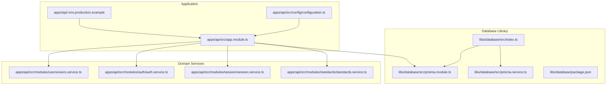
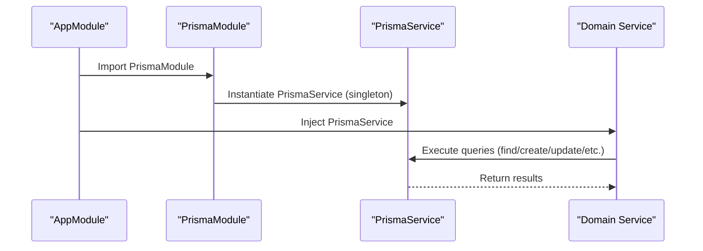
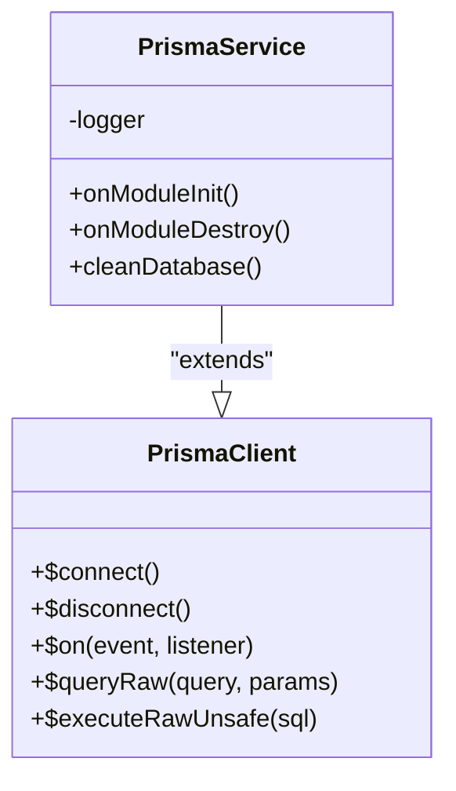
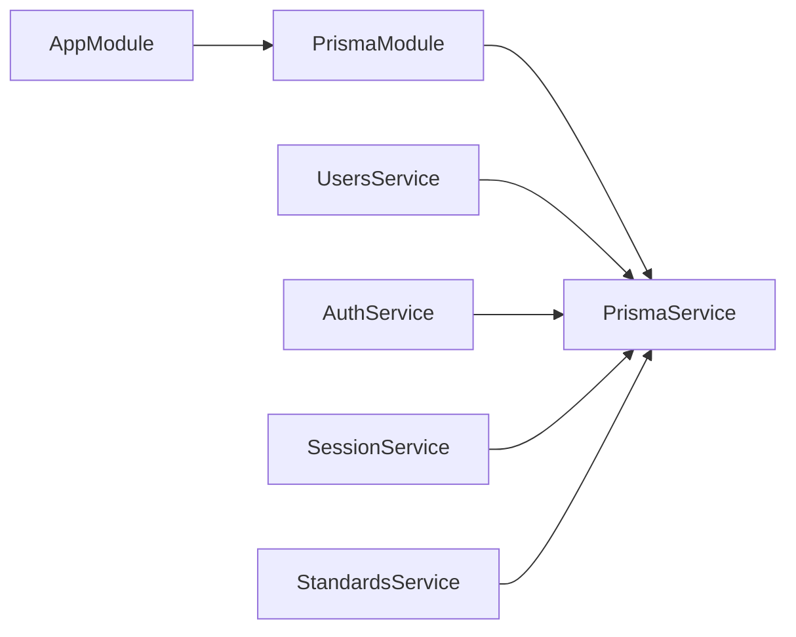
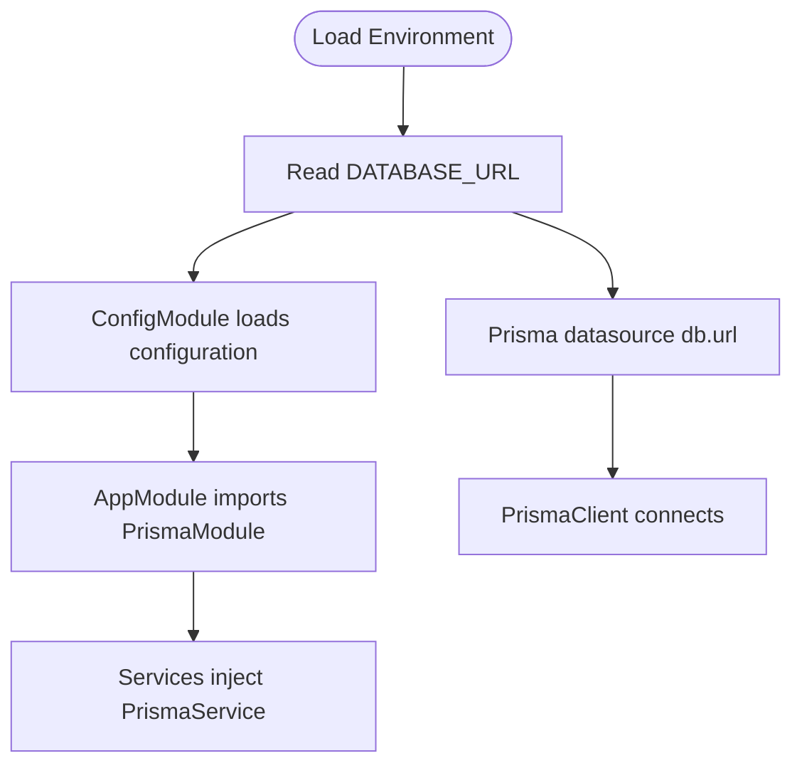
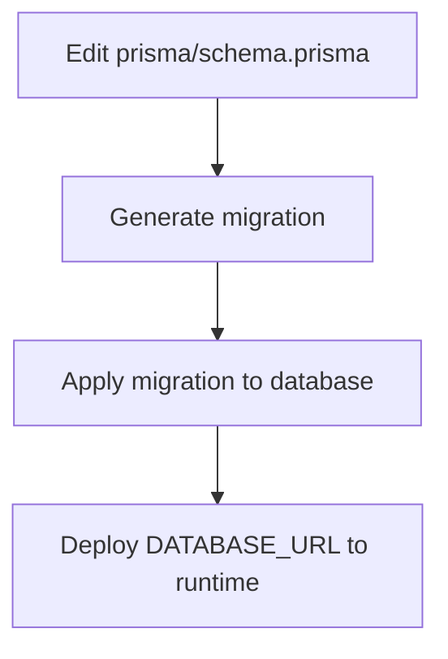
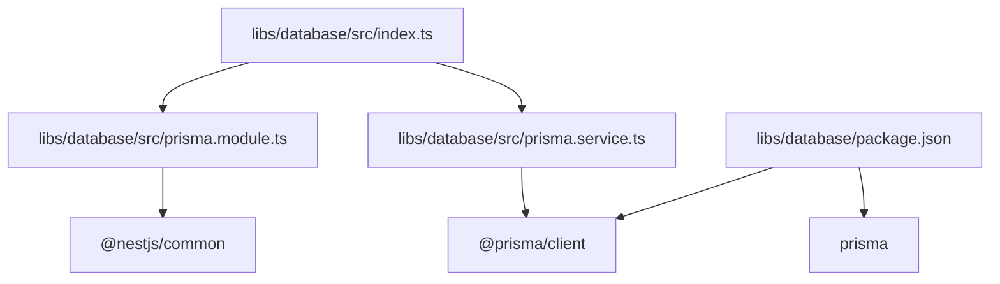

# Database Library

<cite>
**Referenced Files in This Document**
- [index.ts](file://libs/database/src/index.ts)
- [prisma.module.ts](file://libs/database/src/prisma.module.ts)
- [prisma.service.ts](file://libs/database/src/prisma.service.ts)
- [package.json](file://libs/database/package.json)
- [app.module.ts](file://apps/api/src/app.module.ts)
- [configuration.ts](file://apps/api/src/config/configuration.ts)
- [schema.prisma](file://prisma/schema.prisma)
- [seed.ts](file://prisma/seed.ts)
- [users.service.ts](file://apps/api/src/modules/users/users.service.ts)
- [auth.service.ts](file://apps/api/src/modules/auth/auth.service.ts)
- [session.service.ts](file://apps/api/src/modules/session/session.service.ts)
- [standards.service.ts](file://apps/api/src/modules/standards/standards.service.ts)
- [.env.production.example](file://.env.production.example)
- [main.tf](file://infrastructure/terraform/modules/container-apps/main.tf)
- [variables.tf](file://infrastructure/terraform/modules/container-apps/variables.tf)
</cite>

## Table of Contents
1. [Introduction](#introduction)
2. [Project Structure](#project-structure)
3. [Core Components](#core-components)
4. [Architecture Overview](#architecture-overview)
5. [Detailed Component Analysis](#detailed-component-analysis)
6. [Dependency Analysis](#dependency-analysis)
7. [Performance Considerations](#performance-considerations)
8. [Troubleshooting Guide](#troubleshooting-guide)
9. [Conclusion](#conclusion)
10. [Appendices](#appendices)

## Introduction
This document describes the Database library that provides a Prisma service abstraction and connection management for the Quiz-to-build system. It explains how the PrismaModule integrates with NestJS dependency injection, how PrismaService wraps the Prisma client with lifecycle hooks, connection pooling, and development-time query logging. It also covers how the library is consumed across application modules, configuration options, error handling strategies, and operational guidance for migrations and schema updates.

## Project Structure
The Database library is a small, focused NestJS library that exposes a globally available PrismaModule and PrismaService. The main application registers the module and injects PrismaService into domain services.

**Diagram sources**
- [index.ts](file://libs/database/src/index.ts#L1-L3)
- [prisma.module.ts](file://libs/database/src/prisma.module.ts#L1-L10)
- [prisma.service.ts](file://libs/database/src/prisma.service.ts#L1-L62)
- [package.json](file://libs/database/package.json#L1-L20)
- [app.module.ts](file://apps/api/src/app.module.ts#L1-L67)
- [configuration.ts](file://apps/api/src/config/configuration.ts#L1-L49)
- [users.service.ts](file://apps/api/src/modules/users/users.service.ts#L1-L200)
- [auth.service.ts](file://apps/api/src/modules/auth/auth.service.ts#L1-L278)
- [session.service.ts](file://apps/api/src/modules/session/session.service.ts#L1-L684)
- [standards.service.ts](file://apps/api/src/modules/standards/standards.service.ts#L1-L197)
- [.env.production.example](file://.env.production.example#L1-L23)

**Section sources**
- [index.ts](file://libs/database/src/index.ts#L1-L3)
- [prisma.module.ts](file://libs/database/src/prisma.module.ts#L1-L10)
- [prisma.service.ts](file://libs/database/src/prisma.service.ts#L1-L62)
- [package.json](file://libs/database/package.json#L1-L20)
- [app.module.ts](file://apps/api/src/app.module.ts#L1-L67)

## Core Components
- PrismaModule: A global NestJS module that provides and exports a singleton PrismaService instance. This ensures the Prisma client is available application-wide without manual wiring.
- PrismaService: An injectable service extending PrismaClient. It manages connection lifecycle via OnModuleInit and OnModuleDestroy hooks, logs slow queries in development, and provides a cleanDatabase helper for tests.

Key behaviors:
- Connection lifecycle: Connects on module initialization and disconnects on shutdown.
- Development diagnostics: Subscribes to query events to warn about slow queries (>100ms).
- Test isolation: Provides a cleanDatabase method to truncate tables during tests (guarded by environment checks).

**Section sources**
- [prisma.module.ts](file://libs/database/src/prisma.module.ts#L1-L10)
- [prisma.service.ts](file://libs/database/src/prisma.service.ts#L1-L62)

## Architecture Overview
The library abstracts direct Prisma client usage behind a single, globally available service. Application modules import PrismaModule once and inject PrismaService wherever database operations are needed.

**Diagram sources**
- [app.module.ts](file://apps/api/src/app.module.ts#L44-L45)
- [prisma.module.ts](file://libs/database/src/prisma.module.ts#L4-L8)
- [prisma.service.ts](file://libs/database/src/prisma.service.ts#L20-L40)
- [users.service.ts](file://apps/api/src/modules/users/users.service.ts#L39-L73)

## Detailed Component Analysis

### PrismaModule
- Purpose: Provide a globally available PrismaService singleton.
- Behavior: Uses NestJS @Global() decorator to make the provider available across the entire application graph. Exports PrismaService so consumers can inject it without importing the module directly.

Best practices:
- Keep this module imported once in the root application module.
- Do not re-declare PrismaService elsewhere to avoid conflicts.

**Section sources**
- [prisma.module.ts](file://libs/database/src/prisma.module.ts#L1-L10)

### PrismaService
- Extends PrismaClient and implements lifecycle hooks.
- Constructor configuration:
  - Enables logging for query, info, warn, and error events.
  - Sets errorFormat to colorless for consistent error messages.
- Lifecycle:
  - onModuleInit: Connects to the database and subscribes to query events in development.
  - onModuleDestroy: Disconnects cleanly on shutdown.
- Utility:
  - cleanDatabase: Truncates all non-migration tables in test environments only.

**Diagram sources**
- [prisma.service.ts](file://libs/database/src/prisma.service.ts#L5-L40)

**Section sources**
- [prisma.service.ts](file://libs/database/src/prisma.service.ts#L1-L62)

### Integration with Application Modules
- AppModule imports PrismaModule globally.
- Domain services inject PrismaService to perform database operations:
  - UsersService: Reads/writes users, counts related documents, paginates users.
  - AuthService: Manages user registration/login, refresh tokens, and audit data.
  - SessionService: Handles questionnaire sessions, responses, and progress tracking.
  - StandardsService: Reads engineering standards and document-type mappings.

**Diagram sources**
- [app.module.ts](file://apps/api/src/app.module.ts#L44-L45)
- [users.service.ts](file://apps/api/src/modules/users/users.service.ts#L39-L73)
- [auth.service.ts](file://apps/api/src/modules/auth/auth.service.ts#L42-L52)
- [session.service.ts](file://apps/api/src/modules/session/session.service.ts#L89-L94)
- [standards.service.ts](file://apps/api/src/modules/standards/standards.service.ts#L14-L35)

**Section sources**
- [app.module.ts](file://apps/api/src/app.module.ts#L44-L45)
- [users.service.ts](file://apps/api/src/modules/users/users.service.ts#L1-L200)
- [auth.service.ts](file://apps/api/src/modules/auth/auth.service.ts#L1-L278)
- [session.service.ts](file://apps/api/src/modules/session/session.service.ts#L1-L684)
- [standards.service.ts](file://apps/api/src/modules/standards/standards.service.ts#L1-L197)

### Practical Usage Examples
- Injecting PrismaService in a controller or service:
  - Use constructor injection with the PrismaService type.
  - Access generated Prisma client methods (e.g., model.findUnique, model.create, model.update, model.count).
- Example references:
  - UsersService constructor injection and usage of user.findUnique and document.count.
  - AuthService constructor injection and usage of user.create, user.update, refreshToken.create.
  - SessionService constructor injection and extensive use of session, response, and questionnaire relations.
  - StandardsService constructor injection and usage of engineeringStandard and documentType queries.

Note: For concrete code paths, see the service files listed above.

**Section sources**
- [users.service.ts](file://apps/api/src/modules/users/users.service.ts#L39-L127)
- [auth.service.ts](file://apps/api/src/modules/auth/auth.service.ts#L42-L232)
- [session.service.ts](file://apps/api/src/modules/session/session.service.ts#L89-L386)
- [standards.service.ts](file://apps/api/src/modules/standards/standards.service.ts#L14-L103)

### Configuration Options and Connection Settings
- Database URL:
  - Provided via DATABASE_URL environment variable.
  - Loaded by Prisma schema datasource and exposed through application configuration.
- Environment variables:
  - DATABASE_URL is set in production environment files and Terraform deployment variables.
  - Application configuration centralizes environment-driven settings.
- Prisma schema:
  - Defines PostgreSQL provider and datasource URL from environment.
  - Contains comprehensive data models for the system.

**Diagram sources**
- [schema.prisma](file://prisma/schema.prisma#L8-L11)
- [configuration.ts](file://apps/api/src/config/configuration.ts#L7-L10)
- [app.module.ts](file://apps/api/src/app.module.ts#L19-L23)
- [main.tf](file://infrastructure/terraform/modules/container-apps/main.tf#L67-L69)
- [variables.tf](file://infrastructure/terraform/modules/container-apps/variables.tf#L77-L81)
- [.env.production.example](file://.env.production.example#L14-L15)

**Section sources**
- [schema.prisma](file://prisma/schema.prisma#L8-L11)
- [configuration.ts](file://apps/api/src/config/configuration.ts#L7-L10)
- [app.module.ts](file://apps/api/src/app.module.ts#L19-L23)
- [main.tf](file://infrastructure/terraform/modules/container-apps/main.tf#L67-L69)
- [variables.tf](file://infrastructure/terraform/modules/container-apps/variables.tf#L77-L81)
- [.env.production.example](file://.env.production.example#L14-L15)

### Error Handling Strategies
- Development diagnostics:
  - Slow query warnings are logged when a query exceeds a threshold in development.
- Guarded test utilities:
  - cleanDatabase throws if called outside a test environment.
- Service-level error handling:
  - Services throw appropriate exceptions (e.g., NotFoundException, ForbiddenException) when data is missing or access is denied.
- Connection lifecycle:
  - Proper connect/disconnect ensures graceful shutdown and avoids hanging connections.

**Section sources**
- [prisma.service.ts](file://libs/database/src/prisma.service.ts#L25-L40)
- [users.service.ts](file://apps/api/src/modules/users/users.service.ts#L58-L88)
- [auth.service.ts](file://apps/api/src/modules/auth/auth.service.ts#L90-L125)
- [session.service.ts](file://apps/api/src/modules/session/session.service.ts#L147-L153)

### Migrations and Schema Updates
- Prisma schema defines the canonical data model and datasource configuration.
- Seeding script demonstrates initial data creation and can be used to bootstrap test or staging environments.
- Migration workflow:
  - Modify prisma/schema.prisma.
  - Run Prisma CLI commands to generate and apply migrations.
  - Deploy updated DATABASE_URL to target environments.

**Diagram sources**
- [schema.prisma](file://prisma/schema.prisma#L1-L447)
- [seed.ts](file://prisma/seed.ts#L1-L495)

**Section sources**
- [schema.prisma](file://prisma/schema.prisma#L1-L447)
- [seed.ts](file://prisma/seed.ts#L1-L495)

## Dependency Analysis
- Internal dependencies:
  - index.ts re-exports PrismaModule and PrismaService for external consumption.
  - package.json declares @prisma/client and prisma as dependencies for client generation and migrations.
- External dependencies:
  - @nestjs/common for NestJS decorators and lifecycle hooks.
  - @prisma/client for database access.
  - prisma for schema and migration tooling.

**Diagram sources**
- [index.ts](file://libs/database/src/index.ts#L1-L3)
- [prisma.module.ts](file://libs/database/src/prisma.module.ts#L1-L2)
- [prisma.service.ts](file://libs/database/src/prisma.service.ts#L1-L2)
- [package.json](file://libs/database/package.json#L12-L18)

**Section sources**
- [index.ts](file://libs/database/src/index.ts#L1-L3)
- [prisma.module.ts](file://libs/database/src/prisma.module.ts#L1-L2)
- [prisma.service.ts](file://libs/database/src/prisma.service.ts#L1-L2)
- [package.json](file://libs/database/package.json#L12-L18)

## Performance Considerations
- Connection pooling:
  - PrismaClient manages internal connection pooling; ensure DATABASE_URL is configured for your environment.
- Query performance:
  - Use indexes defined in the schema (e.g., unique and composite indexes) to optimize lookups.
  - Monitor slow queries in development using built-in query event logging.
- Batch operations:
  - Prefer batch operations (e.g., findMany with take/skip) to reduce round trips.
- Transactions:
  - Wrap write-heavy sequences in Prisma transactions to maintain consistency and reduce partial writes.
- Caching:
  - Combine database reads with caching (e.g., Redis) for frequently accessed data.

[No sources needed since this section provides general guidance]

## Troubleshooting Guide
Common issues and resolutions:
- Connection failures:
  - Verify DATABASE_URL is present and correct in the environment.
  - Confirm the database server is reachable and credentials are valid.
- Slow queries in development:
  - Review warnings logged for queries exceeding the threshold.
  - Add missing indexes or refactor queries to use selective filters.
- Test environment cleanup:
  - Use cleanDatabase only in tests; otherwise it will throw an error.
- Service errors:
  - Inspect service-level exceptions (e.g., NotFoundException, ForbiddenException) and ensure proper authorization and data existence checks.

**Section sources**
- [prisma.service.ts](file://libs/database/src/prisma.service.ts#L25-L40)
- [users.service.ts](file://apps/api/src/modules/users/users.service.ts#L58-L88)
- [auth.service.ts](file://apps/api/src/modules/auth/auth.service.ts#L90-L125)
- [session.service.ts](file://apps/api/src/modules/session/session.service.ts#L147-L153)

## Conclusion
The Database library provides a clean, centralized abstraction over Prisma for the Quiz-to-build application. By exporting a globally available PrismaService, it simplifies dependency injection, enforces consistent connection lifecycle management, and offers helpful development-time diagnostics. Application modules consume PrismaService through standard NestJS injection, enabling robust, maintainable database operations across the system.

[No sources needed since this section summarizes without analyzing specific files]

## Appendices

### Appendix A: Environment Variables Reference
- DATABASE_URL: Database connection string for PostgreSQL.
- REDIS_HOST, REDIS_PORT, REDIS_PASSWORD: Redis cache configuration.
- JWT_SECRET, JWT_REFRESH_SECRET, JWT_EXPIRES_IN, JWT_REFRESH_EXPIRES_IN: Authentication settings.
- LOG_LEVEL: Logging verbosity.
- BCRYPT_ROUNDS: Password hashing cost factor.

**Section sources**
- [configuration.ts](file://apps/api/src/config/configuration.ts#L7-L30)
- [.env.production.example](file://.env.production.example#L1-L23)
- [main.tf](file://infrastructure/terraform/modules/container-apps/main.tf#L67-L98)
- [variables.tf](file://infrastructure/terraform/modules/container-apps/variables.tf#L77-L110)