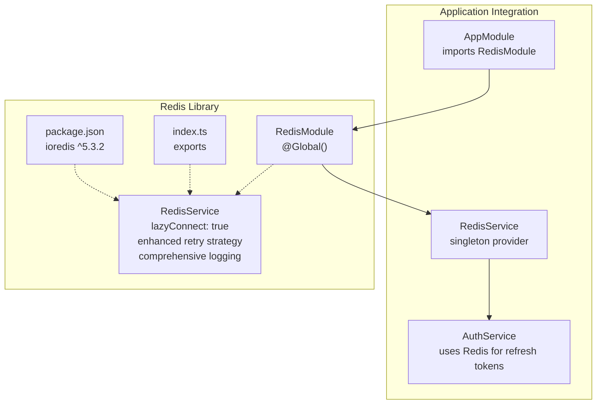
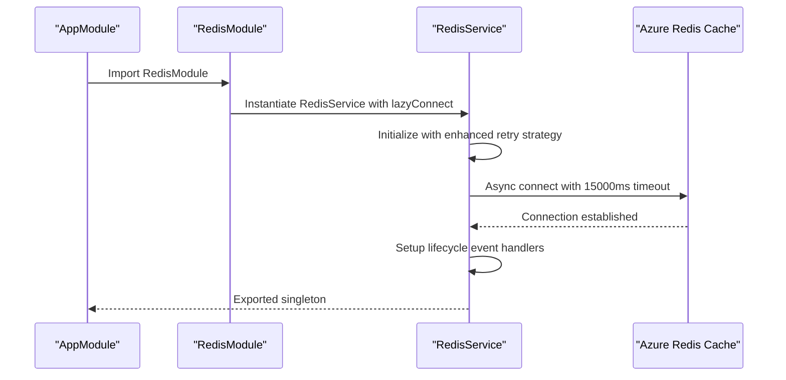
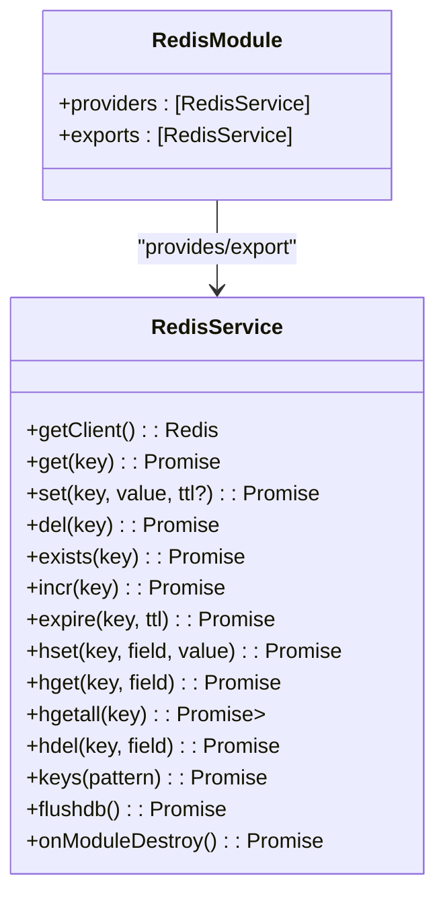
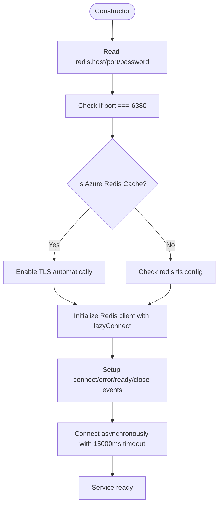
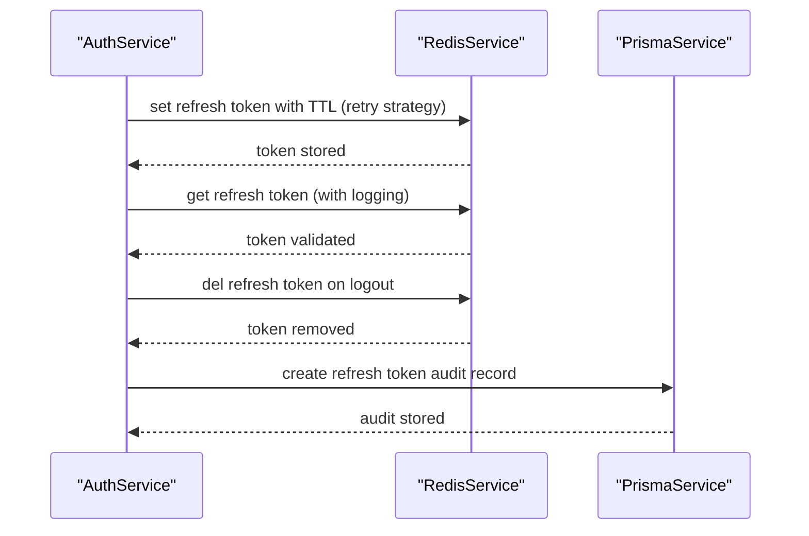
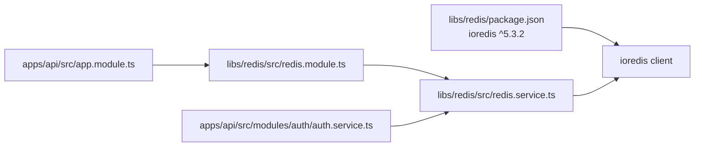

# Redis Library

<cite>
**Referenced Files in This Document**
- [redis.module.ts](file://libs/redis/src/redis.module.ts)
- [redis.service.ts](file://libs/redis/src/redis.service.ts)
- [index.ts](file://libs/redis/src/index.ts)
- [package.json](file://libs/redis/package.json)
- [app.module.ts](file://apps/api/src/app.module.ts)
- [configuration.ts](file://apps/api/src/config/configuration.ts)
- [auth.service.ts](file://apps/api/src/modules/auth/auth.service.ts)
- [auth.service.spec.ts](file://apps/api/src/modules/auth/auth.service.spec.ts)
</cite>

## Update Summary
**Changes Made**
- Updated to reflect significantly enhanced Redis service connection management with lazyConnect: true
- Added documentation for improved retry strategy (max 10 attempts with exponential backoff up to 3000ms)
- Enhanced logging for comprehensive retry attempts and connection lifecycle events
- Updated connection timeout configurations (15000ms connect timeout)
- Added documentation for ready checks and connection lifecycle event handlers
- Revised troubleshooting guide with enhanced error handling and monitoring capabilities

## Table of Contents
1. [Introduction](#introduction)
2. [Project Structure](#project-structure)
3. [Core Components](#core-components)
4. [Architecture Overview](#architecture-overview)
5. [Detailed Component Analysis](#detailed-component-analysis)
6. [Dependency Analysis](#dependency-analysis)
7. [Performance Considerations](#performance-considerations)
8. [Troubleshooting Guide](#troubleshooting-guide)
9. [Conclusion](#conclusion)
10. [Appendices](#appendices)

## Introduction
The Redis library provides cache management and connection pooling for the Quiz-to-build system. It integrates Redis connection management into the NestJS dependency injection system and serves as a critical component for session state management and refresh token storage.

The library has been significantly enhanced with intelligent TLS detection logic that automatically enables secure connections for Azure Redis Cache instances on port 6380, plus comprehensive connection lifecycle management with lazyConnect, enhanced retry strategy, and detailed logging capabilities. These enhancements ensure reliable operation across different deployment environments while maintaining backward compatibility and providing robust monitoring capabilities.

## Project Structure
The Redis library maintains a clean separation of concerns with dedicated modules for service management and configuration:



**Diagram sources**
- [app.module.ts](file://apps/api/src/app.module.ts#L6-L48)
- [redis.module.ts](file://libs/redis/src/redis.module.ts#L1-L10)
- [redis.service.ts](file://libs/redis/src/redis.service.ts#L1-L127)
- [auth.service.ts](file://apps/api/src/modules/auth/auth.service.ts#L13-L46)

**Section sources**
- [app.module.ts](file://apps/api/src/app.module.ts#L1-L67)
- [redis.module.ts](file://libs/redis/src/redis.module.ts#L1-L10)
- [redis.service.ts](file://libs/redis/src/redis.service.ts#L1-L127)
- [index.ts](file://libs/redis/src/index.ts#L1-L3)
- [package.json](file://libs/redis/package.json#L1-L20)

## Core Components
The Redis library consists of two primary components that work together to provide robust caching capabilities with enhanced connection management:

- **RedisModule**: A global NestJS module that provides RedisService as a singleton instance
- **RedisService**: A wrapper around the Redis client that manages connection lifecycle with lazyConnect, comprehensive retry strategy, and detailed logging

**Key Enhancements**:
- **Lazy Connection Management**: lazyConnect: true prevents blocking application startup
- **Intelligent TLS Detection**: Automatically enables TLS for Azure Redis Cache on port 6380
- **Enhanced Retry Strategy**: Exponential backoff with maximum 10 attempts and 3000ms cap
- **Comprehensive Logging**: Detailed retry attempts, connection lifecycle events, and error monitoring
- **Improved Timeout Configurations**: 15000ms connection timeout with ready checks
- **Connection Lifecycle Events**: Handlers for 'connect', 'ready', 'error', and 'close'
- **Graceful Lifecycle Management**: Proper client initialization and shutdown

**Section sources**
- [redis.module.ts](file://libs/redis/src/redis.module.ts#L1-L10)
- [redis.service.ts](file://libs/redis/src/redis.service.ts#L1-L127)
- [index.ts](file://libs/redis/src/index.ts#L1-L3)
- [package.json](file://libs/redis/package.json#L1-L20)

## Architecture Overview
The Redis library integrates seamlessly with the application's dependency injection system and provides transparent caching capabilities for performance-critical operations with enhanced connection resilience.



**Diagram sources**
- [app.module.ts](file://apps/api/src/app.module.ts#L6-L48)
- [redis.module.ts](file://libs/redis/src/redis.module.ts#L1-L10)
- [redis.service.ts](file://libs/redis/src/redis.service.ts#L10-L59)

## Detailed Component Analysis

### RedisModule
The RedisModule serves as the foundation for Redis integration, providing a globally available RedisService instance through NestJS's dependency injection system with enhanced connection management.

- **Purpose**: Provides RedisService as a singleton across the entire application
- **Scope**: @Global() decorator ensures availability everywhere in the application
- **Exports**: Makes RedisService available for injection in any module



**Diagram sources**
- [redis.module.ts](file://libs/redis/src/redis.module.ts#L1-L10)
- [redis.service.ts](file://libs/redis/src/redis.service.ts#L67-L126)

**Section sources**
- [redis.module.ts](file://libs/redis/src/redis.module.ts#L1-L10)

### RedisService
The RedisService is the core component that manages Redis connections and provides caching operations. It has been significantly enhanced with lazy connection management, comprehensive retry strategy, and detailed logging capabilities.

#### Enhanced Connection Management
The service now uses lazyConnect to prevent blocking application startup and implements comprehensive connection lifecycle management:



**Diagram sources**
- [redis.service.ts](file://libs/redis/src/redis.service.ts#L10-L59)

#### Enhanced Retry Strategy
The service implements an improved retry strategy with comprehensive logging:

- **Retry Strategy**: Exponential backoff with maximum 10 attempts and 3000ms cap
- **Connection Timeout**: 15000ms connection timeout prevents hanging connections
- **Max Retries Per Request**: 3 retries per operation
- **Comprehensive Logging**: Detailed retry attempts with delay information
- **Graceful Shutdown**: Proper client termination on module destroy

#### Connection Lifecycle Event Handlers
The service provides comprehensive event handling for connection lifecycle management:

- **connect**: Logs successful connection establishment
- **ready**: Confirms client readiness for commands
- **error**: Captures and logs Redis errors with detailed messages
- **close**: Monitors connection closure events

#### Comprehensive Cache Operations
The service provides extensive caching capabilities:

- **String Operations**: get, set, del, exists, incr, expire
- **Hash Operations**: hset, hget, hgetall, hdel
- **Utility Operations**: keys, flushdb (test environment only)
- **Connection Management**: getClient(), onModuleDestroy()

**Section sources**
- [redis.service.ts](file://libs/redis/src/redis.service.ts#L1-L127)

### Integration with Application Modules
The Redis library integrates with the application through dependency injection, providing transparent access to caching capabilities with enhanced connection resilience.

#### AppModule Integration
AppModule imports RedisModule alongside other core modules, making RedisService available throughout the application.

#### AuthService Integration
The AuthService demonstrates practical Redis usage for refresh token management with enhanced error handling:

- **Token Storage**: Refresh tokens stored in Redis with TTL expiration
- **Token Verification**: Fast lookup for refresh token validation with retry strategy
- **Token Revocation**: Immediate removal on logout with error handling
- **Dual Storage Strategy**: Redis for fast access, database for audit trail



**Diagram sources**
- [app.module.ts](file://apps/api/src/app.module.ts#L6-L48)
- [auth.service.ts](file://apps/api/src/modules/auth/auth.service.ts#L128-L164)
- [redis.service.ts](file://libs/redis/src/redis.service.ts#L75-L84)

**Section sources**
- [app.module.ts](file://apps/api/src/app.module.ts#L1-L67)
- [auth.service.ts](file://apps/api/src/modules/auth/auth.service.ts#L1-L278)

### Practical Usage Examples
The Redis library enables efficient caching strategies for various application scenarios with enhanced error handling:

#### Refresh Token Management
```typescript
// Storing refresh tokens with TTL and retry strategy
await this.redisService.set(
  `refresh:${refreshToken}`,
  user.id,
  this.refreshTokenTtlSeconds,
);

// Verifying refresh tokens with comprehensive logging
const storedUserId = await this.redisService.get(`refresh:${refreshToken}`);

// Removing refresh tokens on logout
await this.redisService.del(`refresh:${refreshToken}`);
```

#### Session State Management
```typescript
// Storing user session data
await this.redisService.hset(`session:${sessionId}`, 'userData', JSON.stringify(userData));
await this.redisService.expire(`session:${sessionId}`, 3600); // 1 hour TTL

// Retrieving session data with error handling
const userData = await this.redisService.hget(`session:${sessionId}`, 'userData');
```

#### Cache Invalidation Strategies
```typescript
// Pattern-based key deletion
const sessionKeys = await this.redisService.keys('session:*');
for (const key of sessionKeys) {
  await this.redisService.del(key);
}

// Conditional cache updates with retry strategy
if (!(await this.redisService.exists(`cache:${key}`))) {
  // Generate and store cache
  await this.redisService.set(`cache:${key}`, value, ttl);
}
```

**Section sources**
- [auth.service.ts](file://apps/api/src/modules/auth/auth.service.ts#L128-L207)
- [redis.service.ts](file://libs/redis/src/redis.service.ts#L75-L126)

## Dependency Analysis
The Redis library maintains minimal external dependencies while providing comprehensive functionality with enhanced connection management:

- **Internal dependencies**:
  - RedisService depends on NestJS ConfigService and ioredis
  - RedisModule depends on RedisService for provider management
- **External dependencies**:
  - ioredis version 5.3.2 for Redis client functionality
- **Application integration**:
  - AppModule imports RedisModule for dependency injection
  - Multiple modules can inject RedisService for caching operations



**Diagram sources**
- [package.json](file://libs/redis/package.json#L12-L14)
- [redis.service.ts](file://libs/redis/src/redis.service.ts#L1-L3)
- [redis.module.ts](file://libs/redis/src/redis.module.ts#L1-L2)
- [app.module.ts](file://apps/api/src/app.module.ts#L6-L7)
- [auth.service.ts](file://apps/api/src/modules/auth/auth.service.ts#L13)

**Section sources**
- [package.json](file://libs/redis/package.json#L1-L20)
- [redis.service.ts](file://libs/redis/src/redis.service.ts#L1-L3)
- [redis.module.ts](file://libs/redis/src/redis.module.ts#L1-L10)
- [app.module.ts](file://apps/api/src/app.module.ts#L1-L67)
- [auth.service.ts](file://apps/api/src/modules/auth/auth.service.ts#L1-L278)

## Performance Considerations
The significantly enhanced Redis library provides several performance optimizations with improved connection resilience:

- **Lazy Connection Management**: lazyConnect: true prevents blocking application startup
- **Intelligent Connection Management**: Automatic TLS detection reduces connection failures for Azure deployments
- **Optimized Retry Strategy**: Exponential backoff with comprehensive logging prevents overwhelming Redis servers during recovery
- **Enhanced Timeout Configurations**: 15000ms connection timeout prevents hanging connections from blocking application startup
- **Connection Lifecycle Monitoring**: Event handlers provide real-time connection status monitoring
- **Memory Efficiency**: Proper TTL management prevents memory bloat
- **Scalability**: Connection pooling through ioredis handles concurrent operations efficiently

## Troubleshooting Guide

### Connection Issues
**TLS Connection Problems**:
- Verify Azure Redis Cache port 6380 is configured correctly
- Check certificate validation for self-signed certificates
- Ensure network security groups allow outbound connections

**Retry Strategy Failures**:
- Monitor retry logs for connection pattern analysis
- Review comprehensive retry attempts with delay information
- Adjust maxRetriesPerRequest based on network conditions
- Implement circuit breaker patterns for critical operations

**Connection Timeout Issues**:
- Monitor 15000ms connection timeout logs
- Check network latency and Redis server availability
- Verify firewall rules allow outbound connections

### Performance Issues
**Slow Response Times**:
- Monitor Redis latency metrics
- Check for memory pressure indicators
- Analyze command execution patterns
- Review connection lifecycle event logs

**Connection Pool Exhaustion**:
- Verify proper client shutdown on module destroy
- Monitor active connection counts
- Implement connection pooling best practices

### Azure-Specific Issues
**Port 6380 Configuration**:
- Ensure TLS is enabled for port 6380 connections
- Verify firewall rules allow port 6380 traffic
- Check Azure Redis Cache service tier limitations

**Authentication Failures**:
- Verify access keys for Azure Redis Cache
- Check key expiration and rotation policies
- Validate network security settings

### Enhanced Monitoring and Debugging
**Connection Lifecycle Events**:
- Monitor 'connect' events for successful connection establishment
- Track 'ready' events for client readiness confirmation
- Review 'error' events for detailed error information
- Watch 'close' events for connection closure monitoring

**Retry Strategy Monitoring**:
- Analyze retry attempt logs with delay information
- Monitor max retry limits (10 attempts)
- Review exponential backoff patterns
- Track retry failure scenarios

**Section sources**
- [redis.service.ts](file://libs/redis/src/redis.service.ts#L14-L59)
- [configuration.ts](file://apps/api/src/config/configuration.ts#L12-L17)
- [auth.service.ts](file://apps/api/src/modules/auth/auth.service.ts#L128-L164)

## Conclusion
The Redis library provides essential caching capabilities for the Quiz-to-build system, with recent enhancements significantly improving reliability, performance, and observability. The lazyConnect implementation prevents blocking application startup, while the enhanced retry strategy with comprehensive logging provides robust connection resilience.

The intelligent TLS detection logic ensures seamless operation with Azure Redis Cache, and the comprehensive connection lifecycle event handlers enable detailed monitoring and debugging capabilities. The dual storage approach (Redis for fast access, database for audit) demonstrates best practices for maintaining both performance and data integrity.

The enhanced logging capabilities provide valuable insights into connection patterns, retry attempts, and error conditions, enabling proactive monitoring and troubleshooting of Redis connectivity issues.

## Appendices

### Connection Configuration
The Redis library supports flexible configuration through environment variables with enhanced connection management:

- **Environment Variables**:
  - REDIS_HOST: Redis server hostname (default: localhost)
  - REDIS_PORT: Redis server port (default: 6379)
  - REDIS_PASSWORD: Redis authentication password (optional)

- **Configuration Loader**:
  - Centralized in configuration.ts with sensible defaults
  - Supports both local development and cloud deployments
  - Automatic TLS detection for Azure Redis Cache

**Section sources**
- [configuration.ts](file://apps/api/src/config/configuration.ts#L12-L17)
- [redis.service.ts](file://libs/redis/src/redis.service.ts#L10-L15)

### Enhanced Connection Management Implementation
The lazyConnect and comprehensive retry strategy provide robust connection resilience:

```typescript
// Lazy connection management
this.client = new Redis({
  host: redisHost,
  port: redisPort,
  password: redisPassword || undefined,
  tls: useTls ? {} : undefined,
  lazyConnect: true, // Don't block app startup
  retryStrategy: (times: number) => {
    if (times > 10) {
      this.logger.error('Redis: Max retries exceeded, giving up');
      return null; // Stop retrying
    }
    const delay = Math.min(times * 100, 3000);
    this.logger.warn(`Redis: Retry attempt ${times}, waiting ${delay}ms`);
    return delay;
  },
  connectTimeout: 15000,
  maxRetriesPerRequest: 3,
  enableReadyCheck: true,
});

// Asynchronous connection
this.client.connect().catch((err: Error) => {
  this.logger.error(`Redis initial connection failed: ${err.message}`);
});
```

This implementation ensures:
- Non-blocking application startup with lazyConnect
- Comprehensive retry strategy with 10 attempts and 3000ms cap
- Detailed logging for all retry attempts and connection events
- 15000ms connection timeout prevents hanging connections
- Ready checks ensure client readiness before accepting commands

**Section sources**
- [redis.service.ts](file://libs/redis/src/redis.service.ts#L19-L59)

### Connection Lifecycle Event Handlers
The comprehensive event handling provides detailed monitoring capabilities:

- **connect**: Logs successful connection establishment
- **ready**: Confirms client readiness for commands  
- **error**: Captures and logs Redis errors with detailed messages
- **close**: Monitors connection closure events

These handlers enable:
- Real-time connection status monitoring
- Proactive error detection and logging
- Connection lifecycle visibility
- Debugging capabilities for connection issues

**Section sources**
- [redis.service.ts](file://libs/redis/src/redis.service.ts#L39-L53)

### Enhanced Retry Strategy Features
The improved retry strategy provides robust error handling with comprehensive logging:

- **Exponential Backoff**: Delays increase with each retry attempt (100ms base)
- **Maximum Attempts**: Caps retry attempts at 10 for graceful failure
- **Maximum Delay**: Caps retry delays at 3000ms (3 seconds)
- **Comprehensive Logging**: Detailed retry attempt information with delay timing
- **Connection Timeout**: 15000ms timeout prevents hanging connections
- **Request Retry Limits**: Maximum 3 retries per operation

**Section sources**
- [redis.service.ts](file://libs/redis/src/redis.service.ts#L25-L36)

### Refresh Token Management Strategy
The Redis library enables efficient refresh token management with enhanced error handling:

- **Fast Lookup**: O(1) token verification using Redis hash operations
- **Automatic Expiration**: TTL-based automatic cleanup
- **Immediate Revocation**: Instant removal on logout
- **Audit Trail**: Database backup for compliance and debugging
- **Retry Strategy**: Robust retry mechanism for token operations

**Section sources**
- [auth.service.ts](file://apps/api/src/modules/auth/auth.service.ts#L128-L207)

### Memory Optimization Techniques
Best practices for Redis memory management with enhanced connection handling:

- **TTL Strategy**: Set appropriate expiration times for cached data
- **Pattern-Based Cleanup**: Use KEYS command for bulk operations
- **Hash Operations**: Store complex data structures efficiently
- **Connection Management**: Proper client shutdown prevents memory leaks
- **Lazy Connection**: Prevents unnecessary connection overhead during startup

**Section sources**
- [redis.service.ts](file://libs/redis/src/redis.service.ts#L75-L126)

### Monitoring and Metrics
Recommended monitoring approaches with comprehensive event handling:

- **Connection Metrics**: Track connection success rates and failure patterns
- **Latency Monitoring**: Monitor Redis command execution times
- **Memory Usage**: Monitor Redis memory consumption trends
- **Error Rates**: Track TLS connection failures and retry patterns
- **Event Monitoring**: Track connection lifecycle events (connect, ready, error, close)
- **Retry Analysis**: Monitor retry attempt patterns and success rates

**Section sources**
- [redis.service.ts](file://libs/redis/src/redis.service.ts#L39-L59)
- [auth.service.ts](file://apps/api/src/modules/auth/auth.service.ts#L128-L164)