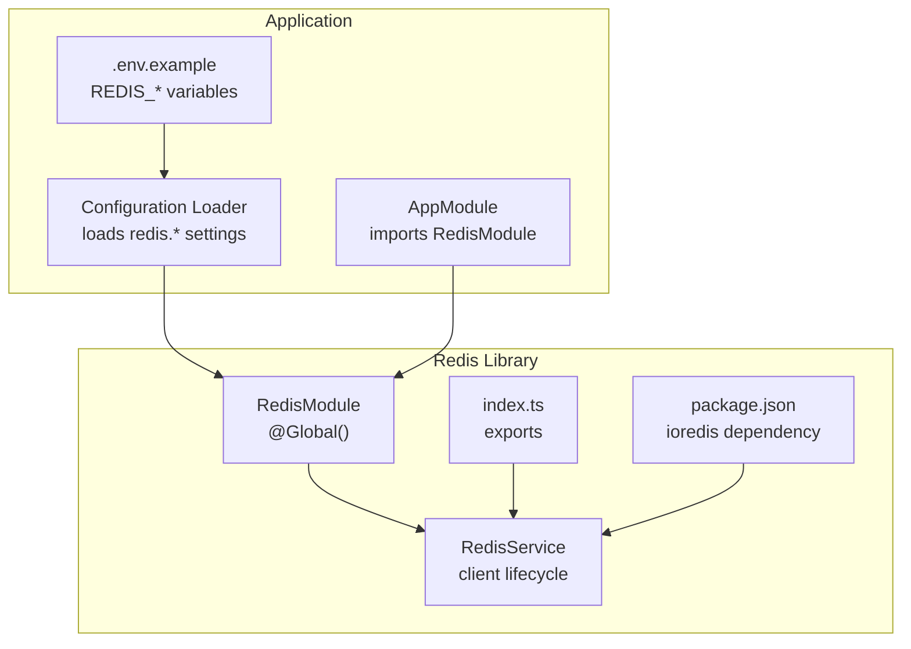
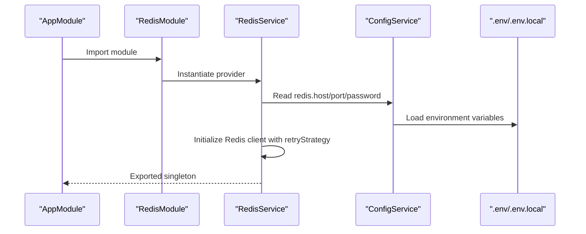
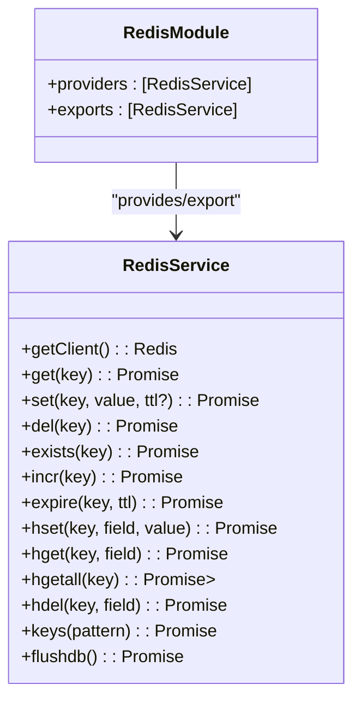
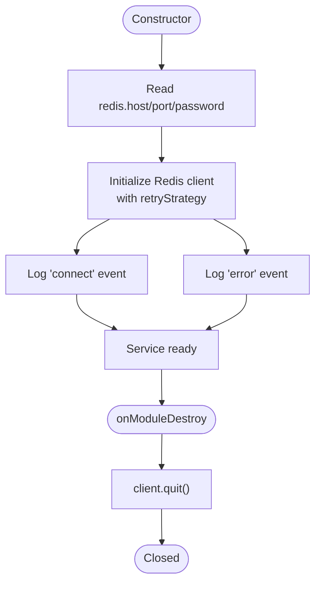
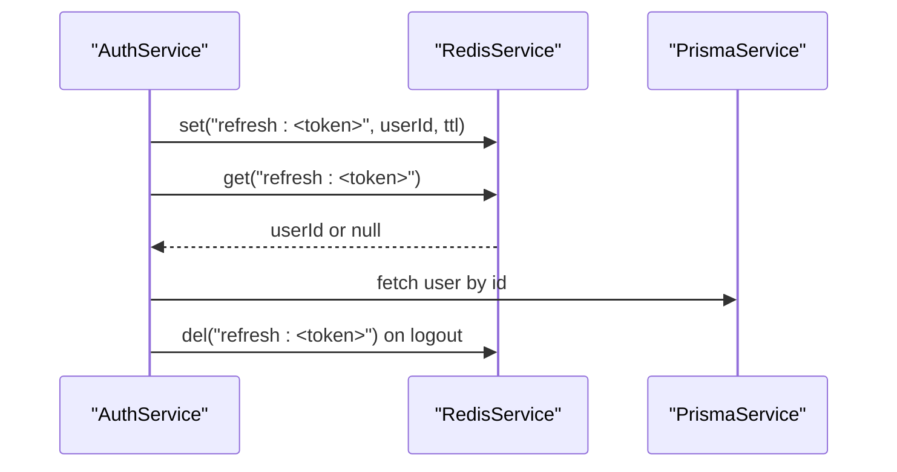
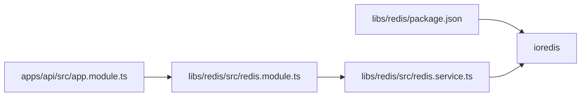

# Redis Library

<cite>
**Referenced Files in This Document**
- [redis.module.ts](file://libs/redis/src/redis.module.ts)
- [redis.service.ts](file://libs/redis/src/redis.service.ts)
- [index.ts](file://libs/redis/src/index.ts)
- [package.json](file://libs/redis/package.json)
- [app.module.ts](file://apps/api/src/app.module.ts)
- [configuration.ts](file://apps/api/src/config/configuration.ts)
- [.env.example](file://.env.example)
- [auth.service.ts](file://apps/api/src/modules/auth/auth.service.ts)
- [auth.service.spec.ts](file://apps/api/src/modules/auth/auth.service.spec.ts)
- [quest-prompts.md](file://docs/quest-prompts.md)
</cite>

## Table of Contents
1. [Introduction](#introduction)
2. [Project Structure](#project-structure)
3. [Core Components](#core-components)
4. [Architecture Overview](#architecture-overview)
5. [Detailed Component Analysis](#detailed-component-analysis)
6. [Dependency Analysis](#dependency-analysis)
7. [Performance Considerations](#performance-considerations)
8. [Troubleshooting Guide](#troubleshooting-guide)
9. [Conclusion](#conclusion)
10. [Appendices](#appendices)

## Introduction
This document describes the Redis library used by the Quiz-to-build system to provide cache management and connection pooling. It explains how the RedisModule integrates Redis connection management into the NestJS dependency injection system, and how the RedisService wrapper exposes a concise set of cache operations while managing the underlying Redis client lifecycle. The library supports session state management, adaptive logic caching, and other performance-critical operations. Practical usage examples show how to cache questionnaire sessions, user preferences, and frequently accessed data. We also document connection configuration, cluster support considerations, failover mechanisms, cache invalidation strategies, TTL management, memory optimization, error handling, reconnection logic, monitoring, and best practices.

## Project Structure
The Redis library is implemented as a NestJS module and service packaged as an internal library. The application module imports the Redis module globally so that RedisService is available application-wide. Configuration is centralized in the application’s configuration loader and environment variables.

**Diagram sources**
- [app.module.ts](file://apps/api/src/app.module.ts#L1-L67)
- [configuration.ts](file://apps/api/src/config/configuration.ts#L1-L49)
- [.env.example](file://.env.example#L1-L33)
- [redis.module.ts](file://libs/redis/src/redis.module.ts#L1-L10)
- [redis.service.ts](file://libs/redis/src/redis.service.ts#L1-L96)
- [index.ts](file://libs/redis/src/index.ts#L1-L3)
- [package.json](file://libs/redis/package.json#L1-L20)

**Section sources**
- [redis.module.ts](file://libs/redis/src/redis.module.ts#L1-L10)
- [redis.service.ts](file://libs/redis/src/redis.service.ts#L1-L96)
- [index.ts](file://libs/redis/src/index.ts#L1-L3)
- [package.json](file://libs/redis/package.json#L1-L20)
- [app.module.ts](file://apps/api/src/app.module.ts#L1-L67)
- [configuration.ts](file://apps/api/src/config/configuration.ts#L1-L49)
- [.env.example](file://.env.example#L1-L33)

## Core Components
- RedisModule: A global NestJS module that provides and exports a single RedisService instance application-wide.
- RedisService: A wrapper around the Redis client that manages connection lifecycle, exposes basic cache operations, and logs connection events and errors.
- Index and package metadata: Export the module and service and declare the Redis client dependency.

Key capabilities:
- Connection configuration via environment variables and configuration loader
- Automatic reconnection with a retry strategy
- Basic cache operations: get, set, setex, del, exists, incr, expire, hset, hget, hgetall, hdel, keys
- Graceful shutdown via quit()

**Section sources**
- [redis.module.ts](file://libs/redis/src/redis.module.ts#L1-L10)
- [redis.service.ts](file://libs/redis/src/redis.service.ts#L1-L96)
- [index.ts](file://libs/redis/src/index.ts#L1-L3)
- [package.json](file://libs/redis/package.json#L1-L20)

## Architecture Overview
The Redis library integrates with the application through a global module. RedisService is constructed with configuration values and maintains a persistent client instance. Modules throughout the application can inject RedisService to perform caching operations.

**Diagram sources**
- [app.module.ts](file://apps/api/src/app.module.ts#L1-L67)
- [redis.module.ts](file://libs/redis/src/redis.module.ts#L1-L10)
- [redis.service.ts](file://libs/redis/src/redis.service.ts#L1-L96)
- [configuration.ts](file://apps/api/src/config/configuration.ts#L1-L49)
- [.env.example](file://.env.example#L1-L33)

## Detailed Component Analysis

### RedisModule
- Purpose: Provides a globally available RedisService instance.
- Behavior: Declares RedisService as a provider and exports it for injection across the application.

**Diagram sources**
- [redis.module.ts](file://libs/redis/src/redis.module.ts#L1-L10)
- [redis.service.ts](file://libs/redis/src/redis.service.ts#L1-L96)

**Section sources**
- [redis.module.ts](file://libs/redis/src/redis.module.ts#L1-L10)

### RedisService
- Connection management:
  - Reads redis.host, redis.port, redis.password from configuration.
  - Initializes a Redis client with a retry strategy that caps delays.
  - Logs connect and error events.
- Lifecycle:
  - Implements OnModuleDestroy to quit the client gracefully during shutdown.
- Operations:
  - String operations: get, set, setex, del, exists, incr, expire
  - Hash operations: hset, hget, hgetall, hdel
  - Utility: keys, flushdb (guarded for test environments)
  - Accessor: getClient to obtain the underlying Redis client

**Diagram sources**
- [redis.service.ts](file://libs/redis/src/redis.service.ts#L1-L96)

**Section sources**
- [redis.service.ts](file://libs/redis/src/redis.service.ts#L1-L96)

### Integration with Application Modules
- AppModule imports RedisModule globally, making RedisService available application-wide.
- Example usage in AuthService:
  - Stores refresh tokens under keys prefixed with refresh:, with TTL derived from configuration.
  - Validates refresh tokens by retrieving the associated user ID.
  - Removes tokens on logout.

**Diagram sources**
- [app.module.ts](file://apps/api/src/app.module.ts#L1-L67)
- [auth.service.ts](file://apps/api/src/modules/auth/auth.service.ts#L1-L278)
- [redis.service.ts](file://libs/redis/src/redis.service.ts#L1-L96)

**Section sources**
- [app.module.ts](file://apps/api/src/app.module.ts#L1-L67)
- [auth.service.ts](file://apps/api/src/modules/auth/auth.service.ts#L1-L278)

### Practical Usage Examples
Below are practical examples of how to use RedisService for caching questionnaire sessions, user preferences, and frequently accessed data. These examples reference the RedisService API and typical key naming patterns.

- Cache questionnaire session state
  - Key pattern: session:<sessionId>
  - Operations: setex with a medium TTL to keep sessions warm during navigation
  - Invalidate: del when session completes or expires

- Cache user preferences
  - Key pattern: user:<userId>:preferences
  - Operations: hset/hgetall for structured preference storage; setex for expiration

- Cache frequently accessed questionnaire metadata
  - Key pattern: meta:questionnaire:<id>
  - Operations: setex with a long TTL for definitions and templates

- Cache adaptive logic visibility sets
  - Key pattern: vis:<questionnaireId>:<responsesHash>
  - Operations: setex with a short TTL; invalidate on response changes

Note: The above examples illustrate recommended patterns. The actual implementation should align with your domain model and key naming conventions.

**Section sources**
- [redis.service.ts](file://libs/redis/src/redis.service.ts#L1-L96)
- [auth.service.ts](file://apps/api/src/modules/auth/auth.service.ts#L1-L278)
- [quest-prompts.md](file://docs/quest-prompts.md#L1211-L1269)

## Dependency Analysis
- Internal dependencies:
  - RedisService depends on NestJS ConfigService and ioredis.
  - RedisModule depends on RedisService.
- External dependencies:
  - ioredis is declared in the library’s package.json.
- Application integration:
  - AppModule imports RedisModule, enabling global availability of RedisService.

**Diagram sources**
- [package.json](file://libs/redis/package.json#L1-L20)
- [redis.service.ts](file://libs/redis/src/redis.service.ts#L1-L96)
- [redis.module.ts](file://libs/redis/src/redis.module.ts#L1-L10)
- [app.module.ts](file://apps/api/src/app.module.ts#L1-L67)

**Section sources**
- [package.json](file://libs/redis/package.json#L1-L20)
- [redis.service.ts](file://libs/redis/src/redis.service.ts#L1-L96)
- [redis.module.ts](file://libs/redis/src/redis.module.ts#L1-L10)
- [app.module.ts](file://apps/api/src/app.module.ts#L1-L67)

## Performance Considerations
- Connection pooling:
  - The current implementation creates a single Redis client per process. For high concurrency, consider a pool abstraction or multiple clients per shard if scaling horizontally.
- Retry strategy:
  - The built-in retry strategy reduces immediate reconnect storms. Tune delays and backoff based on deployment environment.
- TTL and memory:
  - Use setex for ephemeral caches (e.g., sessions, short-lived tokens).
  - Prefer hash operations for structured data to reduce memory overhead compared to serialized objects.
- Bulk operations:
  - Use pipeline or batch commands when performing multiple writes to minimize round trips.
- Monitoring:
  - Track Redis latency, memory usage, and hit rate. Log slow queries and errors at the service boundary.

[No sources needed since this section provides general guidance]

## Troubleshooting Guide
- Connection failures:
  - Verify REDIS_HOST, REDIS_PORT, and REDIS_PASSWORD in environment variables and configuration loader.
  - Check network connectivity and firewall rules.
- Authentication issues:
  - Ensure REDIS_PASSWORD matches the server configuration.
- Reconnection and timeouts:
  - Review the retry strategy and adjust for production traffic patterns.
- Graceful shutdown:
  - Confirm onModuleDestroy quits the client to avoid hanging connections.
- Error logging:
  - Inspect logs for Redis error messages emitted by the service.

**Section sources**
- [configuration.ts](file://apps/api/src/config/configuration.ts#L1-L49)
- [.env.example](file://.env.example#L1-L33)
- [redis.service.ts](file://libs/redis/src/redis.service.ts#L1-L96)

## Conclusion
The Redis library provides a focused, reliable foundation for caching and session state management in the Quiz-to-build system. By integrating RedisService through a global module and leveraging its basic cache primitives, the application can implement efficient, scalable caching strategies for sessions, preferences, and adaptive logic. Proper configuration, TTL management, and monitoring will ensure robust performance and reliability.

[No sources needed since this section summarizes without analyzing specific files]

## Appendices

### Connection Configuration
- Environment variables:
  - REDIS_HOST, REDIS_PORT, REDIS_PASSWORD
- Configuration loader:
  - Loads redis.host, redis.port, redis.password into the NestJS ConfigService
- Module import:
  - AppModule imports RedisModule to enable global RedisService availability

**Section sources**
- [.env.example](file://.env.example#L1-L33)
- [configuration.ts](file://apps/api/src/config/configuration.ts#L1-L49)
- [app.module.ts](file://apps/api/src/app.module.ts#L1-L67)

### Cluster Support and Failover
- Current implementation:
  - Single-node Redis client instantiation.
- Recommendations:
  - For clustered deployments, consider a Redis cluster-compatible client or proxy and configure sentinel or cluster-aware routing.
  - Implement health checks and circuit breakers around Redis operations.

[No sources needed since this section provides general guidance]

### Cache Invalidation Strategies
- Pattern-based invalidation:
  - Use keys(pattern) to discover related keys and del them when data changes.
- TTL-driven expiry:
  - Rely on setex for automatic eviction of stale entries.
- Structured invalidation:
  - Maintain auxiliary indexes (e.g., user:<userId>:sessions) to quickly locate and remove dependent entries.

**Section sources**
- [redis.service.ts](file://libs/redis/src/redis.service.ts#L1-L96)

### TTL Management and Memory Optimization
- Choose appropriate TTLs:
  - Sessions: medium TTL; Tokens: configured TTL; Metadata: longer TTL.
- Optimize data structures:
  - Use hashes for nested preferences; avoid serializing large objects when flat structures suffice.
- Monitor memory:
  - Track memory usage and evictions; adjust maxmemory and policy as needed.

[No sources needed since this section provides general guidance]

### Error Handling and Reconnection Logic
- Built-in behavior:
  - Retry strategy with capped delays; error events logged; graceful quit on shutdown.
- Best practices:
  - Wrap Redis calls with try/catch; implement retries with jitter for transient failures.
  - Consider circuit breaker patterns for degraded resilience.

**Section sources**
- [redis.service.ts](file://libs/redis/src/redis.service.ts#L1-L96)

### Monitoring Redis Performance Metrics
- Recommended metrics:
  - Latency, connected clients, blocked clients, memory usage, hit ratio, rejected connections.
- Tools:
  - Use Redis INFO and monitoring integrations; instrument application-level cache hits/misses.

[No sources needed since this section provides general guidance]

### Choosing Cache Strategies and Avoiding Pitfalls
- Strategy selection:
  - Hot data: short TTL with frequent updates; Cold data: longer TTL or no TTL.
  - Use hash maps for structured data; strings for serialized objects.
- Common pitfalls:
  - Overuse of long TTLs leading to stale data.
  - No invalidation strategy causing memory bloat.
  - Ignoring error handling and reconnection logic.

[No sources needed since this section provides general guidance]