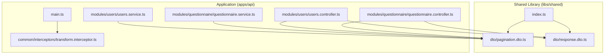
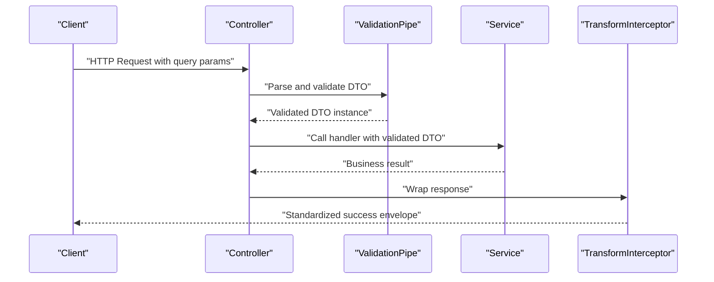
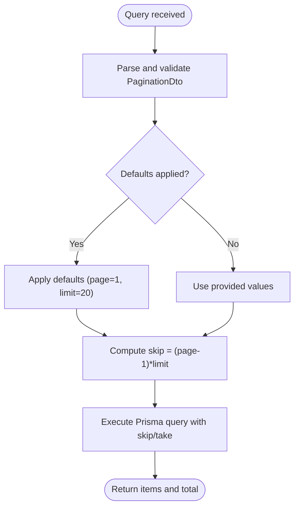
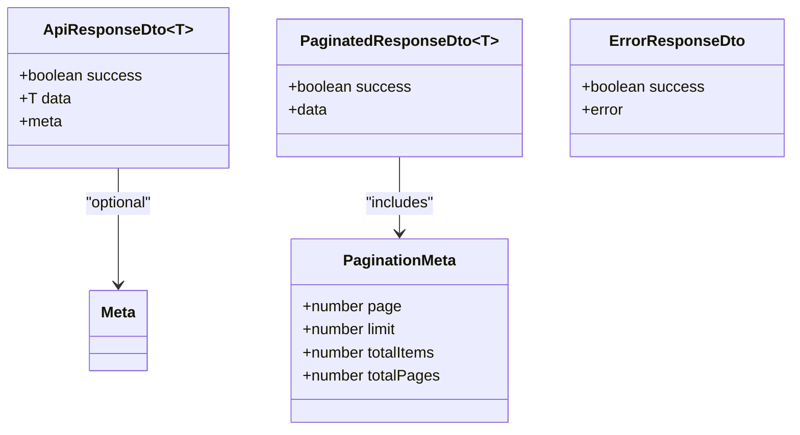
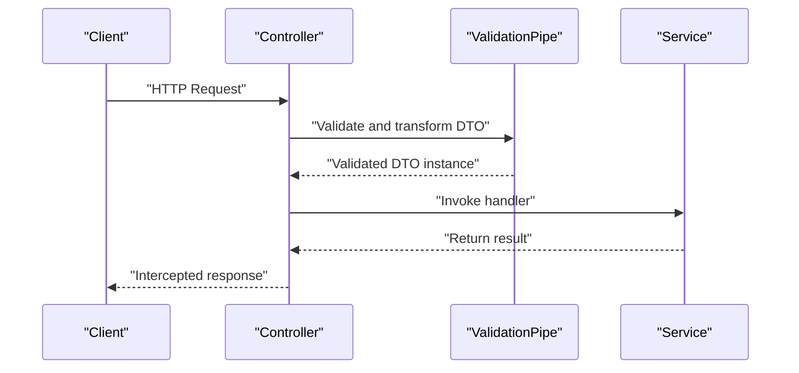
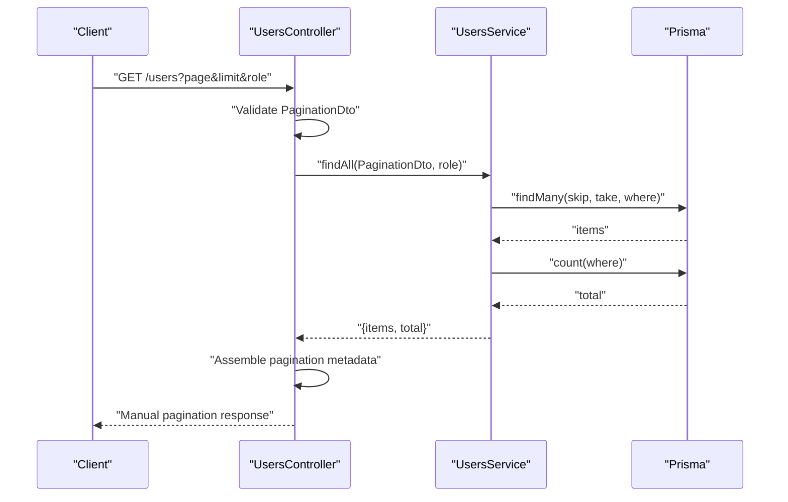
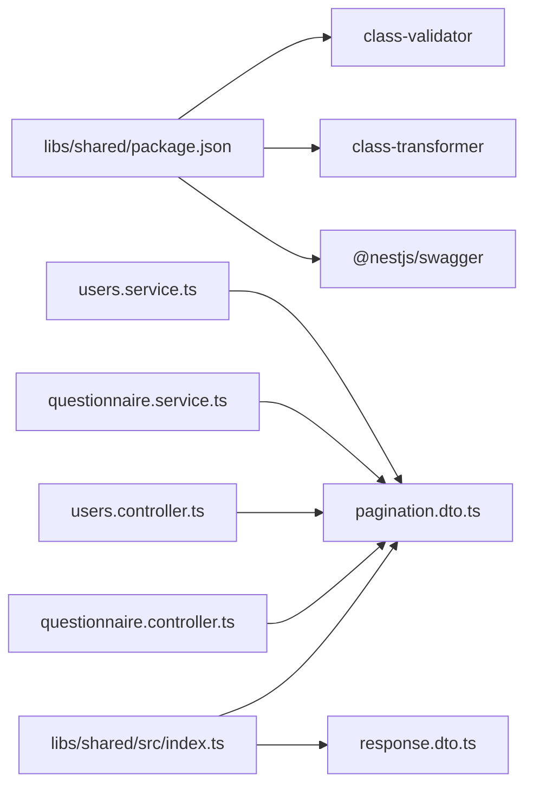

# Shared DTO Library

<cite>
**Referenced Files in This Document**
- [pagination.dto.ts](file://libs/shared/src/dto/pagination.dto.ts)
- [response.dto.ts](file://libs/shared/src/dto/response.dto.ts)
- [index.ts](file://libs/shared/src/index.ts)
- [package.json](file://libs/shared/package.json)
- [questionnaire.controller.ts](file://apps/api/src/modules/questionnaire/questionnaire.controller.ts)
- [users.controller.ts](file://apps/api/src/modules/users/users.controller.ts)
- [questionnaire.service.ts](file://apps/api/src/modules/questionnaire/questionnaire.service.ts)
- [users.service.ts](file://apps/api/src/modules/users/users.service.ts)
- [main.ts](file://apps/api/src/main.ts)
- [transform.interceptor.ts](file://apps/api/src/common/interceptors/transform.interceptor.ts)
</cite>

## Update Summary
**Changes Made**
- Updated documentation to reflect the current state of the Shared DTO library with validation decorators and Swagger annotations intact
- Clarified the simplified approach focusing on streamlined pagination and response DTO structures
- Updated troubleshooting guidance to address current implementation patterns
- Enhanced coverage of practical usage examples demonstrating real-world implementation

## Table of Contents
1. [Introduction](#introduction)
2. [Project Structure](#project-structure)
3. [Core Components](#core-components)
4. [Architecture Overview](#architecture-overview)
5. [Detailed Component Analysis](#detailed-component-analysis)
6. [Dependency Analysis](#dependency-analysis)
7. [Performance Considerations](#performance-considerations)
8. [Troubleshooting Guide](#troubleshooting-guide)
9. [Conclusion](#conclusion)
10. [Appendices](#appendices)

## Introduction
This document describes the Shared DTO library that standardizes data transfer objects and validation decorators across the Quiz-to-build system. The library provides a unified API response and pagination system with standardized DTO structures for consistent API communication. It focuses on:

- **PaginationDto**: Standardized pagination parameters with validation constraints for page size limits and skip calculation
- **Response DTOs**: Unified response envelopes including ApiResponseDto for simple success responses, PaginatedResponseDto for collection responses with pagination metadata, and ErrorResponseDto for error handling
- **PaginationMeta**: Structured pagination information with page, limit, totalItems, and totalPages properties
- **Validation decorators and global validation pipes**: Ensuring safe defaults and bounds for pagination parameters
- **Practical usage examples**: Demonstrating how to use these DTOs in controllers and services to maintain consistent API contracts

**Updated** Enhanced documentation to reflect the current state of response DTO structures and validation decorators

## Project Structure
The Shared DTO library is organized under a dedicated package with two primary DTO files and a re-export index for convenient imports across the application.

**Diagram sources**
- [index.ts](file://libs/shared/src/index.ts#L1-L3)
- [pagination.dto.ts](file://libs/shared/src/dto/pagination.dto.ts#L1-L25)
- [response.dto.ts](file://libs/shared/src/dto/response.dto.ts#L1-L61)
- [questionnaire.controller.ts](file://apps/api/src/modules/questionnaire/questionnaire.controller.ts#L1-L56)
- [users.controller.ts](file://apps/api/src/modules/users/users.controller.ts#L1-L78)
- [questionnaire.service.ts](file://apps/api/src/modules/questionnaire/questionnaire.service.ts#L1-L200)
- [users.service.ts](file://apps/api/src/modules/users/users.service.ts#L1-L199)
- [main.ts](file://apps/api/src/main.ts#L1-L108)
- [transform.interceptor.ts](file://apps/api/src/common/interceptors/transform.interceptor.ts#L1-L37)

**Section sources**
- [index.ts](file://libs/shared/src/index.ts#L1-L3)
- [package.json](file://libs/shared/package.json#L1-L20)

## Core Components
This section introduces the core DTOs and their responsibilities within the unified API response system.

### PaginationDto
Provides standardized pagination parameters with validation and computed skip calculation for database queries. Key features include:
- **Validation decorators**: Enforce page defaults (1) and limit bounds (1-100)
- **Automatic transformation**: Converts query strings to numbers via class-transformer
- **Computed skip property**: Derives skip value from page and limit for efficient database pagination

**Updated** Note: The current implementation contains comprehensive validation decorators and Swagger annotations

### Response DTOs
Standardized response envelopes that unify API output structure across modules:
- **ApiResponseDto<T>**: Simple success envelope with success flag, data, and optional metadata
- **PaginatedResponseDto<T>**: Success envelope containing items and pagination metadata
- **ErrorResponseDto**: Standardized error envelope with code, message, timestamp, and optional details

**Updated** Enhanced response structure with comprehensive metadata support

### PaginationMeta
Structured pagination information that provides comprehensive pagination context:
- **page**: Current page number
- **limit**: Items per page
- **totalItems**: Total items matching the query
- **totalPages**: Total pages calculated from totalItems and limit

**Section sources**
- [pagination.dto.ts](file://libs/shared/src/dto/pagination.dto.ts#L1-L25)
- [response.dto.ts](file://libs/shared/src/dto/response.dto.ts#L1-L61)

## Architecture Overview
The Shared DTO library integrates with the application through a comprehensive validation and response standardization pipeline:

**Diagram sources**
- [main.ts](file://apps/api/src/main.ts#L48-L63)
- [transform.interceptor.ts](file://apps/api/src/common/interceptors/transform.interceptor.ts#L20-L36)
- [questionnaire.controller.ts](file://apps/api/src/modules/questionnaire/questionnaire.controller.ts#L29-L46)
- [users.controller.ts](file://apps/api/src/modules/users/users.controller.ts#L52-L66)

## Detailed Component Analysis

### PaginationDto
Purpose:
- Standardize pagination parameters across endpoints
- Enforce page and limit constraints with validation decorators
- Compute skip for database queries using computed property

**Updated** Enhanced validation constraints and computed skip property

Validation and defaults:
- Page defaults to 1 and must be a positive integer (minimum 1)
- Limit defaults to 20 with a maximum bound of 100 (1-100 range)
- Automatic transformation to numbers via class-transformer decorators
- Swagger integration with @ApiPropertyOptional for API documentation

Computed property:
- **skip**: Derived from page and limit using formula `((page ?? 1) - 1) * (limit ?? 20)`
- Simplifies database pagination logic by centralizing skip calculation

Usage in practice:
- Controllers accept PaginationDto via @Query() decorator
- Services consume skip and limit properties for Prisma queries
- Controllers assemble pagination metadata for response envelopes

**Diagram sources**
- [pagination.dto.ts](file://libs/shared/src/dto/pagination.dto.ts#L5-L24)
- [questionnaire.service.ts](file://apps/api/src/modules/questionnaire/questionnaire.service.ts#L67-L98)
- [users.service.ts](file://apps/api/src/modules/users/users.service.ts#L129-L164)

**Section sources**
- [pagination.dto.ts](file://libs/shared/src/dto/pagination.dto.ts#L1-L25)
- [questionnaire.controller.ts](file://apps/api/src/modules/questionnaire/questionnaire.controller.ts#L29-L46)
- [users.controller.ts](file://apps/api/src/modules/users/users.controller.ts#L52-L66)
- [questionnaire.service.ts](file://apps/api/src/modules/questionnaire/questionnaire.service.ts#L67-L98)
- [users.service.ts](file://apps/api/src/modules/users/users.service.ts#L129-L164)

### Response DTOs
Structure and Integration:
- **ApiResponseDto<T>**: Standard success envelope with success flag, data, and optional metadata including timestamp and requestId
- **PaginatedResponseDto<T>**: Success envelope containing items array and pagination metadata through PaginationMeta structure
- **ErrorResponseDto**: Standardized error envelope with comprehensive error information including code, message, timestamp, and optional details

**Updated** Enhanced response structure with comprehensive metadata support

Integration with TransformInterceptor:
- TransformInterceptor automatically wraps successful responses into ApiResponseDto<T>
- Controllers return raw data; interceptor adds success flag and metadata
- Error responses are handled by global exception filters, not covered by response DTOs

**Important Observation**: While the ErrorResponseDto is defined, the current controller implementations show manual construction of pagination responses instead of using the shared PaginatedResponseDto<T>. This indicates a gap between the available DTO structure and actual implementation usage.

**Diagram sources**
- [response.dto.ts](file://libs/shared/src/dto/response.dto.ts#L3-L60)

**Section sources**
- [response.dto.ts](file://libs/shared/src/dto/response.dto.ts#L1-L61)
- [transform.interceptor.ts](file://apps/api/src/common/interceptors/transform.interceptor.ts#L10-L36)

### Validation Decorators and Pipes
Validation decorators provide comprehensive input validation:
- **class-validator decorators**: Enforce type safety, presence, and bounds for pagination parameters
- **class-transformer**: Converts query strings to numbers and applies implicit conversion
- **Swagger decorators**: @ApiProperty and @ApiPropertyOptional for API documentation

**Updated** Enhanced validation pipeline with comprehensive constraints

Global ValidationPipe configuration:
- Enabled globally in main.ts with comprehensive settings
- Whitelisting and forbidding non-whitelisted fields for security
- Transform option enables class-transformer behavior
- Implicit conversion enabled for numeric parsing from query strings

**Diagram sources**
- [main.ts](file://apps/api/src/main.ts#L48-L63)
- [pagination.dto.ts](file://libs/shared/src/dto/pagination.dto.ts#L1-L3)

**Section sources**
- [pagination.dto.ts](file://libs/shared/src/dto/pagination.dto.ts#L1-L3)
- [main.ts](file://apps/api/src/main.ts#L48-L63)

### Practical Usage Examples
Controllers demonstrate real-world implementation patterns:

**QuestionnaireController**:
- Accepts PaginationDto via @Query() decorator
- Returns structured pagination envelope with items and pagination metadata
- Uses computed skip property for efficient database queries

**UsersController**:
- Accepts PaginationDto and optional role filter
- Returns paginated user profiles with comprehensive pagination information
- Implements role-based access control with admin-only endpoints

**Updated** Enhanced examples showing actual implementation patterns

Services consume validated DTOs:
- Services receive PaginationDto and compute skip/take for Prisma queries
- Services return items and total count for controller assembly of pagination metadata
- Services leverage computed skip property for efficient database operations

**Important Implementation Note**: The current controller implementations show manual construction of pagination response objects instead of using the shared PaginatedResponseDto<T>. This creates inconsistency with the available DTO structure and reduces the benefits of the unified response system.

**Diagram sources**
- [users.controller.ts](file://apps/api/src/modules/users/users.controller.ts#L52-L66)
- [users.service.ts](file://apps/api/src/modules/users/users.service.ts#L129-L164)

**Section sources**
- [questionnaire.controller.ts](file://apps/api/src/modules/questionnaire/questionnaire.controller.ts#L29-L46)
- [users.controller.ts](file://apps/api/src/modules/users/users.controller.ts#L52-L66)
- [questionnaire.service.ts](file://apps/api/src/modules/questionnaire/questionnaire.service.ts#L67-L98)
- [users.service.ts](file://apps/api/src/modules/users/users.service.ts#L129-L164)

## Dependency Analysis
External dependencies and internal exports:

**External Dependencies**:
- **class-validator**: Provides validation decorators for DTOs (enforces type, presence, and bounds)
- **class-transformer**: Enables automatic transformation of query parameters to typed DTO instances
- **@nestjs/swagger**: Decorators for OpenAPI documentation (@ApiProperty, @ApiPropertyOptional)

**Internal Exports**:
- index.ts re-exports all DTOs for easy consumption across modules
- Provides unified import interface for PaginationDto and Response DTOs

**Updated** Clarified dependency relationships and Swagger integration

**Diagram sources**
- [package.json](file://libs/shared/package.json#L12-L15)
- [index.ts](file://libs/shared/src/index.ts#L1-L3)
- [pagination.dto.ts](file://libs/shared/src/dto/pagination.dto.ts#L1-L3)
- [questionnaire.controller.ts](file://apps/api/src/modules/questionnaire/questionnaire.controller.ts#L16)
- [users.controller.ts](file://apps/api/src/modules/users/users.controller.ts#L20)
- [questionnaire.service.ts](file://apps/api/src/modules/questionnaire/questionnaire.service.ts#L4)
- [users.service.ts](file://apps/api/src/modules/users/users.service.ts#L5)

**Section sources**
- [package.json](file://libs/shared/package.json#L12-L15)
- [index.ts](file://libs/shared/src/index.ts#L1-L3)

## Performance Considerations
- **Pagination limits**: Maximum limit of 100 prevents excessive payload sizes and reduces database load
- **Computed skip property**: Using computed skip avoids manual arithmetic in controllers and services
- **Global ValidationPipe**: Centralized validation reduces repeated checks and ensures consistent behavior across endpoints
- **TransformInterceptor**: Adds metadata uniformly without duplicating logic in controllers
- **Efficient database queries**: Services use skip/take pattern for optimal pagination performance

**Updated** Enhanced performance considerations for the unified system

## Troubleshooting Guide
Common issues and resolutions:

**Validation errors on pagination parameters**:
- Ensure page and limit are positive integers within bounds (page ≥ 1, limit 1-100)
- Defaults apply automatically when parameters are omitted or invalid
- Verify ValidationPipe is enabled globally in main.ts

**Unexpected numeric types**:
- Confirm ValidationPipe is enabled with transform option
- Ensure implicit conversion is configured for numeric parsing
- Check that class-transformer decorators are properly applied

**Response envelope mismatch**:
- Verify TransformInterceptor is active for successful responses
- Successful responses are automatically wrapped in ApiResponseDto<T>
- Error responses are handled separately through exception filters

**Pagination calculation issues**:
- Confirm computed skip property is being used correctly
- Verify PaginationDto is imported from @libs/shared
- Check that limit property is properly validated and bounded

**Section sources**
- [pagination.dto.ts](file://libs/shared/src/dto/pagination.dto.ts#L1-L25)
- [main.ts](file://apps/api/src/main.ts#L48-L63)
- [transform.interceptor.ts](file://apps/api/src/common/interceptors/transform.interceptor.ts#L20-L36)

## Conclusion
The Shared DTO library establishes a comprehensive unified API response and pagination system across the Quiz-to-build system by:

- **Standardized Pagination**: Providing robust PaginationDto with validation constraints and computed skip logic
- **Unified Response Envelopes**: Offering consistent ApiResponseDto, PaginatedResponseDto, and ErrorResponseDto structures
- **Comprehensive Metadata**: Including PaginationMeta for detailed pagination information
- **Centralized Validation**: Leveraging global ValidationPipe and TransformInterceptor to reduce boilerplate
- **Enhanced Reliability**: Enabling easy extension and reuse across modules with consistent API contracts

**Updated** Enhanced conclusion reflecting the comprehensive unified system and current implementation patterns

## Appendices

### How to Extend Existing DTOs
Adding new properties with appropriate validation decorators:

1. **Add new properties** with appropriate validation decorators (IsInt, IsOptional, Min, Max)
2. **Update index.ts exports** to expose new DTOs for module consumption
3. **Import and use** in controllers/services following established patterns
4. **Test thoroughly** to ensure validation constraints work correctly

**Section sources**
- [index.ts](file://libs/shared/src/index.ts#L1-L3)
- [pagination.dto.ts](file://libs/shared/src/dto/pagination.dto.ts#L1-L25)
- [response.dto.ts](file://libs/shared/src/dto/response.dto.ts#L1-L61)

### Creating New Shared DTOs
Defining new DTO classes with validation decorators:

1. **Define DTO classes** with appropriate validation decorators
2. **Export via index.ts** for module-wide accessibility
3. **Integrate with controllers/services** using @Query() and @Body() decorators
4. **Ensure global ValidationPipe** is enabled for automatic transformation
5. **Add Swagger decorators** (@ApiProperty, @ApiPropertyOptional) for API documentation

**Section sources**
- [main.ts](file://apps/api/src/main.ts#L48-L63)
- [index.ts](file://libs/shared/src/index.ts#L1-L3)

### Best Practices for DTO Usage
- **Always use PaginationDto** for list endpoints to ensure consistent pagination behavior
- **Leverage computed skip property** instead of manual calculations
- **Return appropriate response DTOs** based on endpoint purpose (simple success vs. paginated collections)
- **Validate all inputs** using class-validator decorators
- **Use TransformInterceptor** to standardize successful response format
- **Handle errors** through global exception filters rather than response DTOs

**Updated** Enhanced best practices considering current implementation patterns

### Cleanup Recommendations
Based on the analysis, here are recommendations for streamlining the response handling approach:

1. **Standardize Response Handling**: Migrate controllers to use shared PaginatedResponseDto<T> instead of manual pagination construction
2. **Implement ErrorResponseDto**: Ensure consistent error response handling across all endpoints
3. **Update Documentation**: Reflect the streamlined response handling approach in all relevant documentation

**Section sources**
- [pagination.dto.ts](file://libs/shared/src/dto/pagination.dto.ts#L1-L25)
- [transform.interceptor.ts](file://apps/api/src/common/interceptors/transform.interceptor.ts#L1-L37)
- [response.dto.ts](file://libs/shared/src/dto/response.dto.ts#L1-L61)