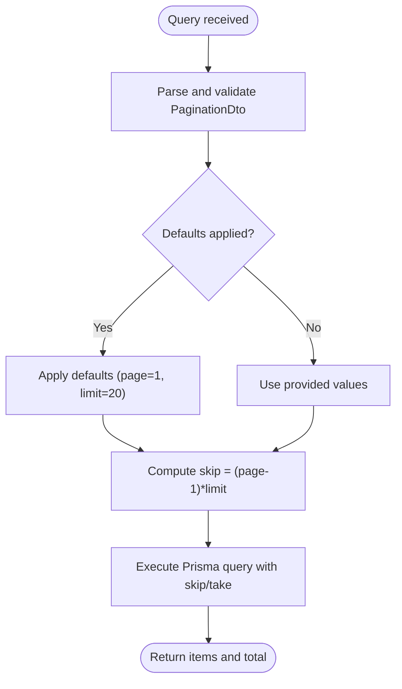

# Shared DTO Library

<cite>
**Referenced Files in This Document**
- [pagination.dto.ts](file://libs/shared/src/dto/pagination.dto.ts)
- [response.dto.ts](file://libs/shared/src/dto/response.dto.ts)
- [index.ts](file://libs/shared/src/index.ts)
- [package.json](file://libs/shared/package.json)
- [questionnaire.controller.ts](file://apps/api/src/modules/questionnaire/questionnaire.controller.ts)
- [users.controller.ts](file://apps/api/src/modules/users/users.controller.ts)
- [questionnaire.service.ts](file://apps/api/src/modules/questionnaire/questionnaire.service.ts)
- [users.service.ts](file://apps/api/src/modules/users/users.service.ts)
- [main.ts](file://apps/api/src/main.ts)
- [transform.interceptor.ts](file://apps/api/src/common/interceptors/transform.interceptor.ts)
</cite>

## Table of Contents
1. [Introduction](#introduction)
2. [Project Structure](#project-structure)
3. [Core Components](#core-components)
4. [Architecture Overview](#architecture-overview)
5. [Detailed Component Analysis](#detailed-component-analysis)
6. [Dependency Analysis](#dependency-analysis)
7. [Performance Considerations](#performance-considerations)
8. [Troubleshooting Guide](#troubleshooting-guide)
9. [Conclusion](#conclusion)
10. [Appendices](#appendices)

## Introduction
This document describes the Shared DTO library that standardizes data transfer objects and validation decorators across the Quiz-to-build system. It focuses on:
- PaginationDTO for standardized pagination responses with page size limits and skip calculation
- ResponseDTO structure for consistent API response formatting (success/error handling, metadata, and data wrapping)
- Validation decorators and global validation pipes used throughout the application
- Practical usage examples in controllers and services
- Guidelines for extending existing DTOs and creating new shared DTOs while maintaining API consistency and reducing boilerplate

## Project Structure
The Shared DTO library is organized under a dedicated package with two primary DTO files and a re-export index for convenient imports across the application.

**Diagram sources**
- [index.ts](file://libs/shared/src/index.ts#L1-L3)
- [pagination.dto.ts](file://libs/shared/src/dto/pagination.dto.ts#L1-L25)
- [response.dto.ts](file://libs/shared/src/dto/response.dto.ts#L1-L61)
- [questionnaire.controller.ts](file://apps/api/src/modules/questionnaire/questionnaire.controller.ts#L1-L56)
- [users.controller.ts](file://apps/api/src/modules/users/users.controller.ts#L1-L78)
- [questionnaire.service.ts](file://apps/api/src/modules/questionnaire/questionnaire.service.ts#L1-L253)
- [users.service.ts](file://apps/api/src/modules/users/users.service.ts#L1-L200)
- [main.ts](file://apps/api/src/main.ts#L1-L43)
- [transform.interceptor.ts](file://apps/api/src/common/interceptors/transform.interceptor.ts#L1-L36)

**Section sources**
- [index.ts](file://libs/shared/src/index.ts#L1-L3)
- [package.json](file://libs/shared/package.json#L1-L19)

## Core Components
This section introduces the core DTOs and their responsibilities.

- PaginationDTO: Provides standardized pagination parameters with validation and computed skip calculation for database queries.
- Response DTOs: Standardized response envelopes for success and error cases, including metadata and pagination metadata for paginated lists.

Key capabilities:
- Validation decorators ensure safe defaults and bounds for pagination parameters.
- Skip calculation simplifies database pagination logic.
- Response DTOs unify API output structure across modules.

**Section sources**
- [pagination.dto.ts](file://libs/shared/src/dto/pagination.dto.ts#L1-L25)
- [response.dto.ts](file://libs/shared/src/dto/response.dto.ts#L1-L61)

## Architecture Overview
The Shared DTO library integrates with the application through:
- Global ValidationPipe for automatic DTO validation and transformation
- TransformInterceptor for standardizing successful API responses
- Controllers and Services consuming shared DTOs to maintain consistent contracts

**Diagram sources**
- [main.ts](file://apps/api/src/main.ts#L34-L43)
- [transform.interceptor.ts](file://apps/api/src/common/interceptors/transform.interceptor.ts#L20-L36)
- [questionnaire.controller.ts](file://apps/api/src/modules/questionnaire/questionnaire.controller.ts#L29-L46)
- [users.controller.ts](file://apps/api/src/modules/users/users.controller.ts#L52-L66)

## Detailed Component Analysis

### PaginationDTO
Purpose:
- Standardize pagination parameters across endpoints
- Enforce page and limit constraints
- Compute skip for database queries

Validation and defaults:
- Page defaults to 1 and must be a positive integer
- Limit defaults to 20 with a maximum of 100
- Automatic transformation to numbers via class-transformer

Computed property:
- skip: derived from page and limit for database pagination

Usage in practice:
- Controllers accept PaginationDto via @Query()
- Services consume skip and limit for Prisma queries
- Controllers assemble pagination metadata for response envelopes

**Diagram sources**
- [pagination.dto.ts](file://libs/shared/src/dto/pagination.dto.ts#L5-L24)
- [questionnaire.service.ts](file://apps/api/src/modules/questionnaire/questionnaire.service.ts#L67-L98)
- [users.service.ts](file://apps/api/src/modules/users/users.service.ts#L129-L164)

**Section sources**
- [pagination.dto.ts](file://libs/shared/src/dto/pagination.dto.ts#L1-L25)
- [questionnaire.controller.ts](file://apps/api/src/modules/questionnaire/questionnaire.controller.ts#L29-L46)
- [users.controller.ts](file://apps/api/src/modules/users/users.controller.ts#L52-L66)
- [questionnaire.service.ts](file://apps/api/src/modules/questionnaire/questionnaire.service.ts#L67-L98)
- [users.service.ts](file://apps/api/src/modules/users/users.service.ts#L129-L164)

### Response DTOs
Structure:
- ApiResponseDto<T>: Standard success envelope with success flag, data, and optional metadata
- PaginatedResponseDto<T>: Success envelope containing items and pagination metadata
- ErrorResponseDto: Standardized error envelope with code, message, timestamp, and optional details/requestId

Integration:
- TransformInterceptor wraps successful responses into ApiResponseDto<T>
- Controllers return raw data; interceptor adds success and metadata
- Error responses are handled by global exception filters

**Diagram sources**
- [response.dto.ts](file://libs/shared/src/dto/response.dto.ts#L3-L60)

**Section sources**
- [response.dto.ts](file://libs/shared/src/dto/response.dto.ts#L1-L61)
- [transform.interceptor.ts](file://apps/api/src/common/interceptors/transform.interceptor.ts#L10-L36)

### Validation Decorators and Pipes
Validation decorators:
- class-validator decorators enforce type, presence, and bounds
- class-transformer converts query strings to numbers and applies implicit conversion

Global ValidationPipe:
- Enabled globally in main.ts
- Whitelisting and forbidding non-whitelisted fields
- Transform enables class-transformer behavior
- Implicit conversion enabled for numeric parsing

**Diagram sources**
- [main.ts](file://apps/api/src/main.ts#L34-L43)
- [pagination.dto.ts](file://libs/shared/src/dto/pagination.dto.ts#L1-L3)

**Section sources**
- [pagination.dto.ts](file://libs/shared/src/dto/pagination.dto.ts#L1-L3)
- [main.ts](file://apps/api/src/main.ts#L34-L43)

### Practical Usage Examples
Controllers:
- QuestionnaireController accepts PaginationDto via @Query() and returns a structured pagination envelope
- UsersController accepts PaginationDto and Role filter, returning a paginated list

Services:
- Services receive PaginationDto and compute skip/take for Prisma queries
- Services return items and total count for controller assembly of pagination metadata

**Diagram sources**
- [users.controller.ts](file://apps/api/src/modules/users/users.controller.ts#L52-L66)
- [users.service.ts](file://apps/api/src/modules/users/users.service.ts#L129-L164)

**Section sources**
- [questionnaire.controller.ts](file://apps/api/src/modules/questionnaire/questionnaire.controller.ts#L29-L46)
- [users.controller.ts](file://apps/api/src/modules/users/users.controller.ts#L52-L66)
- [questionnaire.service.ts](file://apps/api/src/modules/questionnaire/questionnaire.service.ts#L67-L98)
- [users.service.ts](file://apps/api/src/modules/users/users.service.ts#L129-L164)

## Dependency Analysis
External dependencies:
- class-validator: Provides validation decorators for DTOs
- class-transformer: Enables automatic transformation of query parameters to typed DTO instances
- @nestjs/swagger: Decorators for OpenAPI documentation

Internal exports:
- index.ts re-exports PaginationDto and Response DTOs for easy consumption across modules

**Diagram sources**
- [package.json](file://libs/shared/package.json#L12-L15)
- [index.ts](file://libs/shared/src/index.ts#L1-L3)
- [pagination.dto.ts](file://libs/shared/src/dto/pagination.dto.ts#L1-L3)
- [questionnaire.controller.ts](file://apps/api/src/modules/questionnaire/questionnaire.controller.ts#L16)
- [users.controller.ts](file://apps/api/src/modules/users/users.controller.ts#L20)
- [questionnaire.service.ts](file://apps/api/src/modules/questionnaire/questionnaire.service.ts#L4)
- [users.service.ts](file://apps/api/src/modules/users/users.service.ts#L5)

**Section sources**
- [package.json](file://libs/shared/package.json#L12-L15)
- [index.ts](file://libs/shared/src/index.ts#L1-L3)

## Performance Considerations
- Pagination limits: The maximum limit of 100 prevents excessive payload sizes and reduces database load.
- Skip calculation: Using computed skip avoids manual arithmetic in controllers and services.
- Global ValidationPipe: Centralized validation reduces repeated checks and ensures consistent behavior across endpoints.
- TransformInterceptor: Adds metadata uniformly without duplicating logic in controllers.

[No sources needed since this section provides general guidance]

## Troubleshooting Guide
Common issues and resolutions:
- Validation errors on pagination parameters: Ensure page and limit are positive integers within bounds; defaults apply when omitted.
- Unexpected numeric types: Confirm ValidationPipe is enabled and transform options are configured to enable implicit conversion.
- Response envelope mismatch: Verify TransformInterceptor is active; successful responses are automatically wrapped.

**Section sources**
- [pagination.dto.ts](file://libs/shared/src/dto/pagination.dto.ts#L1-L25)
- [main.ts](file://apps/api/src/main.ts#L34-L43)
- [transform.interceptor.ts](file://apps/api/src/common/interceptors/transform.interceptor.ts#L20-L36)

## Conclusion
The Shared DTO library establishes consistent API contracts across the Quiz-to-build system by:
- Providing standardized pagination DTOs with robust validation and computed skip logic
- Offering unified response envelopes for success and error scenarios
- Leveraging global validation and transformation to reduce boilerplate and improve reliability
- Enabling easy extension and reuse across modules

[No sources needed since this section summarizes without analyzing specific files]

## Appendices

### How to Extend Existing DTOs
- Add new properties with appropriate validation decorators
- Update index.ts exports to expose new DTOs
- Import and use in controllers/services following the established patterns

**Section sources**
- [index.ts](file://libs/shared/src/index.ts#L1-L3)
- [pagination.dto.ts](file://libs/shared/src/dto/pagination.dto.ts#L1-L25)
- [response.dto.ts](file://libs/shared/src/dto/response.dto.ts#L1-L61)

### Creating New Shared DTOs
- Define DTO classes with validation decorators
- Export via index.ts
- Integrate with controllers/services using @Query() and @Body() decorators
- Ensure global ValidationPipe is enabled for automatic transformation

**Section sources**
- [main.ts](file://apps/api/src/main.ts#L34-L43)
- [index.ts](file://libs/shared/src/index.ts#L1-L3)