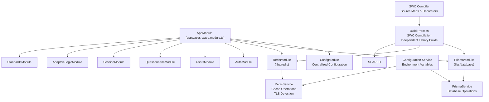
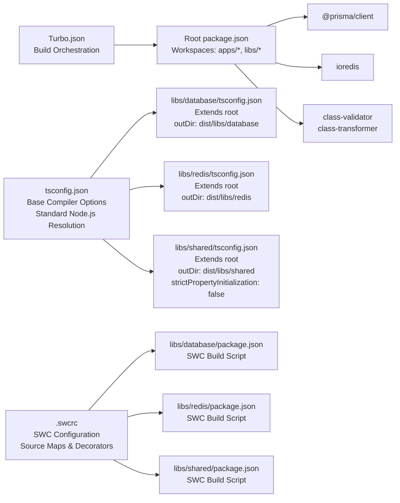

# Shared Libraries

<cite>
**Referenced Files in This Document**
- [tsconfig.json](file://tsconfig.json)
- [libs/database/tsconfig.json](file://libs/database/tsconfig.json)
- [libs/redis/tsconfig.json](file://libs/redis/tsconfig.json)
- [libs/shared/tsconfig.json](file://libs/shared/tsconfig.json)
- [libs/database/src/index.ts](file://libs/database/src/index.ts)
- [libs/database/src/prisma.module.ts](file://libs/database/src/prisma.module.ts)
- [libs/database/src/prisma.service.ts](file://libs/database/src/prisma.service.ts)
- [libs/redis/src/index.ts](file://libs/redis/src/index.ts)
- [libs/redis/src/redis.module.ts](file://libs/redis/src/redis.module.ts)
- [libs/redis/src/redis.service.ts](file://libs/redis/src/redis.service.ts)
- [libs/shared/src/index.ts](file://libs/shared/src/index.ts)
- [libs/shared/src/dto/pagination.dto.ts](file://libs/shared/src/dto/pagination.dto.ts)
- [libs/shared/src/dto/response.dto.ts](file://libs/shared/src/dto/response.dto.ts)
- [libs/database/package.json](file://libs/database/package.json)
- [libs/redis/package.json](file://libs/redis/package.json)
- [libs/shared/package.json](file://libs/shared/package.json)
- [.swcrc](file://.swcrc)
- [package.json](file://package.json)
- [turbo.json](file://turbo.json)
- [apps/api/src/app.module.ts](file://apps/api/src/app.module.ts)
- [apps/api/src/config/configuration.ts](file://apps/api/src/config/configuration.ts)
</cite>

## Update Summary
**Changes Made**
- Updated documentation to reflect removal of custom module resolution system from TypeScript configuration
- Removed references to @libs/database, @libs/redis, and @libs/shared path mappings
- Updated architecture diagrams to show standard Node.js module resolution
- Revised import examples to demonstrate standard relative path imports
- Updated troubleshooting guidance to reflect standard module resolution behavior

## Table of Contents
1. [Introduction](#introduction)
2. [Project Structure](#project-structure)
3. [Core Components](#core-components)
4. [Architecture Overview](#architecture-overview)
5. [Detailed Component Analysis](#detailed-component-analysis)
6. [Dependency Analysis](#dependency-analysis)
7. [Performance Considerations](#performance-considerations)
8. [Troubleshooting Guide](#troubleshooting-guide)
9. [Conclusion](#conclusion)
10. [Appendices](#appendices)

## Introduction
This document describes the shared libraries that provide common functionality across the Quiz-to-build system within a dedicated monorepo structure. The system consists of three specialized libraries located under the libs directory, each with independent TypeScript configuration for enhanced modularity and build organization, now powered by modern SWC-based compilation for improved performance.

- **Database library**: A Prisma service abstraction and connection lifecycle management with dedicated TypeScript configuration and SWC compilation
- **Redis library**: A cache management service with connection pooling and common Redis operations, featuring independent build settings and enhanced TLS detection
- **Shared DTO library**: Reusable data transfer objects and validation decorators for consistent API responses and pagination, with optimized compilation settings

Each library operates as an independent workspace package with its own TypeScript configuration, dependencies, and build processes. The main application consumes these libraries through standard Node.js module resolution, enabling clean separation of concerns and improved maintainability. All libraries now utilize SWC (Speedy Web Compiler) for faster TypeScript compilation with full decorator support and source map generation.

**Updated**: The custom module resolution system has been removed, reverting to standard Node.js module resolution for all shared libraries.

## Project Structure
The shared libraries are organized within a dedicated libs directory structure, each representing a complete workspace package with its own TypeScript configuration, dependencies, and build scripts. The root workspace configuration manages all packages through Turborepo for efficient building and development workflows, with SWC-based compilation providing superior build performance.

```mermaid
graph TB
subgraph "Monorepo Root Workspace"
ROOT_PKG["Root package.json<br/>Workspaces: libs/*"]
TURBO["Turbo.json<br/>Build Orchestration"]
ROOT_TS["tsconfig.json<br/>Base Compiler Options<br/>Standard Node.js Resolution"]
SWCRC[".swcrc<br/>SWC Configuration<br/>Source Maps & Decorators"]
END
subgraph "Database Library (libs/database)"
DB_PKG["package.json<br/>@prisma/client<br/>SWC Build Script"]
DB_TS["tsconfig.json<br/>Extends root<br/>outDir: dist/libs/database"]
DB_SRC["src/<br/>index.ts<br/>prisma.module.ts<br/>prisma.service.ts"]
END
subgraph "Redis Library (libs/redis)"
RDX_PKG["package.json<br/>ioredis<br/>SWC Build Script"]
RDX_TS["tsconfig.json<br/>Extends root<br/>outDir: dist/libs/redis"]
RDX_SRC["src/<br/>index.ts<br/>redis.module.ts<br/>redis.service.ts"]
END
subgraph "Shared Library (libs/shared)"
SH_PKG["package.json<br/>class-validator<br/>class-transformer<br/>SWC Build Script"]
SH_TS["tsconfig.json<br/>Extends root<br/>outDir: dist/libs/shared<br/>strictPropertyInitialization: false"]
SH_SRC["src/<br/>index.ts<br/>dto/<br/>pagination.dto.ts<br/>response.dto.ts"]
END
subgraph "Application (apps/api)"
APP_MOD["app.module.ts<br/>Standard Node.js Imports"]
CFG["config/configuration.ts"]
END
ROOT_PKG --> DB_PKG
ROOT_PKG --> RDX_PKG
ROOT_PKG --> SH_PKG
TURBO --> ROOT_PKG
ROOT_TS --> DB_TS
ROOT_TS --> RDX_TS
ROOT_TS --> SH_TS
SWCRC --> DB_PKG
SWCRC --> RDX_PKG
SWCRC --> SH_PKG
DB_TS --> DB_SRC
RDX_TS --> RDX_SRC
SH_TS --> SH_SRC
APP_MOD --> DB_SRC
APP_MOD --> RDX_SRC
APP_MOD --> SH_SRC
APP_MOD --> CFG
```

**Diagram sources**
- [package.json](file://package.json#L6-L9)
- [tsconfig.json](file://tsconfig.json#L8-L8)
- [.swcrc](file://.swcrc#L1-L22)
- [libs/database/package.json](file://libs/database/package.json#L8-L11)
- [libs/redis/package.json](file://libs/redis/package.json#L8-L11)
- [libs/shared/package.json](file://libs/shared/package.json#L8-L11)
- [libs/database/tsconfig.json](file://libs/database/tsconfig.json#L1-L13)
- [libs/redis/tsconfig.json](file://libs/redis/tsconfig.json#L1-L13)
- [libs/shared/tsconfig.json](file://libs/shared/tsconfig.json#L1-L14)
- [apps/api/src/app.module.ts](file://apps/api/src/app.module.ts#L5-L6)

**Section sources**
- [package.json](file://package.json#L6-L9)
- [tsconfig.json](file://tsconfig.json#L8-L8)
- [.swcrc](file://.swcrc#L1-L22)
- [turbo.json](file://turbo.json#L1-L46)
- [apps/api/src/app.module.ts](file://apps/api/src/app.module.ts#L16-L57)

## Core Components
The shared libraries provide essential cross-cutting concerns through specialized services and modules, each with independent TypeScript configuration for optimal build performance and code organization, now enhanced with SWC-based compilation for superior development experience.

### Database Library
- **Purpose**: Wraps PrismaClient to centralize database connection lifecycle and environment-aware behaviors
- **Key Elements**: 
  - PrismaService extends PrismaClient with OnModuleInit/OnModuleDestroy lifecycle
  - Global PrismaModule with provider/export configuration
  - Development-time slow query logging and safe database cleaning for tests
  - Dedicated TypeScript configuration with independent output directory
  - **Updated**: Now uses SWC compilation for faster build times with source maps

### Redis Library  
- **Purpose**: Provides centralized Redis client management with robust connection handling and enhanced TLS detection
- **Key Elements**:
  - RedisService with comprehensive cache operations (get/set/del/exists/incr/expire)
  - Hash operations (hset/hget/hgetall/hdel), key scanning (keys), and test-only flushdb
  - Graceful shutdown handling and connection event monitoring
  - **Enhanced**: Dynamic TLS detection based on port configuration (6380) or explicit setting
  - Independent build configuration with optimized compilation settings

### Shared DTO Library
- **Purpose**: Defines consistent response envelopes and validated pagination DTOs for API standardization
- **Key Elements**:
  - ApiResponseDto<T>, PaginatedResponseDto<T>, and ErrorResponseDto for standardized responses
  - PaginationDto with validation decorators, min/max constraints, and computed skip property
  - PaginationMeta interface for pagination metadata structures
  - Specialized TypeScript configuration with relaxed property initialization for DTO flexibility
  - **Updated**: Now uses SWC compilation for faster DTO library builds

All libraries are designed as global modules, making their services available application-wide without requiring per-module imports, with SWC-based compilation providing superior build performance across all three libraries.

**Section sources**
- [libs/database/src/prisma.module.ts](file://libs/database/src/prisma.module.ts#L4-L9)
- [libs/database/src/prisma.service.ts](file://libs/database/src/prisma.service.ts#L5-L40)
- [libs/redis/src/redis.module.ts](file://libs/redis/src/redis.module.ts#L4-L9)
- [libs/redis/src/redis.service.ts](file://libs/redis/src/redis.service.ts#L6-L34)
- [libs/shared/src/index.ts](file://libs/shared/src/index.ts#L1-L3)
- [.swcrc](file://.swcrc#L1-L22)

## Architecture Overview
The main application integrates shared libraries through standard Node.js module resolution, enabling seamless access to database and caching capabilities across all feature modules. The architecture leverages NestJS dependency injection to provide consistent service instances throughout the application lifecycle, with each library benefiting from independent TypeScript configuration and SWC-based compilation for optimal build performance.



**Diagram sources**
- [apps/api/src/app.module.ts](file://apps/api/src/app.module.ts#L16-L57)
- [libs/database/src/prisma.module.ts](file://libs/database/src/prisma.module.ts#L4-L9)
- [libs/redis/src/redis.module.ts](file://libs/redis/src/redis.module.ts#L4-L9)
- [apps/api/src/config/configuration.ts](file://apps/api/src/config/configuration.ts#L1-L49)
- [turbo.json](file://turbo.json#L4-L8)
- [.swcrc](file://.swcrc#L1-L22)

## Detailed Component Analysis

### Database Library
The Database library provides a comprehensive Prisma client wrapper with enhanced lifecycle management and development-time debugging capabilities, built with independent TypeScript configuration and SWC-based compilation for optimal compilation performance.

**Core Implementation**:
- PrismaService extends PrismaClient with proper NestJS lifecycle integration
- Environment-aware logging configuration with slow query detection in development
- Safe database cleaning utility restricted to test environments
- Global module registration for application-wide availability

**Service Lifecycle**:
- onModuleInit: Establishes database connections and subscribes to slow query events
- onModuleDestroy: Ensures graceful disconnection and resource cleanup
- cleanDatabase: Comprehensive table truncation for test environment isolation

**Development Features**:
- Slow query logging for queries exceeding 100ms threshold
- Structured query logging with timing information
- Environment-specific behavior control through NODE_ENV variable

**Build Configuration**:
- Extends root TypeScript configuration for consistent compiler options
- Independent output directory: dist/libs/database
- Declaration files enabled for proper TypeScript integration
- Root directory configured to src for clean compilation structure
- **Updated**: SWC compilation with source maps and TypeScript decorators support

**Section sources**
- [libs/database/src/prisma.service.ts](file://libs/database/src/prisma.service.ts#L8-L18)
- [libs/database/src/prisma.service.ts](file://libs/database/src/prisma.service.ts#L20-L34)
- [libs/database/src/prisma.service.ts](file://libs/database/src/prisma.service.ts#L36-L40)
- [libs/database/src/prisma.service.ts](file://libs/database/src/prisma.service.ts#L42-L60)
- [libs/database/src/prisma.module.ts](file://libs/database/src/prisma.module.ts#L4-L9)
- [libs/database/tsconfig.json](file://libs/database/tsconfig.json#L1-L13)
- [libs/database/package.json](file://libs/database/package.json#L8-L11)
- [.swcrc](file://.swcrc#L1-L22)

### Redis Library
The Redis library offers a robust caching solution with comprehensive operation support and reliable connection management, featuring independent build configuration with enhanced TLS detection capabilities and SWC-based compilation for optimized development experience.

**Core Implementation**:
- RedisService wraps ioredis client with ConfigService integration
- Comprehensive cache operation methods for various data types
- Built-in retry strategy for transient connection failures
- Event-driven connection monitoring and error handling
- **Enhanced**: Dynamic TLS detection based on port configuration (6380) or explicit redis.tls setting

**Cache Operations**:
- String operations: get, set, del, exists, incr, expire with TTL support
- Hash operations: hset, hget, hgetall, hdel for structured data storage
- Administrative operations: keys pattern matching and flushdb for testing
- Connection lifecycle: graceful shutdown with client.quit()

**Connection Management**:
- Dynamic host, port, and password configuration via environment variables
- **Enhanced**: Automatic TLS detection - uses TLS when port is 6380 or redis.tls is explicitly set
- TLS configuration includes servername for proper certificate validation
- Exponential backoff retry strategy (up to 2 seconds delay)
- Connection event logging for monitoring and debugging
- Error handling with structured logging

**Build Configuration**:
- Extends root TypeScript configuration for consistent compiler behavior
- Independent output directory: dist/libs/redis
- Declaration files enabled for proper IDE integration
- Optimized compilation settings for caching library requirements
- **Updated**: SWC compilation with source maps and TypeScript decorators

**Section sources**
- [libs/redis/src/redis.service.ts](file://libs/redis/src/redis.service.ts#L10-L28)
- [libs/redis/src/redis.service.ts](file://libs/redis/src/redis.service.ts#L30-L34)
- [libs/redis/src/redis.service.ts](file://libs/redis/src/redis.service.ts#L40-L95)
- [libs/redis/src/redis.module.ts](file://libs/redis/src/redis.module.ts#L4-L9)
- [libs/redis/tsconfig.json](file://libs/redis/tsconfig.json#L1-L13)
- [libs/redis/package.json](file://libs/redis/package.json#L8-L11)
- [.swcrc](file://.swcrc#L1-L22)

### Shared DTO Library
The Shared DTO library provides standardized data structures for consistent API communication and validation across the entire application, with specialized TypeScript configuration and SWC-based compilation for optimal DTO compilation performance.

**Response Envelopes**:
- ApiResponseDto<T>: Generic success response with optional metadata
- PaginatedResponseDto<T>: Success response wrapping items and pagination metadata
- ErrorResponseDto: Standardized error response with structured error details
- PaginationMeta: Consistent pagination metadata structure

**Input Validation**:
- PaginationDto with comprehensive validation decorators
- Page parameter validation (minimum 1, default 1)
- Limit parameter validation (range 1-100, default 20)
- Computed skip property for database query optimization

**Integration Benefits**:
- Automatic OpenAPI documentation generation through Swagger decorators
- Consistent error handling across all API endpoints
- Predictable pagination behavior for list operations
- Strongly-typed response structures for client consumption

**Build Configuration**:
- Extends root TypeScript configuration with relaxed property initialization
- Independent output directory: dist/libs/shared
- Declaration files enabled for proper TypeScript integration
- Specialized compiler option: strictPropertyInitialization: false for DTO flexibility
- Optimized compilation settings for reusable library distribution
- **Updated**: SWC compilation with source maps and TypeScript decorators

**Section sources**
- [libs/shared/src/dto/response.dto.ts](file://libs/shared/src/dto/response.dto.ts#L3-L15)
- [libs/shared/src/dto/response.dto.ts](file://libs/shared/src/dto/response.dto.ts#L17-L29)
- [libs/shared/src/dto/response.dto.ts](file://libs/shared/src/dto/response.dto.ts#L31-L40)
- [libs/shared/src/dto/response.dto.ts](file://libs/shared/src/dto/response.dto.ts#L42-L60)
- [libs/shared/src/dto/pagination.dto.ts](file://libs/shared/src/dto/pagination.dto.ts#L5-L24)
- [libs/shared/tsconfig.json](file://libs/shared/tsconfig.json#L1-L14)
- [libs/shared/package.json](file://libs/shared/package.json#L8-L11)
- [.swcrc](file://.swcrc#L1-L22)

## Dependency Analysis
The monorepo structure enables independent package management while maintaining cohesive integration through standard Node.js module resolution, with each library benefiting from separate TypeScript configuration and SWC-based compilation for optimal build performance.

**Workspace Configuration**:
- Root package.json defines workspaces for both apps and libs directories
- Each library maintains its own dependency tree and build configuration
- Turbo.json orchestrates build processes across all workspace packages with independent library builds
- Root tsconfig.json provides shared compiler options with standard Node.js module resolution
- **Updated**: SWC configuration (.swcrc) provides consistent compilation settings across all libraries

**Library Dependencies**:
- Database library depends on @prisma/client for database operations
- Redis library depends on ioredis for caching functionality  
- Shared library depends on class-validator and class-transformer for DTO validation
- All libraries are marked as private to prevent external publication
- **Updated**: All libraries use SWC for compilation instead of TypeScript compiler

**Application Integration**:
- Standard Node.js module resolution for all imports
- Global module registration eliminates per-feature module imports
- Centralized configuration through ConfigModule with environment overrides
- **Updated**: No custom path mappings - using standard relative paths
- **Updated**: SWC compilation provides faster build times and improved developer experience



**Diagram sources**
- [package.json](file://package.json#L6-L9)
- [tsconfig.json](file://tsconfig.json#L8-L8)
- [.swcrc](file://.swcrc#L1-L22)
- [turbo.json](file://turbo.json#L4-L8)
- [libs/database/tsconfig.json](file://libs/database/tsconfig.json#L1-L13)
- [libs/redis/tsconfig.json](file://libs/redis/tsconfig.json#L1-L13)
- [libs/shared/tsconfig.json](file://libs/shared/tsconfig.json#L1-L14)
- [libs/database/package.json](file://libs/database/package.json#L8-L11)
- [libs/redis/package.json](file://libs/redis/package.json#L8-L11)
- [libs/shared/package.json](file://libs/shared/package.json#L8-L11)

**Section sources**
- [package.json](file://package.json#L6-L9)
- [tsconfig.json](file://tsconfig.json#L8-L8)
- [.swcrc](file://.swcrc#L1-L22)
- [turbo.json](file://turbo.json#L4-L8)
- [libs/database/package.json](file://libs/database/package.json#L12-L14)
- [libs/redis/package.json](file://libs/redis/package.json#L12-L15)
- [libs/shared/package.json](file://libs/shared/package.json#L12-L15)
- [apps/api/src/app.module.ts](file://apps/api/src/app.module.ts#L5-L6)

## Performance Considerations
The shared libraries are designed with performance optimization in mind through careful resource management, efficient operation patterns, independent TypeScript configuration, and SWC-based compilation for optimal build performance and developer experience.

**Database Performance**:
- Centralized connection lifecycle prevents connection pool exhaustion
- Slow query detection in development identifies performance bottlenecks early
- Environment-specific logging minimizes production overhead
- Test-only database cleaning ensures clean test isolation without affecting production
- **Updated**: SWC compilation provides faster incremental builds compared to TypeScript compiler

**Redis Performance**:
- Built-in exponential backoff reduces connection stress during failures
- Graceful shutdown prevents connection leaks and resource waste
- TTL-aware operations prevent memory accumulation of stale data
- Hash operations provide efficient structured data storage patterns
- **Enhanced**: Dynamic TLS detection optimizes connection security based on deployment configuration
- **Updated**: SWC compilation enables faster Redis library builds and deployments

**Shared DTO Performance**:
- Validation occurs at request boundaries, reducing downstream processing overhead
- Computed skip properties eliminate redundant calculations in controllers
- Consistent pagination DTOs improve API predictability and caching effectiveness
- Strong typing enables better compiler optimizations and runtime performance
- Relaxed property initialization in DTO configuration enables flexible data structures
- **Updated**: SWC compilation provides faster DTO library builds and improved development iteration speed

**Build Performance**:
- **Updated**: SWC-based compilation replaces TypeScript compiler for significantly faster build times
- Independent TypeScript configuration allows parallel library builds
- Separate output directories prevent build conflicts between libraries
- Optimized compiler options reduce build times for each library
- Turbo.json orchestrates efficient build pipelines with caching
- **Enhanced**: Source maps generation for debugging compiled code
- **Enhanced**: Full TypeScript decorator support for proper metadata emission

**Developer Experience**:
- Faster compile times enable quicker feedback loops during development
- Source maps provide accurate debugging information for compiled code
- Consistent SWC configuration across all libraries ensures uniform build behavior
- Improved hot reload performance due to faster incremental builds

## Troubleshooting Guide

**Database Issues**:
- Verify Prisma client connection logs during application startup and shutdown
- Confirm NODE_ENV environment variable affects slow query logging behavior
- Use cleanDatabase method exclusively in test environments to avoid data loss
- Check database URL configuration in environment variables
- Verify independent build output in dist/libs/database directory
- **Updated**: Check SWC compilation output and source maps for debugging

**Redis Issues**:
- Monitor connection events and error logs for network connectivity problems
- Verify host, port, and password configuration match deployment environment
- **Enhanced**: Check TLS configuration - port 6380 automatically enables TLS, or set redis.tls explicitly
- Use flushdb method only in controlled test scenarios
- Check retry strategy effectiveness during temporary connection failures
- Validate separate build configuration in dist/libs/redis output
- **Updated**: Verify SWC compilation completed successfully for Redis library

**Shared DTO Issues**:
- Review validation error messages for invalid pagination parameters (page ≥ 1, 1 ≤ limit ≤ 100)
- Confirm response DTO serialization matches client expectations
- Verify Swagger/OpenAPI documentation generation for API contracts
- Check type compatibility between DTOs and controller return types
- Validate relaxed property initialization in DTO compilation settings
- **Updated**: Check SWC compilation for proper decorator metadata emission

**Build Issues**:
- Check independent TypeScript configuration inheritance from root tsconfig.json
- Verify separate output directories prevent build conflicts
- Confirm Turbo.json pipeline configuration for library builds
- **Updated**: Standard Node.js module resolution - no custom path mappings
- **Updated**: Verify SWC configuration in .swcrc file for proper compilation settings
- **Updated**: Check build scripts in package.json for correct SWC invocation

**Compilation Issues**:
- **New**: Verify SWC installation and configuration in .swcrc file
- **New**: Check that all libraries have correct build scripts using "swc src -d dist --strip-leading-paths --config-file ../../.swcrc"
- **New**: Ensure TypeScript decorators are properly handled with legacyDecorator and decoratorMetadata settings
- **New**: Verify source maps are generated correctly for debugging purposes

**Section sources**
- [libs/database/src/prisma.service.ts](file://libs/database/src/prisma.service.ts#L20-L34)
- [libs/database/src/prisma.service.ts](file://libs/database/src/prisma.service.ts#L42-L60)
- [libs/redis/src/redis.service.ts](file://libs/redis/src/redis.service.ts#L21-L27)
- [libs/redis/src/redis.service.ts](file://libs/redis/src/redis.service.ts#L89-L94)
- [libs/database/tsconfig.json](file://libs/database/tsconfig.json#L1-L13)
- [libs/redis/tsconfig.json](file://libs/redis/tsconfig.json#L1-L13)
- [libs/shared/tsconfig.json](file://libs/shared/tsconfig.json#L1-L14)
- [tsconfig.json](file://tsconfig.json#L8-L8)
- [apps/api/src/config/configuration.ts](file://apps/api/src/config/configuration.ts#L12-L17)
- [.swcrc](file://.swcrc#L1-L22)
- [libs/database/package.json](file://libs/database/package.json#L8-L11)
- [libs/redis/package.json](file://libs/redis/package.json#L8-L11)
- [libs/shared/package.json](file://libs/shared/package.json#L8-L11)

## Conclusion
The shared libraries architecture successfully encapsulates cross-cutting concerns into cohesive, independently manageable packages within a dedicated monorepo structure, enhanced by modern SWC-based compilation replacing the traditional TypeScript compiler for superior build performance and developer experience. Each library provides specialized functionality while maintaining loose coupling and clear separation of responsibilities, with the global module pattern ensuring seamless integration without complex import configurations.

The modernization to SWC-based compilation brings significant improvements:
- **Faster Build Times**: SWC compilation is dramatically faster than TypeScript compiler, enabling quicker development cycles
- **Enhanced Developer Experience**: Reduced compilation overhead leads to faster feedback loops and improved productivity
- **Consistent Configuration**: Single .swcrc file provides uniform compilation settings across all libraries
- **Source Map Support**: Proper debugging experience with accurate source mapping for compiled code
- **Decorator Support**: Full TypeScript decorator metadata emission for proper NestJS integration

The enhanced Redis connection handling with dynamic TLS detection further improves deployment flexibility:
- **Automatic Security**: TLS automatically enabled for standard Redis ports (6380) or when explicitly configured
- **Improved Security**: Proper servername configuration for certificate validation
- **Flexible Deployment**: Supports both secure and non-secure Redis deployments based on configuration

**Updated**: The removal of custom module resolution system simplifies the build process and aligns with standard Node.js practices, making the codebase more accessible to developers familiar with conventional TypeScript project structures.

This architecture improves code reuse by eliminating duplication of common functionality, enforces consistency through standardized interfaces and validation, and simplifies maintenance by centralizing configuration and lifecycle management. The modular design also facilitates future enhancements and the addition of new shared libraries following established patterns with independent TypeScript configuration and SWC-based compilation.

## Appendices

### How to Import and Use Each Library

**Database Library**:
- Import PrismaModule into the main application module
- Inject PrismaService into services requiring database access
- Access database operations through the injected service instance
- Benefit from independent build configuration and SWC compilation for faster development cycles

**Redis Library**:
- Import RedisModule into the main application module  
- Inject RedisService into services requiring caching or counter functionality
- Utilize cache operations for session management, rate limiting, and data caching
- **Enhanced**: Leverage automatic TLS detection based on port configuration
- Benefit from optimized build configuration and SWC compilation for caching library performance

**Shared DTO Library**:
- Import DTO classes from the shared library index
- Use PaginationDto for query parameter validation and skip calculation
- Apply response DTOs for standardized API endpoint responses
- Take advantage of relaxed property initialization for flexible DTO usage
- **Updated**: Benefit from SWC compilation for faster DTO library builds

**Section sources**
- [apps/api/src/app.module.ts](file://apps/api/src/app.module.ts#L44-L48)
- [libs/shared/src/index.ts](file://libs/shared/src/index.ts#L1-L3)

### Configuration Options

**Database Configuration**:
- Prisma client configuration through constructor options
- Environment-specific logging levels and error formatting
- Development-time slow query threshold (100ms default)
- Independent TypeScript configuration with dedicated output directory
- **Updated**: SWC compilation with source maps and TypeScript decorators

**Redis Configuration**:
- Host, port, and optional password from environment variables
- **Enhanced**: Dynamic TLS detection - automatic TLS when port is 6380 or redis.tls is true
- TLS configuration with servername for certificate validation
- Retry strategy with exponential backoff (up to 2 seconds delay)
- Connection event monitoring and error logging
- Separate build configuration for optimized caching library compilation
- **Updated**: SWC compilation with source maps and TypeScript decorators

**Application Configuration**:
- Centralized configuration via ConfigModule with environment overrides
- Scoped configuration for database and Redis settings
- Environment-specific behavior control through configuration loading
- Root tsconfig.json providing shared compiler options with standard Node.js resolution

**Build Configuration**:
- **Updated**: SWC-based compilation replacing TypeScript compiler across all libraries
- Independent TypeScript configuration extending from root tsconfig.json
- Separate output directories preventing build conflicts
- Optimized compiler options for each library's specific needs
- Turbo.json orchestration for efficient monorepo-scale builds
- **New**: .swcrc configuration file providing consistent SWC settings
- **New**: Source maps generation for debugging compiled code
- **New**: Full TypeScript decorator support with legacyDecorator and decoratorMetadata

**Section sources**
- [libs/database/src/prisma.service.ts](file://libs/database/src/prisma.service.ts#L8-L18)
- [libs/redis/src/redis.service.ts](file://libs/redis/src/redis.service.ts#L10-L19)
- [libs/database/tsconfig.json](file://libs/database/tsconfig.json#L1-L13)
- [libs/redis/tsconfig.json](file://libs/redis/tsconfig.json#L1-L13)
- [libs/shared/tsconfig.json](file://libs/shared/tsconfig.json#L1-L14)
- [tsconfig.json](file://tsconfig.json#L8-L8)
- [apps/api/src/config/configuration.ts](file://apps/api/src/config/configuration.ts#L1-L49)
- [.swcrc](file://.swcrc#L1-L22)

### Service Lifecycles

**PrismaService Lifecycle**:
- onModuleInit: Connect to database and subscribe to slow query events in development
- onModuleDestroy: Disconnect from database and clean up resources
- cleanDatabase: Truncate all tables except migrations in test environments

**RedisService Lifecycle**:
- Constructor: Initialize Redis client with configuration, retry strategy, and dynamic TLS detection
- onModuleDestroy: Gracefully quit client connection during shutdown
- Event handling: Monitor connection status and log errors appropriately

**Section sources**
- [libs/database/src/prisma.service.ts](file://libs/database/src/prisma.service.ts#L20-L40)
- [libs/redis/src/redis.service.ts](file://libs/redis/src/redis.service.ts#L30-L34)

### Extension Points

**Database Library Extensions**:
- Add Prisma client configuration options in the constructor
- Extend PrismaService with domain-specific helper methods
- Implement custom query logging or monitoring capabilities
- Add database migration or seeding utilities
- Leverage independent build configuration and SWC compilation for rapid iteration

**Redis Library Extensions**:
- Add pipeline operations for batch command execution
- Implement advanced Redis features (streams, pub/sub, scripting)
- Integrate connection monitoring and metrics collection
- Add specialized cache patterns (LRU eviction, distributed locks)
- **Enhanced**: Leverage dynamic TLS detection for secure deployment patterns
- Benefit from optimized build configuration and SWC compilation for caching improvements

**Shared DTO Extensions**:
- Create new response envelope types for specific use cases
- Add validation decorators for common patterns
- Implement custom DTO transformations and serializations
- Extend pagination logic for specialized sorting or filtering requirements
- Utilize relaxed property initialization for flexible data structures
- **Updated**: Benefit from SWC compilation for faster DTO development iterations

**Section sources**
- [libs/database/src/prisma.service.ts](file://libs/database/src/prisma.service.ts#L8-L18)
- [libs/redis/src/redis.service.ts](file://libs/redis/src/redis.service.ts#L6-L95)
- [libs/shared/src/dto/response.dto.ts](file://libs/shared/src/dto/response.dto.ts#L17-L60)
- [libs/shared/src/dto/pagination.dto.ts](file://libs/shared/src/dto/pagination.dto.ts#L5-L24)

### Creating New Shared Libraries

**Directory Structure**:
- Create new directory under libs/<library-name>/src
- Implement index.ts barrel export for public API
- Add TypeScript source files with clear module organization
- Include comprehensive package.json with dependencies and SWC build scripts
- Create separate tsconfig.json extending from root configuration

**Package Configuration**:
- Mark library as private to prevent external publication
- Define main entry point as src/index.ts
- Specify TypeScript types for proper IDE support
- **Updated**: Include SWC build script: "build": "swc src -d dist --strip-leading-paths --config-file ../../.swcrc"
- Include lint scripts for development workflow
- Configure independent output directory in TypeScript configuration

**TypeScript Configuration**:
- Create tsconfig.json that extends root tsconfig.json
- Set unique outDir to prevent build conflicts
- Configure rootDir to src for clean compilation structure
- Enable declaration files for proper TypeScript integration
- Add library-specific compiler options as needed

**Integration Pattern**:
- Create module with @Global() decorator for application-wide availability
- Implement service with proper NestJS lifecycle interfaces
- Export single service instance through module providers and exports
- Register module in main application module imports array
- **Updated**: Use standard Node.js module resolution - no custom path mappings required

**Build and Development**:
- **Updated**: Leverage SWC configuration from .swcrc for consistent compilation
- Use Turbo.json for optimized build orchestration across packages
- Follow established linting and formatting conventions
- Implement comprehensive testing strategies for library functionality
- Benefit from independent build configuration and SWC compilation for faster development cycles

**Section sources**
- [libs/database/src/index.ts](file://libs/database/src/index.ts#L1-L3)
- [libs/redis/src/index.ts](file://libs/redis/src/index.ts#L1-L3)
- [libs/shared/src/index.ts](file://libs/shared/src/index.ts#L1-L3)
- [libs/database/tsconfig.json](file://libs/database/tsconfig.json#L1-L13)
- [libs/redis/tsconfig.json](file://libs/redis/tsconfig.json#L1-L13)
- [libs/shared/tsconfig.json](file://libs/shared/tsconfig.json#L1-L14)
- [tsconfig.json](file://tsconfig.json#L8-L8)
- [libs/database/package.json](file://libs/database/package.json#L1-L21)
- [libs/redis/package.json](file://libs/redis/package.json#L1-L22)
- [libs/shared/package.json](file://libs/shared/package.json#L1-L21)
- [apps/api/src/app.module.ts](file://apps/api/src/app.module.ts#L5-L6)
- [.swcrc](file://.swcrc#L1-L22)