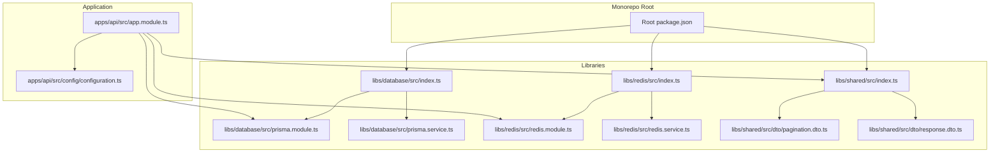
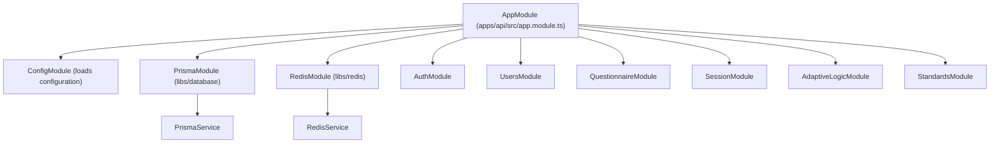
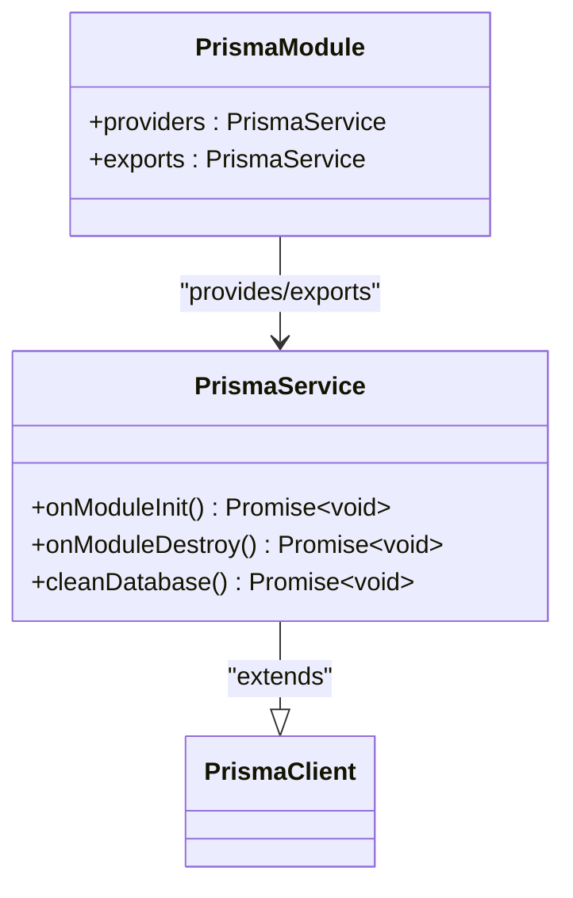
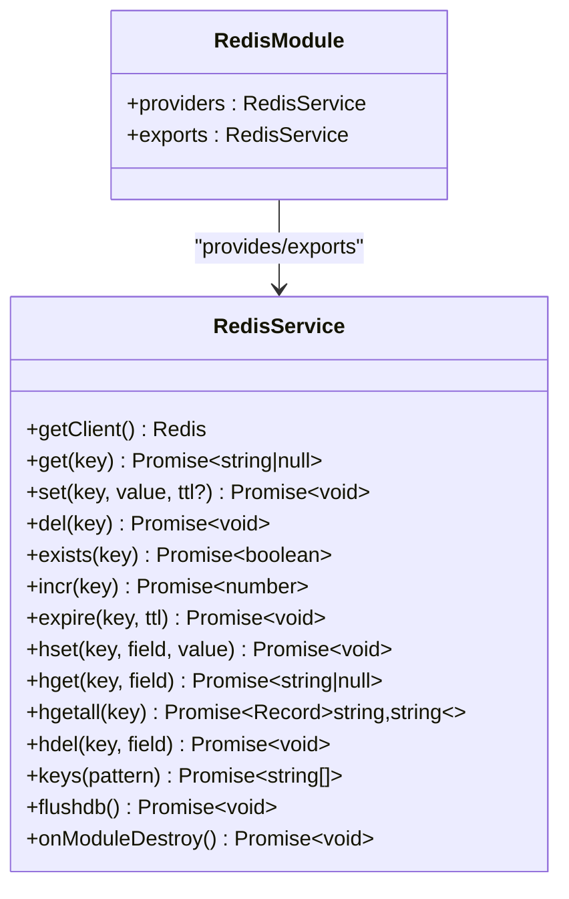
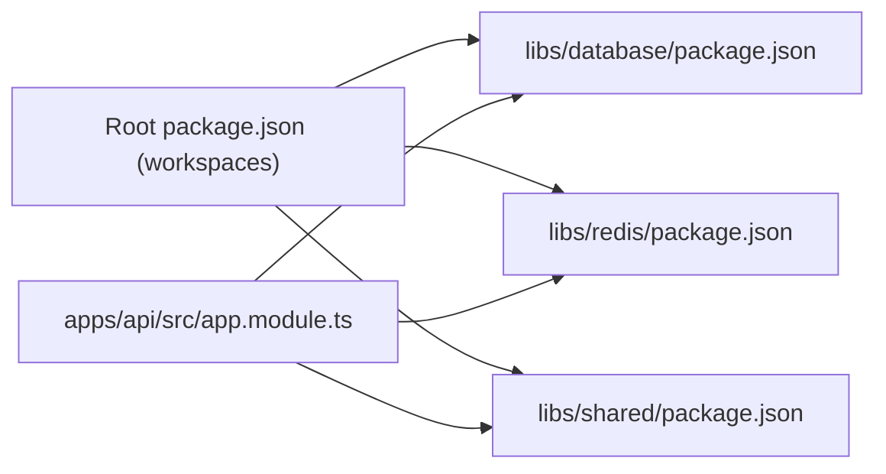

# Shared Libraries

<cite>
**Referenced Files in This Document**
- [libs/database/src/index.ts](file://libs/database/src/index.ts)
- [libs/database/src/prisma.module.ts](file://libs/database/src/prisma.module.ts)
- [libs/database/src/prisma.service.ts](file://libs/database/src/prisma.service.ts)
- [libs/database/package.json](file://libs/database/package.json)
- [libs/redis/src/index.ts](file://libs/redis/src/index.ts)
- [libs/redis/src/redis.module.ts](file://libs/redis/src/redis.module.ts)
- [libs/redis/src/redis.service.ts](file://libs/redis/src/redis.service.ts)
- [libs/redis/package.json](file://libs/redis/package.json)
- [libs/shared/src/index.ts](file://libs/shared/src/index.ts)
- [libs/shared/src/dto/pagination.dto.ts](file://libs/shared/src/dto/pagination.dto.ts)
- [libs/shared/src/dto/response.dto.ts](file://libs/shared/src/dto/response.dto.ts)
- [libs/shared/package.json](file://libs/shared/package.json)
- [apps/api/src/app.module.ts](file://apps/api/src/app.module.ts)
- [apps/api/src/config/configuration.ts](file://apps/api/src/config/configuration.ts)
- [package.json](file://package.json)
</cite>

## Table of Contents
1. [Introduction](#introduction)
2. [Project Structure](#project-structure)
3. [Core Components](#core-components)
4. [Architecture Overview](#architecture-overview)
5. [Detailed Component Analysis](#detailed-component-analysis)
6. [Dependency Analysis](#dependency-analysis)
7. [Performance Considerations](#performance-considerations)
8. [Troubleshooting Guide](#troubleshooting-guide)
9. [Conclusion](#conclusion)
10. [Appendices](#appendices)

## Introduction
This document describes the shared libraries that provide common functionality across the Quiz-to-build system:
- Database library: a Prisma service abstraction and connection lifecycle management
- Redis library: a cache management service with connection pooling and common Redis operations
- Shared DTO library: reusable data transfer objects and validation decorators for consistent API responses and pagination

It explains how these libraries are structured, their dependencies, integration points with the main application, and how to import and use them. It also documents configuration options, service lifecycles, extension points, and best practices for creating and integrating new shared libraries into the monorepo.

## Project Structure
The shared libraries live under the libs directory and are consumed by the NestJS application module. The main application registers the global modules and uses services from the libraries.



**Diagram sources**
- [package.json](file://package.json#L6-L9)
- [apps/api/src/app.module.ts](file://apps/api/src/app.module.ts#L5-L8)
- [libs/database/src/index.ts](file://libs/database/src/index.ts#L1-L3)
- [libs/redis/src/index.ts](file://libs/redis/src/index.ts#L1-L3)
- [libs/shared/src/index.ts](file://libs/shared/src/index.ts#L1-L3)

**Section sources**
- [package.json](file://package.json#L6-L9)
- [apps/api/src/app.module.ts](file://apps/api/src/app.module.ts#L16-L57)

## Core Components
- Database library
  - Provides PrismaService and PrismaModule
  - Handles Prisma client initialization, connection lifecycle, slow query logging in development, and safe database cleaning for tests
- Redis library
  - Provides RedisService and RedisModule
  - Manages Redis client creation, connection events, graceful shutdown, and a rich set of cache operations (get/set/del/exists/incr/expire/hset/hget/hgetall/hdel/keys/flushdb)
- Shared DTO library
  - Exports response DTOs (success, paginated, error) and a validated PaginationDto with skip calculation

These libraries are designed as global modules so they are available application-wide without per-module imports.

**Section sources**
- [libs/database/src/prisma.module.ts](file://libs/database/src/prisma.module.ts#L4-L9)
- [libs/database/src/prisma.service.ts](file://libs/database/src/prisma.service.ts#L5-L40)
- [libs/redis/src/redis.module.ts](file://libs/redis/src/redis.module.ts#L4-L9)
- [libs/redis/src/redis.service.ts](file://libs/redis/src/redis.service.ts#L6-L34)
- [libs/shared/src/index.ts](file://libs/shared/src/index.ts#L1-L3)

## Architecture Overview
The main application integrates the shared libraries via global modules. Services are injected into feature modules and used for persistence and caching.



**Diagram sources**
- [apps/api/src/app.module.ts](file://apps/api/src/app.module.ts#L16-L57)
- [libs/database/src/prisma.module.ts](file://libs/database/src/prisma.module.ts#L4-L9)
- [libs/redis/src/redis.module.ts](file://libs/redis/src/redis.module.ts#L4-L9)

## Detailed Component Analysis

### Database Library
- Purpose: Wrap PrismaClient to centralize connection lifecycle and environment-aware behaviors
- Key elements
  - PrismaService extends PrismaClient and implements OnModuleInit/OnModuleDestroy
  - Registers query logging and slow query warnings in development
  - Provides cleanDatabase for test environments
  - PrismaModule is global and exports PrismaService



**Diagram sources**
- [libs/database/src/prisma.service.ts](file://libs/database/src/prisma.service.ts#L5-L40)
- [libs/database/src/prisma.module.ts](file://libs/database/src/prisma.module.ts#L4-L9)

Usage in application:
- Import PrismaModule into AppModule
- Inject PrismaService into services/controllers where database access is needed

Configuration:
- Environment variables are handled by the Prisma client configuration; the service sets log levels and error format

Lifecycle:
- onModuleInit connects and optionally subscribes to slow query events
- onModuleDestroy disconnects cleanly

Extension points:
- Add additional Prisma client configuration in the constructor
- Extend PrismaService with domain-specific helpers while keeping the module global

**Section sources**
- [libs/database/src/prisma.service.ts](file://libs/database/src/prisma.service.ts#L8-L18)
- [libs/database/src/prisma.service.ts](file://libs/database/src/prisma.service.ts#L20-L34)
- [libs/database/src/prisma.service.ts](file://libs/database/src/prisma.service.ts#L36-L40)
- [libs/database/src/prisma.service.ts](file://libs/database/src/prisma.service.ts#L42-L60)
- [libs/database/src/prisma.module.ts](file://libs/database/src/prisma.module.ts#L4-L9)
- [apps/api/src/app.module.ts](file://apps/api/src/app.module.ts#L44-L45)

### Redis Library
- Purpose: Provide a centralized Redis client with common cache operations and robust connection handling
- Key elements
  - RedisService constructs an ioredis client using ConfigService
  - Implements OnModuleDestroy to quit the client gracefully
  - Offers methods for string operations (get/set/del/exists/incr/expire), hash operations (hset/hget/hgetall/hdel), key scanning (keys), and test-only flushdb



**Diagram sources**
- [libs/redis/src/redis.service.ts](file://libs/redis/src/redis.service.ts#L6-L95)
- [libs/redis/src/redis.module.ts](file://libs/redis/src/redis.module.ts#L4-L9)

Usage in application:
- Import RedisModule into AppModule
- Inject RedisService into services that require caching or counters

Configuration:
- Host, port, and optional password are loaded from configuration via ConfigService

Lifecycle:
- Connects during construction and quits on module destroy

Extension points:
- Add pipeline operations, streams, or pub/sub helpers by extending RedisService
- Introduce connection monitoring or metrics hooks

**Section sources**
- [libs/redis/src/redis.service.ts](file://libs/redis/src/redis.service.ts#L10-L28)
- [libs/redis/src/redis.service.ts](file://libs/redis/src/redis.service.ts#L30-L34)
- [libs/redis/src/redis.service.ts](file://libs/redis/src/redis.service.ts#L40-L95)
- [libs/redis/src/redis.module.ts](file://libs/redis/src/redis.module.ts#L4-L9)
- [apps/api/src/config/configuration.ts](file://apps/api/src/config/configuration.ts#L12-L17)
- [apps/api/src/app.module.ts](file://apps/api/src/app.module.ts#L47-L48)

### Shared DTO Library
- Purpose: Define consistent response envelopes and validated pagination DTO for API consumers
- Key elements
  - PaginationMeta: metadata shape for pagination responses
  - ApiResponseDto<T>: success envelope with optional meta
  - PaginatedResponseDto<T>: success envelope wrapping items and pagination
  - ErrorResponseDto: standardized error envelope
  - PaginationDto: validated pagination input with defaults, min/max, and computed skip

```mermaid
classDiagram
class PaginationMeta {
+page : number
+limit : number
+totalItems : number
+totalPages : number
}
class ApiResponseDto~T~ {
+success : boolean
+data : T
+meta? : { timestamp : string, requestId? : string }
}
class PaginatedResponseDto~T~ {
+success : boolean
+data : { items : T[], pagination : PaginationMeta }
}
class ErrorResponseDto {
+success : false
+error : { code : string, message : string, details? : unknown[], requestId? : string, timestamp : string }
}
class PaginationDto {
+page? : number
+limit? : number
+skip : number
}
```

**Diagram sources**
- [libs/shared/src/dto/response.dto.ts](file://libs/shared/src/dto/response.dto.ts#L3-L15)
- [libs/shared/src/dto/response.dto.ts](file://libs/shared/src/dto/response.dto.ts#L17-L29)
- [libs/shared/src/dto/response.dto.ts](file://libs/shared/src/dto/response.dto.ts#L31-L40)
- [libs/shared/src/dto/response.dto.ts](file://libs/shared/src/dto/response.dto.ts#L42-L60)
- [libs/shared/src/dto/pagination.dto.ts](file://libs/shared/src/dto/pagination.dto.ts#L5-L24)

Usage in application:
- Import DTOs from the shared library index
- Use PaginationDto in controllers/services to validate and compute skip
- Use response DTOs to standardize controller outputs

Validation and Swagger:
- DTOs use class-validator decorators and Swagger annotations for automatic OpenAPI generation

**Section sources**
- [libs/shared/src/index.ts](file://libs/shared/src/index.ts#L1-L3)
- [libs/shared/src/dto/response.dto.ts](file://libs/shared/src/dto/response.dto.ts#L17-L29)
- [libs/shared/src/dto/response.dto.ts](file://libs/shared/src/dto/response.dto.ts#L31-L40)
- [libs/shared/src/dto/response.dto.ts](file://libs/shared/src/dto/response.dto.ts#L42-L60)
- [libs/shared/src/dto/pagination.dto.ts](file://libs/shared/src/dto/pagination.dto.ts#L5-L24)

## Dependency Analysis
- Root workspace configuration includes libs as workspaces
- Each library declares its own dependencies and exposes an index barrel
- The application imports the libraries via scoped alias @libs/<name> and registers their global modules



**Diagram sources**
- [package.json](file://package.json#L6-L9)
- [libs/database/package.json](file://libs/database/package.json#L12-L14)
- [libs/redis/package.json](file://libs/redis/package.json#L12-L13)
- [libs/shared/package.json](file://libs/shared/package.json#L12-L15)
- [apps/api/src/app.module.ts](file://apps/api/src/app.module.ts#L5-L6)

**Section sources**
- [package.json](file://package.json#L6-L9)
- [libs/database/package.json](file://libs/database/package.json#L12-L14)
- [libs/redis/package.json](file://libs/redis/package.json#L12-L13)
- [libs/shared/package.json](file://libs/shared/package.json#L12-L15)
- [apps/api/src/app.module.ts](file://apps/api/src/app.module.ts#L5-L6)

## Performance Considerations
- Database
  - Slow query detection in development helps identify performance bottlenecks early
  - Centralized connection lifecycle ensures consistent resource management
- Redis
  - Built-in retry strategy reduces transient failure impact
  - Graceful shutdown prevents connection leaks
  - Use TTL-aware operations to avoid stale cache entries
- Shared DTOs
  - Validation occurs at DTO boundaries, reducing downstream error handling overhead
  - Consistent pagination DTO avoids repeated calculations and improves API predictability

[No sources needed since this section provides general guidance]

## Troubleshooting Guide
- Database
  - Verify Prisma client connection logs during startup/shutdown
  - Confirm NODE_ENV for slow query logging behavior
  - Use cleanDatabase only in test environments
- Redis
  - Check connection events and error logs for network/password issues
  - Ensure host/port/password are correctly loaded from configuration
  - Use flushdb only in test environments
- Shared DTOs
  - Review validation errors returned by the framework for invalid pagination parameters
  - Confirm response DTO shapes align with client expectations

**Section sources**
- [libs/database/src/prisma.service.ts](file://libs/database/src/prisma.service.ts#L20-L34)
- [libs/database/src/prisma.service.ts](file://libs/database/src/prisma.service.ts#L42-L60)
- [libs/redis/src/redis.service.ts](file://libs/redis/src/redis.service.ts#L21-L27)
- [libs/redis/src/redis.service.ts](file://libs/redis/src/redis.service.ts#L89-L94)
- [apps/api/src/config/configuration.ts](file://apps/api/src/config/configuration.ts#L12-L17)

## Conclusion
The shared libraries encapsulate cross-cutting concerns—database connectivity, caching, and response/data modeling—into cohesive, globally available modules. They improve code reuse, enforce consistency, and simplify maintenance by centralizing configuration and lifecycle management. Integrating new shared libraries follows the established pattern: define a module and service, export them via an index barrel, declare dependencies, and register the module in the application.

[No sources needed since this section summarizes without analyzing specific files]

## Appendices

### How to Import and Use Each Library
- Database
  - Import PrismaModule into the application module
  - Inject PrismaService into services that need database access
- Redis
  - Import RedisModule into the application module
  - Inject RedisService into services requiring caching or counters
- Shared DTOs
  - Import DTOs from the shared library index
  - Apply PaginationDto for query parameters and response DTOs for standardized outputs

**Section sources**
- [apps/api/src/app.module.ts](file://apps/api/src/app.module.ts#L44-L48)
- [libs/shared/src/index.ts](file://libs/shared/src/index.ts#L1-L3)

### Configuration Options
- Database
  - Prisma client configuration is set in the service constructor
- Redis
  - Host, port, and password are loaded from configuration via ConfigService
- Application
  - Centralized configuration via ConfigModule with environment overrides

**Section sources**
- [libs/database/src/prisma.service.ts](file://libs/database/src/prisma.service.ts#L8-L18)
- [libs/redis/src/redis.service.ts](file://libs/redis/src/redis.service.ts#L10-L19)
- [apps/api/src/config/configuration.ts](file://apps/api/src/config/configuration.ts#L1-L49)

### Service Lifecycles
- PrismaService
  - onModuleInit: connect and subscribe to slow query events in development
  - onModuleDestroy: disconnect cleanly
- RedisService
  - onModuleDestroy: quit the client gracefully

**Section sources**
- [libs/database/src/prisma.service.ts](file://libs/database/src/prisma.service.ts#L20-L40)
- [libs/redis/src/redis.service.ts](file://libs/redis/src/redis.service.ts#L30-L34)

### Extension Points
- Database
  - Add Prisma client configuration in the constructor
  - Extend PrismaService with domain-specific helpers
- Redis
  - Add pipeline or advanced commands by extending RedisService
  - Introduce monitoring hooks or metrics
- Shared DTOs
  - Add new response envelopes or validation decorators
  - Introduce additional input DTOs for common patterns

**Section sources**
- [libs/database/src/prisma.service.ts](file://libs/database/src/prisma.service.ts#L8-L18)
- [libs/redis/src/redis.service.ts](file://libs/redis/src/redis.service.ts#L6-L95)
- [libs/shared/src/dto/response.dto.ts](file://libs/shared/src/dto/response.dto.ts#L17-L60)
- [libs/shared/src/dto/pagination.dto.ts](file://libs/shared/src/dto/pagination.dto.ts#L5-L24)

### Creating New Shared Libraries
- Directory layout
  - Place the library under libs/<name>/src and expose an index barrel
- Dependencies
  - Declare runtime and dev dependencies in package.json
- Module design
  - Prefer a single global module exporting a single service
  - Keep the service focused and composable
- Integration
  - Register the module in the application module
  - Export types and utilities via the library’s index barrel
- Build and lint
  - Follow existing scripts for build and lint tasks

**Section sources**
- [libs/database/src/index.ts](file://libs/database/src/index.ts#L1-L3)
- [libs/redis/src/index.ts](file://libs/redis/src/index.ts#L1-L3)
- [libs/shared/src/index.ts](file://libs/shared/src/index.ts#L1-L3)
- [libs/database/package.json](file://libs/database/package.json#L12-L14)
- [libs/redis/package.json](file://libs/redis/package.json#L12-L13)
- [libs/shared/package.json](file://libs/shared/package.json#L12-L15)
- [apps/api/src/app.module.ts](file://apps/api/src/app.module.ts#L5-L6)