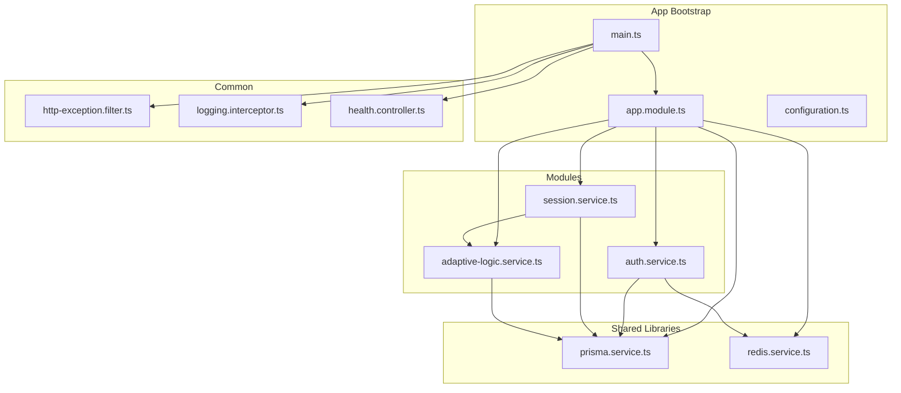
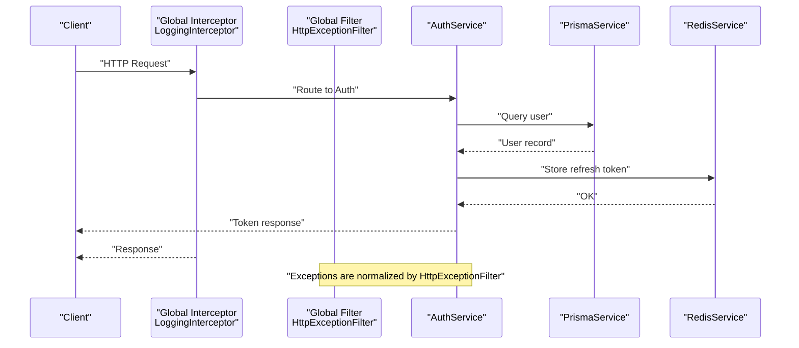
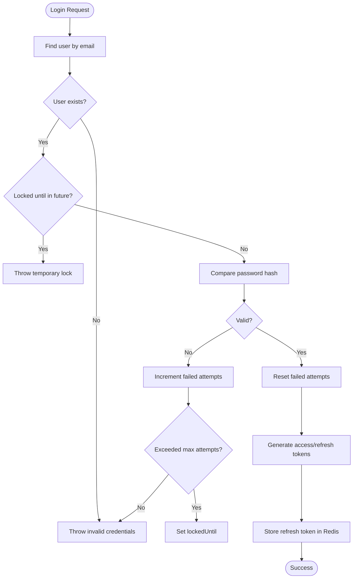
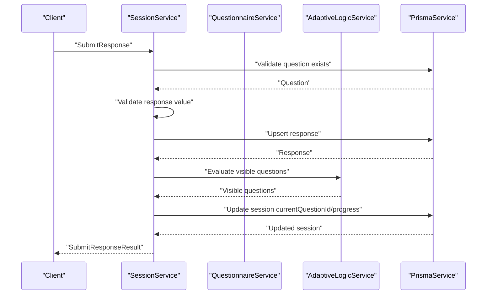
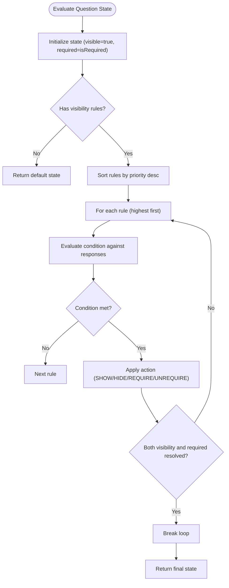
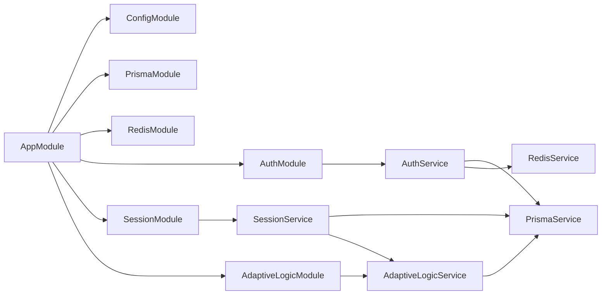

# Troubleshooting and FAQ

<cite>
**Referenced Files in This Document**
- [main.ts](file://apps/api/src/main.ts)
- [app.module.ts](file://apps/api/src/app.module.ts)
- [configuration.ts](file://apps/api/src/config/configuration.ts)
- [prisma.service.ts](file://libs/database/src/prisma.service.ts)
- [redis.service.ts](file://libs/redis/src/redis.service.ts)
- [http-exception.filter.ts](file://apps/api/src/common/filters/http-exception.filter.ts)
- [logging.interceptor.ts](file://apps/api/src/common/interceptors/logging.interceptor.ts)
- [health.controller.ts](file://apps/api/src/health.controller.ts)
- [auth.service.ts](file://apps/api/src/modules/auth/auth.service.ts)
- [login.dto.ts](file://apps/api/src/modules/auth/dto/login.dto.ts)
- [session.service.ts](file://apps/api/src/modules/session/session.service.ts)
- [submit-response.dto.ts](file://apps/api/src/modules/session/dto/submit-response.dto.ts)
- [adaptive-logic.service.ts](file://apps/api/src/modules/adaptive-logic/adaptive-logic.service.ts)
- [condition.evaluator.ts](file://apps/api/src/modules/adaptive-logic/evaluators/condition.evaluator.ts)
- [rule.types.ts](file://apps/api/src/modules/adaptive-logic/types/rule.types.ts)
</cite>

## Table of Contents
1. [Introduction](#introduction)
2. [Project Structure](#project-structure)
3. [Core Components](#core-components)
4. [Architecture Overview](#architecture-overview)
5. [Detailed Component Analysis](#detailed-component-analysis)
6. [Dependency Analysis](#dependency-analysis)
7. [Performance Considerations](#performance-considerations)
8. [Troubleshooting Guide](#troubleshooting-guide)
9. [Conclusion](#conclusion)
10. [Appendices](#appendices)

## Introduction
This document provides comprehensive troubleshooting and FAQ guidance for the Quiz-to-build system. It focuses on diagnosing and resolving common issues related to database connectivity, authentication failures, session management errors, and adaptive logic evaluation. It also covers debugging techniques for APIs, database queries, and cache operations, along with performance tuning guidelines, known limitations, error codes, and security-related troubleshooting.

## Project Structure
The system is a NestJS application with modularized features and shared libraries for database and caching. Key areas include:
- Application bootstrap and global configuration
- Authentication and session management
- Adaptive logic engine for dynamic question visibility
- Shared database and Redis services
- Centralized error handling and logging

**Diagram sources**
- [main.ts](file://apps/api/src/main.ts#L11-L86)
- [app.module.ts](file://apps/api/src/app.module.ts#L16-L66)
- [configuration.ts](file://apps/api/src/config/configuration.ts#L1-L49)
- [auth.service.ts](file://apps/api/src/modules/auth/auth.service.ts#L34-L52)
- [session.service.ts](file://apps/api/src/modules/session/session.service.ts#L87-L94)
- [adaptive-logic.service.ts](file://apps/api/src/modules/adaptive-logic/adaptive-logic.service.ts#L19-L26)
- [prisma.service.ts](file://libs/database/src/prisma.service.ts#L4-L40)
- [redis.service.ts](file://libs/redis/src/redis.service.ts#L6-L34)
- [http-exception.filter.ts](file://apps/api/src/common/filters/http-exception.filter.ts#L22-L82)
- [logging.interceptor.ts](file://apps/api/src/common/interceptors/logging.interceptor.ts#L12-L61)
- [health.controller.ts](file://apps/api/src/health.controller.ts#L13-L41)

**Section sources**
- [main.ts](file://apps/api/src/main.ts#L11-L86)
- [app.module.ts](file://apps/api/src/app.module.ts#L16-L66)

## Core Components
- Application bootstrap sets up security, CORS, global prefix, validation, interceptors, and Swagger documentation.
- Configuration module loads environment variables for database, Redis, JWT, rate limiting, and logging.
- Prisma service manages database connections and logs slow queries in development.
- Redis service handles caching and token storage with connection lifecycle logging.
- Global exception filter standardizes error responses and logs unhandled exceptions.
- Logging interceptor records request metrics and errors.
- Auth service handles registration, login, token generation, refresh, and logout with Redis-backed refresh tokens.
- Session service orchestrates questionnaire sessions, progress calculation, and adaptive logic integration.
- Adaptive logic service evaluates visibility rules and calculates adaptive changes.

**Section sources**
- [main.ts](file://apps/api/src/main.ts#L20-L78)
- [configuration.ts](file://apps/api/src/config/configuration.ts#L1-L49)
- [prisma.service.ts](file://libs/database/src/prisma.service.ts#L20-L40)
- [redis.service.ts](file://libs/redis/src/redis.service.ts#L10-L34)
- [http-exception.filter.ts](file://apps/api/src/common/filters/http-exception.filter.ts#L22-L82)
- [logging.interceptor.ts](file://apps/api/src/common/interceptors/logging.interceptor.ts#L12-L61)
- [auth.service.ts](file://apps/api/src/modules/auth/auth.service.ts#L54-L232)
- [session.service.ts](file://apps/api/src/modules/session/session.service.ts#L96-L359)
- [adaptive-logic.service.ts](file://apps/api/src/modules/adaptive-logic/adaptive-logic.service.ts#L31-L153)

## Architecture Overview
The system integrates authentication, session orchestration, and adaptive logic with a shared database and Redis cache. Requests flow through global interceptors and filters, while module-specific services handle domain logic.

**Diagram sources**
- [logging.interceptor.ts](file://apps/api/src/common/interceptors/logging.interceptor.ts#L16-L60)
- [http-exception.filter.ts](file://apps/api/src/common/filters/http-exception.filter.ts#L26-L82)
- [auth.service.ts](file://apps/api/src/modules/auth/auth.service.ts#L85-L232)
- [prisma.service.ts](file://libs/database/src/prisma.service.ts#L20-L40)
- [redis.service.ts](file://libs/redis/src/redis.service.ts#L20-L34)

## Detailed Component Analysis

### Authentication Troubleshooting
Common issues:
- Invalid credentials or locked accounts during login
- Refresh token validation failures
- Registration conflicts for existing emails
- JWT expiration and refresh token TTL misconfiguration

Diagnostic steps:
- Confirm database connectivity and user existence
- Verify bcrypt rounds and JWT secrets in configuration
- Check Redis connectivity and refresh token presence/expiry
- Review login failure counters and lockout logic

**Diagram sources**
- [auth.service.ts](file://apps/api/src/modules/auth/auth.service.ts#L85-L126)
- [auth.service.ts](file://apps/api/src/modules/auth/auth.service.ts#L234-L253)
- [redis.service.ts](file://libs/redis/src/redis.service.ts#L40-L50)

**Section sources**
- [auth.service.ts](file://apps/api/src/modules/auth/auth.service.ts#L54-L232)
- [login.dto.ts](file://apps/api/src/modules/auth/dto/login.dto.ts#L4-L16)
- [configuration.ts](file://apps/api/src/config/configuration.ts#L19-L37)
- [redis.service.ts](file://libs/redis/src/redis.service.ts#L10-L34)

### Session Management Troubleshooting
Common issues:
- Session not found or access denied
- Attempting to submit responses to completed sessions
- Incorrect progress calculation or missing next questions
- Validation errors for response values

Diagnostic steps:
- Verify session ownership and status
- Confirm response validation rules and question existence
- Inspect adaptive visibility evaluation and next question selection
- Check response upsert behavior and revision increments

**Diagram sources**
- [session.service.ts](file://apps/api/src/modules/session/session.service.ts#L270-L359)
- [adaptive-logic.service.ts](file://apps/api/src/modules/adaptive-logic/adaptive-logic.service.ts#L31-L66)
- [prisma.service.ts](file://libs/database/src/prisma.service.ts#L20-L40)

**Section sources**
- [session.service.ts](file://apps/api/src/modules/session/session.service.ts#L138-L359)
- [submit-response.dto.ts](file://apps/api/src/modules/session/dto/submit-response.dto.ts#L4-L21)

### Adaptive Logic Evaluation Troubleshooting
Common issues:
- Rules not applying due to operator mismatches or missing fields
- Priority ordering causing unexpected overrides
- Complex nested conditions failing to evaluate
- Dependency graph inconsistencies affecting visibility

Diagnostic steps:
- Validate rule operators and expected values
- Confirm condition evaluation logic for nested structures
- Check rule priority sorting and early exit behavior
- Inspect dependency extraction and graph building

**Diagram sources**
- [adaptive-logic.service.ts](file://apps/api/src/modules/adaptive-logic/adaptive-logic.service.ts#L71-L153)
- [condition.evaluator.ts](file://apps/api/src/modules/adaptive-logic/evaluators/condition.evaluator.ts#L9-L22)
- [rule.types.ts](file://apps/api/src/modules/adaptive-logic/types/rule.types.ts#L38-L53)

**Section sources**
- [adaptive-logic.service.ts](file://apps/api/src/modules/adaptive-logic/adaptive-logic.service.ts#L31-L153)
- [condition.evaluator.ts](file://apps/api/src/modules/adaptive-logic/evaluators/condition.evaluator.ts#L9-L22)
- [rule.types.ts](file://apps/api/src/modules/adaptive-logic/types/rule.types.ts#L38-L53)

## Dependency Analysis
Key dependencies and their roles:
- AppModule imports ConfigModule, PrismaModule, RedisModule, and feature modules
- Auth and Session services depend on PrismaService and RedisService
- AdaptiveLogicService depends on PrismaService and ConditionEvaluator
- Global exception filter and logging interceptor apply across requests

**Diagram sources**
- [app.module.ts](file://apps/api/src/app.module.ts#L16-L66)
- [auth.service.ts](file://apps/api/src/modules/auth/auth.service.ts#L42-L52)
- [session.service.ts](file://apps/api/src/modules/session/session.service.ts#L89-L94)
- [adaptive-logic.service.ts](file://apps/api/src/modules/adaptive-logic/adaptive-logic.service.ts#L23-L26)

**Section sources**
- [app.module.ts](file://apps/api/src/app.module.ts#L16-L66)

## Performance Considerations
- Database
  - Enable slow query logging in development to identify long-running queries
  - Use connection pooling and avoid N+1 queries by leveraging includes and batch operations
  - Index frequently queried columns (e.g., user email, session identifiers)
- Cache
  - Monitor Redis connectivity and TTL usage; ensure refresh tokens are properly set with expiry
  - Use appropriate key naming conventions for auditability and cleanup
- Application
  - Leverage global interceptors for request timing and error logging
  - Tune rate limiting thresholds per environment
  - Validate DTOs early to reduce unnecessary downstream processing

[No sources needed since this section provides general guidance]

## Troubleshooting Guide

### Database Connectivity Problems
Symptoms:
- Application fails to start or throws connection errors
- Slow query warnings in development logs

Checklist:
- Confirm DATABASE_URL environment variable is set
- Verify Prisma client initialization and connection lifecycle
- Review NODE_ENV to ensure slow query logging is enabled in development

Resolution steps:
- Reconfigure DATABASE_URL with correct credentials and host
- Restart the application to reinitialize Prisma connection
- Inspect Prisma logs for SQL errors and slow queries

**Section sources**
- [configuration.ts](file://apps/api/src/config/configuration.ts#L7-L10)
- [prisma.service.ts](file://libs/database/src/prisma.service.ts#L20-L40)

### Authentication Failures
Symptoms:
- Login returns unauthorized or account locked
- Refresh token validation fails
- Registration conflicts occur

Checklist:
- Validate user exists and password hash is present
- Check failed login attempts and lockout thresholds
- Confirm refresh token exists in Redis and not expired
- Ensure JWT secrets and refresh expiry are configured

Resolution steps:
- Unlock user account or wait for lock duration to pass
- Regenerate refresh tokens by re-authenticating
- Update JWT configuration and restart the service

**Section sources**
- [auth.service.ts](file://apps/api/src/modules/auth/auth.service.ts#L85-L126)
- [auth.service.ts](file://apps/api/src/modules/auth/auth.service.ts#L128-L158)
- [auth.service.ts](file://apps/api/src/modules/auth/auth.service.ts#L234-L253)
- [configuration.ts](file://apps/api/src/config/configuration.ts#L19-L25)

### Session Management Errors
Symptoms:
- Session not found or access denied
- Cannot submit responses to completed sessions
- Incorrect progress or missing next questions

Checklist:
- Verify session ownership and status
- Confirm response validation rules and question existence
- Inspect adaptive visibility evaluation and next question selection logic

Resolution steps:
- Recreate session if corrupted
- Ensure responses conform to validation rules
- Re-evaluate adaptive rules and rebuild dependency graph if needed

**Section sources**
- [session.service.ts](file://apps/api/src/modules/session/session.service.ts#L138-L160)
- [session.service.ts](file://apps/api/src/modules/session/session.service.ts#L270-L359)

### Adaptive Logic Evaluation Issues
Symptoms:
- Questions not appearing or disappearing unexpectedly
- Rules not taking effect due to operator or priority issues

Checklist:
- Validate rule operators and expected values
- Confirm condition evaluation for nested structures
- Check rule priority sorting and early exit behavior

Resolution steps:
- Adjust rule priorities to ensure intended precedence
- Simplify complex nested conditions and test incrementally
- Rebuild dependency graph and re-run evaluation tests

**Section sources**
- [adaptive-logic.service.ts](file://apps/api/src/modules/adaptive-logic/adaptive-logic.service.ts#L71-L153)
- [condition.evaluator.ts](file://apps/api/src/modules/adaptive-logic/evaluators/condition.evaluator.ts#L9-L22)

### Debugging Techniques
- API Endpoints
  - Use Swagger documentation for endpoint testing
  - Inspect request IDs and logs via LoggingInterceptor
- Database Queries
  - Enable Prisma slow query logging in development
  - Use database profiling tools to identify bottlenecks
- Cache Operations
  - Verify Redis connectivity and key-value operations
  - Monitor refresh token TTL and expiry

**Section sources**
- [main.ts](file://apps/api/src/main.ts#L51-L78)
- [logging.interceptor.ts](file://apps/api/src/common/interceptors/logging.interceptor.ts#L16-L61)
- [prisma.service.ts](file://libs/database/src/prisma.service.ts#L25-L33)
- [redis.service.ts](file://libs/redis/src/redis.service.ts#L20-L34)

### Performance Tuning Guidelines
- Optimize database queries by minimizing includes and using targeted selects
- Reduce adaptive evaluation overhead by precomputing frequently accessed metadata
- Tune Redis TTL and eviction policies for optimal cache hit rates
- Configure rate limits appropriately per environment to prevent abuse

**Section sources**
- [app.module.ts](file://apps/api/src/app.module.ts#L25-L42)
- [configuration.ts](file://apps/api/src/config/configuration.ts#L32-L37)

### Known Limitations and Workarounds
- Adaptive logic evaluation complexity
  - Limit deeply nested conditions and prefer flat rule structures
  - Use explicit priorities to avoid ambiguity
- Session continuity
  - Ensure clients poll for next questions and handle completion checks
  - Implement retry logic for transient failures

**Section sources**
- [adaptive-logic.service.ts](file://apps/api/src/modules/adaptive-logic/adaptive-logic.service.ts#L87-L150)
- [session.service.ts](file://apps/api/src/modules/session/session.service.ts#L388-L546)

### Error Codes, Meanings, and Resolution Steps
Standardized error responses include a code, message, optional details, request ID, and timestamp. Common HTTP error codes and typical causes:
- BAD_REQUEST: Invalid input or session already completed
- UNAUTHORIZED: Invalid credentials or expired/invalid refresh token
- FORBIDDEN: Access denied to a resource
- NOT_FOUND: Session or question not found
- CONFLICT: Duplicate resource (e.g., user already exists)
- UNPROCESSABLE_ENTITY: Validation errors for responses
- RATE_LIMITED: Exceeded throttling limits
- INTERNAL_ERROR: Unhandled exceptions

Resolution steps:
- Validate request payloads and DTOs
- Check authentication state and token validity
- Inspect logs for stack traces and request IDs
- Adjust rate limits and retry policies

**Section sources**
- [http-exception.filter.ts](file://apps/api/src/common/filters/http-exception.filter.ts#L84-L100)
- [session.service.ts](file://apps/api/src/modules/session/session.service.ts#L205-L207)
- [auth.service.ts](file://apps/api/src/modules/auth/auth.service.ts#L90-L110)

### Frequently Asked Questions
- Why am I getting a rate limit error?
  - Adjust throttle limits or use exponential backoff in clients
- Why does my session show zero progress?
  - Ensure responses are recorded and visible questions are evaluated
- Why did a question disappear after answering another?
  - Verify adaptive rules and their priorities
- How do I reset a locked account?
  - Wait for lock duration to pass or contact administrators

**Section sources**
- [configuration.ts](file://apps/api/src/config/configuration.ts#L32-L37)
- [auth.service.ts](file://apps/api/src/modules/auth/auth.service.ts#L234-L253)
- [adaptive-logic.service.ts](file://apps/api/src/modules/adaptive-logic/adaptive-logic.service.ts#L71-L153)

### Step-by-Step Diagnostic Procedures
- Database connectivity
  - Confirm DATABASE_URL and Prisma connection logs
  - Run a simple query to validate connectivity
- Authentication
  - Verify user exists and password hash
  - Check Redis refresh token presence and expiry
- Session
  - Validate session ownership and status
  - Inspect response validation and adaptive visibility
- Adaptive logic
  - Test rule evaluation with known inputs
  - Simplify nested conditions and re-test

**Section sources**
- [configuration.ts](file://apps/api/src/config/configuration.ts#L7-L10)
- [prisma.service.ts](file://libs/database/src/prisma.service.ts#L20-L40)
- [redis.service.ts](file://libs/redis/src/redis.service.ts#L10-L34)
- [session.service.ts](file://apps/api/src/modules/session/session.service.ts#L270-L359)
- [adaptive-logic.service.ts](file://apps/api/src/modules/adaptive-logic/adaptive-logic.service.ts#L31-L66)

### Escalation Paths
- Internal errors
  - Capture request ID and stack traces from logs
  - Open support tickets with environment details and reproduction steps
- Compliance and security
  - Validate JWT configuration and refresh token handling
  - Audit access logs and token lifecycles

**Section sources**
- [http-exception.filter.ts](file://apps/api/src/common/filters/http-exception.filter.ts#L51-L62)
- [auth.service.ts](file://apps/api/src/modules/auth/auth.service.ts#L192-L232)

## Conclusion
This guide consolidates actionable troubleshooting steps, diagnostic procedures, and performance recommendations for the Quiz-to-build system. By validating configuration, monitoring logs, and understanding component interactions, most issues can be resolved efficiently. For persistent problems, escalate with detailed logs and request IDs.

## Appendices

### Monitoring Endpoints
- Health: GET /health, /health/ready, /health/live
- Docs: /docs (Swagger) in non-production environments

**Section sources**
- [health.controller.ts](file://apps/api/src/health.controller.ts#L16-L41)
- [main.ts](file://apps/api/src/main.ts#L51-L78)