# Deploy Now - Quick Deployment Guide

**Status:** Ready for Deployment ✅  
**Last Updated:** February 7, 2026

## Overview

This document provides the quickest path to deploy the Quiz2Biz application to Azure. All infrastructure code and CI/CD pipelines are already in place.

## Prerequisites Status

✅ Deployment workflows configured (`.github/workflows/deploy.yml`)  
✅ CI pipeline configured (`.github/workflows/ci.yml`)  
✅ Docker containerization ready  
✅ Database migrations configured  
✅ Comprehensive documentation available  

## Deployment Options

### Option 1: Automatic Deployment (Recommended)

**When:** You have Azure infrastructure already set up

1. **Ensure GitHub Secrets are configured:**
   ```bash
   # Check if secrets exist in: Settings > Secrets and variables > Actions
   # Required secrets:
   # - AZURE_CREDENTIALS
   # - AZURE_ACR_USERNAME
   # - AZURE_ACR_PASSWORD
   ```

2. **Trigger deployment:**
   - **Automatic:** Push or merge to `main` branch
   - **Manual:** Go to Actions tab > Deploy to Azure > Run workflow

3. **Monitor deployment:**
   - Watch the GitHub Actions workflow logs
   - Deployment typically takes 10-15 minutes

### Option 2: First-Time Setup + Deployment

**When:** Azure infrastructure not yet created

**Time Required:** 30-40 minutes

Follow the comprehensive guide: [FIRST-DEPLOYMENT.md](FIRST-DEPLOYMENT.md)

### Option 3: Manual Deployment

**When:** You want full control over the deployment process

See detailed steps in: [DEPLOYMENT.md](DEPLOYMENT.md#manual-deployment)

## Quick Start (5 Minutes)

If your Azure infrastructure is ready and GitHub secrets are configured:

```bash
# 1. Ensure you're on the main branch
git checkout main

# 2. Pull latest changes
git pull origin main

# 3. Merge your feature branch (if applicable)
git merge your-feature-branch

# 4. Push to trigger automatic deployment
git push origin main

# 5. Monitor deployment
# Open GitHub repository > Actions tab > Watch "Deploy to Azure" workflow
```

## Deployment Workflow

```mermaid
graph TD
    A[Push to Main] --> B[Trigger Deploy Workflow]
    B --> C[Build & Test]
    C --> D{Tests Pass?}
    D -->|Yes| E[Build Docker Image]
    D -->|No| F[Deployment Failed]
    E --> G[Push to Azure Container Registry]
    G --> H[Deploy to Azure Container Apps]
    H --> I[Run Database Migrations]
    I --> J[Health Check]
    J --> K{Healthy?}
    K -->|Yes| L[Deployment Successful ✅]
    K -->|No| M[Rollback]
```



## Verification Commands

After deployment, verify everything is working:

```bash
# Get application URL
APP_URL=$(az containerapp show \
  --name ca-questionnaire-api-dev \
  --resource-group rg-questionnaire-dev \
  --query properties.configuration.ingress.fqdn -o tsv)

echo "Application URL: https://${APP_URL}"

# Test health endpoint
curl https://${APP_URL}/health

# Expected response:
# {"status":"ok","info":{"database":{"status":"up"},"redis":{"status":"up"}}}

# Open API documentation
echo "API Docs: https://${APP_URL}/api/v1/docs"
```

## Troubleshooting

### Deployment Failed?

1. **Check GitHub Actions logs:**
   - Repository > Actions > Failed workflow > View logs

2. **Common issues:**
   - Missing or incorrect GitHub secrets
   - Azure resource not created
   - Database connection issues
   - Docker build errors

3. **Get help:**
   - See [DEPLOYMENT.md - Troubleshooting](DEPLOYMENT.md#troubleshooting)
   - Check Azure Container Apps logs:
     ```bash
     az containerapp logs show \
       --name ca-questionnaire-api-dev \
       --resource-group rg-questionnaire-dev \
       --follow
     ```

### Health Check Fails?

```bash
# Check container logs
az containerapp logs show \
  --name ca-questionnaire-api-dev \
  --resource-group rg-questionnaire-dev \
  --follow

# Check environment variables
az containerapp show \
  --name ca-questionnaire-api-dev \
  --resource-group rg-questionnaire-dev \
  --query properties.template.containers[0].env
```

## Environment Selection

The deployment workflow supports multiple environments:

- **Development:** Automatic on push to `develop` (requires setup)
- **Staging:** Manual workflow dispatch
- **Production:** Automatic on push to `main`

To deploy to a specific environment:
1. Go to Actions tab
2. Select "Deploy to Azure" workflow
3. Click "Run workflow"
4. Choose environment (development/staging/production)
5. Click "Run workflow"

## Post-Deployment Checklist

After successful deployment:

- [ ] Health check returns OK
- [ ] API documentation accessible
- [ ] Can register a test user
- [ ] Can log in with test user
- [ ] Database migrations completed
- [ ] No errors in application logs

## Monitoring

Set up monitoring for production:

```bash
# Enable Application Insights (if not already enabled)
az monitor app-insights component create \
  --app quiz2biz-insights \
  --location eastus2 \
  --resource-group rg-questionnaire-dev

# Set up alerts for CPU/Memory/Errors
# See DEPLOYMENT.md#monitoring-and-alerts for details
```

## Rollback

If deployment fails and you need to rollback:

```bash
# List revisions
az containerapp revision list \
  --name ca-questionnaire-api-dev \
  --resource-group rg-questionnaire-dev \
  -o table

# Activate previous revision
az containerapp revision activate \
  --revision <previous-revision-name> \
  --resource-group rg-questionnaire-dev
```

## Next Steps

1. ✅ **Deploy** - Follow one of the options above
2. 📊 **Monitor** - Set up Application Insights and alerts
3. 🌐 **Custom Domain** - Configure your domain (optional)
4. 🔐 **Security** - Review and rotate secrets regularly
5. 📈 **Scale** - Adjust container replicas based on load

## Documentation Links

- 📖 [Complete Deployment Guide](DEPLOYMENT.md)
- 🚀 [First-Time Deployment](FIRST-DEPLOYMENT.md)
- ✅ [Deployment Checklist](DEPLOYMENT-CHECKLIST.md)
- 🔐 [GitHub Secrets Setup](GITHUB-SECRETS.md)
- 📊 [Deployment Summary](DEPLOYMENT-SUMMARY.md)

## Support

- **Documentation:** Check the links above
- **GitHub Actions:** View workflow logs in Actions tab
- **Azure Logs:** Use `az containerapp logs show` command
- **Status:** All systems operational ✅

---

**Ready to deploy?** Choose an option above and follow the steps!

---

*This document is part of the Quiz2Biz deployment documentation suite.*  
*For detailed information, see [DEPLOYMENT.md](DEPLOYMENT.md)*
