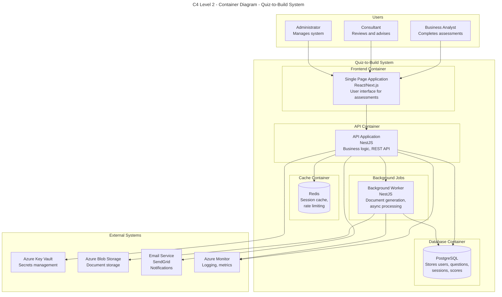

## Container Descriptions

| Container | Technology | Purpose |
|-----------|------------|---------|
| Single Page Application | React/Next.js | Interactive assessment UI, dashboards, reports |
| API Application | NestJS (Node.js) | Core business logic, REST API endpoints |
| PostgreSQL Database | PostgreSQL 15 | Primary data store for all application data |
| Redis Cache | Redis 7 | Session management, rate limiting, caching |
| Background Worker | NestJS | Async document generation, email notifications |
| Azure Key Vault | Azure PaaS | Secure secrets and key management |
| Azure Blob Storage | Azure PaaS | Generated document storage |
| Email Service | SendGrid | Transactional email delivery |
| Azure Monitor | Azure PaaS | Centralized logging and monitoring |

## Communication Patterns

| From | To | Protocol | Description |
|------|-----|----------|-------------|
| SPA | API | HTTPS/REST | User requests, authentication |
| API | PostgreSQL | TCP/TLS | Data persistence queries |
| API | Redis | TCP | Session storage, cache operations |
| API | Worker | Event Queue | Async job dispatch |
| Worker | Blob Storage | HTTPS | Document upload/retrieval |
| API | Key Vault | HTTPS | Secret retrieval |
| API | SendGrid | HTTPS | Email dispatch |
