```mermaid
---
title: C4 Level 3 - Component Diagram - API Application
---
graph TB
    subgraph API Application
        subgraph Controllers Layer
            HC[Health Controller<br/>System health checks]
            AC[Auth Controller<br/>Login, logout, refresh]
            SC[Session Controller<br/>Assessment sessions]
            QC[Questionnaire Controller<br/>Questions, answers]
            SRC[Scoring Controller<br/>Calculate, retrieve scores]
            DC[Document Controller<br/>Generate reports]
            ADC[Admin Controller<br/>User management]
            QPC[QPG Controller<br/>Prompt generation]
            PPC[Policy Pack Controller<br/>Policy generation]
        end

        subgraph Services Layer
            AS[Auth Service<br/>JWT handling, validation]
            SS[Session Service<br/>Session management]
            QS[Questionnaire Service<br/>Question retrieval]
            ALS[Adaptive Logic Service<br/>Question selection]
            SES[Scoring Engine Service<br/>Score calculations]
            DGS[Document Generator Service<br/>PDF/report creation]
            QPGS[QPG Service<br/>Prompt generation]
            PPS[Policy Pack Service<br/>Policy document gen]
            US[Users Service<br/>User CRUD operations]
        end

        subgraph Infrastructure Layer
            PRISMA[Prisma Service<br/>Database ORM]
            REDIS_SVC[Redis Service<br/>Cache operations]
            CONFIG[Config Service<br/>Configuration management]
            LOGGER[Logger Service<br/>Structured logging]
        end

        subgraph Guards and Interceptors
            JWT_GUARD[JWT Auth Guard<br/>Token validation]
            ROLES_GUARD[Roles Guard<br/>RBAC enforcement]
            THROTTLE[Throttler Guard<br/>Rate limiting]
            LOG_INT[Logging Interceptor<br/>Request/response logging]
            TRANSFORM[Transform Interceptor<br/>Response formatting]
        end
    end

    subgraph External
        DB[(PostgreSQL)]
        CACHE[(Redis)]
        KV[Key Vault]
    end

    HC --> LOGGER
    AC --> AS
    SC --> SS
    QC --> QS
    QC --> ALS
    SRC --> SES
    DC --> DGS
    ADC --> US
    QPC --> QPGS
    PPC --> PPS

    AS --> PRISMA
    AS --> REDIS_SVC
    SS --> PRISMA
    SS --> REDIS_SVC
    QS --> PRISMA
    ALS --> PRISMA
    SES --> PRISMA
    DGS --> PRISMA
    QPGS --> PRISMA
    QPGS --> SES
    PPS --> PRISMA
    US --> PRISMA

    PRISMA --> DB
    REDIS_SVC --> CACHE
    CONFIG --> KV

    JWT_GUARD --> AS
    ROLES_GUARD --> AS
```

## Component Descriptions

### Controllers

| Component | Responsibility | Endpoints |
|-----------|---------------|-----------|
| Health Controller | System health monitoring | `GET /health`, `GET /health/ready` |
| Auth Controller | Authentication operations | `POST /auth/login`, `POST /auth/logout`, `POST /auth/refresh` |
| Session Controller | Assessment session management | `POST /sessions`, `GET /sessions/:id`, `PUT /sessions/:id` |
| Questionnaire Controller | Question delivery | `GET /questions`, `GET /questions/:dimension`, `POST /answers` |
| Scoring Controller | Score calculation and retrieval | `POST /scoring/calculate`, `GET /scoring/:sessionId` |
| Document Controller | Report generation | `POST /documents/generate`, `GET /documents/:id` |
| Admin Controller | Administrative operations | `GET /admin/users`, `POST /admin/users`, `PUT /admin/users/:id` |
| QPG Controller | Prompt generation | `POST /qpg/generate`, `GET /qpg/prompts/:sessionId` |
| Policy Pack Controller | Policy document generation | `POST /policy-pack/generate`, `GET /policy-pack/:id` |

### Services

| Component | Responsibility | Key Methods |
|-----------|---------------|-------------|
| Auth Service | Authentication logic | `validateUser()`, `login()`, `refreshToken()`, `revokeToken()` |
| Session Service | Session lifecycle | `createSession()`, `updateSession()`, `completeSession()` |
| Questionnaire Service | Question management | `getQuestions()`, `getByDimension()`, `recordAnswer()` |
| Adaptive Logic Service | Smart question selection | `getNextQuestion()`, `evaluateProgress()`, `shouldSkip()` |
| Scoring Engine Service | Score calculations | `calculateCoverage()`, `calculateSeverity()`, `calculateResidual()` |
| Document Generator Service | Report creation | `generatePDF()`, `generateExecutiveSummary()` |
| QPG Service | Prompt generation | `generatePrompts()`, `buildContext()`, `formatOutput()` |
| Policy Pack Service | Policy generation | `generatePolicy()`, `mapControls()`, `exportOPA()` |
| Users Service | User management | `create()`, `findById()`, `update()`, `delete()` |

### Infrastructure

| Component | Responsibility |
|-----------|---------------|
| Prisma Service | Database access, ORM operations, connection management |
| Redis Service | Cache operations, session storage, rate limit tracking |
| Config Service | Environment configuration, Key Vault integration |
| Logger Service | Structured logging, request tracing |

### Guards and Interceptors

| Component | Type | Purpose |
|-----------|------|---------|
| JWT Auth Guard | Guard | Validates JWT tokens, extracts user context |
| Roles Guard | Guard | Enforces role-based access control |
| Throttler Guard | Guard | Rate limiting per user/IP |
| Logging Interceptor | Interceptor | Logs all requests/responses |
| Transform Interceptor | Interceptor | Standardizes response format |

## Data Flow

```
Request → Throttler Guard → JWT Guard → Roles Guard → Controller → Service → Prisma/Redis → Response
                                                           ↓
                                                    Logging Interceptor
                                                           ↓
                                                   Transform Interceptor
```
