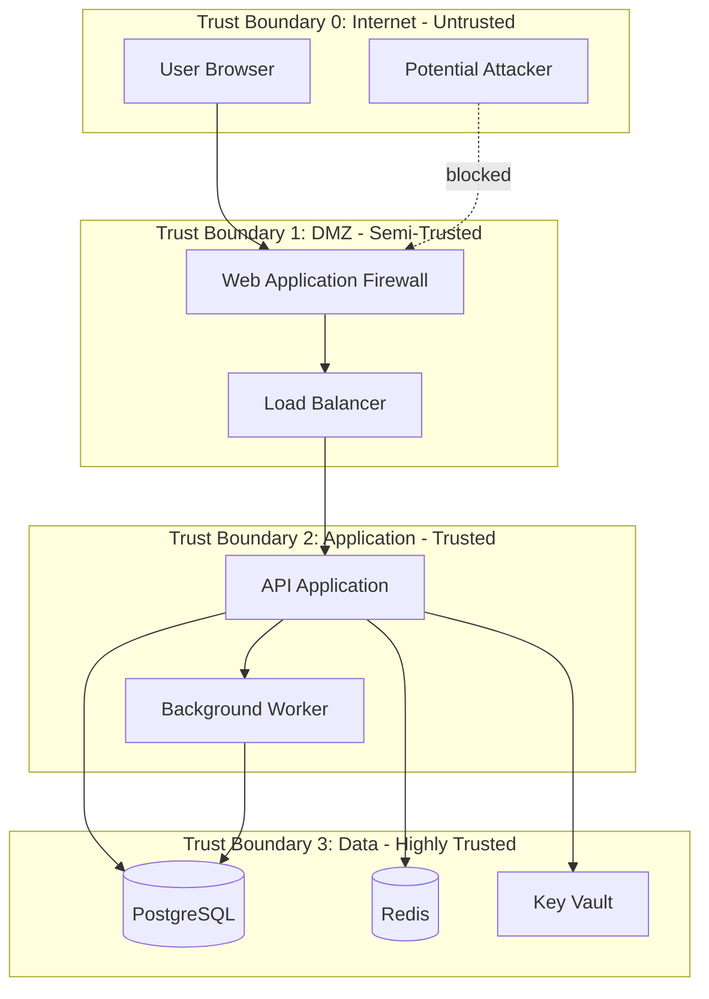
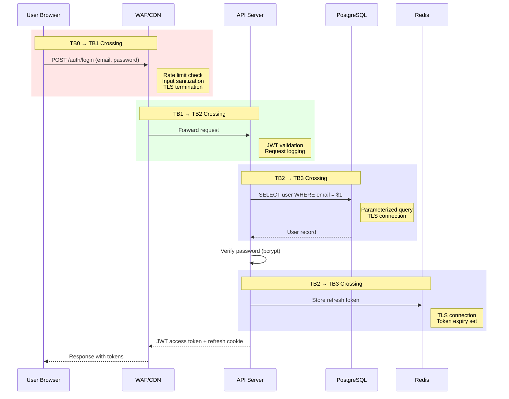
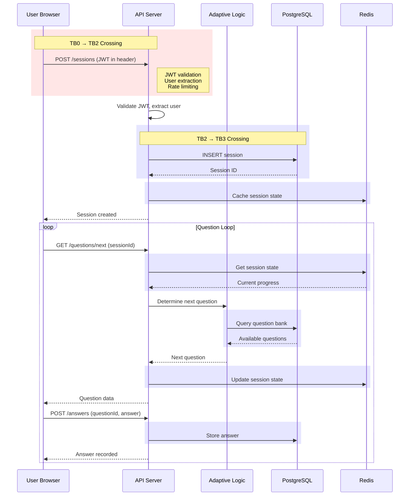
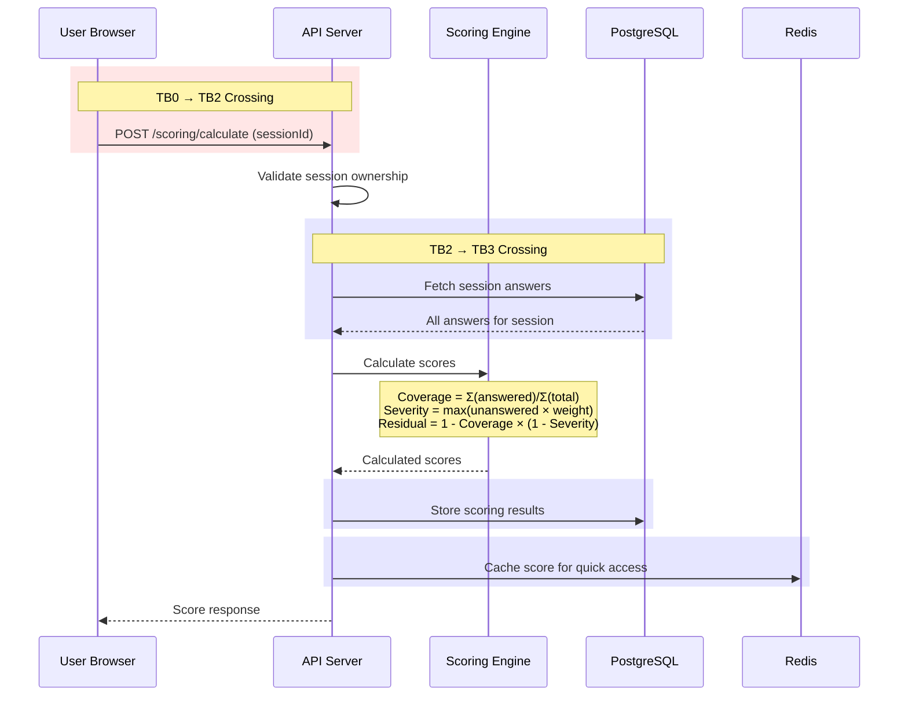
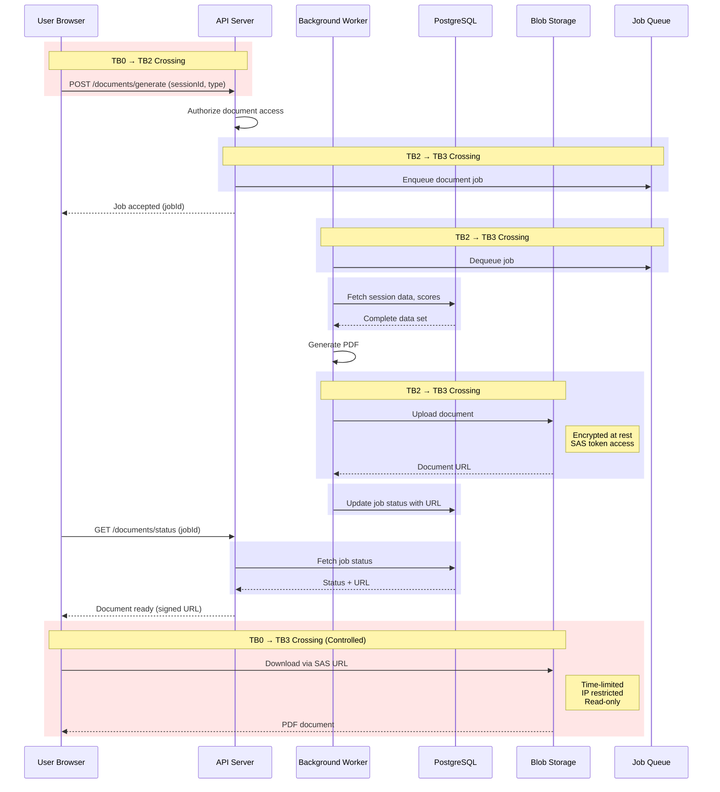
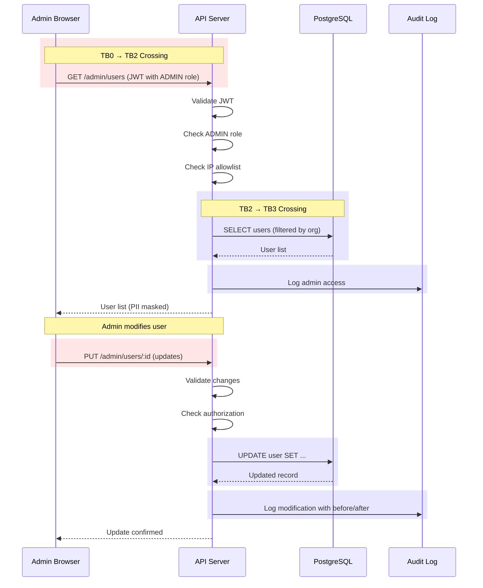

# Data Flow Diagrams with Trust Boundaries

## Overview

This document defines data flows across trust boundaries in the Quiz-to-Build system, identifying security controls at each crossing point.

---

## Trust Boundary Definitions



### Trust Level Definitions

| Level | Name | Description | Controls Required |
|-------|------|-------------|-------------------|
| TB0 | Internet | Untrusted public network | All input validation, rate limiting |
| TB1 | DMZ | Perimeter network | WAF, DDoS protection, TLS termination |
| TB2 | Application | Internal application tier | Authentication, authorization, logging |
| TB3 | Data | Database and secrets tier | Encryption, access control, audit |

---

## Data Flow 1: User Authentication



### Security Controls

| Boundary Crossing | Controls |
|-------------------|----------|
| TB0 → TB1 | TLS 1.3, Rate limiting (10 req/min), Input validation |
| TB1 → TB2 | Internal TLS, Request logging, IP allowlist |
| TB2 → TB3 | Parameterized queries, Connection encryption, Audit logging |

---

## Data Flow 2: Assessment Session



### Data Classification by Flow

| Data Element | Classification | Protection |
|--------------|---------------|------------|
| Session ID | Internal | UUID, unpredictable |
| User Answers | Confidential | Encrypted at rest |
| Question Text | Internal | Read-only access |
| Progress State | Internal | Redis TTL |

---

## Data Flow 3: Score Calculation



### Calculation Data Sensitivity

| Calculation | Sensitivity | Reason |
|-------------|-------------|--------|
| Coverage Formula | Low | Generic algorithm |
| Severity Weights | Medium | Business logic IP |
| Final Scores | High | Business-sensitive |

---

## Data Flow 4: Document Generation



### Document Access Controls

| Access Type | Control | Duration |
|-------------|---------|----------|
| Generate Request | JWT + ownership check | N/A |
| Download URL | SAS token | 15 minutes |
| Blob Access | IP restriction + HTTPS | Per request |

---

## Data Flow 5: Admin Operations



### Admin Access Controls

| Control | Implementation |
|---------|---------------|
| Role Requirement | `ADMIN` or `SUPER_ADMIN` role |
| IP Restriction | Allowlist for admin endpoints |
| Audit Logging | All admin actions logged with details |
| PII Masking | Sensitive fields masked in responses |
| Rate Limiting | 100 req/min for admin endpoints |

---

## Trust Boundary Summary

```
┌─────────────────────────────────────────────────────────────────────────┐
│                        TRUST BOUNDARY MAP                                │
├─────────────────────────────────────────────────────────────────────────┤
│                                                                          │
│  ┌─────────────────────────────────────────────────────────────────┐    │
│  │ TB0: INTERNET (Untrusted)                                        │    │
│  │                                                                   │    │
│  │   [User Browser] ─────┬────── [Attacker]                        │    │
│  │                       │                                          │    │
│  └───────────────────────┼──────────────────────────────────────────┘    │
│                          │                                               │
│                    WAF/DDoS/TLS                                          │
│                          │                                               │
│  ┌───────────────────────┼──────────────────────────────────────────┐    │
│  │ TB1: DMZ (Semi-Trusted)│                                         │    │
│  │                       │                                          │    │
│  │   [WAF] ──── [Load Balancer]                                    │    │
│  │                       │                                          │    │
│  └───────────────────────┼──────────────────────────────────────────┘    │
│                          │                                               │
│                   Auth/Rate Limit                                        │
│                          │                                               │
│  ┌───────────────────────┼──────────────────────────────────────────┐    │
│  │ TB2: APPLICATION (Trusted)                                       │    │
│  │                       │                                          │    │
│  │   [API Server] ───┬───┴─── [Background Worker]                  │    │
│  │                   │                                              │    │
│  └───────────────────┼──────────────────────────────────────────────┘    │
│                      │                                                   │
│               Encryption/RBAC                                            │
│                      │                                                   │
│  ┌───────────────────┼──────────────────────────────────────────────┐    │
│  │ TB3: DATA (Highly Trusted)                                       │    │
│  │                   │                                              │    │
│  │   [PostgreSQL] ───┼─── [Redis] ─── [Key Vault] ─── [Blob]       │    │
│  │                                                                  │    │
│  └──────────────────────────────────────────────────────────────────┘    │
│                                                                          │
└─────────────────────────────────────────────────────────────────────────┘
```

## Security Controls at Each Boundary

| Boundary | Inbound Controls | Outbound Controls |
|----------|-----------------|-------------------|
| TB0 → TB1 | TLS 1.3, WAF rules, DDoS protection | Response filtering |
| TB1 → TB2 | Internal TLS, JWT validation | Sanitized responses |
| TB2 → TB3 | Parameterized queries, encryption | Minimal data exposure |
| TB3 (internal) | Network isolation, encryption at rest | Audit logging |

---

## Compliance Mapping

| Requirement | Trust Boundary | Control |
|-------------|---------------|---------|
| OWASP A01:2021 Broken Access Control | TB0→TB1, TB1→TB2 | JWT + RBAC |
| OWASP A02:2021 Cryptographic Failures | All | TLS, encryption at rest |
| OWASP A03:2021 Injection | TB2→TB3 | Parameterized queries |
| ISO 27001 A.13.1 | TB1 | Network segmentation |
| ISO 27001 A.14.1 | All | Secure development |
| Australian Privacy Act | TB3 | Data residency, encryption |
